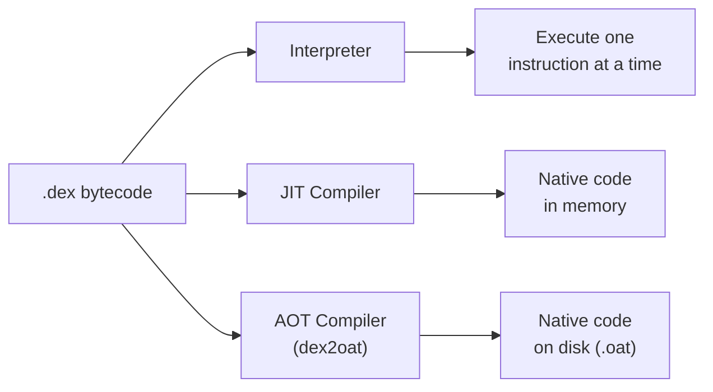
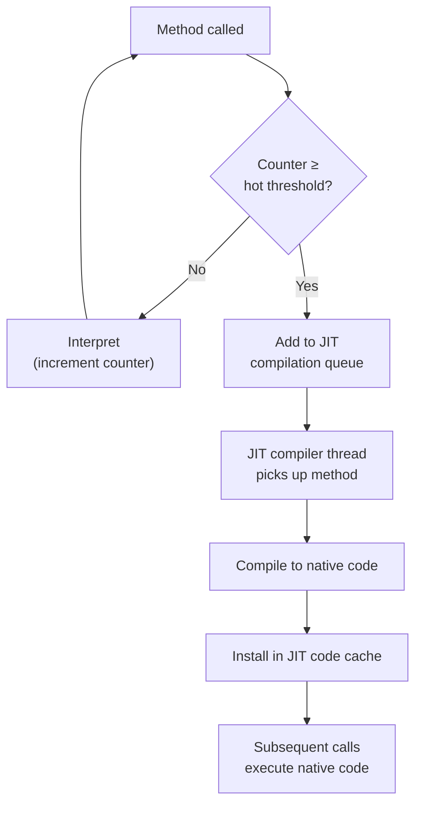
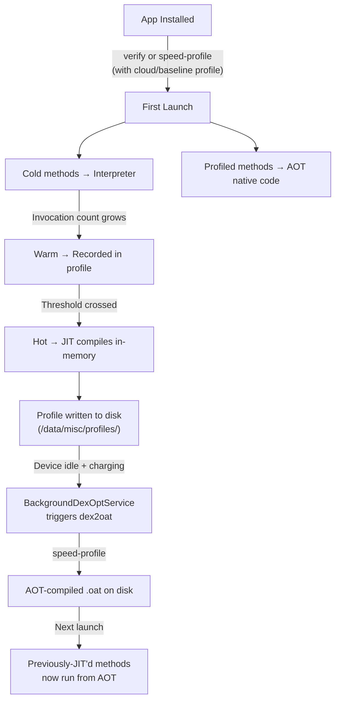
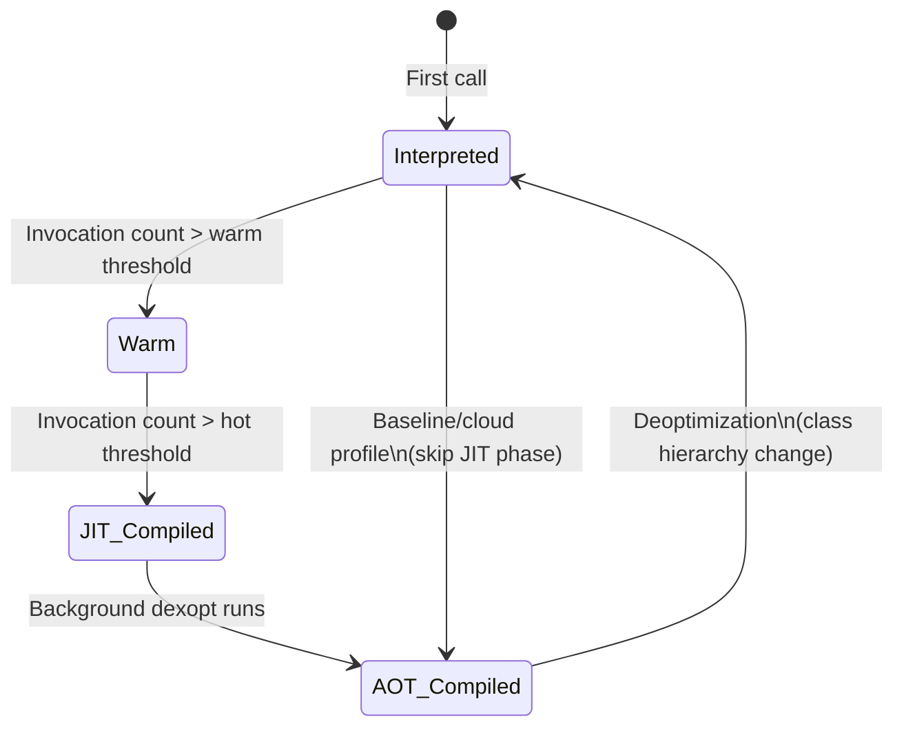

# ART: AOT vs JIT vs Interpreter

ART executes DEX bytecode using three distinct modes — **interpreter**, **JIT compiler**, and **AOT compiler** — combined into a hybrid pipeline that balances startup speed, peak performance, storage, and battery life.

---

## Three Execution Modes

| Mode | When Code Runs | Speed | Storage Cost | When Used |
|------|---------------|-------|-------------|-----------|
| **Interpreter** | Translates each DEX instruction one-by-one at runtime | Slowest | None | Cold methods, debugging, first-ever execution |
| **JIT (Just-In-Time)** | Compiles hot methods to native code in memory at runtime | Fast (after warmup) | RAM only (no disk) | Hot methods during app session |
| **AOT (Ahead-Of-Time)** | Compiles to native code before execution, stored on disk | Fastest (no warmup) | `.oat`/`.art` files on disk | Profile-guided background compilation, baseline profiles |



---

## Interpreter

The interpreter is ART's baseline execution mode. It reads DEX bytecode instructions and executes them one at a time without generating native code.

### How It Works

```
┌──────────────────────────────────────────┐
│          DEX Bytecode Stream             │
│  ┌──────┬──────┬──────┬──────┬────────┐ │
│  │ iget │ add  │ invoke│ ret  │  ...   │ │
│  └──┬───┴──────┴──────┴──────┴────────┘ │
│     │                                    │
│     ▼                                    │
│  Fetch → Decode → Execute → Advance PC   │
│     ▲                          │         │
│     └──────────────────────────┘         │
└──────────────────────────────────────────┘
```

ART uses two interpreter implementations:

| Interpreter | Description |
|-------------|-------------|
| **Switch interpreter** | Giant `switch` statement dispatching on opcode. Portable but slow due to branch misprediction. |
| **Mterp (assembly interpreter)** | Hand-written assembly per architecture (ARM64, x86_64). Dispatches via computed goto. 2-3x faster than switch interpreter. |

### When the Interpreter Runs

- **First execution** of a method before JIT has profiling data
- **Debugging** — when a debugger is attached, ART falls back to the interpreter for breakpoint/step support
- **Deoptimization** — when JIT-compiled code hits an assumption violation (e.g., class hierarchy changed), execution reverts to interpreter
- **Methods below JIT threshold** — cold methods that never get hot enough for JIT

---

## JIT Compiler

The JIT compiler detects frequently-executed ("hot") methods at runtime and compiles them to native machine code in memory.

### Hot Method Detection

ART maintains an **invocation counter** and a **branch-back counter** (loop iterations) per method:



| Threshold | Default | Purpose |
|-----------|---------|---------|
| **Hot method** | ~10,000 invocations | Triggers JIT compilation |
| **Warm method** | ~2,000 invocations | Recorded in profile (candidate for AOT) |
| **OSR threshold** | ~Loop iterations | On-Stack Replacement — compiles mid-loop |

### JIT Code Cache

JIT-compiled native code lives in an **in-memory code cache**, not on disk:

| Property | Value |
|----------|-------|
| **Initial size** | 64 KB |
| **Max size** | 64 MB (varies by device) |
| **Eviction** | LRU — least recently used methods evicted when cache is full |
| **Lifetime** | Process lifetime only — lost on app kill |

### On-Stack Replacement (OSR)

OSR handles long-running loops. If a method contains a hot loop but was entered via the interpreter, JIT can compile the method and transfer execution to the native version **mid-loop** — without waiting for the method to be re-entered.

### JIT Compiler Optimizations

The JIT applies optimizations during compilation:

| Optimization | Description |
|-------------|-------------|
| **Method inlining** | Inline small/hot callees to eliminate call overhead |
| **Inline caches** | Cache receiver type at call sites — fast monomorphic dispatch |
| **Bounds check elimination** | Remove redundant array bounds checks |
| **Null check elimination** | Remove provably-safe null checks |
| **Constant folding** | Evaluate constant expressions at compile time |
| **Dead code elimination** | Remove unreachable code paths |
| **Register allocation** | Linear scan allocator for mapping variables to CPU registers |

---

## AOT Compiler (dex2oat)

The AOT compiler (`dex2oat`) converts DEX bytecode to native machine code **ahead of time**, producing OAT files stored on disk.

### When AOT Runs

| Trigger | What Happens |
|---------|-------------|
| **Install time** | Minimal verification; may AOT-compile with cloud/baseline profile |
| **Background dexopt** | `BackgroundDexOptService` runs when device is idle + charging; compiles profiled methods |
| **OTA update** | System apps re-optimized after OS update |
| **First boot** | All system apps compiled during initial setup |

### Compiler Filters

`dex2oat` supports multiple compilation levels called **compiler filters**:

| Filter | What It Produces | Use Case |
|--------|-----------------|----------|
| `verify` | Verified DEX only, no compilation | Fastest install, all methods interpreted/JIT'd |
| `quicken` | Verified + quickened DEX (optimized bytecode) | Slightly faster interpretation |
| `speed-profile` | AOT for profiled methods, verify for the rest | **Default for apps** — best balance |
| `speed` | AOT for all methods | System apps, boot image |
| `everything` | AOT + debug info for all methods | Testing/benchmarking only |

```bash
# Check current compiler filter for an app
adb shell dumpsys package com.example.app | grep "compilationFilter"

# Force recompile with a specific filter
adb shell cmd package compile -m speed-profile -f com.example.app
```

!!! info "speed-profile is the sweet spot"
    Compiling everything (`speed`) wastes storage and RAM on rarely-executed code. `speed-profile` only compiles the ~10-20% of methods that are actually hot, producing 80%+ of the performance benefit at a fraction of the disk cost.

### OAT File Structure

`dex2oat` produces two primary output files:

```
/data/dalvik-cache/arm64/
├── system@app@MyApp@MyApp.apk@classes.dex  →  .oat file
└── system@app@MyApp@MyApp.apk@classes.art  →  .art file (app image)
```

| File | Contents |
|------|----------|
| **`.oat`** | ELF binary containing compiled native code for each method, plus the original DEX embedded for methods that weren't compiled |
| **`.art`** | Pre-initialized heap image — class objects, interned strings, pre-resolved references. Mapped directly into memory at startup. |
| **`.vdex`** | Verified DEX bytecode — avoids re-verification on subsequent runs |

```
┌─────────────────────────────────────┐
│              OAT File               │
│  ┌─────────────────────────────┐   │
│  │  ELF Header                 │   │
│  ├─────────────────────────────┤   │
│  │  OAT Header                 │   │
│  │  (compiler filter, flags)   │   │
│  ├─────────────────────────────┤   │
│  │  Compiled Code              │   │
│  │  ┌───────────────────────┐  │   │
│  │  │ Method A → ARM64 code │  │   │
│  │  │ Method B → ARM64 code │  │   │
│  │  │ Method C → (not AOT)  │  │   │
│  │  └───────────────────────┘  │   │
│  ├─────────────────────────────┤   │
│  │  Embedded DEX               │   │
│  │  (for interpreted methods)  │   │
│  └─────────────────────────────┘   │
└─────────────────────────────────────┘
```

---

## The Hybrid Pipeline (Android 7+)

Modern ART combines all three modes in a profile-guided pipeline:



### Method Lifecycle Through the Pipeline



### Execution Decision Flow

When a method is called, ART checks in priority order:

1. **AOT code exists?** → Execute native code from `.oat` file
2. **JIT code in cache?** → Execute native code from JIT cache
3. **Neither?** → Interpret DEX bytecode

---

## Profile-Guided Optimization

Profiles are the key to ART's hybrid approach — they tell `dex2oat` which methods deserve AOT compilation.

### Profile Types

=== "Runtime Profiles"

    Generated automatically by ART during app execution. Stored at `/data/misc/profiles/cur/<user>/<package>/primary.prof`.

    Contains:
    
    - Hot methods (invocation count above threshold)
    - Startup methods (called during initial launch)
    - Post-startup methods (called after first frame)
    - Hot classes (frequently loaded)

=== "Cloud Profiles"

    Aggregated from runtime profiles across many devices. Distributed via Play Store.

    - Available after an app has enough installs to generate aggregate data
    - Applied at install time — allows AOT compilation on first launch
    - Not available for new apps or sideloaded APKs

=== "Baseline Profiles"

    Developer-created profiles shipped inside the APK/AAB.

    ```kotlin
    // Generate via Macrobenchmark
    @get:Rule
    val rule = BaselineProfileRule()

    @Test
    fun generateProfile() {
        rule.collect("com.example.app") {
            startActivityAndWait()
            // Navigate critical user journeys
            device.findObject(By.text("Home")).click()
        }
    }
    ```

    The generated profile is compiled into a binary format (`baseline-prof.txt` → `assets/dexopt/baseline.prof`) and included in the APK. On install, ART uses it for immediate `speed-profile` compilation.

### Profile Impact on Startup

| Scenario | First Launch Behavior |
|----------|----------------------|
| No profile | All methods interpreted → JIT kicks in gradually |
| Cloud profile only | Critical methods AOT'd at install → fast first launch |
| Baseline profile | Developer-defined hot paths AOT'd → predictable performance |
| Cloud + Baseline | Merged — broadest AOT coverage from first install |
| After background dexopt | Full runtime profile compiled → best sustained performance |

---

## Performance Comparison

| Metric | Interpreter | JIT | AOT |
|--------|-------------|-----|-----|
| **Startup latency** | Slow (no compile cost, but slow execution) | Medium (compile overhead then fast) | Fast (pre-compiled) |
| **Peak throughput** | ~10-100x slower than native | Near-native | Native |
| **Memory (RAM)** | Low (no compiled code) | Medium (code cache in RAM) | Low at runtime (code on disk, mmap'd) |
| **Storage (disk)** | None | None | `.oat` + `.art` files (10-100 MB per app) |
| **Battery** | High (more CPU cycles per operation) | Medium (compile cost + execution) | Low (efficient execution, no compile) |
| **Adaptability** | N/A | High (recompile on behavior change) | Low (static until re-dexopt) |

!!! warning "AOT everything is not the answer"
    Full AOT (`speed` filter) compiles all methods including cold code. This bloats storage (3-5x DEX size), increases install time, wastes RAM (paging in unused compiled code), and delays OTA updates. Profile-guided AOT (`speed-profile`) achieves near-equal performance for hot paths at a fraction of the cost.

---

## Deoptimization

ART may need to **invalidate** compiled code and fall back to the interpreter:

| Trigger | Reason |
|---------|--------|
| **Debugger attached** | Interpreter needed for single-stepping and breakpoints |
| **Class redefinition** | JVMTI agent modifies a class at runtime |
| **Inline cache miss** | JIT assumed a monomorphic call site, but a new type appeared |
| **Code cache full** | JIT evicts methods; they fall back to interpreter |
| **Structural change** | Installing a new version of a library changes the class hierarchy |

Deoptimization is invisible to the app but has a performance cost — the affected methods run slowly until JIT recompiles them.

---

## Debugging & Inspection

```bash
# View compilation status of an app
adb shell dumpsys package com.example.app | grep -A 5 "Dexopt state"

# Force compile with specific filter
adb shell cmd package compile -m speed -f com.example.app

# Clear compiled code (forces re-interpretation)
adb shell cmd package compile --reset com.example.app

# View JIT stats at runtime
adb shell dumpsys meminfo com.example.app | grep "JIT"

# Dump profile data
adb shell profman --dump-info-for=/data/misc/profiles/cur/0/com.example.app/primary.prof

# Check background dexopt status
adb shell dumpsys bg-dexopt-job

# View OAT file info
adb shell oatdump --oat-file=/data/dalvik-cache/arm64/system@app@...@classes.dex
```

---

??? question "Interview Questions"

    **Q: What are the three execution modes in ART and how do they differ?**

    ART uses three modes: (1) **Interpreter** — reads DEX bytecode one instruction at a time, slowest but requires no compilation, used for cold methods and debugging; (2) **JIT** — compiles hot methods to native code in memory at runtime, providing fast execution after a warmup period but lost on process death; (3) **AOT** — pre-compiles methods to native code on disk via `dex2oat`, providing the fastest execution with no warmup cost but requiring disk space and compile time.

    **Q: Why doesn't Android just AOT-compile everything?**

    Full AOT compilation (`speed` filter) compiles all methods, including rarely-executed cold code. This wastes disk space (compiled code is 3-5x larger than DEX), increases install time, bloats RAM usage (unused native code pages must be paged in), and slows OTA updates. Profile-guided AOT (`speed-profile`) achieves near-equivalent performance by only compiling the ~10-20% of methods that are actually hot, with the rest handled by the interpreter or JIT.

    **Q: What is the role of profiles in ART's compilation pipeline?**

    Profiles record which methods are hot (frequently called), warm (moderately called), and used at startup. ART writes profiles during execution, and the background `dex2oat` service reads them to selectively AOT-compile only profiled methods. This is the `speed-profile` compiler filter. Profiles also come from two external sources: Cloud Profiles (aggregated from users via Play Store) and Baseline Profiles (developer-defined, shipped in the APK). Both enable AOT compilation from the first install.

    **Q: What happens when a method transitions from interpreted to JIT to AOT?**

    Initially, a method is interpreted. As its invocation counter grows past the warm threshold (~2000 calls), it's recorded in the runtime profile. Past the hot threshold (~10,000 calls), the JIT compiler picks it up, compiles it to native code in an in-memory cache, and subsequent calls execute natively. When the device is idle and charging, `BackgroundDexOptService` reads the profile and runs `dex2oat` to AOT-compile profiled methods to disk. On next app launch, those methods execute directly from the `.oat` file — no JIT warmup needed.

    **Q: What is On-Stack Replacement (OSR)?**

    OSR allows the JIT to compile a method and switch to the native version while the method is still executing — specifically during a long-running loop. Without OSR, a method entered via the interpreter would remain interpreted for its entire current invocation, even if JIT compilation completed mid-execution. OSR transfers the interpreter's stack frame to the compiled code mid-loop.

    **Q: What is deoptimization in ART?**

    Deoptimization is when ART invalidates compiled code and falls back to the interpreter. This happens when a debugger is attached (for breakpoint support), when a class is redefined at runtime (JVMTI), when JIT inline caches encounter unexpected types, or when the code cache is full and evicts methods. It's transparent to the app but causes a temporary performance regression until JIT recompiles the affected methods.

    **Q: Explain the difference between `.oat`, `.art`, and `.vdex` files.**

    `.oat` is an ELF binary containing AOT-compiled native code for methods, plus embedded DEX for non-compiled methods. `.art` is a pre-initialized heap image containing class objects, interned strings, and pre-resolved references — mapped directly into memory at startup to avoid re-initialization. `.vdex` contains verified DEX bytecode, so ART doesn't need to re-verify the DEX on subsequent runs. Together, these files are the output of `dex2oat`.

    **Q: What are Baseline Profiles and why are they important?**

    Baseline Profiles are developer-created profiles shipped inside the APK that identify critical code paths (startup, navigation). They allow `dex2oat` to AOT-compile those methods at install time, providing optimized performance from the very first launch — without waiting for JIT profiling or background dexopt. This is especially important for new apps that don't yet have Cloud Profile data from the Play Store.

!!! tip "Further Reading"
    - [ART and Dalvik (Android Source)](https://source.android.com/docs/core/runtime)
    - [ART JIT Compiler (Android Source)](https://source.android.com/docs/core/runtime/jit-compiler)
    - [Baseline Profiles (Android Developers)](https://developer.android.com/topic/performance/baselineprofiles/overview)
    - [dex2oat Compiler Filters (Android Source)](https://source.android.com/docs/core/runtime/configure#compilation_options)
    - [ART Optimizing Compiler (Android Internals)](https://cs.android.com/android/platform/superproject/+/master:art/compiler/optimizing/)
