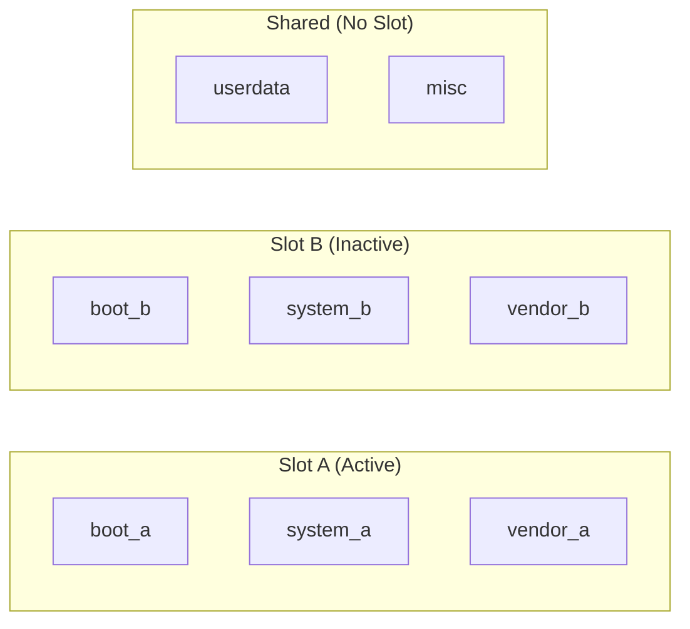
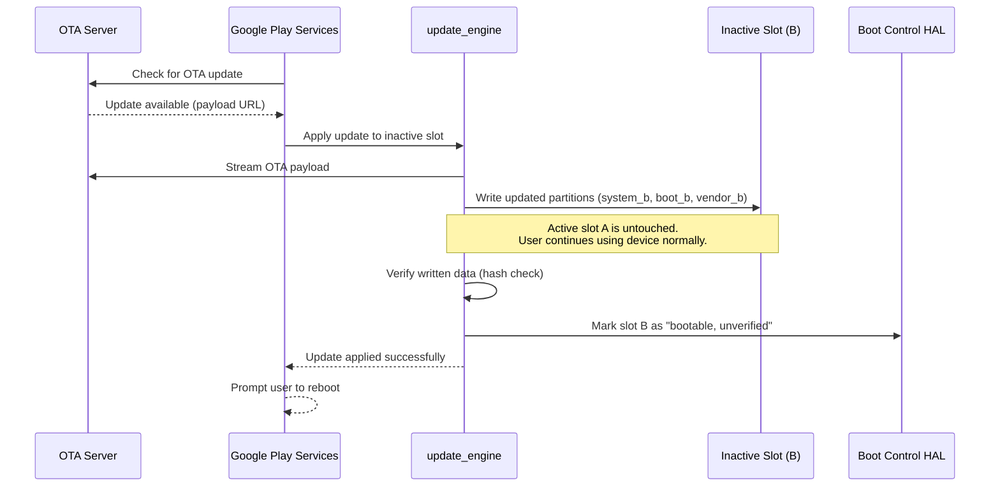
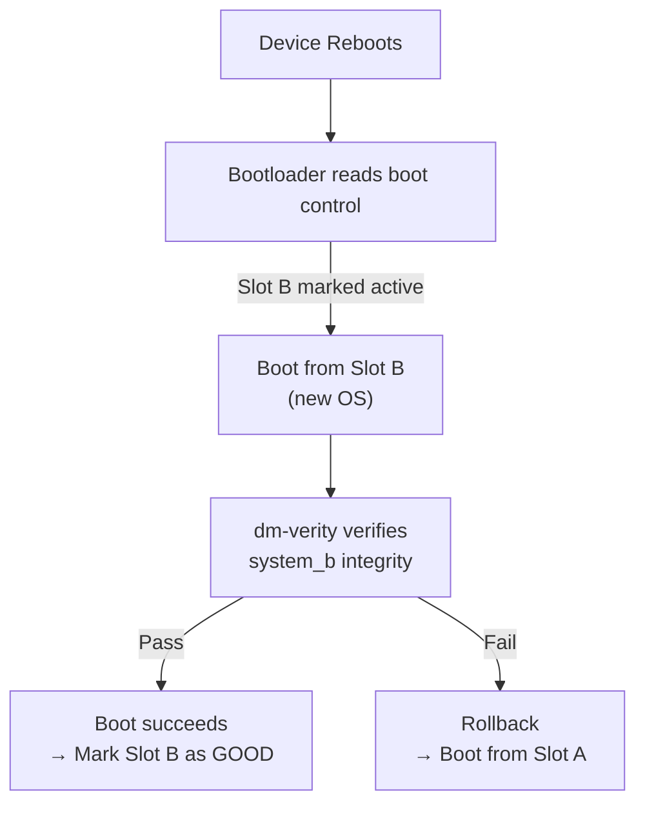
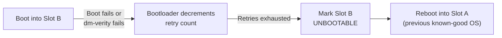
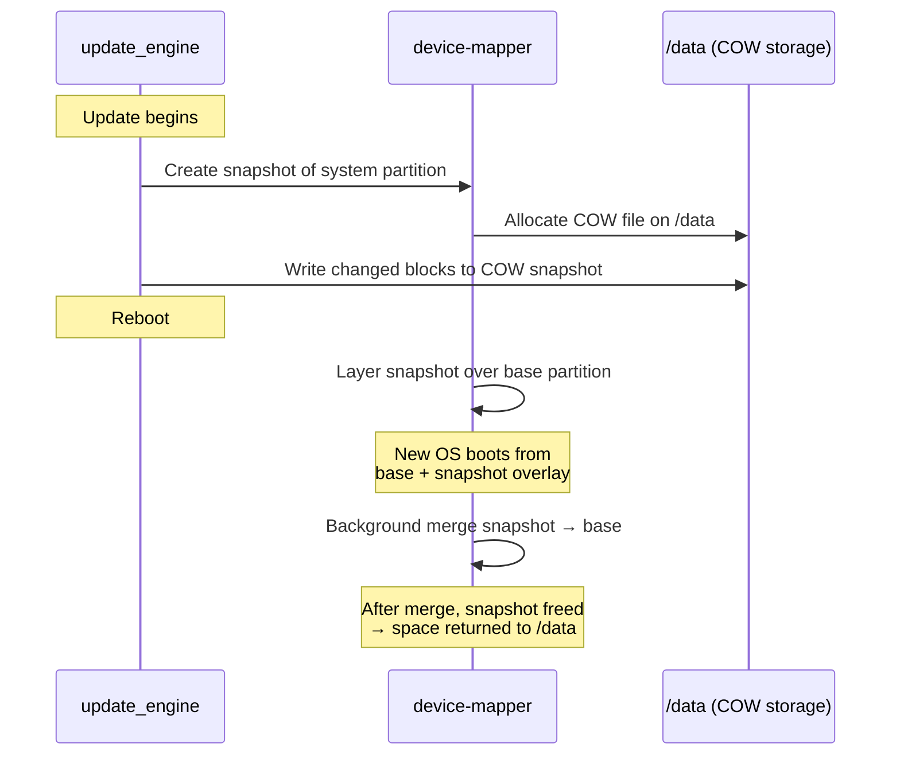
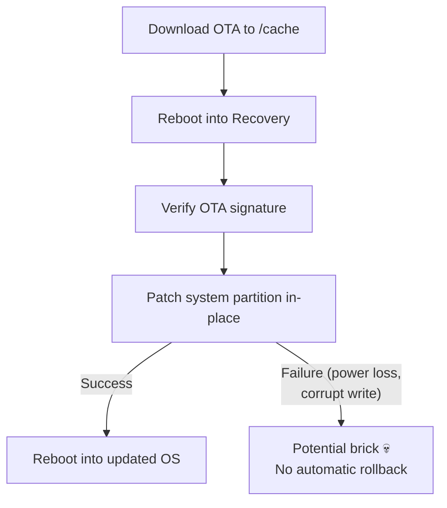
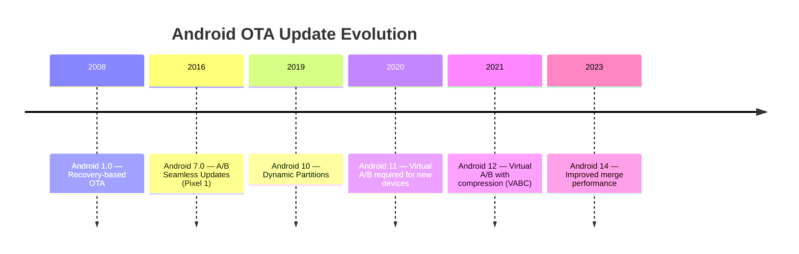

# Android System Updates — A/B Seamless Updates

Android can download and install OS updates **while the device is running** without interrupting the user. The restart is needed not because the update wasn't applied, but because the device must **switch to the updated partition** — Linux cannot swap its own running kernel and init ramdisk in place.

---

## Update Models

Android has used two fundamentally different update architectures:

| | Recovery-Based (Legacy) | A/B Seamless (Modern) |
|---|---|---|
| **Partitions** | Single `system`, `boot`, `vendor` | Duplicate: `system_a`/`system_b`, `boot_a`/`boot_b` |
| **Applies update** | In recovery mode (device unusable) | In background while device is running |
| **Downtime** | 10-20+ minutes of "installing..." screen | Only a normal reboot (~30 seconds) |
| **Rollback** | None — bricked if update fails mid-write | Automatic — boots back into old slot |
| **Introduced** | Android 1.0 | Android 7.0 (Nougat) |
| **Required** | Devices launching with Android < 11 | Devices launching with Android 11+ |

---

## A/B Partition Layout

The key insight is **partition duplication**. Critical partitions exist in two copies called **slots** — slot A and slot B:

- The device boots from one slot (the **active** slot) while the other sits idle
- User data (`/data`) is **never duplicated** — it is shared across both slots
- The `misc` partition stores boot control metadata (which slot is active, retry counters)

---

## How an Update Is Applied While Running

The entire update happens in the background through the `update_engine` daemon:

### Step-by-Step

1. **Check** — Google Play Services (or an OEM updater) polls the OTA server for available updates
2. **Download & write** — `update_engine` streams the OTA payload and writes it directly to the **inactive slot**. The active slot is never modified, so the running OS is unaffected.
3. **Verify** — After writing, `update_engine` reads back every block and verifies SHA-256 hashes against the payload manifest
4. **Mark bootable** — The Boot Control HAL marks the inactive slot as the preferred boot target with status `UNVERIFIED`
5. **User reboots** — The user is prompted (or auto-rebooted, depending on policy) to switch to the updated slot

!!! info "Payload Types"
    - **Full payload** — contains complete partition images. Larger but simpler.
    - **Delta payload** — contains binary diffs (bsdiff/puffdiff) against the current active slot. Much smaller (~100-300 MB vs 2+ GB) but requires the source slot to be unmodified.

---

## Why Is the Restart Needed?

The update is fully written and verified before the reboot. The restart exists for three reasons:

### 1. The Kernel Cannot Replace Itself

The Linux kernel is loaded into memory at boot from the `boot` partition. A running kernel cannot unload itself and load a new one — that would be like replacing the engine of a car while driving. The new kernel on the updated slot can only be loaded by the bootloader during a fresh boot sequence.

### 2. The Root Filesystem Cannot Be Hot-Swapped

The `system` partition is mounted as the root filesystem. Even though Linux supports remounting filesystems, you cannot atomically swap the **entire system image** — init, system services, framework JARs, native libraries — while hundreds of processes hold open file handles to them.

### 3. Atomic Slot Switch

The reboot is the **atomic commit point**. By switching the active slot in the bootloader, the device either boots entirely into the new version or entirely into the old one. There is no partial state where half the OS is old and half is new.

---

## Post-Reboot Verification & Rollback

The update isn't considered "done" until the new slot proves it can boot successfully:

| State | Meaning |
|---|---|
| `UNVERIFIED` | Slot was written and hash-checked, but hasn't booted yet |
| `SUCCESSFUL` | Slot booted, reached `sys.boot_completed=1`, marked good by `update_verifier` |
| `UNBOOTABLE` | Slot failed verification — bootloader will not attempt it again |

### Rollback Flow

The bootloader gives the new slot a limited number of boot attempts (typically 7). If it fails to reach `SUCCESSFUL` status, the bootloader automatically reverts to the old slot. This is why A/B updates **never brick devices** — the old working OS is always intact on the other slot.

!!! warning "What Rollback Cannot Fix"
    Rollback restores the OS partitions but **not** the user data partition. If a data migration ran during first boot on the new version and corrupted `/data`, rolling back the OS won't undo that damage. This is why data migrations must be forward-compatible and carefully tested.

---

## Virtual A/B (Android 11+)

Traditional A/B doubles the storage needed for system partitions (~5-6 GB wasted). **Virtual A/B** solves this using device-mapper snapshots:

| | Traditional A/B | Virtual A/B |
|---|---|---|
| **Storage** | Full duplicate partitions | Single partition + COW snapshots on `/data` |
| **Extra space** | ~5-6 GB always reserved | Snapshot space (~2-3 GB during update, freed after) |
| **Rollback** | Switch slot pointer | Discard snapshot |
| **Merge** | Not needed | Post-reboot merge of snapshot into partition |

### How Virtual A/B Works

1. Instead of writing to a second physical partition, `update_engine` writes changed blocks to a **copy-on-write snapshot** stored on the user data partition
2. After reboot, device-mapper layers the snapshot over the base partition — the OS sees the updated filesystem
3. In the background, the snapshot is **merged** into the base partition. Once merged, the snapshot space is freed

!!! tip "Compression (Android 12+)"
    Virtual A/B with **compression** (`vabc`) uses compressed COW images, reducing snapshot size by 40-50%. This is the default for devices launching with Android 12+.

---

## The Legacy Recovery-Based Update

Before A/B, updates worked very differently:

1. The OTA package was downloaded to `/cache`
2. The device rebooted into the **recovery partition** (a minimal Linux environment)
3. Recovery applied the update by **patching the running system partition in place**
4. If power was lost mid-write, the system partition was left in a half-written state with no fallback

This is why old Android phones showed the "installing system update" screen for 10-20 minutes — the device was literally unusable during the patching process.

---

## Update Delivery: Streaming vs Download

| Mode | How It Works | Used By |
|---|---|---|
| **Download + Apply** | Full payload downloaded to storage, then applied | Legacy OTA, some OEMs |
| **Streaming** | Payload blocks applied as they download (no temp storage needed) | A/B with `update_engine` |

Streaming updates are the default with A/B. The `update_engine` reads payload blocks from an HTTP connection and writes them directly to the inactive slot, requiring **no extra storage** for the downloaded payload.

---

## Key Components

| Component | Role |
|---|---|
| `update_engine` | Daemon that downloads, applies, and verifies OTA payloads |
| `boot_control` HAL | Interface to read/set active slot, mark slots bootable/unbootable |
| `update_verifier` | Runs on first boot after update, reads dm-verity status, marks slot `SUCCESSFUL` |
| `dm-verity` | Kernel feature that verifies every block read from the system partition against a hash tree |
| `bootloader` | Reads slot metadata, decides which slot to boot, handles retry logic |

---

## Timeline of Android Update Evolution

---

??? question "Common Interview Questions"

    **Q: How can Android install an update while the phone is still running?**
    The OS uses A/B partitions — two copies of every critical partition. The update is written to the **inactive** slot while the active slot continues running normally. The running OS is never modified during the update.

    **Q: Why can't Android avoid the reboot entirely?**
    Three reasons: (1) the Linux kernel cannot replace itself in memory, (2) the root filesystem cannot be atomically swapped while processes hold open file handles, and (3) the reboot serves as the atomic commit point for the slot switch — ensuring the device boots entirely into one version.

    **Q: What happens if the update fails after reboot?**
    The bootloader has retry logic. If the new slot fails to boot (dm-verity failure, crash loop, etc.), the bootloader automatically rolls back to the previous slot after exhausting retries (typically 7 attempts). The old OS is always intact.

    **Q: What is Virtual A/B?**
    An optimization introduced in Android 11 that avoids duplicating physical partitions. Instead, changed blocks are written to a copy-on-write snapshot stored on `/data`. After reboot, the snapshot is merged into the base partition and the temporary space is freed.

    **Q: How is the update verified?**
    Two layers: (1) `update_engine` verifies SHA-256 hashes of every block after writing, and (2) `dm-verity` verifies every block read from disk at runtime using a Merkle hash tree rooted in a signed hash in the boot partition.

    **Q: What is the difference between a full and delta OTA payload?**
    A full payload contains complete partition images (~2+ GB). A delta payload contains binary diffs against the current slot (~100-300 MB). Delta payloads are smaller but require the source slot to be unmodified.

    **Q: Can a user roll back an Android OS update manually?**
    Not typically. After the new slot is marked `SUCCESSFUL` and the snapshot is merged (Virtual A/B) or the old slot is overwritten by the next update, the previous version is no longer available. Rollback is automatic and only happens during the boot verification window.

!!! tip "Further Reading"
    - [Android A/B System Updates (AOSP)](https://source.android.com/docs/core/ota/ab)
    - [Virtual A/B Overview (AOSP)](https://source.android.com/docs/core/ota/virtual_ab)
    - [update_engine Design (AOSP)](https://android.googlesource.com/platform/system/update_engine/+/refs/heads/main/README.md)
    - [Boot Control HAL (AOSP)](https://source.android.com/docs/core/ota/ab#bootcontrol)
