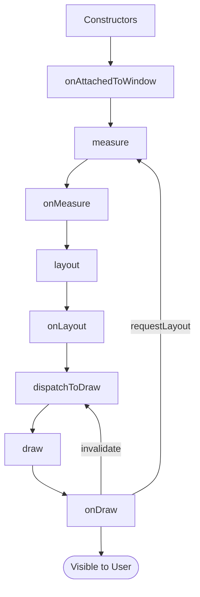

# Views & UI Components

## View Lifecycle



### View and ViewGroup

- **View** is the base class for all UI components
- **ViewGroup** holds views and is a container. ViewGroup **extends** View

### Constructors

Views have 4 constructors:

| Constructor | Usage |
|---|---|
| `View(Context)` | Creating views programmatically |
| `View(Context, AttributeSet)` | Inflating from XML |
| `View(Context, AttributeSet, defStyleAttr)` | XML with style attribute |
| `View(Context, AttributeSet, defStyleAttr, defStyleRes)` | XML with style attribute and default style resource |

### Measure Phase

`(ViewGroup) measure()` → `(View) onMeasure(widthMeasureSpec, heightMeasureSpec)`

!!! warning
    `onMeasure()` **must** call `setMeasuredDimension()` to store the measured width and height.

### Layout Phase

`(ViewGroup) layout()` → `(View) onLayout(left, right, top, bottom)`

Positions the view within its parent.

### Draw Phase

`(ViewGroup) draw()` → `(View) onDraw()`

Provides a `Canvas` for the view to draw itself.

### Invalidate vs RequestLayout

| Method | Effect |
|---|---|
| `invalidate()` | Triggers a **redraw** (skips measure and layout) |
| `requestLayout()` | Triggers **recalculate size/position** and then draw |

---

## Custom View Attributes

### 1. Define Attributes

Create `values/attrs.xml`:

```xml
<resources>
    <declare-styleable name="CustomView">
        <attr name="customColor" format="color" />
        <attr name="customText" format="string" />
    </declare-styleable>
</resources>
```

### 2. Use in XML

```xml
<com.example.CustomView
    app:customColor="#FF0000"
    app:customText="Hello" />
```

### 3. Obtain in Code

```kotlin
val typedArray: TypedArray = context.theme.obtainStyledAttributes(
    attrs,
    R.styleable.CustomView,
    0, 0
)
try {
    val color = typedArray.getColor(R.styleable.CustomView_customColor, Color.BLACK)
    val text = typedArray.getString(R.styleable.CustomView_customText)
} finally {
    typedArray.recycle()
}
```

---

## View vs ViewGroup

| | View | ViewGroup |
|---|---|---|
| Description | Single UI element | Container for views |
| Examples | `Button`, `TextView`, `ImageView` | `LinearLayout`, `RelativeLayout`, `ConstraintLayout` |
| Inheritance | Base class | Extends `View` |

---

## ViewStub

A **lightweight, invisible placeholder** view. It is used to lazily inflate views that are not needed immediately.

```xml
<ViewStub
    android:id="@+id/stub"
    android:inflatedId="@+id/inflated_layout"
    android:layout="@layout/heavy_layout"
    android:layout_width="match_parent"
    android:layout_height="wrap_content" />
```

```kotlin
val stub: ViewStub = findViewById(R.id.stub)
stub.inflate() // Inflates the layout
```

!!! warning
    Once inflated, the ViewStub **cannot be reused**. It removes itself from the hierarchy after inflation.

---

## SurfaceView vs TextureView

=== "SurfaceView"

    - Provides a **dedicated drawing surface**
    - Renders on a **non-UI thread** — efficient for video and gaming
    - Managed via `SurfaceHolder`
    - **Limitations:** Does not support scaling, rotating, or animating like a regular view

=== "TextureView"

    - Renders on the **UI thread**
    - Supports **scaling, rotating, and animating**
    - **Not efficient** for high-frequency rendering compared to SurfaceView
    - Better suited for scenarios needing view transformations

---

## Window Class

The `Window` class serves as the container for all UI components. It acts as a bridge between the app UI and the display.

Responsibilities:

- Shows and hides system UI (status bar, navigation bar)
- Handles input events (touch, gestures, key presses)

---

## WebView

WebView allows loading HTML content and running JavaScript within an app.

```kotlin
val webView: WebView = findViewById(R.id.webView)
webView.settings.javaScriptEnabled = true

// Load a URL
webView.loadUrl("https://example.com")

// Add JavaScript interface
webView.addJavascriptInterface(MyJsInterface(), "Android")
```

```kotlin
class MyJsInterface {
    @JavascriptInterface
    fun showToast(message: String) {
        Toast.makeText(context, message, Toast.LENGTH_SHORT).show()
    }
}
```

!!! tip
    Use the `@JavascriptInterface` annotation on methods that should be callable from HTML/JavaScript.

---

## ViewBinding

Generates a binding class for each XML layout file, eliminating the need for `findViewById()`.

```kotlin
// In Activity
private lateinit var binding: ActivityMainBinding

override fun onCreate(savedInstanceState: Bundle?) {
    super.onCreate(savedInstanceState)
    binding = ActivityMainBinding.inflate(layoutInflater)
    setContentView(binding.root)

    binding.textView.text = "Hello ViewBinding"
}
```

---

## DataBinding

Generates a binding class for XML layouts that use the `<layout>` tag. Allows binding data directly in XML using expressions.

```xml
<layout xmlns:android="http://schemas.android.com/apk/res/android">
    <data>
        <variable
            name="user"
            type="com.example.User" />
    </data>

    <TextView
        android:layout_width="wrap_content"
        android:layout_height="wrap_content"
        android:text="@{user.name}" />
</layout>
```

```kotlin
val binding: ActivityMainBinding = DataBindingUtil.setContentView(this, R.layout.activity_main)
binding.user = User("Sandy")
```

---

## Animations

=== "MotionLayout"

    XML-based animation configuration using `MotionScene` and `transition` tags.

    ```xml
    <androidx.constraintlayout.motion.widget.MotionLayout
        app:layoutDescription="@xml/motion_scene">

        <View
            android:id="@+id/view"
            android:layout_width="64dp"
            android:layout_height="64dp" />

    </androidx.constraintlayout.motion.widget.MotionLayout>
    ```

    The `MotionScene` file defines start/end constraint sets and the transition between them.

=== "ObjectAnimator"

    Animate a view with position and duration programmatically.

    ```kotlin
    ObjectAnimator.ofFloat(view, "translationX", 0f, 300f).apply {
        duration = 1000
        start()
    }
    ```

---

## Interview Q&A

??? question "Describe the View rendering pipeline (measure, layout, draw)."
    The View rendering pipeline has three phases: **Measure** determines the size of each view via `onMeasure()` (must call `setMeasuredDimension()`), **Layout** positions each view within its parent via `onLayout()`, and **Draw** renders the view onto a Canvas via `onDraw()`. The parent ViewGroup drives each phase top-down through the view hierarchy.

??? question "What is the difference between invalidate() and requestLayout()?"
    `invalidate()` triggers only a redraw (the draw phase), skipping measure and layout — use it when the view's appearance changes but not its size. `requestLayout()` triggers a full pass through measure, layout, and draw — use it when the view's size or position needs to change.

??? question "What is ViewStub and when would you use it?"
    ViewStub is a lightweight, invisible placeholder that lazily inflates a layout only when needed (via `inflate()` or `setVisibility(VISIBLE)`). It is useful for views that are rarely shown (error states, empty states) to avoid the cost of inflating them during initial layout. Once inflated, it removes itself from the hierarchy and cannot be reused.

??? question "What is the difference between ViewBinding and DataBinding?"
    ViewBinding generates a binding class that provides direct references to views, replacing `findViewById()`. DataBinding does everything ViewBinding does plus allows binding data directly in XML using expressions (`@{user.name}`), supports two-way binding, and uses the `<layout>` tag. ViewBinding is simpler and has faster build times.

??? question "Explain SurfaceView vs TextureView."
    SurfaceView provides a dedicated drawing surface that renders on a separate non-UI thread, making it efficient for video playback and games, but it cannot be transformed (scaled, rotated, animated) like a regular view. TextureView renders on the UI thread and supports all standard view transformations but is less efficient for high-frequency rendering.

!!! tip "Further Reading"
    - [Custom View Components | Android Developers](https://developer.android.com/develop/ui/views/layout/custom-views/custom-components)
    - [How Android Draws Views | Android Developers](https://developer.android.com/develop/ui/views/how-android-draws)
    - [View Binding | Android Developers](https://developer.android.com/topic/libraries/view-binding)
    - [Data Binding | Android Developers](https://developer.android.com/topic/libraries/data-binding)
    - [MotionLayout | Android Developers](https://developer.android.com/develop/ui/views/animations/motionlayout)
