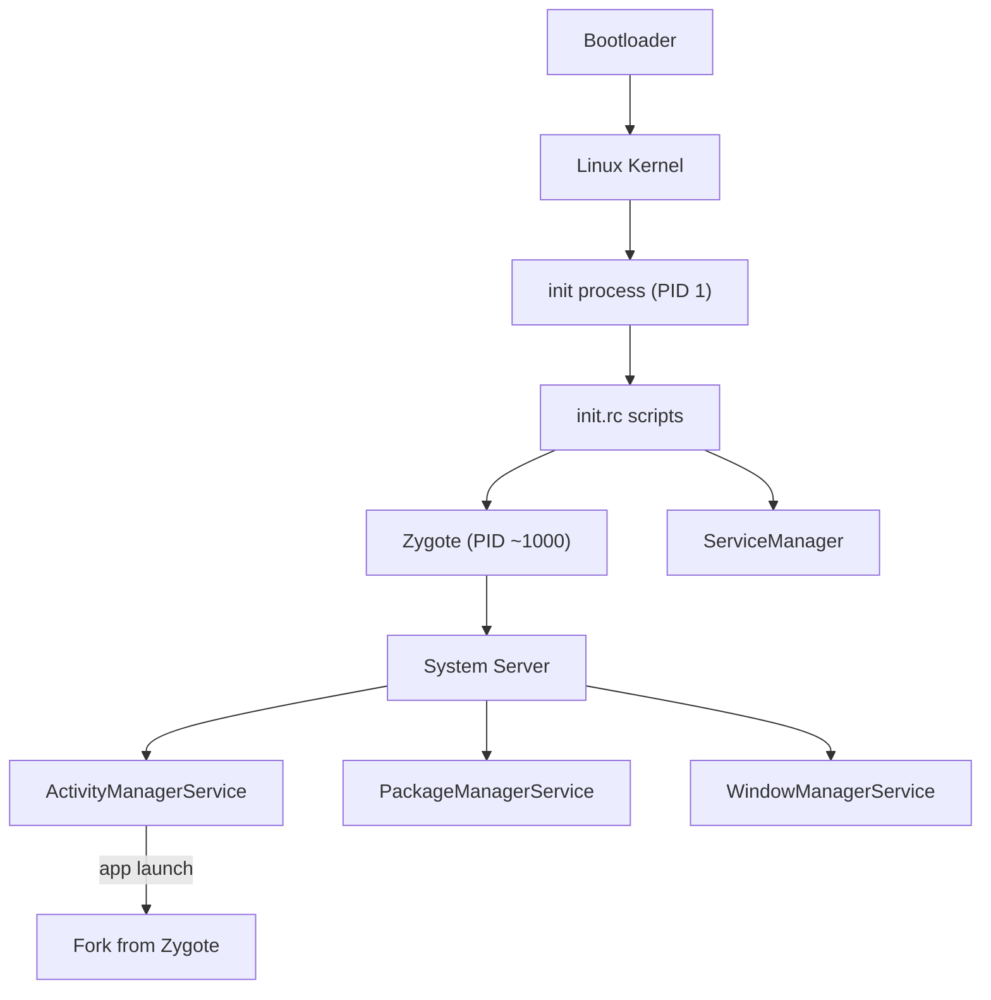
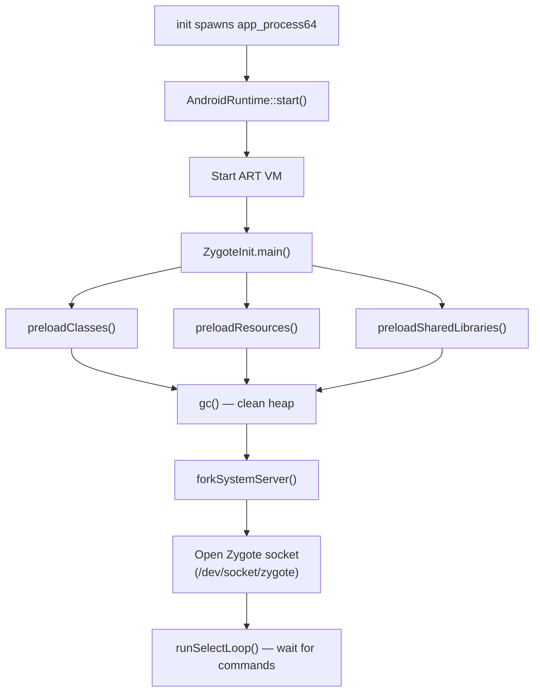
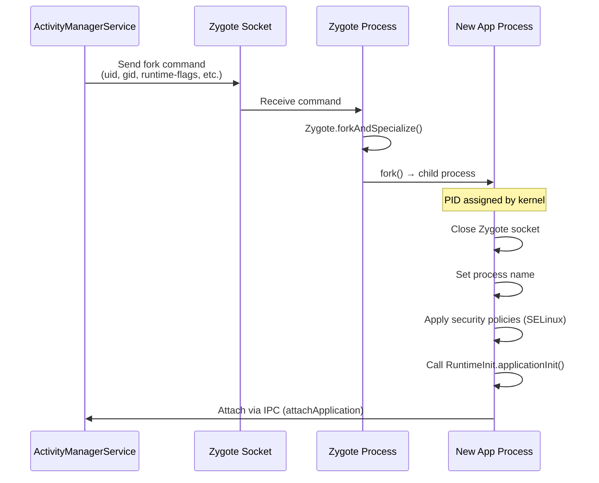
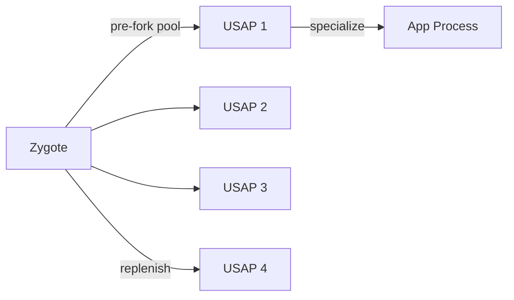
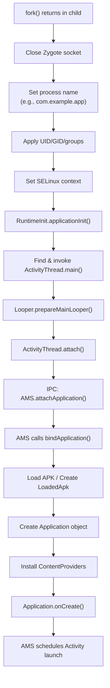
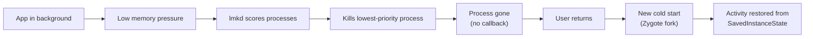

# Zygote & App Startup Internals

## Android Boot Sequence

Understanding app startup begins at device boot. The path from power-on to a running app involves multiple stages:



| Stage | What Happens |
|-------|-------------|
| **Bootloader** | Hardware init, loads kernel into RAM |
| **Kernel** | Mounts root filesystem, starts `init` (PID 1) |
| **init** | Parses `init.rc`, starts native daemons, spawns Zygote |
| **Zygote** | Initializes ART, preloads classes/resources, forks System Server |
| **System Server** | Starts all system services (AMS, PMS, WMS, etc.) |
| **Launcher** | System Server signals boot complete, Home app starts |

---

## Zygote In Depth

Zygote is the parent of every app process on Android. It is started by `init` via `app_process` (or `app_process64` on 64-bit).

### Zygote Initialization



### What Gets Preloaded

| Category | Examples | Count |
|----------|---------|-------|
| **Classes** | `android.app.Activity`, `android.view.View`, `java.util.*` | ~7000+ |
| **Resources** | Framework drawables, layouts, color state lists | ~100+ |
| **Shared Libs** | `libandroid_runtime.so`, `libjnigraphics.so`, ICU data | ~30+ |
| **OpenGL** | GPU driver preloaded (vendor-specific) | — |

!!! info "Why preload?"
    Preloading into Zygote means every forked app process inherits these in shared memory via copy-on-write. Without preloading, each app would separately load ~7000 framework classes — consuming time and memory per-process.

### Dual Zygote (32-bit + 64-bit)

On 64-bit devices, `init` starts **two** Zygote processes:

- `zygote64` — primary, forks 64-bit app processes
- `zygote` — secondary, forks 32-bit app processes (legacy apps)

The system determines which Zygote to use based on the app's `primaryCpuAbi` declared in its APK.

---

## The Fork Mechanism

When `ActivityManagerService` decides to start a new app process, the sequence is:



### fork() and Copy-on-Write

```
┌─────────────────────────────────────────────────┐
│              Zygote Memory (Physical)            │
│  ┌──────────┬────────────┬───────────────────┐  │
│  │ ART VM   │ Preloaded  │ Shared Libraries  │  │
│  │ Internals│ Classes    │ (.so files)       │  │
│  └──────────┴────────────┴───────────────────┘  │
└─────────────────────────────────────────────────┘
         │ fork() — pages shared (CoW)
         ▼
┌─────────────────────────────────────────────────┐
│              App Process (Virtual)               │
│  ┌──────────┬────────────┬───────────────────┐  │
│  │ ART VM   │ Preloaded  │ Shared Libraries  │  │
│  │ (shared) │ (shared)   │ (shared)          │  │
│  └──────────┴────────────┴───────────────────┘  │
│  ┌─────────────────────────────────────────┐    │
│  │ App-specific heap (private, written)     │    │
│  └─────────────────────────────────────────┘    │
└─────────────────────────────────────────────────┘
```

Key properties of `fork()`:

| Property | Implication |
|----------|-------------|
| **Instant creation** | No need to re-initialize ART or reload classes |
| **Shared read-only pages** | Framework code shared across all apps in physical RAM |
| **Copy-on-write** | Private app data gets its own pages only when modified |
| **File descriptors closed** | Child closes Zygote's server socket immediately |
| **New PID, same UID mapping** | Kernel assigns new PID; AMS sets the target UID/GID |

---

## USAP: Unspecialized App Process Pool (Android 10+)

Standard Zygote fork is fast (~5-10ms), but the subsequent specialization (setting UID, SELinux context, loading the app's APK) adds latency. **USAP** (Unspecialized App Process) pre-forks processes to eliminate even that cost.



### How USAP Works

1. Zygote maintains a pool of **pre-forked, unspecialized** processes (default: 1-10)
2. Each USAP has its own socket in `/dev/socket/usap_pool_*`
3. When AMS needs a new process, it writes specialization args directly to a USAP socket
4. The USAP specializes itself (sets UID, GID, SELinux, loads APK) — no fork latency
5. Zygote detects the pool shrank and replenishes it in the background

!!! note "USAP Pool Size"
    The pool size is controlled by `persist.device_config.runtime_native.usap_pool_enabled` and related properties. OEMs tune this based on device RAM. Low-memory devices may disable USAP entirely.

### Comparison

| | Standard Fork | USAP |
|---|---|---|
| **Process creation** | On-demand fork | Pre-forked, waiting |
| **Latency** | ~5-10ms fork + specialization | ~1-2ms (specialization only) |
| **Memory cost** | None until needed | Pool processes consume RAM |
| **When used** | Fallback, low-RAM devices | Default on Android 10+ with sufficient RAM |

---

## Post-Fork: App Process Initialization

After fork, the new process executes a well-defined initialization sequence:



### ActivityThread — The App's Entry Point

`ActivityThread` is the real `main()` of every Android app. It:

1. Creates the main `Looper` and `Handler`
2. Connects to `ActivityManagerService` via Binder
3. Receives lifecycle callbacks (`LAUNCH_ACTIVITY`, `BIND_SERVICE`, etc.) as messages
4. Dispatches them to the appropriate component

```java
// Simplified ActivityThread.main()
public static void main(String[] args) {
    Looper.prepareMainLooper();

    ActivityThread thread = new ActivityThread();
    thread.attach(false /* not system */);

    Looper.loop(); // blocks forever, processing messages
    throw new RuntimeException("Main thread loop exited");
}
```

### bindApplication Sequence

When AMS calls `bindApplication()` on the new process, it triggers:

| Step | What Happens | Typical Cost |
|------|-------------|-------------|
| 1. Load APK | `LoadedApk` created, DEX files mapped into memory | 5-20ms |
| 2. Create ClassLoader | `PathClassLoader` for the app's DEX files | 2-5ms |
| 3. Create `AppComponentFactory` | Custom factory if declared in manifest | <1ms |
| 4. Instantiate `Application` | Reflective creation of the app's `Application` class | <1ms |
| 5. Install ContentProviders | All declared CPs created and `onCreate()` called | 10-50ms |
| 6. `Application.onCreate()` | Developer code runs | Variable |

!!! warning "ContentProviders before Application.onCreate()"
    ContentProviders are instantiated and their `onCreate()` methods called **before** `Application.onCreate()`. This is why libraries abuse ContentProviders for auto-initialization — they run before any developer code.

---

## Full Cold Start Timeline

End-to-end cold start from user tap to first frame:

```mermaid
gantt
    title Cold Start Timeline
    dateFormat X
    axisFormat %Lms

    section System
    Process fork (Zygote)        :0, 10
    Process specialization       :10, 20
    ActivityThread.main()        :20, 25

    section Framework
    bindApplication              :25, 35
    ContentProviders.onCreate()  :35, 55
    Application.onCreate()       :55, 85

    section App
    Activity.onCreate()          :85, 120
    Layout inflation             :120, 160
    View.onMeasure/Layout       :160, 180
    First frame draw             :180, 200
```



!!! tip "Where to Focus Optimization"
    The system section (fork + specialization) is fixed. Developer impact is in:
    
    - **ContentProvider count** — each adds ~2ms
    - **Application.onCreate()** — defer non-critical work
    - **Activity creation** — lazy UI, avoid complex initial layouts
    - **First frame** — reduce view hierarchy depth

---

## System Server's Role in App Launch

System Server hosts the services that orchestrate app launch:

| Service | Role in Startup |
|---------|----------------|
| **ActivityManagerService** | Decides to start process, sends fork command, schedules Activity launch |
| **PackageManagerService** | Resolves Intent → target component, provides APK path and permissions |
| **WindowManagerService** | Creates app window, manages starting window (splash), handles transitions |
| **ActivityTaskManagerService** | Manages Activity stacks and tasks (split from AMS in Android 10) |

### Starting Window (Preview Window)

Before the app draws its first frame, WMS shows a **starting window** based on the app's theme:

1. User taps app icon
2. AMS starts the process
3. WMS immediately shows a starting window (theme's `windowBackground`)
4. App draws first frame → starting window replaced with real content

This is why a blank/white flash appears if `windowBackground` doesn't match the app's actual first screen. The Splash Screen API (Android 12+) formalizes this with branded splash content.

---

## Death & Recreation

### Process Death

The system can kill app processes at any time when resources are needed:



!!! warning "No Callback on Process Death"
    When the system kills a background process, there is **no** `onDestroy()` or any other callback. The process simply ceases to exist. This is why `onSaveInstanceState()` must persist all transient UI state — it's the last guaranteed opportunity.

### Process Importance Hierarchy

AMS assigns an `oom_adj` score to each process. The Linux low-memory killer daemon (`lmkd`) uses this to decide kill order:

| oom_adj Range | Category | Example |
|---|---|---|
| -1000 to -900 | System | `system_server`, Zygote |
| -800 | Persistent | Phone, SystemUI |
| 0 | Foreground | Current visible Activity |
| 100-200 | Visible | Activity behind a dialog |
| 200-300 | Service | Active foreground service |
| 700-900 | Cached | Background apps |
| 900-999 | Empty | No components running |

---

## Debugging & Observing Startup

### Key ADB Commands

```bash
# Watch app startup in real-time (logs TTID)
adb logcat -s ActivityTaskManager:I | grep "Displayed"

# Dump Zygote's preloaded classes
adb shell cat /proc/$(pidof zygote64)/maps | grep "boot"

# Check USAP pool status
adb shell getprop persist.device_config.runtime_native.usap_pool_enabled

# Force a cold start (kill process first)
adb shell am force-stop com.example.app && \
adb shell am start -W com.example.app/.MainActivity

# View process oom_adj scores
adb shell dumpsys activity processes | grep -A 3 "oom"
```

### Perfetto: Startup Trace Analysis

Key slices to look for in a Perfetto trace:

| Slice Name | What It Shows |
|-----------|---------------|
| `bindApplication` | Time from IPC to Application class created |
| `activityStart` | Activity launch + inflation time |
| `inflate` | Layout XML parsing and View tree creation |
| `draw` | First `onDraw()` call to Surface commit |
| `PostFork` | Time spent in post-fork specialization |

---

??? question "Interview Questions"

    **Q: What is Zygote and why does Android use it?**

    Zygote is a daemon process started at boot that pre-initializes the ART runtime and preloads ~7000 framework classes. Every app process is forked from Zygote using `fork()`, which leverages copy-on-write semantics — the child immediately has a working ART VM and all framework classes in shared memory without any copying. This makes app startup fast (no re-initialization) and memory-efficient (read-only pages shared across all apps).

    **Q: Explain copy-on-write in the context of Zygote.**

    When `fork()` creates a child process, the kernel maps the parent's memory pages into the child's address space but marks them read-only. Both processes share the same physical pages. Only when either process writes to a page does the kernel create a private copy for the writer. For Android, this means framework classes, ART internals, and shared libraries remain shared across all app processes until modification — saving significant RAM.

    **Q: What is the difference between fork and exec? Why doesn't Android use exec?**

    `fork()` creates a copy of the current process. `exec()` replaces the current process image with a new program. Android uses `fork()` without `exec()` because it wants to **inherit** Zygote's pre-initialized state (ART VM, preloaded classes). Using `exec()` would discard all that, requiring each app to reinitialize from scratch.

    **Q: Walk through what happens from the user tapping an app icon to the first frame.**

    1. Launcher sends a `startActivity()` Intent to AMS
    2. AMS resolves the target via PackageManager
    3. AMS checks if process exists — if not, requests Zygote to fork
    4. Zygote forks a new process (or assigns a USAP)
    5. Child process specializes (UID, SELinux, process name)
    6. `ActivityThread.main()` runs — creates Looper, attaches to AMS
    7. AMS calls `bindApplication()` — loads APK, creates ClassLoader
    8. ContentProviders instantiated and `onCreate()` called
    9. `Application.onCreate()` runs
    10. AMS schedules Activity launch → `Activity.onCreate()` → inflate → measure/layout → first frame drawn

    **Q: What is USAP and how does it improve startup?**

    USAP (Unspecialized App Process) is a pool of pre-forked processes maintained by Zygote (Android 10+). Instead of forking on-demand, AMS picks an idle USAP and sends it specialization parameters. This eliminates fork latency (~5-10ms), reducing it to just specialization time (~1-2ms). The tradeoff is memory — idle USAPs consume RAM, so the pool is tuned based on device resources.

    **Q: Why are ContentProviders created before Application.onCreate()?**

    This is by design in the Android framework. During `bindApplication()`, the system instantiates all declared ContentProviders and calls their `onCreate()` before calling `Application.onCreate()`. The intent is that ContentProviders are ready to serve queries from other processes immediately. Libraries exploit this ordering to auto-initialize before developer code runs.

    **Q: How does the system decide which process to kill under memory pressure?**

    Each process has an `oom_adj` score maintained by AMS based on what components are running (foreground Activity = 0, cached = 900+). The `lmkd` daemon monitors free memory and kills processes from highest oom_adj first. There is no callback — the process simply terminates. Apps must save state proactively in `onSaveInstanceState()`.

    **Q: What is ActivityThread and why is it important?**

    `ActivityThread` is the entry point (`main()`) of every app process. It creates the main Looper, establishes a Binder connection to AMS, and dispatches all component lifecycle events (activity start, service bind, broadcast receive) as Handler messages on the main thread. Despite its name, it manages all four component types, not just Activities.

!!! tip "Further Reading"
    - [Android Source: ZygoteInit.java](https://cs.android.com/android/platform/superproject/+/master:frameworks/base/core/java/com/android/internal/os/ZygoteInit.java)
    - [Android Source: ActivityThread.java](https://cs.android.com/android/platform/superproject/+/master:frameworks/base/core/java/android/app/ActivityThread.java)
    - [USAP Design Doc (AOSP)](https://cs.android.com/android/platform/superproject/+/master:frameworks/base/core/java/com/android/internal/os/Zygote.java)
    - [App Startup Time (Android Developers)](https://developer.android.com/topic/performance/vitals/launch-time)
    - [Perfetto: Android App Startup](https://perfetto.dev/docs/data-sources/android-startup)
