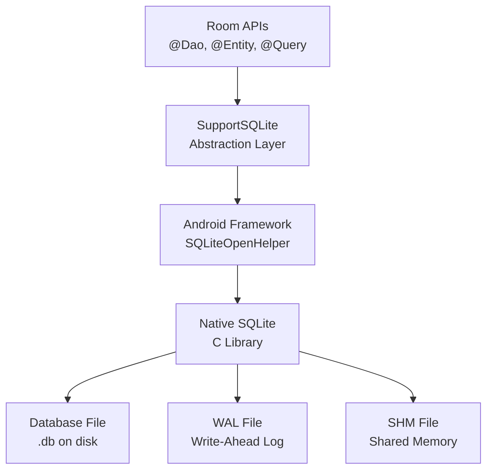
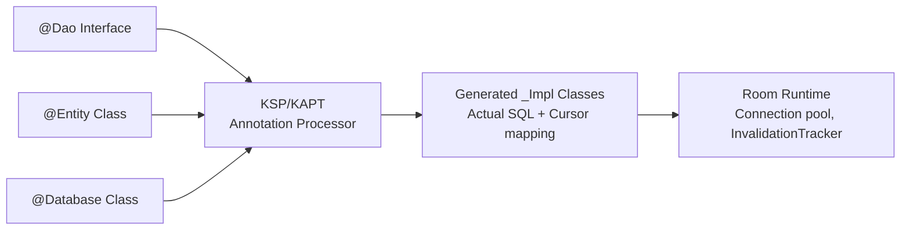

# Database Internals

Room is an abstraction over SQLite, but understanding the underlying database engine is critical for writing performant queries, designing proper schemas, and debugging issues in production. This section covers the internals that matter most for Android developers.

---

## Sub-Topics

| Topic | What It Covers |
|-------|---------------|
| [Indexing](room-indexing.md) | Index types, composite indexes, query planning, index optimization in Room |
| [Triggers & Callbacks](room-triggers.md) | SQLite triggers, Room callbacks, InvalidationTracker, schema migrations |
| [Reactive Queries with Flow](room-reactive-queries.md) | How Room observes tables, Flow/LiveData integration, invalidation mechanism, performance |

---

## SQLite Architecture on Android



---

## Storage Engine

SQLite uses a **B-tree** based storage engine:

| Structure | Purpose |
|-----------|---------|
| **Table B-tree** | Stores row data, keyed by `rowid` (or INTEGER PRIMARY KEY) |
| **Index B-tree** | Stores index entries, pointing back to the table B-tree |
| **Pages** | Fixed-size blocks (4KB default) — the unit of I/O |
| **WAL** | Write-Ahead Log for concurrent reads during writes |

### Page Layout

```
┌─────────────────────────────────┐
│ Page Header (8-12 bytes)        │
├─────────────────────────────────┤
│ Cell Pointer Array              │
│ (sorted offsets to cells)       │
├─────────────────────────────────┤
│ Free Space                      │
├─────────────────────────────────┤
│ Cell Content Area               │
│ (actual row/index data)         │
└─────────────────────────────────┘
```

---

## WAL Mode (Write-Ahead Logging)

Room enables WAL mode by default (Android 9+). This is critical for mobile performance:

| Mode | Reads During Write | Write Concurrency | Crash Safety |
|------|-------------------|-------------------|-------------|
| **Journal (legacy)** | Blocked | Single writer blocks readers | Rollback journal |
| **WAL** | Allowed | Readers don't block writer | WAL + checkpointing |

```kotlin
// Room enables WAL by default, but you can configure:
Room.databaseBuilder(context, AppDatabase::class.java, "app.db")
    .setJournalMode(RoomDatabase.JournalMode.WRITE_AHEAD_LOGGING)
    .build()
```

!!! note "WAL Checkpoint"
    WAL file grows as writes accumulate. SQLite periodically checkpoints (copies WAL data back to the main DB file). Room triggers auto-checkpointing. A large WAL file (>1MB) may indicate heavy write load without checkpointing.

---

## Room Compilation Pipeline



Room generates concrete implementations at compile time:

- `UserDao_Impl` — contains the actual SQL strings and cursor-to-object mapping
- `AppDatabase_Impl` — manages schema creation, migration, and the InvalidationTracker

---

## Connection Pool

Room manages a pool of SQLite connections:

| Connection | Purpose | Count |
|-----------|---------|-------|
| **Write** | INSERT, UPDATE, DELETE, DDL | 1 (SQLite limitation) |
| **Read** | SELECT queries | Up to 4 (configurable) |

```kotlin
Room.databaseBuilder(context, AppDatabase::class.java, "app.db")
    .setQueryExecutor(Executors.newFixedThreadPool(4))
    .build()
```

!!! warning "Main Thread Queries"
    Room forbids database access on the main thread by default. The `allowMainThreadQueries()` builder option disables this check — never use it in production. It exists only for testing.

---

## Transaction Semantics

```kotlin
@Dao
interface OrderDao {
    @Transaction
    suspend fun placeOrder(order: Order, items: List<OrderItem>) {
        insertOrder(order)
        items.forEach { insertItem(it) }
        updateInventory(items)
    }

    @Insert
    suspend fun insertOrder(order: Order)

    @Insert
    suspend fun insertItem(item: OrderItem)

    @Query("UPDATE inventory SET stock = stock - :qty WHERE sku = :sku")
    suspend fun updateInventory(sku: String, qty: Int)
}
```

| Isolation Level | SQLite Behavior |
|----------------|-----------------|
| **DEFERRED** (default) | Lock acquired on first actual read/write |
| **IMMEDIATE** | Write lock acquired at BEGIN |
| **EXCLUSIVE** | Full exclusive lock at BEGIN |

Room's `@Transaction` uses IMMEDIATE by default to avoid deadlocks in WAL mode.

---

??? question "Common Interview Questions"

    **Q: How does Room differ from raw SQLite access?**
    Room provides: compile-time SQL verification, automatic cursor-to-object mapping, reactive query observation (Flow/LiveData), built-in migration support, and thread safety. The generated code is equivalent to what you'd write manually — no runtime reflection, no performance penalty.

    **Q: Why does SQLite only allow one writer at a time?**
    SQLite's file-level locking model doesn't support concurrent writes. The database file is a single resource — even in WAL mode, only one connection can write at a time. Readers can proceed concurrently with a writer in WAL mode (they read from the main DB file while writes go to the WAL).

    **Q: What happens if the app crashes mid-transaction?**
    In WAL mode, uncommitted writes exist only in the WAL file and are discarded on recovery. The main database file remains consistent. SQLite's atomic commit guarantees that a transaction either fully commits or fully rolls back — there's no partial state.

    **Q: When should you use `@Transaction` in Room?**
    When you need atomicity (multiple writes that must all succeed or all fail), or when a query returns relations (Room needs consistent reads across multiple tables). Without `@Transaction`, a multi-step write could partially succeed, leaving the database in an inconsistent state.

!!! tip "Further Reading"
    - [SQLite architecture](https://www.sqlite.org/arch.html)
    - [Room persistence library](https://developer.android.com/training/data-storage/room)
    - [Write-Ahead Logging](https://www.sqlite.org/wal.html)
