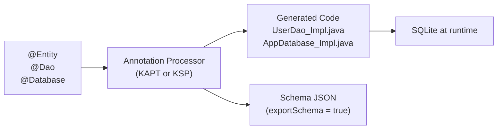
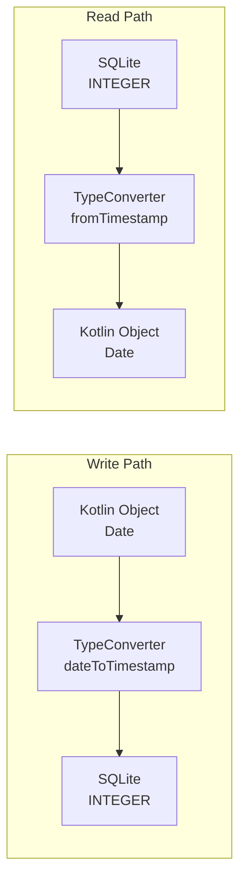
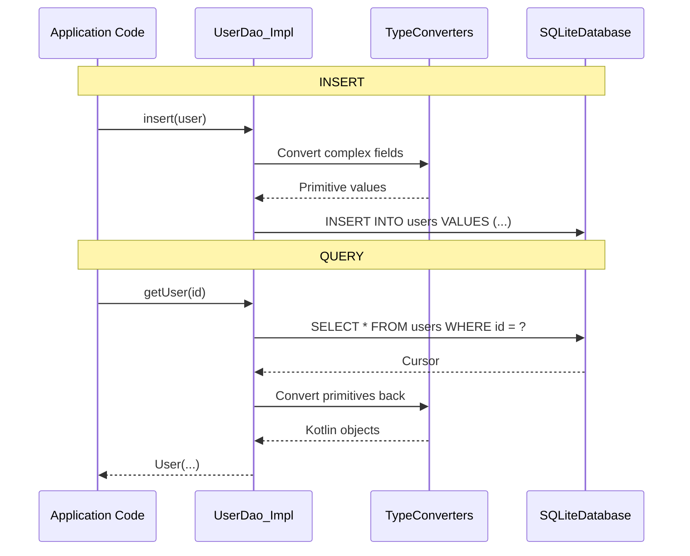

# Room Entity Internals

How Room transforms `@Entity` annotated Kotlin data classes into SQLite tables at compile time, and how entities flow through the generated code at runtime.

---

## Compile-Time Processing

Room uses **annotation processing** (KAPT or KSP) to generate all database code at compile time — no reflection at runtime.



### What Gets Generated

| Annotation | Generated Class | Contents |
|-----------|----------------|----------|
| `@Database` | `AppDatabase_Impl` | `createOpenHelper()`, migration logic, DAO factory methods |
| `@Dao` | `UserDao_Impl` | SQL execution, cursor-to-entity mapping, Flow wiring |
| `@Entity` | (no separate class) | Schema embedded in `AppDatabase_Impl` as `CREATE TABLE` SQL |

---

## @Entity → CREATE TABLE

```kotlin
@Entity(
    tableName = "users",
    indices = [
        Index(value = ["email"], unique = true),
        Index(value = ["department_id", "name"])
    ],
    foreignKeys = [
        ForeignKey(
            entity = Department::class,
            parentColumns = ["id"],
            childColumns = ["department_id"],
            onDelete = ForeignKey.CASCADE
        )
    ]
)
data class User(
    @PrimaryKey(autoGenerate = true)
    val id: Long = 0,
    
    @ColumnInfo(name = "full_name")
    val name: String,
    
    val email: String,
    
    @ColumnInfo(name = "department_id")
    val departmentId: Long,
    
    @ColumnInfo(defaultValue = "0")
    val isActive: Boolean = false,
    
    @Embedded
    val address: Address? = null
)

data class Address(
    @ColumnInfo(name = "street") val street: String?,
    @ColumnInfo(name = "city") val city: String?,
    @ColumnInfo(name = "zip") val zip: String?
)
```

**Generated SQL:**

```sql
CREATE TABLE IF NOT EXISTS `users` (
    `id` INTEGER PRIMARY KEY AUTOINCREMENT NOT NULL,
    `full_name` TEXT NOT NULL,
    `email` TEXT NOT NULL,
    `department_id` INTEGER NOT NULL,
    `isActive` INTEGER NOT NULL DEFAULT 0,
    `street` TEXT,
    `city` TEXT,
    `zip` TEXT,
    FOREIGN KEY(`department_id`) REFERENCES `departments`(`id`) ON DELETE CASCADE
);

CREATE UNIQUE INDEX IF NOT EXISTS `index_users_email` ON `users` (`email`);
CREATE INDEX IF NOT EXISTS `index_users_department_id_name` ON `users` (`department_id`, `name`);
```

### Kotlin Type → SQLite Type Mapping

| Kotlin Type | SQLite Type | Notes |
|-------------|-------------|-------|
| `Int`, `Long`, `Short`, `Byte` | `INTEGER` | |
| `Float`, `Double` | `REAL` | |
| `String` | `TEXT` | |
| `Boolean` | `INTEGER` | 0 = false, 1 = true |
| `ByteArray` | `BLOB` | |
| `Enum` | `TEXT` (default) or `INTEGER` | Depends on TypeConverter |
| Nullable (`T?`) | Same type + allows NULL | `NOT NULL` omitted |

---

## @Embedded — Flattening Objects

`@Embedded` inlines another object's fields directly into the parent table — no separate table, no JOIN.

```kotlin
@Entity
data class Employee(
    @PrimaryKey val id: Long,
    val name: String,
    @Embedded(prefix = "home_") val homeAddress: Address?,
    @Embedded(prefix = "work_") val workAddress: Address?
)
```

**Resulting columns:**

```
id | name | home_street | home_city | home_zip | work_street | work_city | work_zip
```

!!! warning "Column Name Collisions"
    Without `prefix`, embedding two `Address` fields would create duplicate column names (`street`, `city`, `zip`). Always use `prefix` when embedding the same type multiple times.

---

## TypeConverters

Room only supports primitive types natively. For complex types, you provide converters.

```kotlin
class Converters {
    @TypeConverter
    fun fromTimestamp(value: Long?): Date? = value?.let { Date(it) }

    @TypeConverter
    fun dateToTimestamp(date: Date?): Long? = date?.time

    @TypeConverter
    fun fromStringList(value: String?): List<String>? = 
        value?.let { Json.decodeFromString(it) }

    @TypeConverter
    fun stringListToString(list: List<String>?): String? = 
        list?.let { Json.encodeToString(it) }
}

@Database(entities = [User::class], version = 1)
@TypeConverters(Converters::class)
abstract class AppDatabase : RoomDatabase()
```

### How TypeConverters Work Internally



**Generated code (inside `Dao_Impl`):**

```java
// Write — entity to ContentValues
final long _tmp = __converters.dateToTimestamp(entity.getCreatedAt());
_stmt.bindLong(_index, _tmp);

// Read — cursor to entity
final long _tmp = _cursor.getLong(_cursorIndexOfCreatedAt);
final Date _tmpCreatedAt = __converters.fromTimestamp(_tmp);
```

!!! tip "TypeConverter Scope"
    TypeConverters can be scoped at `@Database` (global), `@Dao`, `@Entity`, or field level. Use the narrowest scope that works — global converters apply everywhere and can cause unintended conversions.

---

## @Relation — Multi-Table Queries

`@Relation` fetches related entities automatically without writing JOIN SQL.

```kotlin
data class UserWithPosts(
    @Embedded val user: User,
    @Relation(
        parentColumn = "id",
        entityColumn = "user_id"
    )
    val posts: List<Post>
)

@Dao
interface UserDao {
    @Transaction
    @Query("SELECT * FROM users WHERE id = :userId")
    fun getUserWithPosts(userId: Long): UserWithPosts
}
```

### What Room Actually Generates

Room does **NOT** generate a JOIN. It runs **two separate queries** wrapped in a transaction:

```java
// Generated code (simplified)
@Override
public UserWithPosts getUserWithPosts(long userId) {
    final String _sql = "SELECT * FROM users WHERE id = ?";
    // ... execute query 1, get User ...
    
    final String _sql2 = "SELECT * FROM posts WHERE user_id IN (?)";
    // ... execute query 2 with collected user IDs ...
    
    // ... match posts to users by user_id ...
    return new UserWithPosts(user, matchedPosts);
}
```

!!! warning "@Transaction is Required"
    Without `@Transaction`, a write could happen between the two queries, producing inconsistent results. Room warns at compile time if you forget it.

### Many-to-Many Relations

```kotlin
@Entity(primaryKeys = ["userId", "playlistId"])
data class UserPlaylistCrossRef(
    val userId: Long,
    val playlistId: Long
)

data class UserWithPlaylists(
    @Embedded val user: User,
    @Relation(
        parentColumn = "id",
        entityColumn = "id",
        associateBy = Junction(
            value = UserPlaylistCrossRef::class,
            parentColumn = "userId",
            entityColumn = "playlistId"
        )
    )
    val playlists: List<Playlist>
)
```

Room generates three queries: fetch users → fetch cross-refs → fetch playlists.

---

## Entity Lifecycle at Runtime



### Cursor-to-Entity Mapping

Generated code reads each column by index from the cursor:

```java
// Generated inside UserDao_Impl
final int _cursorIndexOfId = CursorUtil.getColumnIndexOrThrow(_cursor, "id");
final int _cursorIndexOfName = CursorUtil.getColumnIndexOrThrow(_cursor, "full_name");
final int _cursorIndexOfEmail = CursorUtil.getColumnIndexOrThrow(_cursor, "email");

while (_cursor.moveToNext()) {
    final long _tmpId = _cursor.getLong(_cursorIndexOfId);
    final String _tmpName = _cursor.getString(_cursorIndexOfName);
    final String _tmpEmail = _cursor.getString(_cursorIndexOfEmail);
    // ... construct entity ...
    _result = new User(_tmpId, _tmpName, _tmpEmail, ...);
}
```

!!! note "No Reflection"
    Room never uses reflection at runtime. All mapping is generated at compile time as explicit cursor-index-to-constructor-parameter code. This is why Room requires entities to have a constructor with parameters matching the column names (or `@Ignore` for excluded fields).

---

## Schema Migrations

When the entity changes, the database version must increment and a migration must be provided.

```kotlin
@Database(entities = [User::class], version = 3, exportSchema = true)
abstract class AppDatabase : RoomDatabase()

val MIGRATION_1_2 = object : Migration(1, 2) {
    override fun migrate(db: SupportSQLiteDatabase) {
        db.execSQL("ALTER TABLE users ADD COLUMN phone TEXT")
    }
}

val MIGRATION_2_3 = object : Migration(2, 3) {
    override fun migrate(db: SupportSQLiteDatabase) {
        db.execSQL("ALTER TABLE users ADD COLUMN is_verified INTEGER NOT NULL DEFAULT 0")
    }
}

Room.databaseBuilder(context, AppDatabase::class.java, "app.db")
    .addMigrations(MIGRATION_1_2, MIGRATION_2_3)
    .build()
```

### Auto-Migration (Room 2.4+)

```kotlin
@Database(
    entities = [User::class],
    version = 3,
    autoMigrations = [
        AutoMigration(from = 1, to = 2),
        AutoMigration(from = 2, to = 3, spec = Migration2To3::class)
    ]
)
abstract class AppDatabase : RoomDatabase()

@RenameColumn(tableName = "users", fromColumnName = "name", toColumnName = "full_name")
class Migration2To3 : AutoMigrationSpec
```

| Change | Auto-Migration Handles? |
|--------|------------------------|
| Add column | Yes |
| Add table | Yes |
| Add index | Yes |
| Rename column/table | Yes (with `@RenameColumn`/`@RenameTable` spec) |
| Delete column/table | Yes (with `@DeleteColumn`/`@DeleteTable` spec) |
| Change column type | **No** — manual migration required |
| Complex data transformation | **No** — manual migration required |

---

??? question "Interview Questions"

    **Q: How does Room generate code from @Entity at compile time?**

    Room uses annotation processing (KAPT or KSP) to read `@Entity`, `@Dao`, and `@Database` annotations during compilation. It generates `_Impl` classes containing the `CREATE TABLE` SQL, cursor-to-entity mapping code, and TypeConverter calls. No reflection is used at runtime.

    **Q: What's the difference between @Embedded and @Relation?**

    `@Embedded` flattens an object's fields into the parent table — no extra query, no separate table. `@Relation` fetches from a different table using a separate query (Room runs two queries, not a JOIN). Use `@Embedded` for value objects (Address); `@Relation` for associated entities (User → Posts).

    **Q: Why does @Relation require @Transaction?**

    Room executes `@Relation` as two separate queries. Without `@Transaction`, a concurrent write could modify the related table between the two queries, returning inconsistent data (e.g., a post referencing a user that no longer exists in the first query result).

    **Q: How do TypeConverters work internally?**

    Room generates explicit conversion calls in the `Dao_Impl` code. On write, it calls the converter to turn complex types (Date, List, Enum) into SQLite-compatible primitives. On read, it calls the reverse converter on cursor values. The converter methods are invoked directly — no reflection.

!!! tip "Further Reading"
    - [Room Entity Documentation](https://developer.android.com/training/data-storage/room/defining-data)
    - [Room Auto-Migration Guide](https://developer.android.com/training/data-storage/room/migrating-db-versions)
    - [Understanding Room Internals (Generated Code)](https://medium.com/androiddevelopers/room-under-the-hood-a4bfcb56d053)
