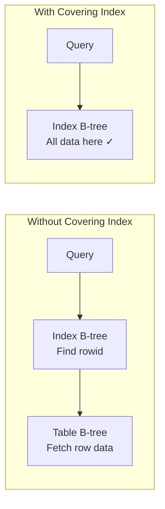

# Room Indexing

## Why Indexes Matter

Without an index, every query performs a **full table scan** — reading every row to find matches. An index creates a sorted B-tree structure that allows O(log n) lookups instead of O(n).

| Operation | Without Index | With Index |
|-----------|--------------|------------|
| `WHERE id = 5` | Scan all rows | B-tree lookup → direct |
| `WHERE name = 'Alice'` | Scan all rows | B-tree lookup → direct |
| `WHERE age > 25` | Scan all rows | Range scan on sorted tree |
| `ORDER BY created_at` | Sort in memory (temp B-tree) | Already sorted — no extra work |

---

## Index Types in SQLite/Room

| Type | Purpose | Syntax |
|------|---------|--------|
| **Single column** | Speed up queries filtering on one column | `@Index("column")` |
| **Composite** | Speed up queries filtering on multiple columns | `@Index("col1", "col2")` |
| **Unique** | Enforce uniqueness + fast lookup | `@Index(unique = true)` |
| **Partial** | Index only rows matching a condition | Raw SQL only (not Room annotation) |
| **Covering** | Index contains all columns needed — no table lookup | Composite index with all SELECT columns |

---

## Declaring Indexes in Room

=== "Entity Annotation"

    ```kotlin
    @Entity(
        tableName = "users",
        indices = [
            Index("email", unique = true),
            Index("last_name", "first_name"),
            Index("created_at")
        ]
    )
    data class User(
        @PrimaryKey(autoGenerate = true) val id: Long = 0,
        val email: String,
        val firstName: String,
        val lastName: String,
        val createdAt: Long
    )
    ```

=== "Generated SQL"

    ```sql
    CREATE TABLE users (
        id INTEGER PRIMARY KEY AUTOINCREMENT NOT NULL,
        email TEXT NOT NULL,
        firstName TEXT NOT NULL,
        lastName TEXT NOT NULL,
        createdAt INTEGER NOT NULL
    );

    CREATE UNIQUE INDEX index_users_email ON users (email);
    CREATE INDEX index_users_last_name_first_name ON users (last_name, first_name);
    CREATE INDEX index_users_created_at ON users (createdAt);
    ```

---

## Composite Index Ordering

The order of columns in a composite index matters — it follows the **leftmost prefix rule**:

```kotlin
@Index("last_name", "first_name", "age")
```

This index can accelerate:

| Query | Uses Index? | Why |
|-------|------------|-----|
| `WHERE last_name = ?` | Yes | Leftmost column |
| `WHERE last_name = ? AND first_name = ?` | Yes | Left two columns |
| `WHERE last_name = ? AND first_name = ? AND age = ?` | Yes | All three columns |
| `WHERE first_name = ?` | No | Skips leftmost column |
| `WHERE age = ?` | No | Skips leftmost columns |
| `WHERE last_name = ? AND age = ?` | Partial | Uses `last_name` only, can't skip `first_name` |

!!! note "Column Order Rule"
    Place **high-selectivity columns first** (columns that filter out more rows). If `last_name` eliminates 95% of rows but `age` only eliminates 20%, `last_name` should come first.

---

## EXPLAIN QUERY PLAN

Use SQLite's query planner to verify index usage:

```kotlin
// Debug-only: check if your query uses the expected index
@RawQuery
fun explain(query: SupportSQLiteQuery): Cursor

// Usage
val cursor = dao.explain(
    SimpleSQLiteQuery("EXPLAIN QUERY PLAN SELECT * FROM users WHERE email = 'test@example.com'")
)
```

| Output | Meaning |
|--------|---------|
| `SCAN users` | Full table scan — no index used |
| `SEARCH users USING INDEX index_users_email` | Index used for lookup |
| `SEARCH users USING COVERING INDEX ...` | Index contains all needed data — no table access |
| `USE TEMP B-TREE FOR ORDER BY` | Sorting in memory — consider adding index on ORDER BY column |

---

## Foreign Key Indexes

Room requires indexes on foreign key columns for efficient JOIN and CASCADE operations:

```kotlin
@Entity(
    tableName = "orders",
    foreignKeys = [
        ForeignKey(
            entity = User::class,
            parentColumns = ["id"],
            childColumns = ["userId"],
            onDelete = ForeignKey.CASCADE
        )
    ],
    indices = [Index("userId")] // Required for FK performance
)
data class Order(
    @PrimaryKey(autoGenerate = true) val id: Long = 0,
    val userId: Long,
    val total: Double,
    val createdAt: Long
)
```

!!! warning "Missing FK Index"
    Without an index on the foreign key column, every DELETE on the parent table triggers a full scan of the child table to find related rows. Room emits a compile-time warning if you forget this.

---

## Index Performance Trade-offs

| Factor | Impact |
|--------|--------|
| **Read speed** | Indexes dramatically speed up SELECT queries |
| **Write speed** | Every INSERT/UPDATE/DELETE must also update all relevant indexes |
| **Storage** | Each index occupies disk space (roughly proportional to indexed data) |
| **Memory** | Frequently accessed index pages stay in SQLite's page cache |

### When NOT to Index

- Tables with < 100 rows (full scan is fast enough)
- Columns with very low cardinality (e.g., boolean `is_active` — only 2 values)
- Columns rarely used in WHERE/JOIN/ORDER BY
- Write-heavy tables where read performance isn't critical

---

## Covering Indexes

A covering index contains all columns needed by a query, eliminating the table B-tree lookup entirely:

```kotlin
// Query: SELECT first_name, last_name FROM users WHERE email = ?

// This index COVERS the query (no table lookup needed):
@Index("email", "first_name", "last_name")

// The query planner sees all needed columns in the index itself
// Output: SEARCH users USING COVERING INDEX ...
```



---

## Index Maintenance

### REINDEX

After bulk operations (large deletes, imports), indexes may become fragmented:

```kotlin
@RawQuery
fun reindex(query: SupportSQLiteQuery): Int

// Call periodically or after bulk operations
dao.reindex(SimpleSQLiteQuery("REINDEX"))
```

### ANALYZE

Updates SQLite's statistics for the query planner:

```kotlin
// Helps query planner make better index choices
dao.reindex(SimpleSQLiteQuery("ANALYZE"))
```

---

??? question "Common Interview Questions"

    **Q: What is an index and how does it work internally?**
    An index is a separate B-tree structure that stores a subset of column values in sorted order, with pointers back to the full row (via rowid). When a query filters or sorts by indexed columns, SQLite traverses the index B-tree (O(log n)) instead of scanning every row (O(n)). The trade-off is extra storage and slower writes.

    **Q: When would a query NOT use an available index?**
    SQLite's query planner may skip an index when: (1) the table is small enough that a full scan is faster, (2) the query doesn't match the leftmost prefix of a composite index, (3) the indexed column has very low selectivity (most rows match), (4) a function is applied to the column (`WHERE LOWER(name) = ?` won't use an index on `name`).

    **Q: What's the leftmost prefix rule?**
    A composite index on (A, B, C) can be used for queries filtering on A, (A, B), or (A, B, C) — always starting from the left. It cannot help with queries on B alone or C alone. Think of it like a phone book sorted by last name then first name — you can look up by last name, or last+first, but not first name alone.

    **Q: How do you decide which columns to index?**
    Index columns that appear in: WHERE clauses (especially equality checks), JOIN conditions, ORDER BY clauses, and foreign keys. Prioritize queries that run frequently or on large tables. Verify with EXPLAIN QUERY PLAN. Avoid over-indexing — every index slows down writes.

    **Q: What's the difference between a primary key index and a regular index?**
    In SQLite, the INTEGER PRIMARY KEY *is* the rowid — it defines the physical ordering of the table B-tree. Regular indexes are separate B-trees that point back to the rowid. Primary key lookups are always the fastest because they go directly to the table B-tree without indirection.

!!! tip "Further Reading"
    - [SQLite Query Planner](https://www.sqlite.org/queryplanner.html)
    - [Room index documentation](https://developer.android.com/reference/androidx/room/Index)
    - [SQLite EXPLAIN QUERY PLAN](https://www.sqlite.org/eqp.html)
