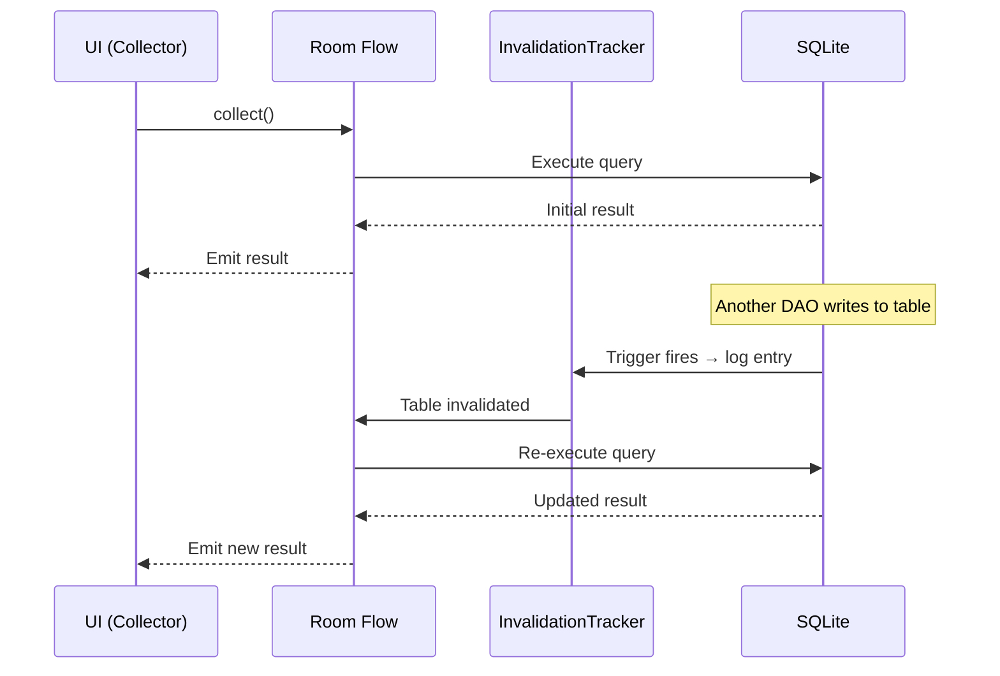
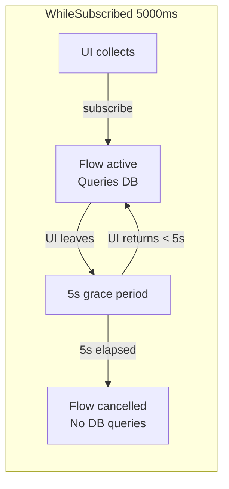

# Reactive Queries with Flow

## How Room Reactive Queries Work

When a DAO method returns `Flow<T>` or `LiveData<T>`, Room automatically re-executes the query whenever the underlying table changes.



---

## Flow vs LiveData in Room

| Feature | `Flow<List<T>>` | `LiveData<List<T>>` |
|---------|-----------------|---------------------|
| **Lifecycle aware** | No (needs `lifecycleScope`) | Yes (auto-pauses) |
| **Backpressure** | Built-in (coroutines) | No (always latest) |
| **Operators** | Full Flow API (`map`, `filter`, `combine`) | Limited (Transformations) |
| **Threading** | Dispatchers (flexible) | Main thread delivery |
| **Testing** | `Turbine`, `runTest` | `InstantTaskExecutorRule` |
| **Compose** | `collectAsState()` | `observeAsState()` |

!!! note "Prefer Flow"
    Flow is the recommended approach for new code. It integrates naturally with coroutines, provides richer operators, and works well with both Compose and View-based UI.

---

## DAO Return Types

```kotlin
@Dao
interface UserDao {
    // One-shot query — returns once, no observation
    @Query("SELECT * FROM users WHERE id = :id")
    suspend fun getUserById(id: Long): User?

    // Reactive — emits on every table change
    @Query("SELECT * FROM users")
    fun getAllUsers(): Flow<List<User>>

    // Reactive single item — emits null if not found
    @Query("SELECT * FROM users WHERE id = :id")
    fun observeUser(id: Long): Flow<User?>

    // Reactive count
    @Query("SELECT COUNT(*) FROM users")
    fun observeUserCount(): Flow<Int>

    // LiveData variant (legacy)
    @Query("SELECT * FROM users")
    fun getAllUsersLiveData(): LiveData<List<User>>
}
```

---

## Collecting in ViewModel

```kotlin
class UserListViewModel @Inject constructor(
    private val userDao: UserDao
) : ViewModel() {

    val users: StateFlow<List<User>> = userDao.getAllUsers()
        .stateIn(
            scope = viewModelScope,
            started = SharingStarted.WhileSubscribed(5000),
            initialValue = emptyList()
        )
}
```

### WhileSubscribed Explained

| Strategy | Behavior | Use Case |
|----------|----------|----------|
| `Eagerly` | Starts immediately, never stops | App-level shared data |
| `Lazily` | Starts on first subscriber, never stops | ViewModel outliving config changes |
| `WhileSubscribed(5000)` | Stops 5s after last subscriber leaves | Screen-level data — survives rotation but frees resources on navigation |



---

## Combining Multiple Flows

```kotlin
class DashboardViewModel @Inject constructor(
    private val userDao: UserDao,
    private val orderDao: OrderDao
) : ViewModel() {

    val dashboardState: StateFlow<DashboardState> = combine(
        userDao.observeUser(currentUserId),
        orderDao.observeActiveOrders(currentUserId),
        orderDao.observeOrderCount(currentUserId)
    ) { user, activeOrders, totalCount ->
        DashboardState(
            userName = user?.name ?: "Guest",
            activeOrders = activeOrders,
            totalOrders = totalCount
        )
    }.stateIn(viewModelScope, SharingStarted.WhileSubscribed(5000), DashboardState.Loading)
}
```

---

## Invalidation Granularity

Room's invalidation is **table-level**, not row-level:

```kotlin
// This Flow re-emits when ANY row in the users table changes
@Query("SELECT * FROM users WHERE id = :id")
fun observeUser(id: Long): Flow<User?>
```

| What Changes | What Gets Invalidated |
|-------------|----------------------|
| Insert user with id=5 | ALL active queries on `users` table |
| Update user with id=5 | ALL active queries on `users` table |
| Delete user with id=99 | ALL active queries on `users` table |

!!! warning "Performance Implication"
    If you have 20 active Flows observing the `users` table and one row is updated, all 20 re-execute their queries. This is usually fine for small tables but can be expensive for large tables with many observers. Mitigation strategies:

    - Use `distinctUntilChanged()` to suppress duplicate emissions
    - Split large tables if different observers need different subsets
    - Use `conflatedCallbackFlow` for high-frequency writes

---

## distinctUntilChanged

Prevent re-emission when the re-query returns the same result:

```kotlin
@Query("SELECT * FROM users WHERE id = :id")
fun observeUser(id: Long): Flow<User?>

// In ViewModel — suppress duplicate emissions
val user: StateFlow<User?> = userDao.observeUser(userId)
    .distinctUntilChanged()
    .stateIn(viewModelScope, SharingStarted.WhileSubscribed(5000), null)
```

Without `distinctUntilChanged()`: if another user's row is updated, the query re-executes and emits the same `User` object — causing unnecessary recomposition in Compose.

---

## Multi-Table Reactive Queries

When a query joins multiple tables, Room observes ALL involved tables:

```kotlin
@Transaction
@Query("""
    SELECT orders.*, users.name as userName
    FROM orders
    INNER JOIN users ON orders.user_id = users.id
    WHERE orders.status = :status
""")
fun observeOrdersWithUser(status: String): Flow<List<OrderWithUser>>
```

This Flow re-emits when either `orders` OR `users` table changes.

---

## Paging with Room

For large datasets, use Paging 3 with Room's built-in `PagingSource`:

```kotlin
@Dao
interface MessageDao {
    @Query("SELECT * FROM messages ORDER BY timestamp DESC")
    fun getMessagesPagingSource(): PagingSource<Int, Message>
}

// ViewModel
val messages: Flow<PagingData<Message>> = Pager(
    config = PagingConfig(pageSize = 50, prefetchDistance = 10),
    pagingSourceFactory = { messageDao.getMessagesPagingSource() }
).flow.cachedIn(viewModelScope)
```

Room automatically invalidates the PagingSource when the table changes, triggering a refresh.

---

## Testing Reactive Queries

```kotlin
@Test
fun userFlow_emitsUpdates() = runTest {
    val dao = database.userDao()

    dao.observeUser(1).test {
        // Initial emission — user doesn't exist
        assertThat(awaitItem()).isNull()

        // Insert user
        dao.insert(User(id = 1, name = "Alice"))
        assertThat(awaitItem()).isEqualTo(User(id = 1, name = "Alice"))

        // Update user
        dao.insert(User(id = 1, name = "Bob"))
        assertThat(awaitItem()).isEqualTo(User(id = 1, name = "Bob"))

        cancelAndIgnoreRemainingEvents()
    }
}
```

!!! note "Turbine"
    The `.test {}` extension comes from [Turbine](https://github.com/cashapp/turbine) — the standard library for testing Kotlin Flows. It provides timeout-aware assertions and clean failure messages.

---

??? question "Common Interview Questions"

    **Q: How does Room know when to re-emit from a Flow?**
    Room uses SQLite triggers (created internally by InvalidationTracker) that fire on INSERT/UPDATE/DELETE and write to a log table. A background coroutine polls this log. When changes are detected, all active Flows observing the affected tables re-execute their queries and emit new results.

    **Q: Why is invalidation table-level and not row-level?**
    Row-level tracking would require storing the rowid in the invalidation log for every write, then checking each observer's WHERE clause against those rowids. This is prohibitively expensive for general-case queries. Table-level invalidation is a pragmatic compromise — most Room queries are fast enough that re-executing them is cheaper than fine-grained tracking.

    **Q: What happens to a Room Flow when the app goes to background?**
    It depends on the collection scope. With `WhileSubscribed(5000)` in a ViewModel: if the UI stops collecting (onStop), the upstream Flow cancels after the timeout, stopping query observation. With `Eagerly`: the Flow remains active in the ViewModel's scope regardless of UI state — this wastes resources if the data isn't being displayed.

    **Q: How do you handle a high-frequency write scenario (e.g., real-time sync)?**
    1. Use `distinctUntilChanged()` to suppress redundant emissions.
    2. Apply `debounce(300)` to batch rapid changes into single emissions.
    3. Batch writes in a single transaction (triggers once, not N times).
    4. Consider using `conflate()` to skip intermediate values.
    5. Move heavy transformations to `Dispatchers.Default`.

    **Q: Flow vs Channel for Room queries?**
    Flow is correct for Room reactive queries — it's cold (starts when collected, stops when cancelled) and declarative. Channels are hot and imperative — use them for one-shot events (navigation, snackbar), not continuous data observation. Room doesn't support Channel return types.

!!! tip "Further Reading"
    - [Room with Flow](https://developer.android.com/training/data-storage/room/async-queries#flow)
    - [StateFlow and SharedFlow](https://developer.android.com/kotlin/flow/stateflow-and-sharedflow)
    - [Turbine testing library](https://github.com/cashapp/turbine)
