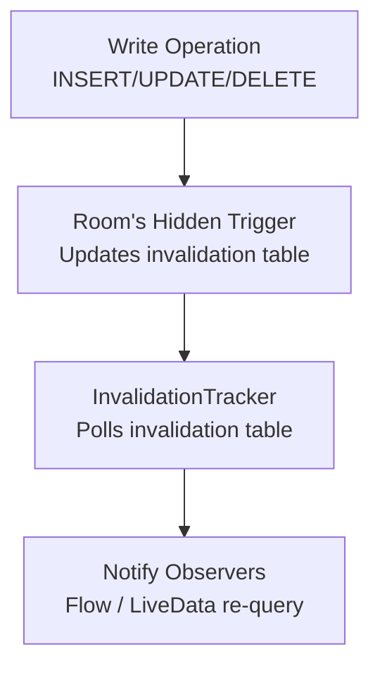

# Triggers & Callbacks

## SQLite Triggers

A trigger is a stored procedure that automatically executes in response to a table event (INSERT, UPDATE, DELETE). While Room doesn't have a `@Trigger` annotation, you can create them via migrations or callbacks.

### Trigger Timing

| Timing | Fires | Use Case |
|--------|-------|----------|
| **BEFORE** | Before the operation executes | Validation, prevent invalid data |
| **AFTER** | After the operation completes | Audit logging, cascading updates |
| **INSTEAD OF** | Replaces the operation (views only) | Updatable views |

---

## Creating Triggers in Room

=== "Via Migration"

    ```kotlin
    val MIGRATION_3_4 = object : Migration(3, 4) {
        override fun migrate(db: SupportSQLiteDatabase) {
            db.execSQL("""
                CREATE TRIGGER update_modified_at
                AFTER UPDATE ON orders
                BEGIN
                    UPDATE orders
                    SET modified_at = strftime('%s', 'now') * 1000
                    WHERE id = NEW.id;
                END
            """)
        }
    }
    ```

=== "Via Callback (on create)"

    ```kotlin
    Room.databaseBuilder(context, AppDatabase::class.java, "app.db")
        .addCallback(object : RoomDatabase.Callback() {
            override fun onCreate(db: SupportSQLiteDatabase) {
                super.onCreate(db)
                db.execSQL("""
                    CREATE TRIGGER auto_timestamp
                    AFTER INSERT ON messages
                    BEGIN
                        UPDATE messages
                        SET created_at = strftime('%s', 'now') * 1000
                        WHERE id = NEW.id;
                    END
                """)
            }
        })
        .build()
    ```

---

## Common Trigger Patterns

### Auto-Timestamp

```sql
CREATE TRIGGER set_updated_at
AFTER UPDATE ON users
FOR EACH ROW
BEGIN
    UPDATE users SET updated_at = strftime('%s', 'now') * 1000
    WHERE id = NEW.id;
END;
```

### Audit Log

```sql
CREATE TRIGGER audit_order_changes
AFTER UPDATE ON orders
FOR EACH ROW
WHEN OLD.status != NEW.status
BEGIN
    INSERT INTO order_audit (order_id, old_status, new_status, changed_at)
    VALUES (NEW.id, OLD.status, NEW.status, strftime('%s', 'now') * 1000);
END;
```

### Soft Delete

```sql
-- Prevent actual deletion, mark as deleted instead
CREATE TRIGGER soft_delete_user
BEFORE DELETE ON users
FOR EACH ROW
BEGIN
    UPDATE users SET is_deleted = 1, deleted_at = strftime('%s', 'now') * 1000
    WHERE id = OLD.id;
    SELECT RAISE(IGNORE); -- Cancel the actual DELETE
END;
```

### Denormalization / Counter Cache

```sql
-- Keep a comment count on posts without JOIN
CREATE TRIGGER increment_comment_count
AFTER INSERT ON comments
BEGIN
    UPDATE posts SET comment_count = comment_count + 1
    WHERE id = NEW.post_id;
END;

CREATE TRIGGER decrement_comment_count
AFTER DELETE ON comments
BEGIN
    UPDATE posts SET comment_count = comment_count - 1
    WHERE id = OLD.post_id;
END;
```

---

## Room's InvalidationTracker

Room has its own internal trigger system to power reactive queries. The `InvalidationTracker` creates **shadow triggers** on observed tables.



### How It Works Internally

1. Room creates an `room_table_modification_log` table
2. For each observed table, Room creates AFTER triggers:
   ```sql
   CREATE TEMP TRIGGER IF NOT EXISTS room_table_modification_trigger_users_UPDATE
   AFTER UPDATE ON users
   BEGIN
       INSERT OR REPLACE INTO room_table_modification_log VALUES(null, 0);
   END;
   ```
3. The InvalidationTracker polls this log table periodically
4. When changes are detected, all observers of that table are notified to re-query

### Custom InvalidationTracker Usage

```kotlin
val tracker = database.invalidationTracker

// Observe specific tables
tracker.addObserver(object : InvalidationTracker.Observer("users", "orders") {
    override fun onInvalidated(tables: Set<String>) {
        // One or more observed tables changed
        Timber.d("Tables invalidated: $tables")
        refreshCache(tables)
    }
})
```

---

## Room Callbacks

Room provides lifecycle callbacks for database events:

```kotlin
Room.databaseBuilder(context, AppDatabase::class.java, "app.db")
    .addCallback(object : RoomDatabase.Callback() {
        override fun onCreate(db: SupportSQLiteDatabase) {
            // Called once when DB is first created
            // Seed initial data, create triggers
        }

        override fun onOpen(db: SupportSQLiteDatabase) {
            // Called every time DB is opened
            // Enable WAL, run PRAGMA statements
            db.execSQL("PRAGMA foreign_keys = ON")
        }

        override fun onDestructiveMigration(db: SupportSQLiteDatabase) {
            // Called when fallbackToDestructiveMigration() is triggered
        }
    })
    .build()
```

---

## Schema Migrations

Migrations transform the database schema between versions without losing data:

```kotlin
@Database(entities = [User::class, Order::class], version = 5)
abstract class AppDatabase : RoomDatabase() {
    abstract fun userDao(): UserDao
}

// Migration from version 4 to 5: add a column
val MIGRATION_4_5 = object : Migration(4, 5) {
    override fun migrate(db: SupportSQLiteDatabase) {
        db.execSQL("ALTER TABLE users ADD COLUMN avatar_url TEXT")
    }
}

// Register migrations
Room.databaseBuilder(context, AppDatabase::class.java, "app.db")
    .addMigrations(MIGRATION_3_4, MIGRATION_4_5)
    .build()
```

### Auto-Migration (Room 2.4+)

```kotlin
@Database(
    entities = [User::class],
    version = 6,
    autoMigrations = [
        AutoMigration(from = 5, to = 6, spec = Migration5To6::class)
    ]
)
abstract class AppDatabase : RoomDatabase()

@RenameColumn(tableName = "users", fromColumnName = "name", toColumnName = "full_name")
class Migration5To6 : AutoMigrationSpec
```

| Migration Type | When to Use |
|---------------|-------------|
| **Auto-migration** | Simple schema changes (add column, rename, add table) |
| **Manual migration** | Complex changes (data transformation, index changes, triggers) |
| **Destructive** | Development only — drops and recreates all tables |

!!! warning "Testing Migrations"
    Always test migrations with `MigrationTestHelper`:

    ```kotlin
    @get:Rule
    val helper = MigrationTestHelper(
        InstrumentationRegistry.getInstrumentation(),
        AppDatabase::class.java
    )

    @Test
    fun migrate4To5() {
        // Create DB at version 4
        helper.createDatabase("test.db", 4).apply {
            execSQL("INSERT INTO users (id, name) VALUES (1, 'Alice')")
            close()
        }
        // Run migration and validate
        helper.runMigrationsAndValidate("test.db", 5, true, MIGRATION_4_5)
    }
    ```

---

## Trigger vs Application Logic

| Approach | Pros | Cons |
|----------|------|------|
| **SQLite Triggers** | Atomic, always executes, no app code needed | Invisible to Room, hard to test, debugging is painful |
| **Room @Transaction** | Visible in code, testable, type-safe | Must remember to call, not enforced by DB |
| **InvalidationTracker** | Automatic reactivity, Room-native | Coarse-grained (table-level), slight delay |

!!! note "Recommendation"
    Use triggers for integrity constraints that must never be bypassed (audit logs, timestamps). Use application-level logic (`@Transaction`) for business rules that benefit from testability and visibility. Use InvalidationTracker for UI reactivity.

---

??? question "Common Interview Questions"

    **Q: How does Room know when to re-query a Flow/LiveData?**
    Room creates hidden AFTER triggers on observed tables that write to an internal invalidation log table. The InvalidationTracker polls this log (on background thread). When it finds entries, it notifies all active observers for those tables, causing Flow collectors or LiveData observers to re-execute their queries.

    **Q: What are the limitations of SQLite triggers?**
    - Cannot use transactions inside a trigger (they run within the triggering transaction)
    - Limited to SQL operations (no Kotlin/Java code)
    - Not visible to Room's type system — no compile-time checks
    - Can cause unexpected cascading effects if poorly documented
    - Performance overhead on every matching operation

    **Q: When should you use a destructive migration vs a proper migration?**
    Never in production. Destructive migration drops all tables and recreates them — losing all user data. Use it only during development when the schema is in flux. In production, always write proper migrations that preserve data. Use auto-migration for simple changes and manual migration for complex transformations.

    **Q: How do you handle a migration that transforms data (not just schema)?**
    Write a manual Migration that: (1) creates a new table with the target schema, (2) copies and transforms data from the old table using INSERT INTO ... SELECT, (3) drops the old table, (4) renames the new table to the original name, (5) recreates indexes. All within a single transaction for atomicity.

!!! tip "Further Reading"
    - [Room migrations](https://developer.android.com/training/data-storage/room/migrating-db-versions)
    - [SQLite CREATE TRIGGER](https://www.sqlite.org/lang_createtrigger.html)
    - [Room auto-migration](https://developer.android.com/reference/androidx/room/AutoMigration)
