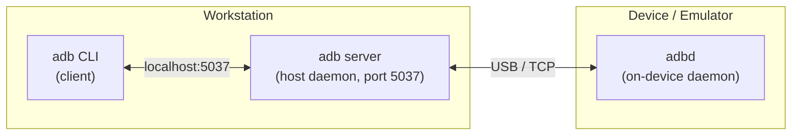
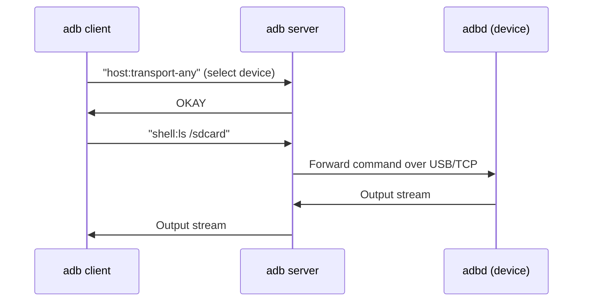
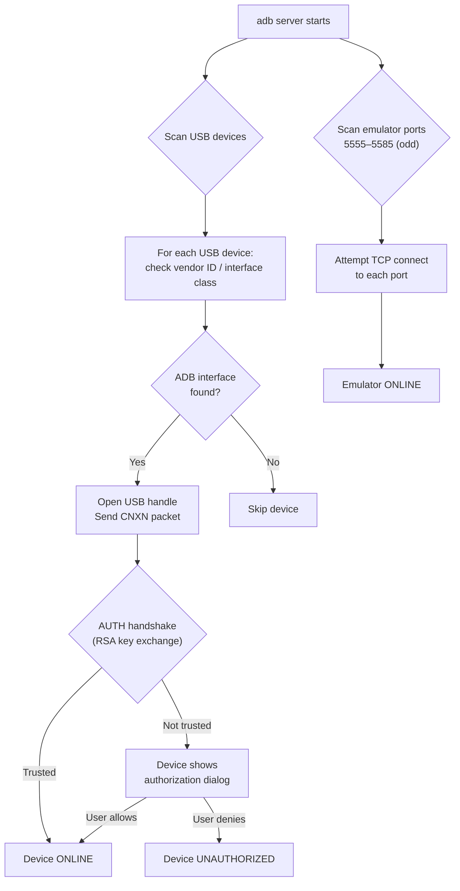

# ADB — Android Debug Bridge

## Architecture

ADB is a client-server tool with three components that cooperate over USB or TCP/IP:



| Component | Role | Runs On |
|-----------|------|---------|
| **Client** | Sends commands (`adb shell`, `adb install`) | Your terminal / IDE |
| **Server** | Multiplexes connections to all attached devices | Workstation (background process, port 5037) |
| **Daemon (adbd)** | Executes commands on the device; runs as a background process started at boot | Device or emulator |

### Server Lifecycle

1. First `adb` command checks if a server is running on port 5037.
2. If not, it spawns one (`adb start-server`).
3. The server scans USB devices and listens for TCP connections from emulators (ports 5555–5585).
4. All subsequent `adb` clients talk to this single server.

!!! warning "Stale Server"
    IDE-bundled ADB and system-installed ADB can run different versions. If the version differs, one kills the other's server — causing "device offline" errors. Fix: ensure a single ADB binary is on your `$PATH`, or set `ANDROID_HOME` consistently.

---

## USB vs Wi-Fi Modes

=== "USB (Default)"

    1. Enable **Developer Options** → **USB Debugging** on the device.
    2. Connect via USB cable.
    3. Device appears in `adb devices`.
    4. On first connection, the device prompts to trust the workstation's RSA key.

=== "Wi-Fi (Android 10 and below)"

    ```bash
    # Device connected via USB first
    adb tcpip 5555                       # Switch adbd to TCP mode
    adb connect 192.168.1.42:5555        # Connect over Wi-Fi
    # USB cable can now be removed
    ```

=== "Wireless Debugging (Android 11+)"

    1. Enable **Developer Options** → **Wireless Debugging**.
    2. Tap **Pair device with pairing code**.
    3. On workstation:
    ```bash
    adb pair 192.168.1.42:37099          # Enter the 6-digit code
    adb connect 192.168.1.42:41515       # Connect to the debug port
    ```

    !!! tip "Pairing vs Connecting"
        Pairing (one-time) exchanges TLS keys. Connecting establishes the debug session. The two use different ports.

---

## How ADB Communicates



The protocol is text-based with a 4-hex-digit length prefix:

```
000Chost:version        ← 12 bytes of payload
```

Each command opens a **local socket** to the server, which opens a corresponding **remote socket** to `adbd`. This is how `adb forward` and `adb reverse` work — they map local ↔ remote socket pairs.

---

## Port Forwarding

Port forwarding is critical for debugging — it's how the IDE reaches JDWP inside the device.

```bash
# Forward local port 8700 to JDWP process on device
adb forward tcp:8700 jdwp:<pid>

# Forward local port 8080 to device port 8080 (e.g., local dev server)
adb reverse tcp:8080 tcp:8080
```

| Direction | Command | Use Case |
|-----------|---------|----------|
| **Forward** (`adb forward`) | Host → Device | IDE connecting to JDWP debugger port |
| **Reverse** (`adb reverse`) | Device → Host | App hitting `localhost` API server on workstation |

---

## Essential Commands

### Device Management

```bash
adb devices -l                 # List devices with details
adb -s <serial> shell          # Target specific device
adb kill-server                # Restart server (fixes "offline" issues)
adb reconnect                  # Reset connection without killing server
```

### App Operations

```bash
adb install -r app-debug.apk          # Install (replace existing)
adb install-multiple base.apk cfg.apk # Install split APKs
adb uninstall com.example.app         # Uninstall
adb shell pm clear com.example.app    # Clear app data
```

### Debugging

```bash
adb shell am start -D -n com.example.app/.MainActivity
#         ↑ -D flag: start in "wait for debugger" mode

adb jdwp                       # List PIDs with JDWP transport active
adb forward tcp:8700 jdwp:1234 # Forward to attach debugger
adb logcat -s MyTag:D          # Filter logs by tag + level
adb bugreport > bug.zip        # Full device diagnostic dump
```

### Shell Shortcuts

```bash
adb shell dumpsys activity activities  # Current activity stack
adb shell dumpsys meminfo <package>    # Memory breakdown
adb shell settings get global adb_enabled
adb shell input tap 500 800            # Simulate touch
adb shell screencap /sdcard/screen.png # Screenshot
```

---

## ADB Internals: Device Detection



!!! note "Unauthorized Device"
    If `adb devices` shows `unauthorized`, the RSA trust prompt was dismissed. Revoke USB debugging authorizations in **Developer Options** and reconnect to get the prompt again.

---

## Troubleshooting

| Symptom | Likely Cause | Fix |
|---------|-------------|-----|
| `device offline` | Stale server or USB glitch | `adb kill-server && adb devices` |
| `unauthorized` | RSA key not accepted | Revoke authorizations on device, reconnect |
| `no devices/emulators found` | USB debugging off or bad cable | Check Developer Options, try another port |
| `more than one device` | Multiple devices/emulators connected | Use `adb -s <serial>` or `$ANDROID_SERIAL` |
| `cannot connect to daemon` | Port 5037 in use by another process | Kill conflicting process or change port with `$ADB_SERVER_PORT` |
| Wi-Fi drops mid-session | Network switch / DHCP renewal | `adb connect <ip>:<port>` again |

---

??? question "Interview Questions"

    **Q: What are the three components of ADB?**
    Client (CLI), server (host daemon on port 5037), and adbd (device daemon). The server multiplexes all client-to-device communication.

    **Q: Why might `adb devices` show "offline"?**
    Version mismatch between IDE-bundled and system ADB (one kills the other's server), stale USB connection, or the device dropped its TCP session. `adb kill-server` usually resolves it.

    **Q: How does ADB connect over Wi-Fi on Android 11+?**
    Wireless Debugging uses TLS with a one-time pairing step (`adb pair`) that exchanges keys, followed by `adb connect` to the debug port. The two ports are different — pairing port is ephemeral.

    **Q: What does `adb forward tcp:8700 jdwp:<pid>` do?**
    Creates a socket bridge: local port 8700 on the workstation maps to the JDWP debug transport inside the specified process on the device. The IDE connects to `localhost:8700` to debug that process.

    **Q: How does `adb reverse` differ from `adb forward`?**
    `forward` maps host-port → device-port (host initiates). `reverse` maps device-port → host-port (device initiates). Common use: `adb reverse tcp:8080 tcp:8080` lets the app call `localhost:8080` and hit a server on your workstation.
