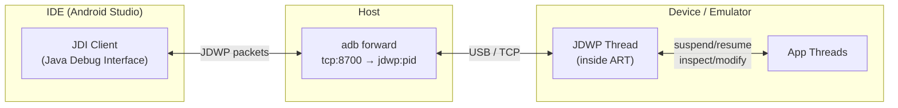
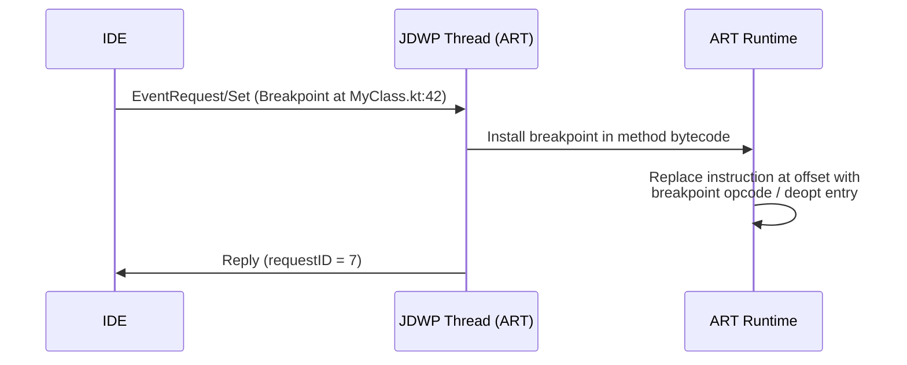
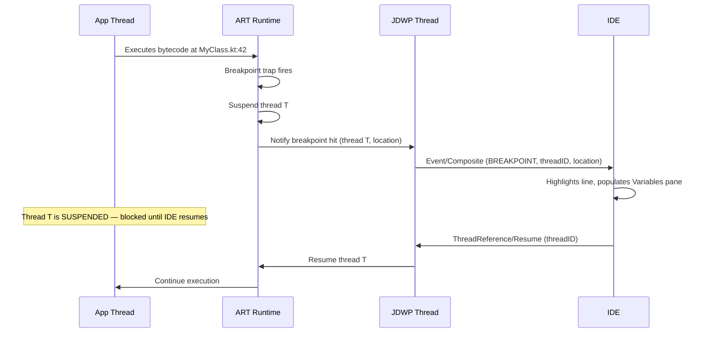
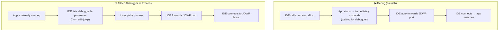
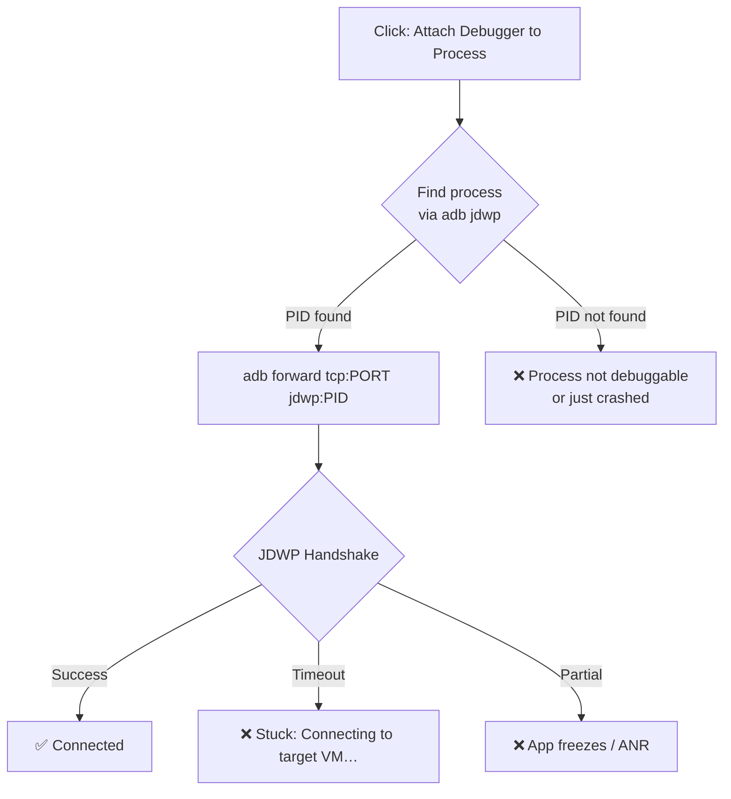

# Debugger Internals

## JDWP — Java Debug Wire Protocol

Every debuggable process on Android runs a **JDWP transport thread** inside ART. This thread listens for a debugger connection and brokers all debug commands (set breakpoint, inspect variable, step over, etc.).



| Layer | What It Does |
|-------|-------------|
| **JDI (Java Debug Interface)** | High-level Java API used by the IDE to send debug commands |
| **JDWP (wire protocol)** | Binary packet protocol carried over a socket — command/reply pairs with unique IDs |
| **JVMTI / ART runtime** | Executes the actual debug operations: inserting breakpoints, suspending threads, reading frames |
| **ADB forward** | Bridges the TCP socket from host to the device-side JDWP transport |

### JDWP Packet Format

```
 0                   4        8        9       11
 ├───── length ──────┤ id     │ flags  │ cmdset │ cmd
 │      (4 bytes)    │(4 bytes│(1 byte)│(1 byte)│(1 byte)
```

- **Command packets** flow in both directions (IDE → VM and VM → IDE for events).
- **Reply packets** match by `id` and carry error codes.
- Flag `0x80` marks a reply.

---

## How Breakpoints Work

### Setting a Breakpoint



### Hitting a Breakpoint



### Breakpoint Mechanism in ART

ART uses **deoptimization** for breakpoints in compiled (AOT/JIT) code:

| Code State | Breakpoint Mechanism |
|-----------|---------------------|
| **Interpreted** | Interpreter checks breakpoint table at each bytecode — low overhead |
| **JIT-compiled** | ART deoptimizes the method back to interpreter, then sets the breakpoint. The method stays deoptimized while the breakpoint is active |
| **AOT-compiled** | Same deoptimization path — the compiled native code is bypassed and the interpreter takes over for that method |

!!! warning "Debugger Performance Impact"
    Breakpoints in hot methods force deoptimization, which means the method runs in the interpreter (~10–100× slower than compiled). This is why stepping through tight loops feels sluggish — it's not the IDE, it's the interpreter running code that was previously JIT-compiled.

---

## Debug Launch vs Attach to Process

There are two ways to connect a debugger in Android Studio:



### Key Differences

| Aspect | Debug Launch (▶ Debug) | Attach to Process |
|--------|----------------------|-------------------|
| **App state** | Cold start — app is launched fresh | App already running (any state) |
| **Startup debugging** | Can break in `Application.onCreate()`, `ContentProvider`, early init | Misses everything before attach |
| **`-D` flag** | IDE passes `-D` to `am start` — app blocks in `Waiting for debugger` dialog | Not used — app never pauses |
| **JDWP connection** | Synchronous: app waits → IDE connects → app resumes. Clean handshake | Asynchronous: IDE connects to an already-running JDWP thread |
| **Port forwarding** | IDE sets up `adb forward` before the app resumes | IDE sets up `adb forward` on-demand when you click attach |
| **Reliability** | Very reliable — deterministic handshake | Can fail if process is mid-transition (see below) |
| **Use case** | Debugging startup, crash-on-launch, DI initialization | Debugging something that only repros after navigating to a specific state |

### The `-D` Flag and `Waiting for Debugger`

When ART starts a process with the debug flag:

```java
// In ActivityThread, simplified
if (mDebugMode != DEBUG_OFF) {
    Debug.waitForDebugger();  // Blocks the main thread
}
```

`Debug.waitForDebugger()` does:

1. Opens the JDWP transport socket.
2. Blocks until a debugger sends a **JDWP handshake** (`JDWP-Handshake` — literally those 14 ASCII bytes).
3. Once connected, the main thread resumes and lifecycle callbacks begin.

This is why Debug launch is deterministic — nothing happens until the IDE is attached and ready.

---

## Why Attaching the Debugger Gets Stuck

This is the most common frustration: you click **"Attach Debugger to Android Process"**, pick your process, and the IDE hangs on "Connecting to the target VM…" or the app freezes.

### Root Causes



#### 1. JDWP Thread Busy or Blocked

The JDWP thread inside the app process is a single thread. If it's blocked (e.g., waiting on a lock held by a suspended thread, or processing a previous debug session's cleanup), the handshake never completes.

**Common scenario:** You detached a previous debugger session uncleanly (force-stopped the IDE, killed the ADB server mid-session), and the JDWP thread is stuck trying to finalize the old connection.

**Fix:** Kill the app process and restart it, or `adb kill-server && adb start-server`.

#### 2. Port Forwarding Conflict

Another process or a stale `adb forward` rule is occupying the JDWP port. The IDE connects to the port but reaches the wrong socket (or a dead one).

```bash
adb forward --list               # See all active forwards
adb forward --remove-all         # Clear stale rules
```

#### 3. Process in a Transitional State

If you try to attach while the process is being created, finishing a configuration change, or being killed by the system, the JDWP transport may not be fully initialized.

| Process State | JDWP Available? | What Happens on Attach |
|--------------|----------------|----------------------|
| Running normally | ✅ Yes | Clean handshake |
| Mid-`onCreate` (no `-D` flag) | ⚠️ Partially | May race — JDWP socket not yet listening |
| Configuration change (rotation) | ⚠️ Briefly disrupted | Old Activity dying, new one starting — JDWP is reachable but threads are churning |
| Being killed by LMK | ❌ Dying | PID vanishes mid-handshake |
| Not debuggable (`debuggable=false`) | ❌ No | Process doesn't appear in `adb jdwp` |

#### 4. ADB Connection Instability

Wi-Fi debugging is particularly prone to this — packet loss or latency causes the JDWP handshake to time out. USB connections can also glitch if the device enters Doze or the cable is flaky.

#### 5. Multiple IDE Instances

Two Android Studio windows (or Android Studio + IntelliJ) both trying to debug the same app. JDWP only supports **one debugger connection at a time**. The second connection hangs.

### The "App Freezes" Variant

Sometimes attaching doesn't just fail — the **app freezes completely**:

1. IDE sends JDWP handshake.
2. JDWP thread receives it and starts negotiating.
3. During negotiation, the IDE sends a `VM/Suspend` command (or the JDWP thread implicitly suspends all threads to take a snapshot).
4. If the connection then drops (network blip, timeout), threads remain **suspended** — but no debugger is connected to resume them.

The app is alive but every thread is suspended. It looks frozen and eventually triggers an ANR.

**Fix:** Force-stop the app (`adb shell am force-stop <package>`) — there's no way to "unsuspend" without a connected debugger.

!!! tip "Best Practice"
    Use **Debug launch** when you need startup debugging. Use **Attach** only for debugging issues that require a specific app state (e.g., repro after navigating 5 screens deep). If Attach hangs, don't wait — force-stop and retry.

---

## Debuggable vs Non-Debuggable Builds

The `debuggable` flag in the manifest controls whether ART starts the JDWP transport:

```kotlin
// build.gradle.kts
android {
    buildTypes {
        debug {
            isDebuggable = true   // Default for debug builds
        }
        release {
            isDebuggable = false  // Default for release builds
        }
    }
}
```

| `debuggable` | JDWP Thread | `adb jdwp` lists it | Attach possible | Performance |
|-------------|-------------|---------------------|-----------------|-------------|
| `true` | Started at process creation | Yes | Yes | Slower — ART keeps deopt metadata, disables some optimizations |
| `false` | Not started | No | No | Full speed — AOT/JIT without debug overhead |

!!! warning "Debug Overhead Is Real"
    `debuggable=true` isn't free even when no debugger is attached. ART maintains extra metadata for potential deoptimization, skips some JIT optimizations, and keeps the JDWP socket open. Profile performance issues on `release` builds, not `debug`.

---

## Debugging from the Command Line

For environments without an IDE:

```bash
# 1. Start app in debug-wait mode
adb shell am start -D -n com.example.app/.MainActivity

# 2. Find the PID
adb shell pidof com.example.app
# → 12345

# 3. Forward JDWP port
adb forward tcp:8700 jdwp:12345

# 4. Attach jdb (Java Debugger)
jdb -connect com.sun.jdi.SocketAttach:hostname=localhost,port=8700

# 5. Set a breakpoint and resume
> stop in com.example.app.MainActivity.onCreate
> resume
```

This is exactly what Android Studio does under the hood — the IDE wraps `jdb`-level operations with a GUI.

---

??? question "Interview Questions"

    **Q: What is JDWP and how does Android Studio use it?**
    JDWP (Java Debug Wire Protocol) is a binary protocol for communication between a debugger and a JVM/ART. Android Studio uses JDI (Java Debug Interface) to send JDWP commands over an ADB-forwarded socket to the JDWP thread inside the app's ART runtime.

    **Q: How do breakpoints work in ART?**
    For interpreted code, the interpreter checks a breakpoint table at each instruction. For JIT/AOT-compiled code, ART deoptimizes the method back to the interpreter, then sets the breakpoint. The method stays in interpreted mode while the breakpoint is active.

    **Q: What's the difference between Debug launch and Attach Debugger?**
    Debug launch starts the app with the `-D` flag — the app suspends immediately and waits for the debugger to connect before executing any lifecycle code. Attach connects to an already-running process. Debug launch is deterministic (synchronous handshake); Attach can race with process state and fail.

    **Q: Why does Attach Debugger sometimes freeze the app?**
    The JDWP handshake may trigger a `VM/Suspend` that pauses all app threads. If the debugger connection drops during this window (network issue, port conflict, timeout), threads remain suspended with no debugger to resume them — causing an ANR. Force-stop is the only recovery.

    **Q: Does `debuggable=true` affect performance even without a debugger attached?**
    Yes. ART maintains deoptimization metadata, keeps the JDWP transport socket open, and skips some JIT optimizations. Always benchmark on release builds.

    **Q: How can you debug an app without Android Studio?**
    Use `am start -D` to launch in debug-wait mode, `adb forward tcp:<port> jdwp:<pid>` to bridge the JDWP socket, and `jdb -connect` to attach a command-line debugger. This is the same mechanism the IDE uses internally.
