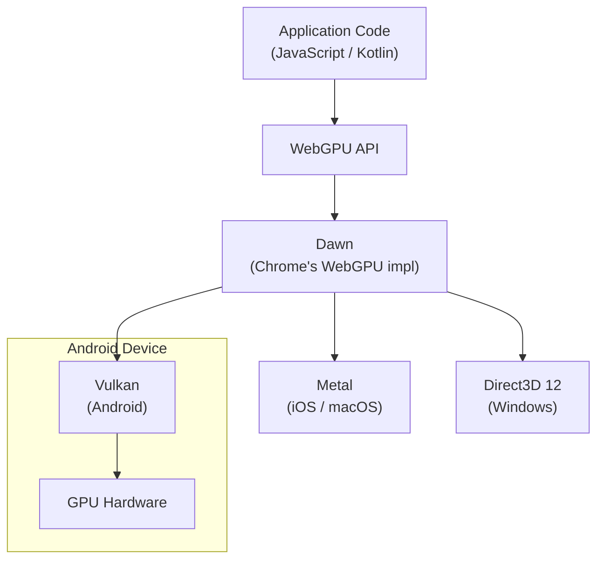
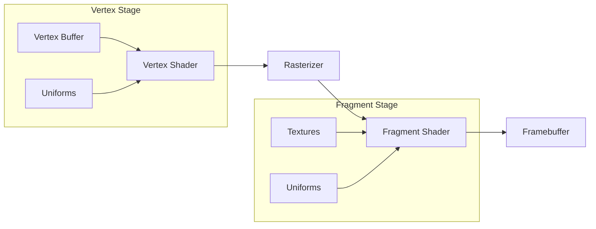
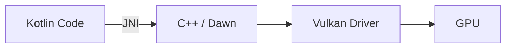

# WebGPU

WebGPU is the next-generation graphics and compute API designed to replace WebGL. It provides low-level, explicit GPU access modeled after Vulkan, Metal, and Direct3D 12 — but with a portable, safe abstraction layer that runs in browsers and natively on Android via Dawn.

---

## WebGPU vs Existing APIs

| Feature | WebGL / WebGL2 | WebGPU | Vulkan (Native) |
|---|---|---|---|
| **Abstraction Level** | High (OpenGL ES wrapper) | Medium (explicit but safe) | Low (fully explicit) |
| **Compute Shaders** | No (WebGL2 has limited transform feedback) | Yes — first-class support | Yes |
| **Shader Language** | GLSL ES | WGSL | SPIR-V / GLSL |
| **Multi-threaded Rendering** | No | Yes (command encoders) | Yes |
| **Pipeline State** | Implicit, mutable global state | Explicit, immutable pipelines | Explicit, immutable pipelines |
| **Error Handling** | Silent failures, `gl.getError()` | Validation layer + error scopes | Validation layers (opt-in) |
| **Memory Management** | Driver-managed | Explicit buffer/texture creation | Fully manual (allocations, barriers) |
| **Android Support** | WebView / Chrome | Chrome 121+, WebView (behind flag) | Native NDK |

!!! tip "Why WebGPU on Android?"
    Vulkan is powerful but complex — memory barriers, synchronization, and thousands of lines of boilerplate for a triangle. WebGPU gives you ~80% of Vulkan's performance with ~20% of the complexity, and your code runs on the web too.

---

## Architecture



### Key Components

| Component | Role |
|---|---|
| **Adapter** | Represents a physical GPU — used to query capabilities and request a device |
| **Device** | Logical connection to the GPU — creates resources and submits work |
| **Queue** | Accepts command buffers for execution on the GPU |
| **Command Encoder** | Records GPU commands into a command buffer |
| **Pipeline** | Compiled shader + state configuration (render or compute) |
| **Bind Group** | Maps buffers/textures/samplers to shader bindings |
| **Buffer** | GPU-accessible memory for vertices, uniforms, storage, etc. |
| **Texture** | GPU image data — render targets, sampled textures |

---

## Core Concepts

### Initialization

```javascript
// Request adapter (physical GPU)
const adapter = await navigator.gpu.requestAdapter({
    powerPreference: "high-performance"  // or "low-power" for mobile battery
});

// Check limits relevant to mobile
console.log("Max buffer size:", adapter.limits.maxBufferSize);
console.log("Max texture dimension:", adapter.limits.maxTextureDimension2D);

// Request logical device
const device = await adapter.requestDevice({
    requiredLimits: {
        maxStorageBufferBindingSize: 128 * 1024 * 1024  // 128 MB
    }
});

// Error handling
device.lost.then((info) => {
    console.error("Device lost:", info.message);
    // Re-initialize on Android — GPU process can be killed under memory pressure
});
```

### The Render Pipeline



```javascript
const pipeline = device.createRenderPipeline({
    layout: "auto",
    vertex: {
        module: device.createShaderModule({ code: vertexWGSL }),
        entryPoint: "main",
        buffers: [{
            arrayStride: 20,  // 3 floats position + 2 floats UV = 20 bytes
            attributes: [
                { shaderLocation: 0, offset: 0,  format: "float32x3" },  // position
                { shaderLocation: 1, offset: 12, format: "float32x2" },  // uv
            ]
        }]
    },
    fragment: {
        module: device.createShaderModule({ code: fragmentWGSL }),
        entryPoint: "main",
        targets: [{ format: navigator.gpu.getPreferredCanvasFormat() }]
    },
    primitive: { topology: "triangle-list", cullMode: "back" },
    depthStencil: {
        format: "depth24plus",
        depthWriteEnabled: true,
        depthCompare: "less"
    }
});
```

### WGSL Shaders

WGSL (WebGPU Shading Language) replaces GLSL. It uses Rust-like syntax with explicit bindings.

=== "Vertex Shader"

    ```wgsl
    struct Uniforms {
        mvp: mat4x4<f32>,
    }

    @group(0) @binding(0) var<uniform> uniforms: Uniforms;

    struct VertexInput {
        @location(0) position: vec3<f32>,
        @location(1) uv: vec2<f32>,
    }

    struct VertexOutput {
        @builtin(position) position: vec4<f32>,
        @location(0) uv: vec2<f32>,
    }

    @vertex
    fn main(in: VertexInput) -> VertexOutput {
        var out: VertexOutput;
        out.position = uniforms.mvp * vec4<f32>(in.position, 1.0);
        out.uv = in.uv;
        return out;
    }
    ```

=== "Fragment Shader"

    ```wgsl
    @group(0) @binding(1) var texSampler: sampler;
    @group(0) @binding(2) var texColor: texture_2d<f32>;

    @fragment
    fn main(@location(0) uv: vec2<f32>) -> @location(0) vec4<f32> {
        return textureSample(texColor, texSampler, uv);
    }
    ```

### Bind Groups & Resource Binding

Bind groups connect CPU-side resources to shader bindings — similar to Vulkan descriptor sets.

```javascript
const uniformBuffer = device.createBuffer({
    size: 64,  // mat4x4 = 16 floats × 4 bytes
    usage: GPUBufferUsage.UNIFORM | GPUBufferUsage.COPY_DST
});

const bindGroup = device.createBindGroup({
    layout: pipeline.getBindGroupLayout(0),
    entries: [
        { binding: 0, resource: { buffer: uniformBuffer } },
        { binding: 1, resource: sampler },
        { binding: 2, resource: texture.createView() },
    ]
});
```

| Bind Group Strategy | When to Use |
|---|---|
| **Group 0** — per-frame data | Camera matrices, time, global lighting |
| **Group 1** — per-material | Textures, material properties |
| **Group 2** — per-object | Model matrix, object-specific uniforms |

!!! note "Bind Group Layout Compatibility"
    Pipelines sharing the same bind group layout can reuse bind groups without recreation. Design layouts to minimize rebinding — group by update frequency.

---

## Compute Shaders

WebGPU's compute shaders unlock general-purpose GPU computing — image processing, physics, ML inference, particle systems.

```wgsl
@group(0) @binding(0) var<storage, read> inputData: array<f32>;
@group(0) @binding(1) var<storage, read_write> outputData: array<f32>;

@compute @workgroup_size(64)
fn main(@builtin(global_invocation_id) id: vec3<u32>) {
    let index = id.x;
    if (index < arrayLength(&inputData)) {
        outputData[index] = inputData[index] * 2.0;
    }
}
```

```javascript
// Dispatch compute work
const commandEncoder = device.createCommandEncoder();
const passEncoder = commandEncoder.beginComputePass();
passEncoder.setPipeline(computePipeline);
passEncoder.setBindGroup(0, computeBindGroup);
passEncoder.dispatchWorkgroups(Math.ceil(dataLength / 64));
passEncoder.end();

// Copy results back to CPU-readable buffer
commandEncoder.copyBufferToBuffer(gpuOutputBuffer, 0, readbackBuffer, 0, bufferSize);
device.queue.submit([commandEncoder.finish()]);

// Read results
await readbackBuffer.mapAsync(GPUMapMode.READ);
const results = new Float32Array(readbackBuffer.getMappedRange());
```

### Workgroup Sizing for Mobile GPUs

| GPU Vendor | Typical Warp/Wave Size | Recommended Workgroup Size |
|---|---|---|
| **Qualcomm Adreno** | 64 (fibers) | 64 or 128 |
| **ARM Mali** | 16 (threads per warp) | 64 (4 warps) |
| **Apple (M-series/A-series)** | 32 | 64 or 256 |

!!! warning "Mobile GPU Constraints"
    Mobile GPUs have shared memory between CPU and GPU (unified memory architecture) but significantly less bandwidth and fewer compute units than desktop GPUs. Keep workgroup shared memory usage under 16 KB and avoid complex branching.

---

## Rendering Loop

```javascript
function frame() {
    const commandEncoder = device.createCommandEncoder();

    const renderPass = commandEncoder.beginRenderPass({
        colorAttachments: [{
            view: context.getCurrentTexture().createView(),
            clearValue: { r: 0.1, g: 0.1, b: 0.1, a: 1.0 },
            loadOp: "clear",
            storeOp: "store"
        }],
        depthStencilAttachment: {
            view: depthTexture.createView(),
            depthClearValue: 1.0,
            depthLoadOp: "clear",
            depthStoreOp: "store"
        }
    });

    renderPass.setPipeline(pipeline);
    renderPass.setBindGroup(0, bindGroup);
    renderPass.setVertexBuffer(0, vertexBuffer);
    renderPass.setIndexBuffer(indexBuffer, "uint16");
    renderPass.drawIndexed(indexCount);
    renderPass.end();

    device.queue.submit([commandEncoder.finish()]);
    requestAnimationFrame(frame);
}
```

---

## Android Integration

### WebView with WebGPU

Chrome for Android supports WebGPU from version 121+. Android WebView support is rolling out progressively.

```kotlin
class WebGPUActivity : AppCompatActivity() {
    override fun onCreate(savedInstanceState: Bundle?) {
        super.onCreate(savedInstanceState)

        val webView = WebView(this).apply {
            settings.javaScriptEnabled = true
            settings.domStorageEnabled = true
        }
        setContentView(webView)

        webView.webViewClient = object : WebViewClient() {
            override fun onPageFinished(view: WebView?, url: String?) {
                view?.evaluateJavascript(
                    "navigator.gpu !== undefined"
                ) { result ->
                    Log.d("WebGPU", "Supported: $result")
                }
            }
        }

        webView.loadUrl("https://your-webgpu-app.com")
    }
}
```

!!! warning "WebView Limitations"
    Android WebView may lag behind Chrome for WebGPU support. Check `navigator.gpu` availability at runtime and provide a WebGL2 fallback for older devices.

### Native WebGPU via Dawn

Dawn is Google's native C++ implementation of WebGPU, usable outside the browser via JNI on Android.



```cpp
// Native Dawn initialization (C++)
#include <dawn/webgpu_cpp.h>
#include <dawn/native/DawnNative.h>

wgpu::Instance instance = wgpu::CreateInstance();

wgpu::RequestAdapterOptions options{};
options.backendType = wgpu::BackendType::Vulkan;  // Android uses Vulkan

wgpu::Adapter adapter;
instance.RequestAdapter(&options, [](WGPURequestAdapterStatus status,
                                     WGPUAdapter adapter, const char* msg,
                                     void* userdata) {
    *static_cast<wgpu::Adapter*>(userdata) = wgpu::Adapter::Acquire(adapter);
}, &adapter);
```

```kotlin
// JNI bridge (Kotlin side)
class DawnRenderer {
    external fun nativeInit(surface: Surface): Long
    external fun nativeRender(handle: Long)
    external fun nativeDestroy(handle: Long)

    companion object {
        init { System.loadLibrary("dawn_renderer") }
    }
}
```

### Feature Detection

```javascript
async function initWebGPU() {
    if (!navigator.gpu) {
        console.warn("WebGPU not supported — falling back to WebGL2");
        return initWebGL2();
    }

    const adapter = await navigator.gpu.requestAdapter();
    if (!adapter) {
        console.warn("No GPU adapter found");
        return initWebGL2();
    }

    // Check specific features
    const features = adapter.features;
    const hasTimestamp = features.has("timestamp-query");
    const hasFloat32 = features.has("shader-f16");

    // Check limits for mobile constraints
    const limits = adapter.limits;
    if (limits.maxTextureDimension2D < 4096) {
        console.warn("Low-end GPU — reducing texture quality");
    }

    return adapter;
}
```

---

## Mobile Performance Optimization

### Buffer Management

```javascript
// Prefer writeBuffer for small, frequent updates (uniforms)
device.queue.writeBuffer(uniformBuffer, 0, mvpMatrix);

// Use staging buffers for large uploads (mesh data)
const stagingBuffer = device.createBuffer({
    size: vertexData.byteLength,
    usage: GPUBufferUsage.MAP_WRITE | GPUBufferUsage.COPY_SRC,
    mappedAtCreation: true
});
new Float32Array(stagingBuffer.getMappedRange()).set(vertexData);
stagingBuffer.unmap();

const encoder = device.createCommandEncoder();
encoder.copyBufferToBuffer(stagingBuffer, 0, vertexBuffer, 0, vertexData.byteLength);
device.queue.submit([encoder.finish()]);
```

### Texture Compression

| Format | Android Support | Compression Ratio | Quality |
|---|---|---|---|
| **ETC2** | Universal (OpenGL ES 3.0+) | 6:1 – 8:1 | Good |
| **ASTC** | Wide (most Adreno/Mali GPUs) | 4:1 – 36:1 (configurable) | Excellent |
| **BC (S3TC)** | Limited (some x86 devices) | 6:1 | Good |

```javascript
// Check compressed texture support
const features = adapter.features;
if (features.has("texture-compression-astc")) {
    // Use ASTC — best quality-to-size on mobile
} else if (features.has("texture-compression-etc2")) {
    // ETC2 fallback — universally supported on Android
}
```

### Render Bundle Optimization

Render bundles pre-encode draw commands for reuse — reduces CPU overhead in render loops.

```javascript
const bundleEncoder = device.createRenderBundleEncoder({
    colorFormats: [navigator.gpu.getPreferredCanvasFormat()],
    depthStencilFormat: "depth24plus"
});

// Record static geometry once
bundleEncoder.setPipeline(pipeline);
bundleEncoder.setBindGroup(0, sceneBindGroup);
for (const mesh of staticMeshes) {
    bundleEncoder.setVertexBuffer(0, mesh.vertexBuffer);
    bundleEncoder.setIndexBuffer(mesh.indexBuffer, "uint16");
    bundleEncoder.setBindGroup(1, mesh.materialBindGroup);
    bundleEncoder.drawIndexed(mesh.indexCount);
}
const bundle = bundleEncoder.finish();

// Reuse in render loop — single call replaces many draw calls
renderPass.executeBundles([bundle]);
```

### Performance Checklist

| Practice | Reason |
|---|---|
| Use `powerPreference: "low-power"` on mobile | Prevents thermal throttling, extends battery |
| Limit draw calls to < 200/frame | Mobile GPUs have lower command processing bandwidth |
| Use ASTC/ETC2 compressed textures | Reduces GPU memory bandwidth — the primary mobile bottleneck |
| Keep render targets ≤ device resolution | Don't render at 2x then downsample — mobile GPUs can't afford it |
| Minimize bind group switches | Each switch invalidates cached descriptor state |
| Use render bundles for static geometry | Amortizes CPU-side command encoding |
| Profile with `timestamp-query` | Measure actual GPU timings, not frame time |

---

## WebGPU vs WebGL Migration

### Conceptual Mapping

| WebGL Concept | WebGPU Equivalent |
|---|---|
| `gl.bindBuffer()` / `gl.bindTexture()` | Bind groups |
| `gl.uniform*()` | Uniform buffers |
| `gl.drawArrays()` / `gl.drawElements()` | `renderPass.draw()` / `renderPass.drawIndexed()` |
| `gl.useProgram()` | `renderPass.setPipeline()` |
| Framebuffer objects | Render pass attachments |
| GLSL shaders | WGSL shaders |
| `gl.getError()` | Validation layer + `device.pushErrorScope()` |
| State machine (global mutable state) | Immutable pipeline state objects |

### Error Handling

```javascript
device.pushErrorScope("validation");

// Intentionally bad operation
device.createBuffer({ size: -1, usage: GPUBufferUsage.VERTEX });

device.popErrorScope().then((error) => {
    if (error) {
        console.error("Validation error:", error.message);
    }
});

// Uncaptured errors (global handler)
device.onuncapturederror = (event) => {
    console.error("GPU error:", event.error.message);
    // On Android: report to crash analytics
};
```

---

## Practical Example: Fullscreen Quad with Compute

A common mobile pattern — generate an image with a compute shader, then display it.

=== "Compute Shader"

    ```wgsl
    @group(0) @binding(0) var outputTex: texture_storage_2d<rgba8unorm, write>;

    @compute @workgroup_size(8, 8)
    fn main(@builtin(global_invocation_id) id: vec3<u32>) {
        let dims = textureDimensions(outputTex);
        if (id.x >= dims.x || id.y >= dims.y) { return; }

        let uv = vec2<f32>(f32(id.x) / f32(dims.x), f32(id.y) / f32(dims.y));

        // Simple gradient
        let color = vec4<f32>(uv.x, uv.y, 0.5, 1.0);
        textureStore(outputTex, vec2<i32>(id.xy), color);
    }
    ```

=== "Render Shader"

    ```wgsl
    @vertex
    fn vs(@builtin(vertex_index) idx: u32) -> @builtin(position) vec4<f32> {
        // Fullscreen triangle (3 vertices, no vertex buffer needed)
        let uv = vec2<f32>(f32((idx << 1u) & 2u), f32(idx & 2u));
        return vec4<f32>(uv * 2.0 - 1.0, 0.0, 1.0);
    }

    @group(0) @binding(0) var tex: texture_2d<f32>;
    @group(0) @binding(1) var samp: sampler;

    @fragment
    fn fs(@builtin(position) pos: vec4<f32>) -> @location(0) vec4<f32> {
        let uv = pos.xy / vec2<f32>(textureDimensions(tex));
        return textureSample(tex, samp, uv);
    }
    ```

=== "JavaScript Setup"

    ```javascript
    // 1. Create storage texture
    const storageTex = device.createTexture({
        size: [canvas.width, canvas.height],
        format: "rgba8unorm",
        usage: GPUTextureUsage.STORAGE_BINDING | GPUTextureUsage.TEXTURE_BINDING
    });

    // 2. Dispatch compute
    const computeEncoder = device.createCommandEncoder();
    const computePass = computeEncoder.beginComputePass();
    computePass.setPipeline(computePipeline);
    computePass.setBindGroup(0, computeBindGroup);
    computePass.dispatchWorkgroups(
        Math.ceil(canvas.width / 8),
        Math.ceil(canvas.height / 8)
    );
    computePass.end();

    // 3. Render fullscreen quad sampling the compute output
    const renderPass = computeEncoder.beginRenderPass({ /* ... */ });
    renderPass.setPipeline(renderPipeline);
    renderPass.setBindGroup(0, renderBindGroup);
    renderPass.draw(3);  // fullscreen triangle
    renderPass.end();

    device.queue.submit([computeEncoder.finish()]);
    ```

---

## Browser & Device Support

| Platform | Status | Backend |
|---|---|---|
| **Chrome Android 121+** | Shipped | Vulkan via Dawn |
| **Chrome Desktop 113+** | Shipped | Vulkan / D3D12 / Metal |
| **Firefox** | Nightly (behind flag) | gfx-rs/wgpu |
| **Safari 18+** | Shipped | Metal |
| **Android WebView** | Partial (rolling out) | Vulkan via Dawn |
| **Samsung Internet** | Not yet | — |

!!! note "Android Version Requirements"
    WebGPU on Android requires Vulkan 1.1+ support, which means Android 10+ on most devices. Devices with only OpenGL ES (no Vulkan driver) cannot run WebGPU.

---

??? question "When should I use WebGPU instead of Vulkan on Android?"
    Use WebGPU when you need cross-platform portability (same code runs in browsers and native), faster iteration (no manual memory management or synchronization), or when building web-first experiences delivered via WebView. Use Vulkan directly when you need maximum control over GPU resources, advanced features not yet exposed in WebGPU (e.g., ray tracing, mesh shaders), or are building a native-only engine.

??? question "Can I use WebGPU for ML inference on Android?"
    Yes. WebGPU compute shaders can run matrix operations on the GPU. Libraries like ONNX Runtime Web and Transformers.js already support WebGPU backends. For Android specifically, this lets you run models on the GPU without platform-specific NNAPI or TFLite GPU delegate code — though those native paths will still be faster for production workloads.

??? question "How does WebGPU handle device loss on Android?"
    Android can kill GPU processes under memory pressure. WebGPU surfaces this via the `device.lost` promise. When it fires, you must recreate the device and all GPU resources (buffers, textures, pipelines). Design your renderer with a clean initialization path that can be called again after loss.

??? question "What is WGSL and why not GLSL?"
    WGSL (WebGPU Shading Language) was designed specifically for WebGPU. Unlike GLSL, it has explicit binding declarations (`@group/@binding`), Rust-like type syntax, and no implicit conversions — making shader compilation more predictable and errors easier to catch. You can use tools like Naga or Tint to cross-compile GLSL/SPIR-V to WGSL if migrating from Vulkan/OpenGL.

??? question "Is WebGPU fast enough for games on Android?"
    For mid-complexity games (2D, casual 3D, strategy), absolutely. WebGPU eliminates most of WebGL's overhead and gets close to native Vulkan performance. For AAA-quality rendering with advanced techniques (ray tracing, GPU-driven rendering), you'll still want Vulkan or a native engine. The performance gap is primarily in CPU-side overhead and missing advanced GPU features, not raw shader throughput.

??? question "How do I debug WebGPU on Android?"
    Use Chrome DevTools remote debugging (`chrome://inspect`) to connect to an Android device. The WebGPU validation layer provides detailed error messages. For GPU-side debugging, use RenderDoc (via Dawn's native backend) or `timestamp-query` for performance profiling. Chrome's `about:gpu` page shows the active WebGPU backend and adapter info.

!!! tip "Further Reading"
    - [WebGPU Specification — W3C](https://www.w3.org/TR/webgpu/)
    - [WGSL Specification — W3C](https://www.w3.org/TR/WGSL/)
    - [WebGPU Fundamentals](https://webgpufundamentals.org/)
    - [Dawn — Google's WebGPU Implementation](https://dawn.googlesource.com/dawn)
    - [WebGPU Samples — Google](https://webgpu.github.io/webgpu-samples/)
    - [Chrome Platform Status — WebGPU](https://chromestatus.com/feature/6213121689518080)
