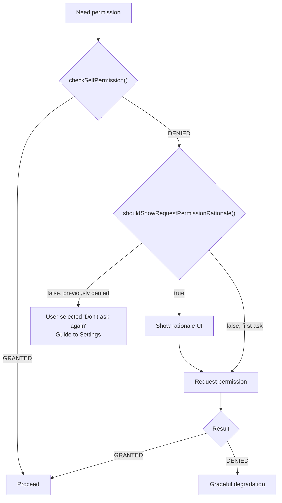

# Android Essentials

## Context

`Context` represents the current state of the application environment. It provides access to resources, databases, shared preferences, and system services.

| Type | Lifecycle | Use When |
|------|-----------|----------|
| **Application Context** | Lives as long as the app process | Singletons, DI, libraries that outlive Activities |
| **Activity Context** | Lives as long as the Activity | UI operations, dialogs, toasts, theme-dependent resources |

### Getting Context

| Method | Returns | Notes |
|--------|---------|-------|
| `this` (inside Activity) | Activity context | Theme-aware, can show dialogs |
| `applicationContext` | Application context | Safe for long-lived objects |
| `baseContext` | The base context delegate | Rarely used directly — needed for `attachBaseContext()` overrides (e.g., locale changes) |

### Memory Leak Risk

```kotlin
// BAD — singleton holds Activity context, Activity can never be GC'd
object ImageCache {
    lateinit var context: Context // if assigned Activity context = LEAK

    fun init(context: Context) {
        this.context = context // Activity leaks forever
    }
}

// GOOD — always use application context for long-lived objects
object ImageCache {
    lateinit var context: Context

    fun init(context: Context) {
        this.context = context.applicationContext // safe
    }
}
```

!!! warning "Rule of Thumb"
    If the object outlives the Activity, use `applicationContext`. If you need theme or UI capabilities, use the Activity context but ensure the reference does not escape the Activity's lifecycle.

---

## Application Class

The `Application` class is the **entry point** of the app. It is created before any Activity, Service, or BroadcastReceiver.

| Callback | When It Is Called |
|----------|-------------------|
| `onCreate()` | Process starts — before any other component |
| `onTrimMemory(level)` | System signals memory pressure with a granular level |
| `onConfigurationChanged(config)` | Device configuration changes (locale, orientation) |
| `onLowMemory()` | Older API — equivalent to `onTrimMemory(TRIM_MEMORY_COMPLETE)` |

!!! note "`onTerminate()` is never called on real devices"
    It only runs in emulated process environments. Do not rely on it for cleanup.

### When to Use Application

- Initialize DI frameworks (Hilt, Koin)
- Set up crash reporting (Firebase Crashlytics)
- Configure logging, strict mode
- One-time setup that needs to happen before any component runs

```kotlin
@HiltAndroidApp
class MyApp : Application() {
    override fun onCreate() {
        super.onCreate()
        if (BuildConfig.DEBUG) {
            Timber.plant(Timber.DebugTree())
            enableStrictMode()
        }
    }

    override fun onTrimMemory(level: Int) {
        super.onTrimMemory(level)
        if (level >= TRIM_MEMORY_MODERATE) {
            // Clear image caches, release resources
            imageLoader.memoryCache?.clear()
        }
    }
}
```

### ProcessLifecycleOwner

Observe app-level foreground/background transitions without tracking every Activity yourself:

```kotlin
class AppLifecycleObserver : DefaultLifecycleObserver {
    override fun onStart(owner: LifecycleOwner) {
        // App moved to FOREGROUND (any Activity is visible)
        Analytics.logEvent("app_foregrounded")
    }

    override fun onStop(owner: LifecycleOwner) {
        // App moved to BACKGROUND (no Activity is visible)
        Analytics.logEvent("app_backgrounded")
    }
}

// Register in Application.onCreate()
ProcessLifecycleOwner.get().lifecycle.addObserver(AppLifecycleObserver())
```

!!! tip "`ON_DESTROY` is never emitted"
    `ProcessLifecycleOwner` emits `ON_CREATE` once and `ON_START`/`ON_STOP` as the app transitions, but never `ON_DESTROY`. The process is simply killed by the OS.

---

## AndroidManifest

The manifest is the **bridge between the app and the Android OS**. The system reads it before running any code.

### What It Declares

| Element | Purpose |
|---------|---------|
| `<application>` | App-level config (theme, icon, Application class) |
| `<activity>` | Each Activity, with intent filters for deep links |
| `<service>` | Background services |
| `<receiver>` | Broadcast receivers |
| `<provider>` | Content providers |
| `<uses-permission>` | Permissions the app needs |
| `<uses-feature>` | Hardware/software features (camera, GPS) |

### Manifest Merging

The final manifest is a **merge** of your app manifest plus every library's manifest. The merger follows priority order:

```
Build variant manifest (highest priority)
    → App module main manifest
        → Library manifests (lowest priority)
```

Use `tools:node` and `tools:replace` to resolve conflicts:

```xml
<!-- Remove a permission a library declared -->
<uses-permission
    android:name="android.permission.ACCESS_FINE_LOCATION"
    tools:node="remove" />

<!-- Override a library's Activity attribute -->
<activity
    android:name="com.library.SomeActivity"
    android:exported="false"
    tools:replace="android:exported" />
```

!!! tip "Inspect Merged Manifest"
    In Android Studio: open your `AndroidManifest.xml` and click the **Merged Manifest** tab at the bottom to see the final result with source attribution.

---

## Permissions

### Runtime Permission Flow

Since Android 6.0 (API 23), dangerous permissions must be requested at runtime.



```kotlin
class MainActivity : ComponentActivity() {

    private val requestPermission = registerForActivityResult(
        ActivityResultContracts.RequestPermission()
    ) { granted ->
        if (granted) {
            openCamera()
        } else {
            showPermissionDeniedMessage()
        }
    }

    private fun checkCameraPermission() {
        when {
            ContextCompat.checkSelfPermission(
                this, Manifest.permission.CAMERA
            ) == PackageManager.PERMISSION_GRANTED -> {
                openCamera()
            }
            shouldShowRequestPermissionRationale(Manifest.permission.CAMERA) -> {
                // User denied before but didn't check "Don't ask again"
                showRationaleDialog {
                    requestPermission.launch(Manifest.permission.CAMERA)
                }
            }
            else -> {
                requestPermission.launch(Manifest.permission.CAMERA)
            }
        }
    }
}
```

### Permission Best Practices

- **Ask in context** — request the camera permission when the user taps the camera button, not at app launch
- **Graceful degradation** — the app should work (with reduced features) if permission is denied
- **Explain why** — use `shouldShowRequestPermissionRationale()` to show a dialog before re-requesting
- **Minimize permissions** — use `Photo Picker` instead of `READ_MEDIA_IMAGES`, use `COARSE_LOCATION` when `FINE_LOCATION` is not needed

---

## Build Configuration

### compileSdk vs targetSdk vs minSdk

| Property | Purpose | Example |
|----------|---------|---------|
| `compileSdk` | SDK version used to **compile** the app. Determines which APIs are available in your code. | 35 |
| `targetSdk` | SDK version the app has been **tested against**. The OS uses this to decide whether to apply backward-compatibility behaviors. | 35 |
| `minSdk` | Lowest Android version the app can be **installed** on. | 24 |

!!! warning "Common Misconception"
    `compileSdk` must be **greater than or equal to** `targetSdk`. You compile against the latest SDK to access new APIs, then set `targetSdk` to declare which behavior level you have tested. Setting `compileSdk` lower than `targetSdk` is a build error.

```kotlin
android {
    compileSdk = 35

    defaultConfig {
        minSdk = 24
        targetSdk = 35
    }
}
```

**What happens when you raise `targetSdk`:**

The OS assumes your app handles new behaviors. For example, targeting API 31+ requires you to declare `android:exported` on all components with intent filters. Targeting API 33+ requires the new `POST_NOTIFICATIONS` permission. If you do not handle these, the app may crash or lose functionality.

### Build Types, Product Flavors & Build Variants

```
Build Variant = Build Type x Product Flavor
```

| Concept | Purpose | Examples |
|---------|---------|---------|
| **Build Type** | Environment configuration | `debug`, `release`, `staging` |
| **Product Flavor** | App variations | `free`/`paid`, `demo`/`full` |
| **Build Variant** | The combination | `freeDebug`, `paidRelease` |

??? example "Variant Matrix"

    | Flavor | Build Type | Variant | Package Suffix |
    |--------|-----------|---------|----------------|
    | Free | Debug | `freeDebug` | `.free.debug` |
    | Free | Release | `freeRelease` | `.free` |
    | Paid | Debug | `paidDebug` | `.paid.debug` |
    | Paid | Release | `paidRelease` | `.paid` |

```kotlin
android {
    buildTypes {
        debug {
            isDebuggable = true
            applicationIdSuffix = ".debug"
        }
        release {
            isMinifyEnabled = true
            proguardFiles(getDefaultProguardFile("proguard-android-optimize.txt"))
        }
    }

    flavorDimensions += "tier"
    productFlavors {
        create("free") {
            dimension = "tier"
            applicationIdSuffix = ".free"
        }
        create("paid") {
            dimension = "tier"
            applicationIdSuffix = ".paid"
        }
    }
}
```

Each flavor can have its own source set (`src/free/`, `src/paid/`) with unique code, resources, and manifest entries.

### `implementation` vs `api`

Scenario: Module **A** depends on library **B**. Your **app** depends on module **A**.

| Scope | App Can See B? | Recompile App When B Changes? | Use When |
|-------|:-:|:-:|----------|
| `implementation` | No | No | Default — encapsulates internal dependencies |
| `api` | Yes | Yes | B's types are part of A's public API |

```kotlin
// Module A's build.gradle.kts
dependencies {
    implementation(libs.retrofit)     // App cannot use Retrofit directly
    api(libs.kotlinx.coroutines)      // App can use coroutines (exposed in A's API)
}
```

!!! tip "Prefer `implementation`"
    `api` leaks transitive dependencies and slows builds (changes in B recompile everything that depends on A). Only use `api` when A's public method signatures or return types use B's classes.

---

## LiveData

An **observable**, **lifecycle-aware**, **thread-safe** data holder from the Architecture Components.

| Method | Thread | Behavior |
|--------|--------|----------|
| `setValue(value)` | Main thread only | Synchronous — observers notified immediately |
| `postValue(value)` | Any thread | Posts to main thread — if called multiple times before main thread processes, only the **last** value is dispatched |

### Transformations

```kotlin
// map — transform each value
val userName: LiveData<String> = Transformations.map(userLiveData) { user ->
    "${user.firstName} ${user.lastName}"
}

// switchMap — switch to a different LiveData source
val userPosts: LiveData<List<Post>> = Transformations.switchMap(userIdLiveData) { userId ->
    repository.getPostsLiveData(userId)
}
```

### MediatorLiveData

Combines multiple LiveData sources:

```kotlin
val mediator = MediatorLiveData<String>()

mediator.addSource(liveDataA) { a ->
    mediator.value = "A: $a, B: ${liveDataB.value}"
}
mediator.addSource(liveDataB) { b ->
    mediator.value = "A: ${liveDataA.value}, B: $b"
}
```

### LiveData vs StateFlow

| Aspect | LiveData | StateFlow |
|--------|----------|-----------|
| **Library** | `androidx.lifecycle` | `kotlinx.coroutines` |
| **Platform** | Android-only | Pure Kotlin (KMP-compatible) |
| **Initial value** | No initial value (nullable) | Always has a value (constructor requires it) |
| **Lifecycle awareness** | Auto-observes lifecycle | Requires `repeatOnLifecycle` or `collectAsStateWithLifecycle` |
| **Thread safety** | `postValue` from any thread | `emit` from any coroutine context |
| **Null support** | Yes | Yes, but value is never uninitialized |
| **Replay** | Replays last value to new observers | Replays last value to new collectors |
| **Kotlin-native** | No (Android dependency) | Yes |

!!! tip "Modern Android"
    Prefer `StateFlow` in the ViewModel layer. Use `collectAsStateWithLifecycle()` in Compose or `repeatOnLifecycle` in Views to safely collect. LiveData remains useful for Java codebases and one-shot event patterns with `SingleLiveEvent`.

---

## Miscellaneous

### Edge to Edge (Android 15)

Starting with Android 15, apps targeting API 35 are **edge-to-edge by default** — the app draws behind the status bar and navigation bar.

```kotlin
class MainActivity : ComponentActivity() {
    override fun onCreate(savedInstanceState: Bundle?) {
        super.onCreate(savedInstanceState)
        enableEdgeToEdge() // from androidx.activity

        setContent {
            Scaffold(
                modifier = Modifier.fillMaxSize()
            ) { innerPadding ->
                // innerPadding accounts for system bars
                MainScreen(modifier = Modifier.padding(innerPadding))
            }
        }
    }
}
```

Handle insets manually when not using Scaffold:

```kotlin
Modifier.windowInsetsPadding(WindowInsets.systemBars)
Modifier.windowInsetsPadding(WindowInsets.ime) // keyboard insets
```

### StrictMode

Catches accidental disk reads, network calls, and resource mismatches on the main thread during development.

```kotlin
if (BuildConfig.DEBUG) {
    StrictMode.setThreadPolicy(
        StrictMode.ThreadPolicy.Builder()
            .detectDiskReads()
            .detectDiskWrites()
            .detectNetwork()
            .penaltyLog()       // log to Logcat
            .penaltyDeath()     // crash on violation (aggressive but effective)
            .build()
    )
    StrictMode.setVmPolicy(
        StrictMode.VmPolicy.Builder()
            .detectLeakedClosableObjects()  // unclosed streams
            .detectLeakedSqlLiteObjects()   // unclosed cursors
            .detectActivityLeaks()          // leaked Activity instances
            .penaltyLog()
            .build()
    )
}
```

!!! warning "Debug builds only"
    Never enable `penaltyDeath()` in release builds. StrictMode itself adds overhead and should be completely disabled in production.

### Accessibility

| Practice | Why |
|----------|-----|
| Set `contentDescription` on images and icons | Screen readers (TalkBack) announce the description |
| Use `sp` for font sizes | Respects the user's system font-size preference |
| Set `importantForAccessibility` | Control what TalkBack sees — hide decorative elements |
| Use `focusable` and `nextFocusDown` | Directional navigation for D-pad and keyboard users |
| Test with TalkBack enabled | Catch missing descriptions and broken focus order |

```kotlin
// Compose accessibility
Image(
    painter = painterResource(R.drawable.profile),
    contentDescription = "Profile photo of ${user.name}" // always descriptive
)

// Decorative images — null tells TalkBack to skip
Icon(
    imageVector = Icons.Default.Star,
    contentDescription = null // decorative, not interactive
)
```

---

## Interview Q&A

??? question "What is the difference between Application Context and Activity Context?"
    Application Context lives as long as the app process and is safe for singletons, DI, and long-lived objects. Activity Context is tied to the Activity lifecycle and is needed for UI operations like showing dialogs and toasts. Using Activity Context in long-lived objects causes memory leaks because the Activity cannot be garbage collected.

??? question "What is the difference between compileSdk, targetSdk, and minSdk?"
    `compileSdk` determines which APIs are available at compile time. `targetSdk` declares which API level the app has been tested against, and the OS uses it to decide whether to apply backward-compatibility behaviors. `minSdk` is the lowest Android version the app can be installed on. `compileSdk` must be greater than or equal to `targetSdk`.

??? question "What is the difference between LiveData and StateFlow?"
    LiveData is Android-specific and lifecycle-aware out of the box, while StateFlow is pure Kotlin and requires `repeatOnLifecycle` or `collectAsStateWithLifecycle` for safe collection. StateFlow always has an initial value and is KMP-compatible. Modern Android development prefers StateFlow in the ViewModel layer with LiveData reserved for Java codebases.

??? question "What is manifest merging and how do you resolve conflicts?"
    The final AndroidManifest is a merge of your app manifest and all library manifests, following a priority order (build variant > app > libraries). Conflicts are resolved using `tools:node` (e.g., `tools:node="remove"` to remove a library's permission) and `tools:replace` to override specific attributes. You can inspect the merged result in Android Studio's Merged Manifest tab.

??? question "How do you handle the 'Don't ask again' state for runtime permissions?"
    When `shouldShowRequestPermissionRationale()` returns false and the permission was previously denied, the user has selected "Don't ask again." In this case, you cannot show the system permission dialog again. Instead, guide the user to the app's settings page where they can manually grant the permission.

??? question "What is ProcessLifecycleOwner and when would you use it?"
    `ProcessLifecycleOwner` provides lifecycle events for the entire app process, emitting `ON_START` when any Activity becomes visible (app foreground) and `ON_STOP` when no Activity is visible (app background). It is useful for analytics, pausing/resuming global resources, and detecting foreground/background transitions without tracking individual Activities.

!!! tip "Further Reading"
    - [Context - Android Developers](https://developer.android.com/reference/android/content/Context)
    - [App Manifest overview - Android Developers](https://developer.android.com/guide/topics/manifest/manifest-intro)
    - [Request runtime permissions - Android Developers](https://developer.android.com/training/permissions/requesting)
    - [LiveData overview - Android Developers](https://developer.android.com/topic/libraries/architecture/livedata)
    - [StateFlow and SharedFlow - Kotlin Docs](https://kotlinlang.org/docs/flow.html#stateflow-and-sharedflow)
