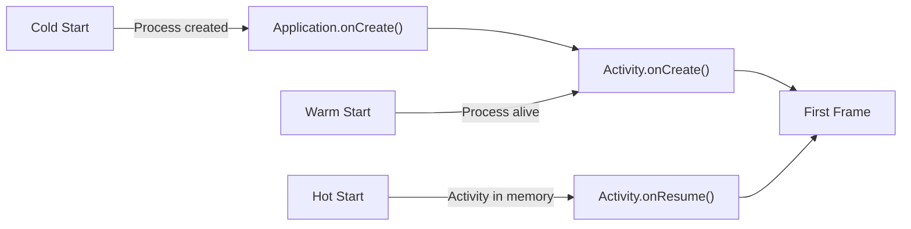

# App Startup & Initialization

## Library Initialization

Every library that needs a `Context` at startup faces the same problem: how to initialize without burdening the app developer.

### The ContentProvider Approach

Libraries like Firebase and WorkManager register their own `ContentProvider` in the manifest. The system creates all ContentProviders before `Application.onCreate()`, giving each library a `Context` automatically.

```xml
<!-- Firebase auto-registers this in the merged manifest -->
<provider
    android:name="com.google.firebase.provider.FirebaseInitProvider"
    android:authorities="${applicationId}.firebaseinitprovider"
    android:exported="false"
    android:initOrder="100" />
```

!!! warning "The Problem"
    Each ContentProvider adds ~2ms to startup. With 10+ libraries each registering their own CP, that is 20ms+ of overhead before your code even runs. ContentProviders also have no mechanism to declare initialization order between libraries.

### App Startup Library

Jetpack App Startup solves this by providing a **single ContentProvider** that initializes multiple libraries with explicit dependency ordering.

```kotlin
// Step 1: Implement Initializer for each library
class WorkManagerInitializer : Initializer<WorkManager> {
    override fun create(context: Context): WorkManager {
        val config = Configuration.Builder()
            .setMinimumLoggingLevel(Log.DEBUG)
            .build()
        WorkManager.initialize(context, config)
        return WorkManager.getInstance(context)
    }

    override fun dependencies(): List<Class<out Initializer<*>>> {
        // No dependencies — runs first
        return emptyList()
    }
}

class AnalyticsInitializer : Initializer<Analytics> {
    override fun create(context: Context): Analytics {
        return Analytics.init(context)
    }

    override fun dependencies(): List<Class<out Initializer<*>>> {
        // Runs AFTER WorkManager is initialized
        return listOf(WorkManagerInitializer::class.java)
    }
}
```

```xml
<!-- Single ContentProvider replaces all library CPs -->
<provider
    android:name="androidx.startup.InitializationProvider"
    android:authorities="${applicationId}.androidx-startup"
    android:exported="false"
    tools:node="merge">
    <meta-data
        android:name="com.example.WorkManagerInitializer"
        android:value="androidx.startup" />
    <meta-data
        android:name="com.example.AnalyticsInitializer"
        android:value="androidx.startup" />
</provider>
```

The `dependencies()` method creates a directed acyclic graph. App Startup resolves the graph and initializes components in topological order.

---

## Cold, Warm & Hot Start



| Type | What Happens | Typical Time |
|------|-------------|-------------|
| **Cold** | No process exists. Zygote forks a new process, loads the app's classes, runs `Application.onCreate()`, creates the Activity, inflates the layout, draws the first frame. | 500ms - 2s+ |
| **Warm** | Process is alive but the Activity was destroyed. Skips process creation and `Application.onCreate()`. Recreates the Activity from `onCreate()`. | 200ms - 500ms |
| **Hot** | Process and Activity are both alive (in memory). The system brings the Activity to the foreground and calls `onResume()`. | <100ms |

!!! note "What makes cold start slow"
    Cold start includes class loading (DEX → ART), static initializers, ContentProvider creation, `Application.onCreate()`, and the first Activity's full creation cycle. Each step compounds.

---

## TTID vs TTFD

| Metric | What It Measures | How to Measure |
|--------|-----------------|----------------|
| **TTID** (Time to Initial Display) | Time from intent to the first frame drawn on screen | Automatic — Android logs `Displayed` in Logcat |
| **TTFD** (Time to Full Display) | Time from intent to all content being rendered (network data, images) | Manual — call `reportFullyDrawn()` |

```kotlin
class MainActivity : ComponentActivity() {
    override fun onCreate(savedInstanceState: Bundle?) {
        super.onCreate(savedInstanceState)
        setContent {
            val state by viewModel.uiState.collectAsStateWithLifecycle()

            if (state is UiState.Loaded) {
                // Signal that the app is fully drawn with real content
                LaunchedEffect(Unit) {
                    reportFullyDrawn()
                }
            }

            MainScreen(state)
        }
    }
}
```

**Macrobenchmark** automates this measurement in CI:

```kotlin
@LargeTest
@RunWith(AndroidJUnit4::class)
class StartupBenchmark {
    @get:Rule
    val benchmarkRule = MacrobenchmarkRule()

    @Test
    fun startupCompilation() = benchmarkRule.measureRepeated(
        packageName = "com.example.app",
        metrics = listOf(StartupTimingMetric()),
        iterations = 5,
        startupMode = StartupMode.COLD,
    ) {
        pressHome()
        startActivityAndWait()
    }
}
```

---

## Reducing Cold Start Time

### 1. Baseline Profiles

Ship AOT-compiled critical paths so the first run does not rely on interpretation or JIT.

```kotlin
// baseline-prof.txt — collected via Macrobenchmark
@get:Rule
val baselineProfileRule = BaselineProfileRule()

@Test
fun generateBaselineProfile() = baselineProfileRule.collect(
    packageName = "com.example.app"
) {
    startActivityAndWait()
    // Navigate through critical user journeys
    device.findObject(By.text("Home")).click()
    device.waitForIdle()
}
```

### 2. Lazy Initialization

```kotlin
@HiltAndroidApp
class MyApp : Application() {
    // Lazy — only created when first accessed
    val imageLoader by lazy {
        ImageLoader.Builder(this)
            .crossfade(true)
            .build()
    }

    override fun onCreate() {
        super.onCreate()
        // Only critical init here
        initCrashReporting()
    }
}
```

### 3. Defer Non-Critical Work

Post to the main handler so work runs after the first frame is drawn:

```kotlin
override fun onCreate() {
    super.onCreate()

    // CRITICAL — must happen before first frame
    initCrashReporting()
    initDependencyInjection()

    // DEFERRED — runs after the first frame
    Handler(Looper.getMainLooper()).post {
        initAnalytics()
        initFeatureFlags()
        initRemoteConfig()
    }
}
```

### 4. Avoid Heavy Application.onCreate()

| Do | Don't |
|----|-------|
| Init crash reporting | Load large JSON configs |
| Init DI graph (lazy) | Pre-warm caches |
| Set up strict mode (debug) | Init analytics synchronously |
| Register ProcessLifecycleOwner | Perform disk I/O |

### 5. First Coroutine Creation Cost

!!! warning "Hidden Startup Tax"
    The first coroutine launch has significant overhead (~100ms on low-end devices) because the coroutine machinery — `CoroutineDispatcher`, `CoroutineContext`, internal thread pools — must be initialized for the first time.

```kotlin
// BAD — pays the coroutine init cost at startup
override fun onCreate() {
    super.onCreate()
    lifecycleScope.launch {
        initSomething() // first coroutine = slow
    }
}

// GOOD — use Executors for startup work, coroutines later
override fun onCreate() {
    super.onCreate()
    Executors.newSingleThreadExecutor().execute {
        initSomething() // no coroutine overhead
    }
}
```

Once the coroutine machinery is initialized (which happens lazily on first use), subsequent coroutine launches are fast. The cost is only paid once per process.

---

## Splash Screen API (Android 12+)

The `SplashScreen` API replaces custom splash Activities. The system draws the splash screen before your app's first frame, eliminating the blank white screen.

```kotlin
class MainActivity : ComponentActivity() {
    override fun onCreate(savedInstanceState: Bundle?) {
        val splashScreen = installSplashScreen()

        // Keep splash on screen while loading initial data
        splashScreen.setKeepOnScreenCondition {
            viewModel.isLoading.value
        }

        // Optional: customize exit animation
        splashScreen.setOnExitAnimationListener { splashScreenView ->
            val fadeOut = ObjectAnimator.ofFloat(splashScreenView.view, "alpha", 1f, 0f)
            fadeOut.duration = 300L
            fadeOut.doOnEnd { splashScreenView.remove() }
            fadeOut.start()
        }

        super.onCreate(savedInstanceState)
        setContent { MyApp() }
    }
}
```

Configure the splash in your theme:

```xml
<style name="Theme.App.Starting" parent="Theme.SplashScreen">
    <item name="windowSplashScreenBackground">@color/splash_bg</item>
    <item name="windowSplashScreenAnimatedIcon">@drawable/ic_launcher_foreground</item>
    <item name="windowSplashScreenAnimationDuration">300</item>
    <item name="postSplashScreenTheme">@style/Theme.App</item>
</style>
```

---

## Tracing Startup Performance

### Perfetto / System Trace

Capture a system trace to see exactly where time is spent during startup:

```bash
# Record a startup trace
adb shell perfetto -o /data/misc/perfetto-traces/startup.perfetto-trace -t 10s \
  sched freq idle am wm gfx view dalvik

# Pull and open in ui.perfetto.dev
adb pull /data/misc/perfetto-traces/startup.perfetto-trace
```

### Method Tracing

For fine-grained method-level analysis:

```kotlin
override fun onCreate() {
    Debug.startMethodTracing("startup_trace")
    super.onCreate()
    initCriticalComponents()
    Debug.stopMethodTracing()
    // Trace saved to /sdcard/Android/data/<pkg>/files/startup_trace.trace
}
```

Open the `.trace` file in Android Studio Profiler to see a flame chart of method execution times.

!!! tip "Staff POV"
    Track cold start time as a **product metric**. Set a budget (e.g., <800ms TTID) and alert when it regresses. Use Firebase Performance for field metrics and Macrobenchmark in CI for lab metrics. Both are needed — field metrics catch device-specific regressions, lab metrics catch code regressions before they ship.

---

## Interview Q&A

??? question "What is the difference between cold, warm, and hot start?"
    A cold start creates a new process from scratch, running `Application.onCreate()` and the full Activity creation cycle (500ms-2s+). A warm start reuses an existing process but recreates the Activity from `onCreate()` (200-500ms). A hot start brings an already in-memory Activity to the foreground via `onResume()` (<100ms).

??? question "What is the difference between TTID and TTFD?"
    TTID (Time to Initial Display) measures the time from intent to the first frame drawn on screen and is tracked automatically by Android via Logcat. TTFD (Time to Full Display) measures the time until all content is rendered (including network data and images) and requires manually calling `reportFullyDrawn()` in your code.

??? question "How does the Jetpack App Startup library improve startup performance?"
    Instead of each library registering its own ContentProvider (each adding ~2ms overhead), App Startup consolidates all library initializations into a single ContentProvider. It also supports explicit dependency ordering via the `dependencies()` method, which creates a directed acyclic graph resolved in topological order.

??? question "What are Baseline Profiles and how do they improve cold start time?"
    Baseline Profiles ship pre-compiled (AOT) critical code paths with the APK, so the first run does not rely on interpretation or JIT compilation. They are generated using Macrobenchmark by recording critical user journeys. The Android runtime uses these profiles to compile the specified methods ahead of time during installation.

??? question "Why does the first coroutine launch have a performance cost at startup?"
    The first coroutine launch initializes the entire coroutine machinery — `CoroutineDispatcher`, `CoroutineContext`, and internal thread pools — which can take ~100ms on low-end devices. This cost is paid only once per process. To avoid this at startup, use `Executors` for initial work and defer coroutine usage until after the first frame.

!!! tip "Further Reading"
    - [App Startup - Android Developers](https://developer.android.com/topic/libraries/app-startup)
    - [App Startup Time - Android Developers](https://developer.android.com/topic/performance/vitals/launch-time)
    - [Baseline Profiles - Android Developers](https://developer.android.com/topic/performance/baselineprofiles/overview)
    - [Macrobenchmark - Android Developers](https://developer.android.com/topic/performance/benchmarking/macrobenchmark-overview)
    - [Splash Screen API - Android Developers](https://developer.android.com/develop/ui/views/launch/splash-screen)
