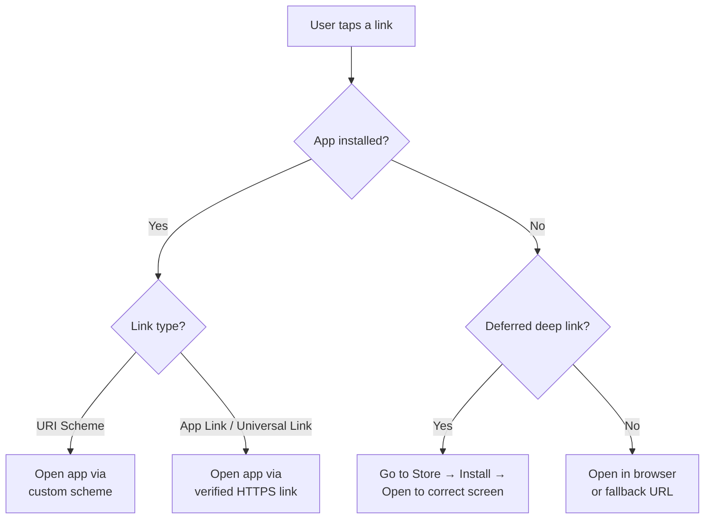
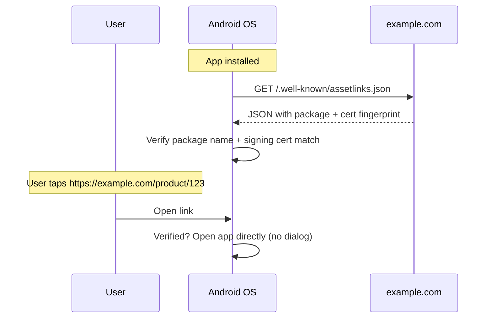
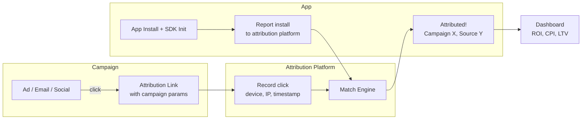
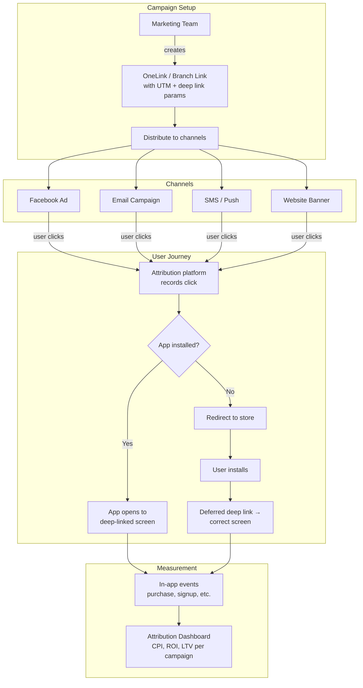

# Deep Links & Attribution

How mobile apps handle incoming links, and how marketing campaigns track user acquisition through deep linking and attribution platforms.

---

## Deep Linking Types



### Comparison

| Type | Format | Requires Install | Fallback | Verification |
|------|--------|-----------------|----------|-------------|
| **URI Scheme** | `myapp://product/123` | Yes | None (fails silently) | None |
| **App Links** (Android) | `https://example.com/product/123` | Yes | Opens in browser | Domain verification (assetlinks.json) |
| **Universal Links** (iOS) | `https://example.com/product/123` | Yes | Opens in browser | Domain verification (apple-app-site-association) |
| **Deferred Deep Link** | Any URL | No (redirects through store) | Store → app | Attribution SDK |

---

## URI Schemes

The simplest deep link — a custom protocol registered by your app.

```xml
<!-- AndroidManifest.xml -->
<activity android:name=".ProductActivity"
    android:exported="true">
    <intent-filter>
        <action android:name="android.intent.action.VIEW" />
        <category android:name="android.intent.category.DEFAULT" />
        <category android:name="android.intent.category.BROWSABLE" />
        <data
            android:scheme="myapp"
            android:host="product"
            android:pathPrefix="/" />
    </intent-filter>
</activity>
```

```kotlin
// Handle: myapp://product/123
val productId = intent.data?.lastPathSegment  // "123"
```

!!! warning "URI Scheme Limitations"
    - No ownership verification — any app can register the same scheme
    - No fallback if app is not installed — link just fails
    - Android shows a disambiguation dialog if multiple apps register the same scheme
    - Not supported in all contexts (some apps strip custom schemes)

---

## Android App Links

HTTPS links that open your app directly without a disambiguation dialog, with browser fallback if the app isn't installed.

### Setup

**1. Host the Digital Asset Links file:**

```json
// https://example.com/.well-known/assetlinks.json
[{
    "relation": ["delegate_permission/common.handle_all_urls"],
    "target": {
        "namespace": "android_app",
        "package_name": "com.example.myapp",
        "sha256_cert_fingerprints": [
            "AB:CD:EF:12:34:..."
        ]
    }
}]
```

**2. Declare the intent filter with `autoVerify`:**

```xml
<activity android:name=".ProductActivity"
    android:exported="true">
    <intent-filter android:autoVerify="true">
        <action android:name="android.intent.action.VIEW" />
        <category android:name="android.intent.category.DEFAULT" />
        <category android:name="android.intent.category.BROWSABLE" />
        <data
            android:scheme="https"
            android:host="example.com"
            android:pathPrefix="/product" />
    </intent-filter>
</activity>
```

**3. Handle the incoming intent:**

```kotlin
override fun onCreate(savedInstanceState: Bundle?) {
    super.onCreate(savedInstanceState)
    
    val uri = intent.data ?: return
    
    when {
        uri.pathSegments.firstOrNull() == "product" -> {
            val productId = uri.pathSegments.getOrNull(1)
            navigateToProduct(productId)
        }
        uri.pathSegments.firstOrNull() == "profile" -> {
            val userId = uri.getQueryParameter("id")
            navigateToProfile(userId)
        }
    }
}
```

### Verification Flow



---

## Deferred Deep Links

Route users to the correct in-app screen **even if the app wasn't installed** when they clicked the link. The link context survives the install process.

### How It Works

```mermaid
sequenceDiagram
    participant User
    participant Link as Attribution Link<br/>(OneLink / Branch)
    participant Store as App Store
    participant App as Your App
    participant SDK as Attribution SDK

    User->>Link: Click link<br/>(https://myapp.onelink.me/xyz)
    Link->>Link: Record: device fingerprint +<br/>link params (product_id=123)
    Link->>Store: Redirect to store
    User->>Store: Install app
    User->>App: First launch
    App->>SDK: SDK init
    SDK->>Link: Check for deferred deep link<br/>(match by device fingerprint)
    Link-->>SDK: Found! product_id=123
    SDK-->>App: Deep link data
    App->>App: Navigate to product/123
```

### Matching Methods

| Method | Accuracy | How It Works |
|--------|----------|-------------|
| **Device ID matching** | ~100% | GAID/IDFA sent before and after install (limited by privacy changes) |
| **Fingerprinting** | ~80-90% | IP + User-Agent + screen size + OS version |
| **Google Play Install Referrer** | ~100% | `installreferrer` API — Google passes referrer data through the store |
| **Clipboard (iOS)** | ~100% | Link data copied to pasteboard, SDK reads on first launch |

!!! warning "Privacy Impact"
    Apple's App Tracking Transparency (ATT) and Google's Privacy Sandbox are restricting device-level tracking. Fingerprinting accuracy is declining. Modern attribution increasingly relies on platform-provided APIs (SKAdNetwork, Install Referrer).

---

## Attribution Platforms

Attribution answers: **"Which marketing campaign brought this user?"**

### How Attribution Works



### Major Platforms

| Platform | Key Product | Strengths |
|----------|------------|-----------|
| **AppsFlyer** | OneLink | Market leader, deep linking + attribution combined |
| **Branch** | Branch Links | Deep linking focus, strong web-to-app |
| **Adjust** | Adjust Links | Privacy-focused, SKAN support |
| **Singular** | Singular Links | Cost aggregation + attribution |
| **Kochava** | Kochava Links | Fraud prevention |

---

## OneLink (AppsFlyer)

AppsFlyer's deep linking solution that combines attribution, deep linking, and deferred deep linking in one URL.

### OneLink URL Structure

```
https://myapp.onelink.me/AbCd?
    pid=facebook               ← media source
    c=summer_sale              ← campaign name
    af_adset=retargeting       ← ad set
    af_ad=banner_300x250       ← specific ad
    af_dp=myapp://product/123  ← deep link URI (if app installed)
    af_web_dp=https://example.com/product/123  ← web fallback
    deep_link_value=product_123               ← custom parameter
    deep_link_sub1=summer_promo               ← custom sub-parameter
```

### Integration

```kotlin
class MyApplication : Application() {
    override fun onCreate() {
        super.onCreate()
        
        // Initialize AppsFlyer
        AppsFlyerLib.getInstance().init("YOUR_DEV_KEY", object : AppsFlyerConversionListener {
            override fun onConversionDataSuccess(data: MutableMap<String, Any>?) {
                // Attribution data for installs
                val mediaSource = data?.get("media_source")
                val campaign = data?.get("campaign")
                val isFirstLaunch = data?.get("is_first_launch") as? Boolean
                
                // Deferred deep link
                val deepLinkValue = data?.get("deep_link_value") as? String
                if (isFirstLaunch == true && deepLinkValue != null) {
                    navigateToContent(deepLinkValue)
                }
            }
            
            override fun onConversionDataFail(error: String?) {}
            override fun onAppOpenAttribution(data: MutableMap<String, String>?) {
                // Deep link data for re-engagements (app already installed)
                val deepLink = data?.get("deep_link_value")
                deepLink?.let { navigateToContent(it) }
            }
            override fun onAttributionFailure(error: String?) {}
        }, this)
        
        AppsFlyerLib.getInstance().start(this)
    }
}
```

### Unified Deep Linking (UDL)

AppsFlyer's newer API that simplifies deep linking with a single callback:

```kotlin
AppsFlyerLib.getInstance().subscribeForDeepLink { deepLinkResult ->
    when (deepLinkResult.status) {
        DeepLinkResult.Status.FOUND -> {
            val deepLink = deepLinkResult.deepLink
            val value = deepLink.deepLinkValue  // "product_123"
            val sub1 = deepLink.getStringValue("deep_link_sub1")
            navigateToContent(value)
        }
        DeepLinkResult.Status.NOT_FOUND -> { /* organic open */ }
        DeepLinkResult.Status.ERROR -> { /* handle error */ }
    }
}
```

---

## Marketing Campaign Flow

End-to-end flow of a marketing campaign using deep links and attribution.



### UTM Parameters

Standard tracking parameters appended to URLs:

| Parameter | Purpose | Example |
|-----------|---------|---------|
| `utm_source` | Traffic source | `facebook`, `google`, `newsletter` |
| `utm_medium` | Marketing medium | `cpc`, `email`, `social`, `banner` |
| `utm_campaign` | Campaign name | `summer_sale_2024` |
| `utm_term` | Paid search keyword | `running+shoes` |
| `utm_content` | A/B test variant or ad creative | `blue_banner`, `video_ad` |

### Key Metrics

| Metric | Formula | Meaning |
|--------|---------|---------|
| **CPI** (Cost Per Install) | Ad spend / installs | How much each install costs |
| **CPA** (Cost Per Action) | Ad spend / conversions | How much each conversion costs |
| **ROAS** (Return on Ad Spend) | Revenue / ad spend | Revenue generated per dollar spent |
| **LTV** (Lifetime Value) | Total revenue from user over time | Long-term value of acquired users |
| **Retention** | Users active on day N / installs | How many users stick around |

---

## Implementation Checklist

| Task | Android | iOS |
|------|---------|-----|
| URI scheme deep links | Intent filter in Manifest | URL Types in Info.plist |
| Verified deep links | `assetlinks.json` + `autoVerify` | `apple-app-site-association` + Associated Domains |
| Attribution SDK | AppsFlyer/Branch SDK in Application | AppDelegate / SceneDelegate |
| Deferred deep linking | SDK callback on first launch | SDK callback on first launch |
| UTM tracking | Parse from attribution data | Parse from attribution data |
| In-app event tracking | `AppsFlyerLib.trackEvent()` | `AppsFlyerLib.logEvent()` |

---

??? question "Interview Questions"

    **Q: What's the difference between a deep link and a deferred deep link?**

    A deep link opens a specific screen in an already-installed app. A deferred deep link does the same, but works even when the app isn't installed — it redirects through the app store, and the link context is preserved and applied after the first launch. Attribution SDKs match the pre-install click to the post-install launch using device fingerprinting or platform APIs.

    **Q: Why use App Links instead of URI schemes?**

    App Links (Android) and Universal Links (iOS) use verified HTTPS URLs. The OS confirms domain ownership, so no other app can intercept your links. They also provide a browser fallback if the app isn't installed, and they avoid the disambiguation dialog. URI schemes have no verification, no fallback, and are susceptible to hijacking.

    **Q: How does attribution work when tracking is restricted (ATT, Privacy Sandbox)?**

    Apple's SKAdNetwork provides privacy-preserving attribution — the ad network receives a conversion value (0-63) after a delay, without device-level identifiers. Google's Privacy Sandbox replaces GAID with Topics API and Attribution Reporting API. Both shift from deterministic (device ID) to probabilistic or aggregated attribution, reducing per-user accuracy but preserving campaign-level measurement.

    **Q: What happens if a user clicks a OneLink but has multiple matching apps installed?**

    OneLink (and similar platforms) use the `af_dp` parameter to specify the exact URI scheme or App Link for the target app. If using App Links with `autoVerify`, the OS routes directly to the verified app. If using URI schemes and multiple apps handle the same scheme, Android shows a disambiguation dialog.

!!! tip "Further Reading"
    - [Android App Links Documentation](https://developer.android.com/training/app-links)
    - [AppsFlyer OneLink Guide](https://support.appsflyer.com/hc/en-us/articles/207032246)
    - [Branch Deep Linking Documentation](https://help.branch.io/developers-hub/docs/android-basic-integration)
    - [SKAdNetwork Documentation](https://developer.apple.com/documentation/storekit/skadnetwork)
