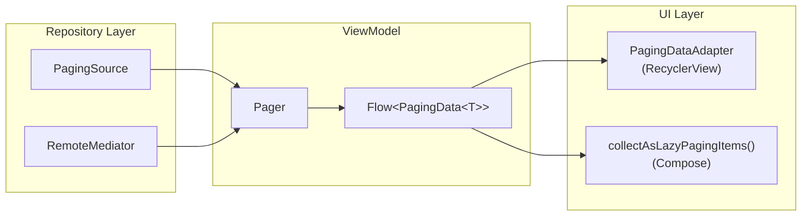
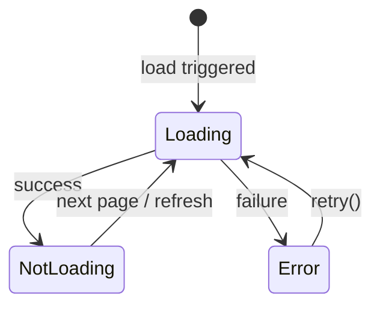
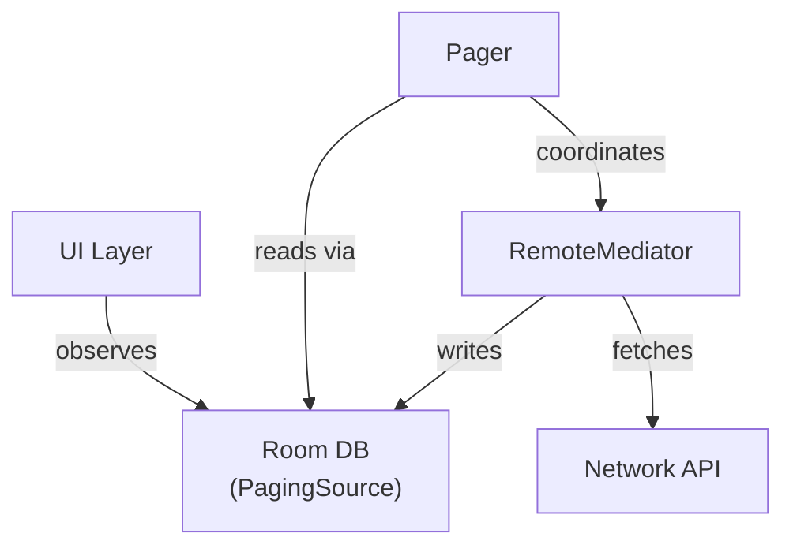

# AndroidX Paging3

Paging3 is the Jetpack library for loading large datasets in chunks. It handles caching, request deduplication, error recovery, and integrates with RecyclerView and Compose out of the box.

---

## Architecture Overview



| Component | Responsibility |
|-----------|---------------|
| **PagingSource** | Loads pages from a single data source (network or DB) |
| **RemoteMediator** | Coordinates network + local DB for offline-first pagination |
| **Pager** | Constructs `Flow<PagingData<T>>` from config + source |
| **PagingData** | Immutable container of paged items flowing through the pipeline |
| **PagingDataAdapter** | RecyclerView adapter that consumes `PagingData` with DiffUtil |
| **LazyPagingItems** | Compose-side collector for `PagingData` |

---

## PagingSource

The core loading contract. Implement `load()` to return a `LoadResult` with the page data and prev/next keys.

```kotlin
class ArticlePagingSource(
    private val api: ArticleApi
) : PagingSource<Int, Article>() {

    override suspend fun load(params: LoadParams<Int>): LoadResult<Int, Article> {
        val page = params.key ?: 1
        return try {
            val response = api.getArticles(page = page, size = params.loadSize)
            LoadResult.Page(
                data = response.articles,
                prevKey = if (page == 1) null else page - 1,
                nextKey = if (response.articles.isEmpty()) null else page + 1
            )
        } catch (e: Exception) {
            LoadResult.Error(e)
        }
    }

    override fun getRefreshKey(state: PagingState<Int, Article>): Int? {
        return state.anchorPosition?.let { anchor ->
            state.closestPageToPosition(anchor)?.prevKey?.plus(1)
                ?: state.closestPageToPosition(anchor)?.nextKey?.minus(1)
        }
    }
}
```

### LoadParams & LoadResult

| LoadParams type | When triggered |
|-----------------|---------------|
| `Refresh` | Initial load or manual refresh |
| `Append` | Scrolling forward (next page) |
| `Prepend` | Scrolling backward (previous page) |

| LoadResult type | Meaning |
|-----------------|---------|
| `Page` | Successful load with data + prev/next keys |
| `Error` | Load failed — UI can show error + retry |
| `Invalid` | Source is stale — triggers a new `PagingSource` creation |

!!! warning "PagingSource is single-use"
    A `PagingSource` instance is invalidated after calling `invalidate()` or when a `LoadResult.Invalid` is returned. The `Pager`'s `pagingSourceFactory` lambda creates a fresh instance each time. Never reuse a `PagingSource` object.

---

## Pager & PagingConfig

The `Pager` wires the config and source into a `Flow<PagingData>`.

```kotlin
val pager = Pager(
    config = PagingConfig(
        pageSize = 20,
        prefetchDistance = 5,
        initialLoadSize = 40,
        maxSize = 200,
        enablePlaceholders = false
    ),
    pagingSourceFactory = { ArticlePagingSource(api) }
).flow.cachedIn(viewModelScope)
```

### PagingConfig Parameters

| Parameter | Default | Purpose |
|-----------|---------|---------|
| `pageSize` | required | Items per page — should match your API's page size |
| `prefetchDistance` | `pageSize` | How far from the edge to trigger the next load |
| `initialLoadSize` | `pageSize * 3` | Items to load on the first request |
| `maxSize` | `MAX_VALUE` | Max items held in memory — pages are dropped when exceeded |
| `enablePlaceholders` | `true` | Show nulls for not-yet-loaded items (requires known total count) |

!!! tip "Tuning prefetchDistance"
    Set `prefetchDistance` to 1-2x `pageSize` for fast APIs. For slow APIs (>500ms), increase to 3-4x so loads fire earlier and the user never sees a loading spinner mid-scroll.

!!! warning "cachedIn is required"
    Always call `.cachedIn(viewModelScope)` to cache `PagingData` across configuration changes. Without it, every recomposition or RecyclerView reconnect triggers a full reload from scratch.

---

## UI Integration

=== "RecyclerView"

    ```kotlin
    // Adapter
    class ArticleAdapter : PagingDataAdapter<Article, ArticleViewHolder>(
        diffCallback = object : DiffUtil.ItemCallback<Article>() {
            override fun areItemsTheSame(old: Article, new: Article) = old.id == new.id
            override fun areContentsTheSame(old: Article, new: Article) = old == new
        }
    ) {
        override fun onCreateViewHolder(parent: ViewGroup, viewType: Int): ArticleViewHolder {
            val view = LayoutInflater.from(parent.context)
                .inflate(R.layout.item_article, parent, false)
            return ArticleViewHolder(view)
        }

        override fun onBindViewHolder(holder: ArticleViewHolder, position: Int) {
            getItem(position)?.let { holder.bind(it) }
        }
    }

    // Fragment / Activity
    lifecycleScope.launch {
        viewModel.pager.collectLatest { pagingData ->
            adapter.submitData(pagingData)
        }
    }
    ```

=== "Jetpack Compose"

    ```kotlin
    @Composable
    fun ArticleList(viewModel: ArticleViewModel) {
        val articles = viewModel.pager.collectAsLazyPagingItems()

        LazyColumn {
            items(
                count = articles.itemCount,
                key = articles.itemKey { it.id }
            ) { index ->
                val article = articles[index]
                article?.let { ArticleCard(it) }
            }
        }
    }
    ```

---

## Load State Handling

Paging3 exposes `LoadState` for each load direction: `refresh`, `append`, and `prepend`.



| LoadState | Meaning |
|-----------|---------|
| `Loading` | A load is in progress |
| `NotLoading(endOfPaginationReached)` | Idle — check `endOfPaginationReached` for end of list |
| `Error(throwable)` | Load failed — display error UI with retry |

=== "RecyclerView"

    ```kotlin
    lifecycleScope.launch {
        adapter.loadStateFlow.collectLatest { loadStates ->
            binding.progressBar.isVisible = loadStates.refresh is LoadState.Loading
            binding.errorView.isVisible = loadStates.refresh is LoadState.Error
            binding.retryButton.isVisible = loadStates.refresh is LoadState.Error
        }
    }

    binding.retryButton.setOnClickListener { adapter.retry() }
    ```

=== "Jetpack Compose"

    ```kotlin
    @Composable
    fun ArticleList(articles: LazyPagingItems<Article>) {
        LazyColumn {
            items(count = articles.itemCount, key = articles.itemKey { it.id }) { index ->
                articles[index]?.let { ArticleCard(it) }
            }

            // Append loading indicator
            when (articles.loadState.append) {
                is LoadState.Loading -> item { LoadingIndicator() }
                is LoadState.Error -> item {
                    RetryButton(onClick = { articles.retry() })
                }
                else -> {}
            }
        }

        // Refresh state
        if (articles.loadState.refresh is LoadState.Loading) {
            FullScreenLoading()
        }
    }
    ```

### LoadStateAdapter (Header/Footer)

Attach loading and error indicators directly to the RecyclerView.

```kotlin
class PagingLoadStateAdapter(
    private val retry: () -> Unit
) : LoadStateAdapter<LoadStateViewHolder>() {

    override fun onCreateViewHolder(parent: ViewGroup, loadState: LoadState): LoadStateViewHolder {
        val view = LayoutInflater.from(parent.context)
            .inflate(R.layout.item_load_state, parent, false)
        return LoadStateViewHolder(view, retry)
    }

    override fun onBindViewHolder(holder: LoadStateViewHolder, loadState: LoadState) {
        holder.bind(loadState)
    }
}

// Attach as header/footer
recyclerView.adapter = articleAdapter.withLoadStateHeaderAndFooter(
    header = PagingLoadStateAdapter { articleAdapter.retry() },
    footer = PagingLoadStateAdapter { articleAdapter.retry() }
)
```

---

## RemoteMediator (Offline-First)

`RemoteMediator` implements the **network as source-of-truth, DB as cache** pattern. The UI always reads from the local DB via a `PagingSource`, while the mediator fetches from the network and writes to the DB.



```kotlin
@OptIn(ExperimentalPagingApi::class)
class ArticleRemoteMediator(
    private val api: ArticleApi,
    private val db: AppDatabase
) : RemoteMediator<Int, ArticleEntity>() {

    override suspend fun load(
        loadType: LoadType,
        state: PagingState<Int, ArticleEntity>
    ): MediatorResult {
        val page = when (loadType) {
            LoadType.REFRESH -> 1
            LoadType.PREPEND -> return MediatorResult.Success(endOfPaginationReached = true)
            LoadType.APPEND -> {
                val lastItem = state.lastItemOrNull()
                    ?: return MediatorResult.Success(endOfPaginationReached = true)
                lastItem.nextPage ?: return MediatorResult.Success(endOfPaginationReached = true)
            }
        }

        return try {
            val response = api.getArticles(page = page, size = state.config.pageSize)

            db.withTransaction {
                if (loadType == LoadType.REFRESH) {
                    db.articleDao().clearAll()
                    db.remoteKeyDao().clearAll()
                }
                db.articleDao().insertAll(response.articles.map { it.toEntity(nextPage = page + 1) })
            }

            MediatorResult.Success(endOfPaginationReached = response.articles.isEmpty())
        } catch (e: Exception) {
            MediatorResult.Error(e)
        }
    }
}
```

### Wiring RemoteMediator with Pager

```kotlin
@OptIn(ExperimentalPagingApi::class)
val pager = Pager(
    config = PagingConfig(pageSize = 20),
    remoteMediator = ArticleRemoteMediator(api, db),
    pagingSourceFactory = { db.articleDao().getArticlesPagingSource() }
).flow.cachedIn(viewModelScope)
```

!!! note "Room generates PagingSource"
    When using `RemoteMediator`, Room generates the `PagingSource` from a DAO query returning `PagingSource<Int, Entity>`. Room automatically invalidates the source when the underlying table changes, triggering a UI refresh.

---

## Transformations

Apply transforms on `PagingData` before it reaches the UI. These run in the paging pipeline and respect page boundaries.

```kotlin
val pager = Pager(
    config = PagingConfig(pageSize = 20),
    pagingSourceFactory = { ArticlePagingSource(api) }
).flow
    .map { pagingData ->
        pagingData
            .filter { it.isPublished }
            .map { it.toUiModel() }
            .insertSeparators { before, after ->
                if (before?.category != after?.category) {
                    SectionHeader(after?.category ?: "")
                } else null
                }
    }
    .cachedIn(viewModelScope)
```

| Operator | Purpose |
|----------|---------|
| `map` | Transform each item |
| `filter` | Remove items from the stream |
| `insertSeparators` | Insert headers/dividers between items based on adjacent item comparison |
| `insertHeaderItem` | Add a fixed item at the start |
| `insertFooterItem` | Add a fixed item at the end |

!!! warning "Filtering impacts page size"
    `filter` runs after the page is loaded. If you filter out 50% of items, effective page size is halved and the user may see more frequent loads. Consider filtering server-side or increasing `pageSize` to compensate.

---

## Testing

Paging3 provides `TestPager` for unit testing `PagingSource` implementations without the full pipeline.

```kotlin
@Test
fun `load returns page of articles`() = runTest {
    val source = ArticlePagingSource(FakeArticleApi(articles = testArticles))
    val pager = TestPager(PagingConfig(pageSize = 10), source)

    val result = pager.refresh() as LoadResult.Page

    assertEquals(10, result.data.size)
    assertEquals(null, result.prevKey)
    assertEquals(2, result.nextKey)
}

@Test
fun `load returns error on api failure`() = runTest {
    val source = ArticlePagingSource(FakeArticleApi(shouldFail = true))
    val pager = TestPager(PagingConfig(pageSize = 10), source)

    val result = pager.refresh()

    assertTrue(result is LoadResult.Error)
}

@Test
fun `sequential pages load correctly`() = runTest {
    val source = ArticlePagingSource(FakeArticleApi(articles = allArticles))
    val pager = TestPager(PagingConfig(pageSize = 10), source)

    val firstPage = pager.refresh() as LoadResult.Page
    val secondPage = pager.append() as LoadResult.Page

    assertEquals(10, firstPage.data.size)
    assertEquals(10, secondPage.data.size)
    assertNotEquals(firstPage.data, secondPage.data)
}
```

!!! tip "Testing PagingData in ViewModel"
    For ViewModel tests, use `AsyncPagingDataDiffer` with a no-op `ListUpdateCallback` to collect items from `Flow<PagingData<T>>`:

    ```kotlin
    val differ = AsyncPagingDataDiffer(
        diffCallback = MyDiffCallback(),
        updateCallback = NoopListCallback,
        mainDispatcher = testDispatcher,
        workerDispatcher = testDispatcher
    )

    val job = launch { differ.submitData(viewModel.pager.first()) }
    advanceUntilIdle()

    assertEquals(expectedItems, differ.snapshot().items)
    job.cancel()
    ```

---

## PagingSource vs RemoteMediator

| Aspect | PagingSource only | PagingSource + RemoteMediator |
|--------|-------------------|-------------------------------|
| **Data origin** | Single source (network OR DB) | Network + local DB |
| **Offline support** | No | Yes — DB serves as cache |
| **Complexity** | Low | Higher — need DB, DAOs, remote keys |
| **Use case** | Simple API-backed lists | Feeds, timelines, offline-first apps |
| **Invalidation** | Manual `invalidate()` | Room auto-invalidates on table changes |
| **Initial load** | Always network | DB first, then network backfill |

---

## Common Pitfalls

!!! warning "Pitfalls to avoid"

    **Forgetting `cachedIn`** — Without it, every collector triggers a fresh load. Configuration changes cause a full reload instead of restoring cached data.

    **Reusing PagingSource instances** — `PagingSource` is single-use. Always create a new instance in the `pagingSourceFactory` lambda. Reuse causes `IllegalStateException`.

    **Blocking in `load()`** — `PagingSource.load()` runs on a background dispatcher, but heavy computation still blocks the paging pipeline. Offload CPU-intensive transforms.

    **Not handling all LoadTypes in RemoteMediator** — Forgetting `PREPEND` causes crashes. Return `MediatorResult.Success(endOfPaginationReached = true)` for directions you don't support.

    **Using `collectLatest` wrong** — Use `collectLatest` (not `collect`) with `submitData`. Each new `PagingData` emission cancels the previous one. Using `collect` leaks the old generation.

---

??? question "Interview Questions"

    **Q: What problem does Paging3 solve over manual pagination?**
    Paging3 handles request deduplication, lifecycle-aware caching (`cachedIn`), bidirectional loading, error recovery with retry, and load state management. Manual pagination requires implementing all of this from scratch and is error-prone around configuration changes and concurrent loads.

    **Q: What is the difference between PagingSource and RemoteMediator?**
    `PagingSource` loads from a single data source (network or DB). `RemoteMediator` sits between network and local DB — it fetches from the network, stores in the DB, and the UI observes the DB through a Room-generated `PagingSource`. Use `RemoteMediator` for offline-first patterns.

    **Q: Why must you call `cachedIn(viewModelScope)`?**
    `PagingData` is a cold stream. Without caching, each new collector (e.g., after a configuration change) creates a new paging pipeline and reloads from scratch. `cachedIn` multicasts the stream and survives ViewModel recreation.

    **Q: How does Paging3 handle errors?**
    Load failures produce `LoadState.Error` which is exposed through `loadStateFlow` (RecyclerView) or `loadState` (Compose). The UI can show error states and call `retry()` to reattempt the failed load. The library tracks which load direction failed and retries only that direction.

    **Q: How do you insert section headers with Paging3?**
    Use `insertSeparators` on `PagingData`. It provides the item before and after each boundary, and you return a separator item (or null) based on the comparison. This requires a sealed class or interface to represent both data items and separators.

    **Q: What happens when `PagingSource.invalidate()` is called?**
    The current `PagingSource` is discarded and the `pagingSourceFactory` creates a new one. A `REFRESH` load triggers using `getRefreshKey()` to restore the user's scroll position as closely as possible.

    **Q: How does `maxSize` in PagingConfig work?**
    When the total number of loaded items exceeds `maxSize`, the library drops pages furthest from the user's current position. This prevents unbounded memory growth in infinite scrolling lists. Dropped pages are reloaded when the user scrolls back.

!!! tip "Further Reading"
    - [Paging library overview — Android Developers](https://developer.android.com/topic/libraries/architecture/paging/v3-overview)
    - [Paging codelab](https://developer.android.com/codelabs/android-paging)
    - [PagingSource API reference](https://developer.android.com/reference/kotlin/androidx/paging/PagingSource)
    - [RemoteMediator API reference](https://developer.android.com/reference/kotlin/androidx/paging/RemoteMediator)
