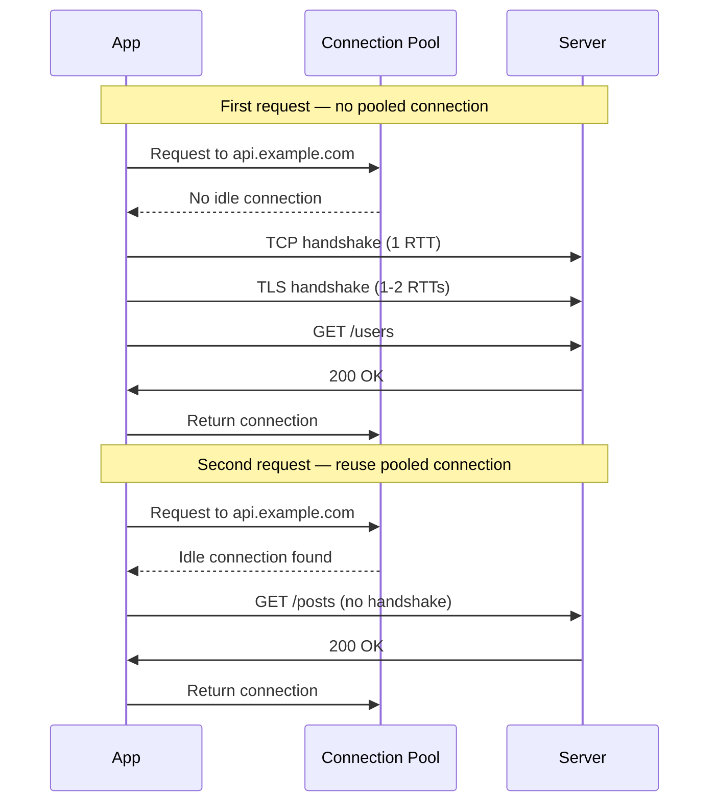
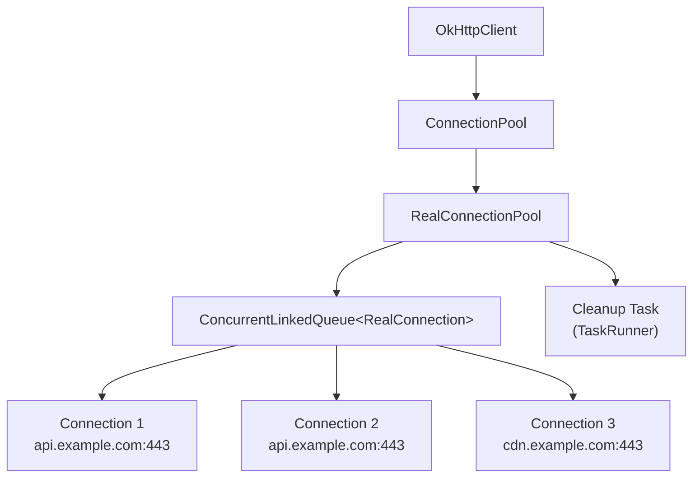
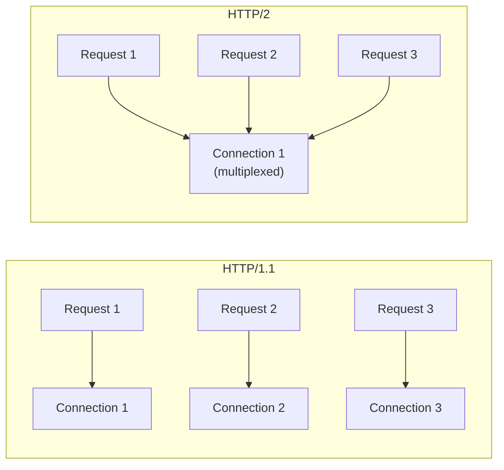
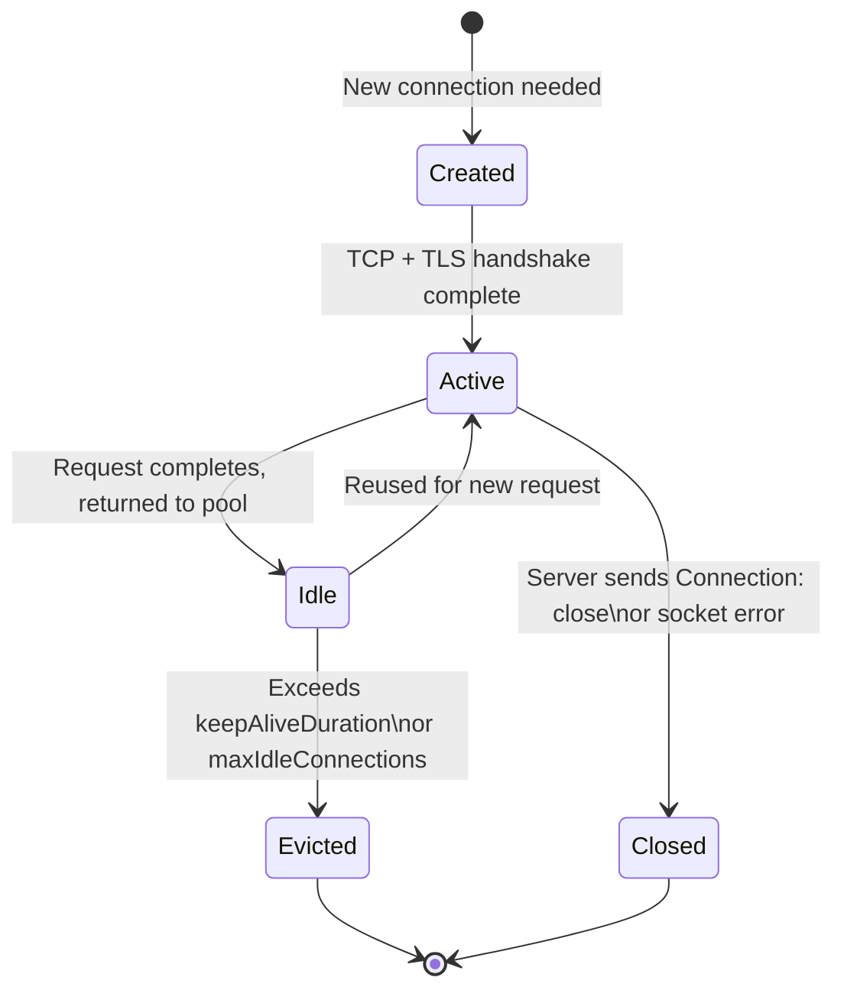
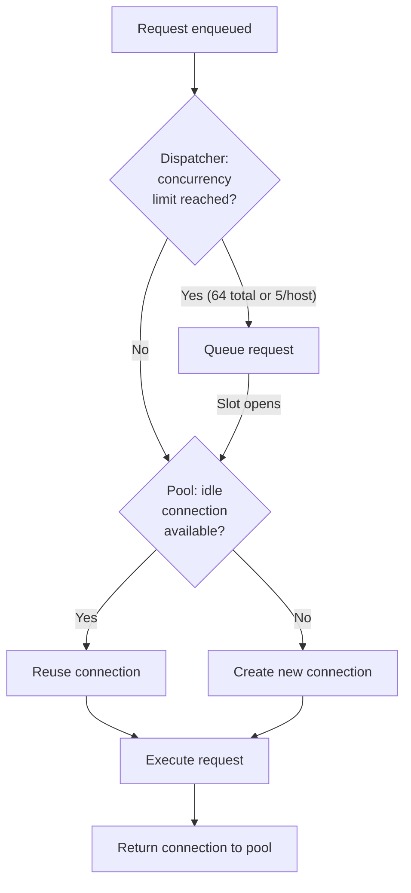

# Connection Pooling

---

## Why Connection Pooling Matters

Every HTTP request over a new connection pays the cost of a **TCP handshake** (1 RTT) and, for HTTPS, a **TLS handshake** (1-2 additional RTTs). On mobile networks with 50-200ms latency, this adds 150-600ms per request before a single byte of application data is transferred.

Connection pooling **reuses existing TCP+TLS connections** across requests to the same host, eliminating repeated handshake overhead.



### Cost Breakdown per New Connection

| Step | RTTs | Latency (100ms RTT) |
|------|:----:|:--------------------:|
| TCP handshake | 1 | 100ms |
| TLS 1.2 handshake | 2 | 200ms |
| TLS 1.3 handshake | 1 | 100ms |
| HTTP request/response | 1 | 100ms |
| **Total (TLS 1.2)** | **4** | **400ms** |
| **Total (TLS 1.3)** | **3** | **300ms** |
| **With pooling** | **1** | **100ms** |

---

## OkHttp's ConnectionPool Internals

OkHttp manages connection pooling through `ConnectionPool` and the internal `RealConnectionPool`. Every `OkHttpClient` holds a reference to a pool, and all requests made through that client share it.

### Architecture



### Default Configuration

```kotlin
// OkHttp defaults
ConnectionPool(
    maxIdleConnections = 5,
    keepAliveDuration = 5,
    timeUnit = TimeUnit.MINUTES
)
```

| Parameter | Default | Purpose |
|-----------|---------|---------|
| `maxIdleConnections` | 5 | Max connections sitting idle in the pool |
| `keepAliveDuration` | 5 min | How long an idle connection stays before eviction |

!!! note "No Max Active Limit"
    `maxIdleConnections` only limits **idle** connections. There is no cap on active (in-use) connections in the pool itself. The `Dispatcher` controls concurrency: 64 max concurrent requests, 5 per host by default.

---

## Connection Matching and Reuse

When OkHttp needs a connection for a request, it searches the pool for a reusable one. The matching criteria depend on the HTTP version.

### HTTP/1.1 Matching

A pooled connection is eligible if:

1. **Same host and port** — `api.example.com:443` matches `api.example.com:443`
2. **Not currently in use** — HTTP/1.1 allows only one request at a time per connection
3. **Same TLS configuration** — cipher suite, TLS version, and certificate pins must match
4. **Not marked `noNewExchanges`** — connection hasn't received a `Connection: close` header

### HTTP/2 Multiplexing

HTTP/2 allows **multiple concurrent streams** over a single TCP connection, so the matching rules are relaxed:

1. **Same host and port** — same as HTTP/1.1
2. **Can be in use** — multiple requests share one connection
3. **Stream limit not reached** — server sets `MAX_CONCURRENT_STREAMS` (commonly 100-250)
4. **Same TLS certificate** — the certificate must cover the target hostname



| Aspect | HTTP/1.1 | HTTP/2 |
|--------|----------|--------|
| Requests per connection | 1 at a time | Many concurrent streams |
| Connections needed for 10 parallel requests | 10 | 1 |
| Head-of-line blocking | Yes (per connection) | No (streams are independent) |
| Pool pressure | High | Low |

!!! tip "HTTP/2 on Android"
    OkHttp negotiates HTTP/2 automatically via ALPN during the TLS handshake. If the server supports HTTP/2, OkHttp uses it — no configuration needed.

---

## Connection Lifecycle



### Connection States

| State | Description |
|-------|-------------|
| **Active** | Currently handling a request (or HTTP/2 streams) |
| **Idle** | In the pool, waiting for reuse |
| **Evicted** | Removed by the cleanup task — idle too long or pool is full |
| **Closed** | Socket closed due to error, server directive, or eviction |

---

## Cleanup and Eviction

OkHttp runs a background cleanup task that periodically scans the pool and removes stale connections.

### Cleanup Algorithm

```kotlin
// Simplified version of RealConnectionPool.cleanup()
fun cleanup(now: Long): Long {
    var idleCount = 0
    var longestIdleConnection: RealConnection? = null
    var longestIdleDuration = Long.MIN_VALUE

    for (connection in connections) {
        if (connection.inUse()) continue // skip active connections
        idleCount++
        val idleDuration = now - connection.idleAtNs
        if (idleDuration > longestIdleDuration) {
            longestIdleDuration = idleDuration
            longestIdleConnection = connection
        }
    }

    return when {
        // Idle too long — evict immediately
        longestIdleDuration >= keepAliveDurationNs -> {
            longestIdleConnection!!.close()
            0 // run cleanup again immediately
        }
        // Too many idle connections — evict the oldest
        idleCount > maxIdleConnections -> {
            longestIdleConnection!!.close()
            0
        }
        // Connections exist but none need eviction yet
        idleCount > 0 -> keepAliveDurationNs - longestIdleDuration
        // Pool is empty — no cleanup needed
        else -> -1
    }
}
```

**Key behaviors:**

- Evicts the **longest-idle** connection first (LRU-like)
- Runs again immediately after evicting (may need to evict more)
- Schedules the next run based on when the next connection will expire
- Stops running when the pool is empty; restarts when a connection is added

---

## Configuration and Tuning

### Custom Pool Settings

```kotlin
val client = OkHttpClient.Builder()
    .connectionPool(ConnectionPool(
        maxIdleConnections = 10,
        keepAliveDuration = 2,
        timeUnit = TimeUnit.MINUTES
    ))
    .build()
```

### Tuning Guidelines

| Scenario | maxIdleConnections | keepAliveDuration | Why |
|----------|:------------------:|:-----------------:|-----|
| Single API host | 5 (default) | 5 min | Few connections needed, keep them warm |
| Multiple API hosts | 10-15 | 5 min | More hosts = more connections to pool |
| Burst-heavy (feed loading) | 10-15 | 2 min | Higher concurrency, shorter idle |
| Battery-sensitive background sync | 2-3 | 1 min | Minimize idle socket overhead |
| HTTP/2 only | 1-3 | 5 min | Multiplexing needs fewer connections |

### Sharing the OkHttpClient

```kotlin
// CORRECT — single client, shared pool
@Module
@InstallIn(SingletonComponent::class)
object NetworkModule {
    @Provides
    @Singleton
    fun provideOkHttpClient(): OkHttpClient {
        return OkHttpClient.Builder()
            .connectionPool(ConnectionPool(10, 5, TimeUnit.MINUTES))
            .build()
    }
}
```

!!! warning "Never Create Multiple OkHttpClients"
    Each `OkHttpClient` instance has its own `ConnectionPool`, `Dispatcher`, and thread pools. Creating multiple clients fragments the pool, wastes memory, and prevents connection reuse across the app. Always use a singleton, and use `.newBuilder()` for per-request customization:

    ```kotlin
    // Shares the pool and dispatcher, overrides only the timeout
    val longTimeoutClient = sharedClient.newBuilder()
        .readTimeout(60, TimeUnit.SECONDS)
        .build()
    ```

---

## Connection Pool and Dispatcher Interaction

The `Dispatcher` and `ConnectionPool` work together to manage request concurrency and connection reuse.



| Component | Controls | Default |
|-----------|----------|---------|
| **Dispatcher** | Max concurrent requests | 64 total, 5 per host |
| **ConnectionPool** | Idle connection storage and reuse | 5 idle, 5 min keep-alive |

---

## Monitoring and Debugging

### EventListener

OkHttp's `EventListener` reports connection pool activity in real time.

```kotlin
class ConnectionPoolLogger : EventListener() {
    override fun connectionAcquired(call: Call, connection: Connection) {
        Log.d("Pool", "Reused connection: ${connection.route().address.url}")
    }

    override fun connectStart(call: Call, inetSocketAddress: InetSocketAddress, proxy: Proxy) {
        Log.d("Pool", "New connection to: $inetSocketAddress")
    }

    override fun connectionReleased(call: Call, connection: Connection) {
        Log.d("Pool", "Released: ${connection.route().address.url}")
    }
}

val client = OkHttpClient.Builder()
    .eventListenerFactory { ConnectionPoolLogger() }
    .build()
```

### Pool Metrics

```kotlin
val pool = client.connectionPool()
Log.d("Pool", "Idle: ${pool.idleConnectionCount()}")
Log.d("Pool", "Total: ${pool.connectionCount()}")
```

!!! tip "Diagnosing Pool Misses"
    If `connectStart` fires frequently for the same host, connections are not being reused. Common causes:

    - Multiple `OkHttpClient` instances (separate pools)
    - Server sending `Connection: close` headers
    - `keepAliveDuration` too short
    - Requests to many different hostnames (CDN subdomains)

---

## Connection Pooling in Retrofit and Ktor

=== "Retrofit"

    Retrofit delegates entirely to its underlying `OkHttpClient`. Configure the pool on the OkHttp client:

    ```kotlin
    val okHttpClient = OkHttpClient.Builder()
        .connectionPool(ConnectionPool(10, 5, TimeUnit.MINUTES))
        .build()

    val retrofit = Retrofit.Builder()
        .baseUrl("https://api.example.com/")
        .client(okHttpClient)
        .addConverterFactory(MoshiConverterFactory.create())
        .build()
    ```

=== "Ktor"

    Ktor manages pools per engine. With the OkHttp engine, it uses OkHttp's pool. With CIO, configure directly:

    ```kotlin
    val client = HttpClient(CIO) {
        engine {
            endpoint {
                maxConnectionsPerRoute = 10
                keepAliveTime = 5000       // ms
                connectTimeout = 10_000
                pipelineMaxSize = 20
            }
        }
    }
    ```

---

## HTTP/2 Connection Coalescing

HTTP/2 can reuse a **single connection** for requests to different hostnames if the TLS certificate covers both and they resolve to the same IP.

```
api.example.com   ──┐
                    ├── Same IP, same cert → single connection
cdn.example.com   ──┘
```

| Condition | Required? |
|-----------|:---------:|
| Same IP address | Yes |
| Same TLS certificate (SAN covers both hosts) | Yes |
| Same port | Yes |
| HTTP/2 negotiated | Yes |

This reduces the number of connections needed when your API and CDN share infrastructure.

---

??? question "Interview Questions"

    **Q: Why does connection pooling improve mobile app performance?**

    Each new HTTPS connection requires a TCP handshake (1 RTT) and TLS handshake (1-2 RTTs). On mobile with 100ms latency, that's 200-300ms overhead per request. Pooling reuses connections, reducing subsequent requests to a single RTT for the HTTP exchange.

    **Q: What's the difference between `maxIdleConnections` and max concurrent requests?**

    `maxIdleConnections` (ConnectionPool) limits how many connections can sit idle waiting for reuse. Max concurrent requests (Dispatcher) limits how many requests run simultaneously — default 64 total, 5 per host. They control different things: pool size vs. concurrency.

    **Q: How does HTTP/2 multiplexing affect connection pooling?**

    HTTP/2 allows multiple concurrent streams over a single connection. This dramatically reduces pool pressure — instead of needing N connections for N parallel requests (HTTP/1.1), a single connection handles all of them. The pool typically holds 1-2 connections per host instead of 5+.

    **Q: What happens when a pooled connection goes stale?**

    OkHttp's cleanup task runs in the background, evicting connections that have been idle longer than `keepAliveDuration` (default 5 min) or when idle count exceeds `maxIdleConnections`. If a stale connection is used and fails, OkHttp's `RetryAndFollowUpInterceptor` retries with a new connection transparently.

    **Q: Why should OkHttpClient be a singleton?**

    Each OkHttpClient has its own ConnectionPool, Dispatcher, and thread pools. Multiple instances fragment connection reuse — two clients talking to the same host maintain separate connections instead of sharing. Use a singleton and `.newBuilder()` for per-request overrides.

    **Q: How does connection coalescing work in HTTP/2?**

    If two different hostnames resolve to the same IP and the server's TLS certificate covers both (via Subject Alternative Name), HTTP/2 reuses a single connection for both. This avoids extra handshakes when your API and CDN share infrastructure.

---

!!! tip "Further Reading"
    - [OkHttp Connection Pool source](https://github.com/square/okhttp/blob/master/okhttp/src/main/kotlin/okhttp3/ConnectionPool.kt)
    - [HTTP/2 Connection Coalescing (RFC 9113)](https://www.rfc-editor.org/rfc/rfc9113#section-9.1.1)
    - [OkHttp EventListener docs](https://square.github.io/okhttp/features/events/)
