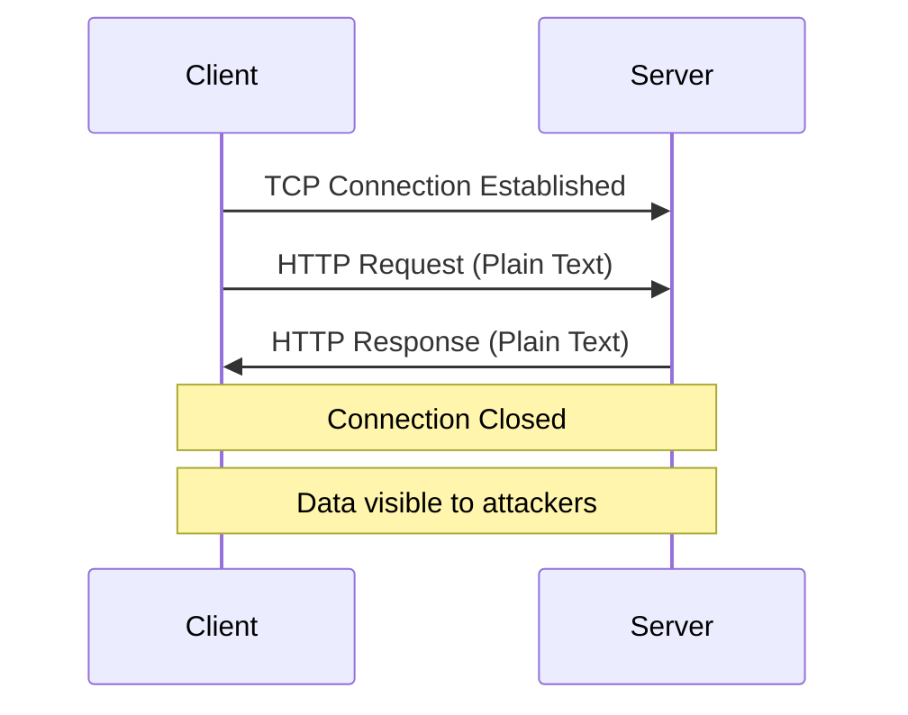
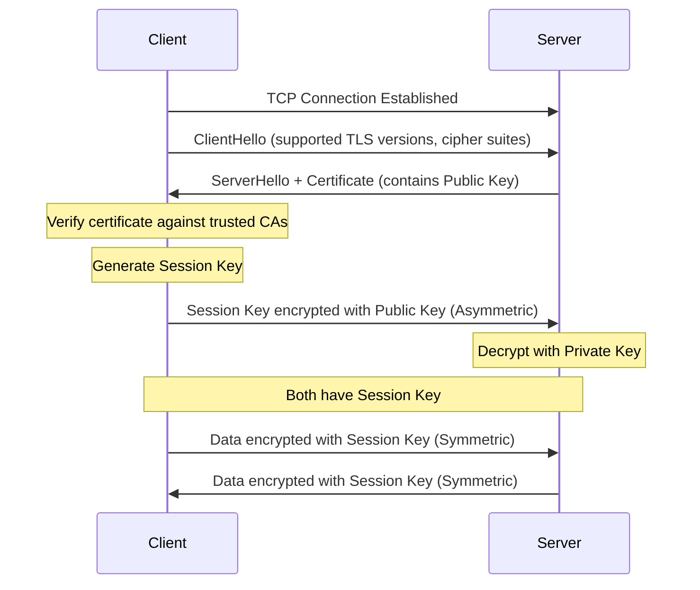
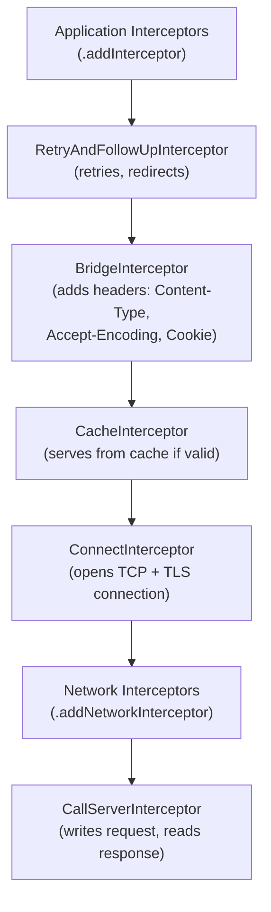

# Networking

---

## HTTP Flow



## HTTPS / TLS Handshake Flow



---

## Basics

| Term | Description |
|------|-------------|
| **URL** | Web address. DNS resolves the hostname to an IP address. |
| **HTTP** | Stateless request-response protocol. Methods: `GET`, `POST`, `PUT`, `DELETE`, `PATCH`, `HEAD`. |
| **TLS/SSL** | Encryption protocol for secure communication. TLS is the modern successor to SSL. |
| **TCP** | Reliable, connection-oriented, ordered delivery. Used by HTTP/HTTPS. |
| **UDP** | Connectionless, no delivery guarantee. Used by DNS, video streaming, gaming. |
| **Socket** | Software endpoint for bidirectional communication. A TCP connection = pair of sockets. |
| **Multipart Request** | HTTP request with multiple content-types in the body (e.g., form fields + file upload). |

---

## HttpURLConnection

Part of the Android SDK. Handles HTTP operations including caching, redirects, and authentication.

!!! note "OkHttp Under the Hood"
    Since Android 4.4, `HttpURLConnection` uses OkHttp internally. There is no reason to use `HttpURLConnection` directly in modern code.

```kotlin
val url = URL("https://api.example.com/data")
val connection = url.openConnection() as HttpURLConnection
try {
    connection.requestMethod = "GET"
    connection.connectTimeout = 15_000
    connection.readTimeout = 15_000

    if (connection.responseCode == HttpURLConnection.HTTP_OK) {
        val response = connection.inputStream.bufferedReader().readText()
    }
} finally {
    connection.disconnect()
}
```

---

## Server Communication Patterns

=== "HTTP Request"

    Standard request-response. Client initiates, server responds, connection closes.

=== "HTTP Polling"

    Client sends requests at regular intervals to check for updates. Simple but wasteful — most responses are empty.

=== "HTTP Long Polling"

    Client sends a request and the server **holds it open** until data is available or a timeout occurs. Reduces empty responses but still creates new connections repeatedly.

=== "WebSocket"

    Persistent, **bidirectional** communication over a single TCP connection. Only one handshake. Both client and server can push data at any time. Used for chat, live updates, real-time collaboration.

=== "SSE (Server-Sent Events)"

    **Unidirectional** persistent connection — server pushes events to the client over a standard HTTP connection. Simpler than WebSocket when you only need server-to-client updates (stock prices, notifications).

---

## OkHttp

### Synchronous Request

```kotlin
val client = OkHttpClient()

val request = Request.Builder()
    .url("https://api.example.com/data")
    .build()

// Blocks the calling thread
val response = client.newCall(request).execute()
val body = response.body?.string()
```

### Asynchronous Request

```kotlin
val client = OkHttpClient()

val request = Request.Builder()
    .url("https://api.example.com/data")
    .build()

// Callback on OkHttp's background thread pool
client.newCall(request).enqueue(object : Callback {
    override fun onFailure(call: Call, e: IOException) {
        // handle failure
    }
    override fun onResponse(call: Call, response: Response) {
        val body = response.body?.string()
    }
})
```

!!! note "Default Dispatcher"
    OkHttp uses a `ThreadPoolExecutor` as its default dispatcher (max 64 concurrent requests, 5 per host). Customize via `OkHttpClient.Builder().dispatcher(...)`.

---

## OkHttp Interceptors

Interceptors are a powerful mechanism to observe, modify, and short-circuit requests and responses. They form a **chain** where each interceptor processes the request and passes it to the next.

### Interceptor Chain (Internal)



### Application vs Network Interceptor

| | Application Interceptor | Network Interceptor |
|---|---|---|
| Added via | `.addInterceptor()` | `.addNetworkInterceptor()` |
| Called | Once per call | Once per network request (not called on cached responses) |
| Sees | Original request | Request after redirects, with OkHttp-added headers |
| Use case | Logging, auth tokens, analytics | Low-level network inspection, response modification |

### Caching Interceptor

```kotlin
val cacheSize = 10L * 1024 * 1024 // 10 MB
val cache = Cache(context.cacheDir, cacheSize)

val client = OkHttpClient.Builder()
    .cache(cache)
    .build()

// Force cache for offline mode
val request = Request.Builder()
    .url("https://api.example.com/data")
    .cacheControl(CacheControl.FORCE_CACHE)
    .build()
```

### Auth Token Interceptor

```kotlin
class AuthTokenInterceptor(
    private val tokenProvider: () -> String
) : Interceptor {
    override fun intercept(chain: Interceptor.Chain): Response {
        val request = chain.request().newBuilder()
            .addHeader("Authorization", "Bearer ${tokenProvider()}")
            .build()
        return chain.proceed(request)
    }
}

val client = OkHttpClient.Builder()
    .addInterceptor(AuthTokenInterceptor { getAccessToken() })
    .build()
```

### Authenticator (Token Refresh)

OkHttp's built-in mechanism for handling **401 Unauthorized** responses. Better than doing token refresh in an interceptor because OkHttp manages the retry loop (up to 20 retries by default) and avoids infinite loops.

```kotlin
class TokenAuthenticator(
    private val tokenManager: TokenManager
) : Authenticator {

    override fun authenticate(route: Route?, response: Response): Request? {
        // Avoid infinite retry if refresh also returns 401
        if (response.request.header("Authorization") != null
            && response.priorResponse != null) {
            return null // give up — already retried
        }

        val newToken = synchronized(this) {
            // Refresh the token (thread-safe)
            tokenManager.refreshToken()
        }

        return if (newToken != null) {
            response.request.newBuilder()
                .header("Authorization", "Bearer $newToken")
                .build()
        } else {
            null // give up — refresh failed
        }
    }
}

val client = OkHttpClient.Builder()
    .authenticator(TokenAuthenticator(tokenManager))
    .addInterceptor(AuthTokenInterceptor { tokenManager.accessToken })
    .build()
```

!!! tip "Interceptor vs Authenticator"
    - **Interceptor** — adds the token to every request proactively
    - **Authenticator** — only called when a 401 is received; refreshes the token and retries the request
    - Use both together: interceptor attaches the current token, authenticator handles expiration.

---

## Retrofit

Type-safe HTTP client built on OkHttp. Turns an interface into HTTP calls with annotations.

### Service Interface

```kotlin
interface ApiService {
    @GET("users/{id}")
    suspend fun getUser(@Path("id") userId: String): User

    @GET("users")
    suspend fun searchUsers(
        @Query("name") name: String,
        @Query("page") page: Int
    ): List<User>

    @POST("users")
    suspend fun createUser(@Body user: CreateUserRequest): User

    @PUT("users/{id}")
    suspend fun updateUser(
        @Path("id") userId: String,
        @Body user: UpdateUserRequest,
        @Header("If-Match") etag: String
    ): User

    @Multipart
    @POST("users/{id}/avatar")
    suspend fun uploadAvatar(
        @Path("id") userId: String,
        @Part image: MultipartBody.Part
    ): AvatarResponse

    @DELETE("users/{id}")
    suspend fun deleteUser(@Path("id") userId: String): Response<Unit>
}
```

### Common Annotations

| Annotation | Purpose |
|---|---|
| `@GET`, `@POST`, `@PUT`, `@DELETE`, `@PATCH` | HTTP method + relative URL |
| `@Path("param")` | Replaces `{param}` in the URL |
| `@Query("key")` | Appends `?key=value` to the URL |
| `@QueryMap` | Appends a `Map<String, String>` as query parameters |
| `@Body` | Serializes the object as the request body (JSON, protobuf, etc.) |
| `@Header("name")` | Adds a single header to the request |
| `@HeaderMap` | Adds multiple headers from a map |
| `@Multipart` + `@Part` | Multipart form data (file uploads) |
| `@FormUrlEncoded` + `@Field` | URL-encoded form data |

### Setup

```kotlin
val retrofit = Retrofit.Builder()
    .baseUrl("https://api.example.com/")
    .client(okHttpClient)
    .addConverterFactory(MoshiConverterFactory.create(moshi))
    .build()

val service = retrofit.create(ApiService::class.java)
```

!!! tip "Return Types"
    - `suspend fun getUser(): User` — returns the deserialized body directly (throws on error)
    - `suspend fun getUser(): Response<User>` — returns the full Response wrapper (access code, headers, error body)
    - `fun getUser(): Call<User>` — non-coroutine, use `.enqueue()` or `.execute()`

---

## Connection Pooling

OkHttp maintains a connection pool to reuse existing TCP+TLS connections, avoiding the overhead of repeated handshakes.

**Default pool settings:** 5 idle connections, 5-minute keep-alive.

```kotlin
val client = OkHttpClient.Builder()
    .connectionPool(ConnectionPool(
        maxIdleConnections = 10,
        keepAliveDuration = 5,
        timeUnit = TimeUnit.MINUTES
    ))
    .build()
```

**Best practices:**

- **Same base URL:** Use a **single** `OkHttpClient` instance — all requests share the connection pool
- **Different base URLs:** Still share one `OkHttpClient` unless you need separate pool configurations
- **Singleton pattern:** Create `OkHttpClient` once in your DI module; creating multiple clients wastes memory and connections

---

## File Download

```kotlin
val request = Request.Builder()
    .url("https://example.com/file.zip")
    .addHeader("Range", "bytes=0-1023") // partial download (first 1KB)
    .build()

val response = client.newCall(request).execute()
val contentLength = response.body?.contentLength() ?: -1L
var totalBytesRead = 0L

response.body?.byteStream()?.use { input ->
    FileOutputStream(outputFile).use { output ->
        val buffer = ByteArray(8192) // 8KB buffer
        var bytesRead: Int
        while (input.read(buffer).also { bytesRead = it } != -1) {
            output.write(buffer, 0, bytesRead)
            totalBytesRead += bytesRead
            val progress = if (contentLength > 0) totalBytesRead * 100 / contentLength else -1
            onProgress(progress)
        }
    }
}
```

- **Range Header** — request specific byte ranges for resumable downloads
- **Content-Length** — used to calculate download progress
- Configure **connectTimeout**, **readTimeout**, and **writeTimeout** appropriately

---

## gRPC

Binary protocol using **Protocol Buffers** for serialization. More efficient than REST for mobile apps.

### Key Characteristics

| Feature | REST/JSON | gRPC/Protobuf |
|---|---|---|
| Format | Text (JSON) | Binary (protobuf) |
| Schema | Optional (OpenAPI) | Required (.proto files) |
| Streaming | Limited (SSE, WebSocket) | Built-in bidirectional streaming |
| Code generation | Optional | Required (generates client/server stubs) |
| Payload size | Larger | 3-10x smaller |
| HTTP version | HTTP/1.1 or HTTP/2 | HTTP/2 required |

### Proto Definition

```protobuf
syntax = "proto3";

service UserService {
    rpc GetUser (GetUserRequest) returns (User);
    rpc ListUsers (ListUsersRequest) returns (stream User); // server streaming
}

message GetUserRequest {
    string id = 1;
}

message User {
    string id = 1;
    string name = 2;
    string email = 3;
}
```

### Android Usage

```kotlin
// Generated stub from .proto file
val channel = ManagedChannelBuilder
    .forAddress("api.example.com", 443)
    .useTransportSecurity()
    .build()

val stub = UserServiceGrpcKt.UserServiceCoroutineStub(channel)

// Unary call
val user = stub.getUser(GetUserRequest.newBuilder().setId("123").build())

// Server streaming
stub.listUsers(request).collect { user ->
    println(user.name)
}
```

!!! tip "When to Use gRPC"
    - High-frequency calls between services (microservices)
    - Bandwidth-constrained mobile apps
    - When you need bidirectional streaming
    - Large apps like Google, Netflix, and Square use gRPC for mobile APIs

---

## GraphQL

Single endpoint, client specifies exactly which fields it needs. Reduces over-fetching and under-fetching.

```graphql
# Client requests only the fields it needs
query {
    user(id: "123") {
        name
        email
        posts(limit: 5) {
            title
            createdAt
        }
    }
}
```

| Aspect | REST | GraphQL |
|---|---|---|
| Endpoints | Multiple (`/users`, `/posts`) | Single (`/graphql`) |
| Over-fetching | Common (server decides response shape) | None (client specifies fields) |
| Versioning | URL-based (`/v1/`, `/v2/`) | Schema evolution (deprecate fields) |
| Caching | HTTP caching (easy) | More complex (needs client-side cache like Apollo) |

**Android libraries:** Apollo GraphQL (Kotlin-first, coroutine support, normalized caching).

---

## OAuth 2.0

!!! warning "Pre-OAuth"
    Credentials sent in every request — insecure and inefficient.

**OAuth 2.0** uses token-based authorization:

- **Authentication** = send credentials, receive tokens
- **Authorization** = send access token with API requests
- **Access Token** = short-lived (minutes to hours), used for API authorization
- **Refresh Token** = long-lived (days to months), used to obtain new access tokens silently

### JWT (JSON Web Token)

Three Base64-encoded parts separated by dots: `header.payload.signature`

| Part | Content |
|---|---|
| **Header** | Algorithm (`HS256`, `RS256`) and token type |
| **Payload** | Claims — user ID, roles, expiry (`exp`), issued at (`iat`) |
| **Signature** | `HMAC(header + payload, secret)` — verifies integrity |

!!! warning "JWTs are NOT encrypted"
    The payload is Base64-encoded, not encrypted. Anyone can decode it. Never put sensitive data (passwords, credit cards) in a JWT. The signature only proves the token has not been tampered with.

---

## HTTP Status Codes

| Range | Category | Common Codes |
|---|---|---|
| **1xx** | Informational | 100 Continue |
| **2xx** | Success | 200 OK, 201 Created, 204 No Content, 206 Partial Content |
| **3xx** | Redirection | 301 Moved Permanently, 302 Found, 304 Not Modified |
| **4xx** | Client Error | 400 Bad Request, 401 Unauthorized, 403 Forbidden, 404 Not Found, 409 Conflict, 429 Too Many Requests |
| **5xx** | Server Error | 500 Internal Server Error, 502 Bad Gateway, 503 Service Unavailable, 504 Gateway Timeout |

---

## HTTPS and SSL Pinning

- **HTTP** — no encryption, data visible to anyone on the network
- **Asymmetric encryption** — public + private key pair, secure but slow (used for key exchange only)
- **Symmetric encryption** — single shared session key, fast (used for actual data transfer)

!!! tip "TLS Handshake Summary"
    1. Server sends certificate containing its **public key**
    2. Client verifies certificate against trusted CA store
    3. Client generates a **session key**, encrypts it with the server's public key (asymmetric)
    4. Server decrypts with its **private key**
    5. Both sides now share the session key
    6. All subsequent data uses **symmetric encryption** with the session key

### SSL Pinning

The client **pins** the server's certificate or public key hash. Rejects any certificate not matching the pin — prevents man-in-the-middle attacks even with a compromised CA.

```kotlin
val client = OkHttpClient.Builder()
    .certificatePinner(
        CertificatePinner.Builder()
            .add("api.example.com", "sha256/AAAA...=")
            .add("api.example.com", "sha256/BBBB...=") // backup pin
            .build()
    )
    .build()
```

!!! warning "Pin Rotation"
    Always pin **at least two keys** (current + backup). If you only pin one and the certificate rotates, every deployed app will fail to connect until users update. This has caused production outages at major companies.

### Network Security Config

Declarative XML configuration for network security policies. Placed in `res/xml/network_security_config.xml` and referenced in the manifest.

```xml
<!-- res/xml/network_security_config.xml -->
<network-security-config>

    <!-- Block cleartext (HTTP) traffic globally -->
    <base-config cleartextTrafficPermitted="false" />

    <!-- Allow cleartext for local development -->
    <domain-config cleartextTrafficPermitted="true">
        <domain includeSubdomains="true">10.0.2.2</domain>
        <domain includeSubdomains="true">localhost</domain>
    </domain-config>

    <!-- Certificate pinning (declarative alternative to OkHttp pinning) -->
    <domain-config>
        <domain includeSubdomains="true">api.example.com</domain>
        <pin-set expiration="2025-12-31">
            <pin digest="SHA-256">AAAA...=</pin>
            <pin digest="SHA-256">BBBB...=</pin>
        </pin-set>
    </domain-config>

    <!-- Trust custom CA (e.g., for staging environment) -->
    <domain-config>
        <domain includeSubdomains="true">staging.example.com</domain>
        <trust-anchors>
            <certificates src="@raw/staging_ca" />
            <certificates src="system" />
        </trust-anchors>
    </domain-config>

</network-security-config>
```

```xml
<!-- AndroidManifest.xml -->
<application
    android:networkSecurityConfig="@xml/network_security_config"
    ... >
```

!!! tip "When to Use Network Security Config vs OkHttp Pinning"
    - **Network Security Config** — applies to all HTTP traffic (WebView, third-party libraries), declarative, has built-in expiration. Preferred for most cases.
    - **OkHttp CertificatePinner** — only applies to OkHttp requests, programmatic, more flexible. Use when you need dynamic pins or per-request logic.

---

## Network Resilience Patterns

| Pattern | When | How |
|---------|------|-----|
| **Retry with backoff** | Transient failures (5xx, timeouts) | Exponential backoff: 1s -> 2s -> 4s -> cap |
| **Circuit breaker** | Repeated failures to same endpoint | Stop calling after N failures, retry after cooldown |
| **Timeout budget** | Chained API calls | Total timeout across all retries, not per-request |
| **Offline-first** | Poor connectivity | Serve cached data, sync when online |

```kotlin
// Exponential backoff with jitter
suspend fun <T> retryWithBackoff(
    times: Int = 3,
    initialDelay: Long = 1000,
    factor: Double = 2.0,
    block: suspend () -> T
): T {
    var currentDelay = initialDelay
    repeat(times - 1) {
        try { return block() } catch (e: IOException) {
            delay(currentDelay + Random.nextLong(0, currentDelay / 2))
            currentDelay = (currentDelay * factor).toLong()
        }
    }
    return block() // last attempt — let it throw
}
```

---

## Ktor (KMP-Compatible HTTP Client)

Kotlin-first HTTP client with multiplatform support. Alternative to OkHttp + Retrofit for KMP projects.

```kotlin
// Shared module (commonMain)
val client = HttpClient {
    install(ContentNegotiation) {
        json(Json {
            ignoreUnknownKeys = true
            isLenient = true
        })
    }
    install(Logging) {
        level = LogLevel.BODY
    }
    install(HttpTimeout) {
        requestTimeoutMillis = 15_000
        connectTimeoutMillis = 10_000
    }
}

// Making requests
suspend fun getUser(id: String): User {
    return client.get("https://api.example.com/users/$id").body()
}

suspend fun createUser(user: CreateUserRequest): User {
    return client.post("https://api.example.com/users") {
        contentType(ContentType.Application.Json)
        setBody(user)
    }.body()
}
```

| Aspect | OkHttp + Retrofit | Ktor |
|---|---|---|
| Platform | Android/JVM only | Multiplatform (Android, iOS, Desktop, JS) |
| Engine | Single (OkHttp) | Pluggable (OkHttp, CIO, Darwin, etc.) |
| API style | Interface + annotations | DSL (builder-style) |
| Kotlin support | Good (suspend functions) | Native (built in Kotlin) |
| Ecosystem | Massive (most Android apps) | Growing (preferred for KMP) |

!!! tip "Choosing Between Them"
    - **Android-only project** — OkHttp + Retrofit. Battle-tested, massive ecosystem, best tooling.
    - **KMP project** — Ktor. Shared networking code across Android, iOS, Desktop. Use the OkHttp engine on Android and Darwin engine on iOS.

---

## Interview Q&A

??? question "What is the difference between HTTP and HTTPS?"
    HTTP sends data in plain text, making it vulnerable to eavesdropping. HTTPS wraps HTTP in a TLS layer — the client and server perform a TLS handshake to establish a shared session key, and all subsequent data is symmetrically encrypted. The handshake uses asymmetric encryption (public/private key) only for the initial key exchange.

??? question "Explain the difference between Application and Network interceptors in OkHttp."
    Application interceptors (added via `.addInterceptor()`) are called once per logical request and see the original request before OkHttp adds headers or follows redirects. Network interceptors (added via `.addNetworkInterceptor()`) are called once per network request, see the final request with all OkHttp-added headers, and are skipped entirely when a response is served from cache.

??? question "How does SSL pinning work, and what are its risks?"
    SSL pinning hardcodes the expected server certificate or public key hash in the client. During the TLS handshake, the client rejects any certificate that does not match the pin, preventing man-in-the-middle attacks even if a CA is compromised. The main risk is certificate rotation — if only one key is pinned and the server certificate changes, all deployed apps break until users update.

??? question "When would you choose WebSocket over HTTP polling?"
    WebSocket is preferred when you need real-time, bidirectional communication (chat, live collaboration, gaming). It maintains a single persistent TCP connection with minimal overhead per message. HTTP polling wastes bandwidth with repeated empty responses and adds latency equal to the polling interval.

??? question "What is the difference between Retrofit and Ktor?"
    Retrofit is an Android/JVM-only type-safe HTTP client that uses interface annotations and is built on OkHttp. Ktor is a Kotlin-first HTTP client with multiplatform support (Android, iOS, Desktop, JS) that uses a DSL-based API with pluggable engines. Choose Retrofit for Android-only projects and Ktor for KMP projects.

??? question "How does OkHttp's Authenticator differ from an Interceptor for handling auth?"
    An interceptor proactively attaches the access token to every outgoing request. An Authenticator is only invoked when a 401 response is received — it refreshes the token and retries the request automatically. Using both together is the recommended pattern: the interceptor attaches the current token, and the authenticator handles expiration transparently.

---

!!! tip "Further Reading"
    - [Retrofit Official Documentation](https://square.github.io/retrofit/)
    - [OkHttp Official Documentation](https://square.github.io/okhttp/)
    - [Android Network Security Configuration](https://developer.android.com/privacy-and-security/security-config)
    - [Ktor Client Documentation](https://ktor.io/docs/client-create-new-application.html)
    - [gRPC on Android](https://grpc.io/docs/platforms/android/java/quickstart/)
