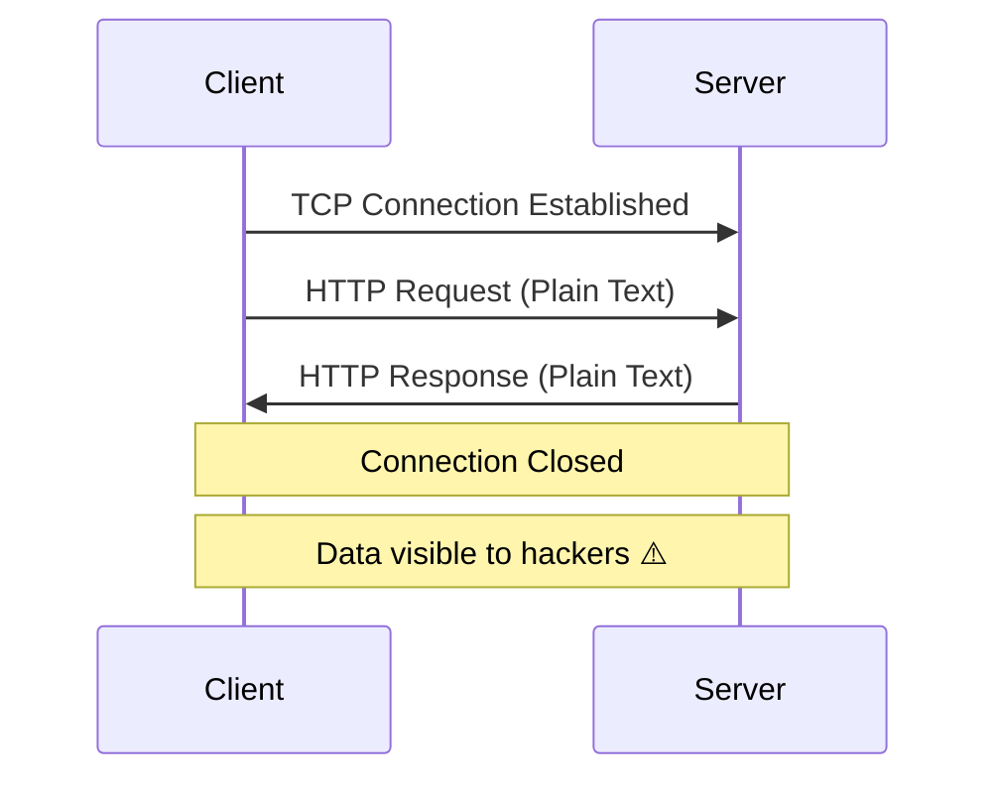
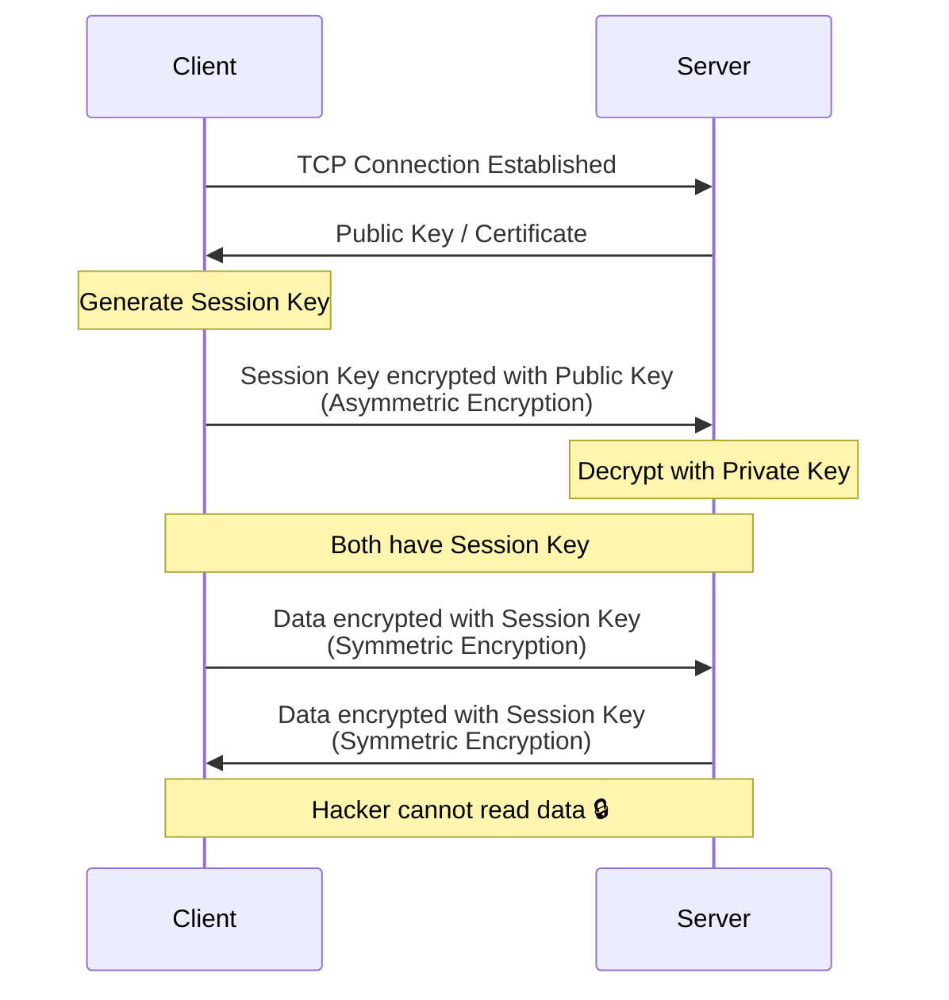

# Networking

---

## HTTP Flow



## HTTPS / SSL Handshake Flow



---

## Basics

- **URL**: Web address. DNS converts the URL hostname to an IP address.
- **HTTP**: Foundation of web communication. Methods: `GET`, `POST`, `PUT`, `DELETE`, `HEAD`, `PATCH`.
- **SSL**: Encryption protocol for secure communication.
- **Network Protocol**: Rules for formatting, sending, and receiving data.
- **TCP**: Reliable, connection-oriented, ordered delivery.
- **UDP**: Connectionless, lightweight, faster, no delivery guarantee.
- **Socket**: Software endpoint for bidirectional client-server communication.
- **InputStream**: Reads bytes from the server.
- **BufferedReader**: Reads text efficiently by buffering chunks.
- **SSL/TLS Handshake**: Creates an encrypted channel, includes certificate verification.
- **Multipart Request**: A POST request with more than one content-type in the body.

---

## HttpURLConnection

Part of the Android SDK. `HttpEngine` handles high-level HTTP logic (caching, redirects, auth).

!!! note "OkHttp Under the Hood"
    After Android 4.4, `HttpURLConnection` uses OkHttp internally.

```kotlin
val url = URL("https://api.example.com/data")
val connection = url.openConnection() as HttpURLConnection
try {
    connection.requestMethod = "GET"
    connection.connectTimeout = 15000
    connection.readTimeout = 15000

    val responseCode = connection.responseCode
    if (responseCode == HttpURLConnection.HTTP_OK) {
        val reader = BufferedReader(InputStreamReader(connection.inputStream))
        val response = reader.readText()
        reader.close()
    }
} finally {
    connection.disconnect()
}
```

---

## Server Communication Patterns

=== "HTTP Request"

    Standard request-response: handshake → connection → response → close.

=== "HTTP Polling"

    Client sends requests at regular intervals to check for updates.

=== "HTTP Long Polling"

    Client sends a request and waits — the connection stays open until the server has data or a timeout occurs.

=== "WebSocket"

    Persistent, bidirectional communication over a single TCP connection. Only requires one handshake.

=== "SSE (Server-Sent Events)"

    Unidirectional persistent connection — server pushes events to the client (e.g., stock price updates).

---

## OkHttp

### Synchronous Request

```kotlin
val client = OkHttpClient()

val request = Request.Builder()
    .url("https://api.example.com/data")
    .build()

// Synchronous - blocks the thread
val response = client.newCall(request).execute()
val body = response.body?.string()
```

### Asynchronous Request

```kotlin
val client = OkHttpClient()

val request = Request.Builder()
    .url("https://api.example.com/data")
    .build()

// Asynchronous - callback on background thread
client.newCall(request).enqueue(object : Callback {
    override fun onFailure(call: Call, e: IOException) {
        // handle failure
    }

    override fun onResponse(call: Call, response: Response) {
        val body = response.body?.string()
    }
})
```

!!! note "Default Dispatcher"
    OkHttp uses `ThreadPoolExecutor` as the default dispatcher. A custom dispatcher can be provided via `OkHttpClient.Builder().dispatcher(customDispatcher)`.

---

## OkHttp Interceptors

- **Application Interceptor**: Sits between the client code and OkHttp core library. Added via `.addInterceptor()`.
- **Network Interceptor**: Sits between OkHttp core library and the server. Added via `.addNetworkInterceptor()`.

### Caching Interceptor

```kotlin
val cacheSize = 10L * 1024 * 1024 // 10 MB
val cache = Cache(context.cacheDir, cacheSize)

val client = OkHttpClient.Builder()
    .cache(cache)
    .build()

// Force cache for offline mode
val request = Request.Builder()
    .url("https://api.example.com/data")
    .cacheControl(CacheControl.FORCE_CACHE)
    .build()
```

### Auth Token Interceptor

```kotlin
class AuthTokenInterceptor(
    private val tokenProvider: () -> String
) : Interceptor {
    override fun intercept(chain: Interceptor.Chain): Response {
        val request = chain.request().newBuilder()
            .addHeader("Authorization", "Bearer ${tokenProvider()}")
            .build()
        return chain.proceed(request)
    }
}

val client = OkHttpClient.Builder()
    .addInterceptor(AuthTokenInterceptor { getAccessToken() })
    .build()
```

### Gzip Compression Interceptor

```kotlin
class GzipInterceptor : Interceptor {
    override fun intercept(chain: Interceptor.Chain): Response {
        val request = chain.request().newBuilder()
            .addHeader("Accept-Encoding", "gzip")
            .build()
        return chain.proceed(request)
    }
}
```

---

## Retrofit

- Uses OkHttp under the hood.
- Supports coroutines (`suspend` functions in service interfaces).
- Less boilerplate than raw OkHttp.
- Parses JSON responses directly to data classes via converters (Gson, Moshi).

```kotlin
interface ApiService {
    @GET("users/{id}")
    suspend fun getUser(@Path("id") userId: String): User
}

val retrofit = Retrofit.Builder()
    .baseUrl("https://api.example.com/")
    .client(okHttpClient)
    .addConverterFactory(MoshiConverterFactory.create())
    .build()

val service = retrofit.create(ApiService::class.java)
```

---

## Connection Pooling

- Reuses existing connections, skipping the handshake for subsequent requests.
- For **many requests to the same base URL**: use the same `OkHttpClient` instance to take advantage of pooling.
- For **different base URLs with balanced load**: use different `OkHttpClient` instances.

---

## File Download

- Standard HTTP request with buffered reading (typically **4 KB** buffer size).
- Read in a loop until the stream is exhausted.
- **Range Header**: Request specific byte ranges for partial downloads or resuming.
- **Content-Length**: Used to calculate download progress.
- Configure **read timeout**, **write timeout**, and **connect timeout** appropriately.

```kotlin
val request = Request.Builder()
    .url("https://example.com/file.zip")
    .addHeader("Range", "bytes=0-1023") // first 1KB
    .build()

val response = client.newCall(request).execute()
val inputStream = response.body?.byteStream()
val buffer = ByteArray(4096) // 4KB buffer
var bytesRead: Int

FileOutputStream(outputFile).use { output ->
    while (inputStream?.read(buffer).also { bytesRead = it ?: -1 } != -1) {
        output.write(buffer, 0, bytesRead)
    }
}
```

---

## OAuth 2.0

!!! warning "Earlier Approach"
    Credentials were sent in every request — insecure and inefficient.

**OAuth 2.0** uses access tokens (JWT) instead:

- **Authentication** = Send credentials, receive tokens.
- **Authorization** = Send access token with requests.
- **Access Token**: Short-lived. Used for API authorization.
- **Refresh Token**: Long-lived. Used to generate new access tokens when the current one expires.

### JWT (JSON Web Token)

Three parts separated by dots:

| Part | Content |
|---|---|
| **Header** | Algorithm and token type |
| **Payload** | Claims (user data, expiry) |
| **Signature** | Verification hash |

---

## HTTP Status Codes

| Range | Category | Common Codes |
|---|---|---|
| **1xx** | Informational | 100 Continue |
| **2xx** | Success | 200 OK, 201 Created, 204 No Content, 206 Partial Content |
| **3xx** | Redirection | 301 Moved Permanently, 302 Found |
| **4xx** | Client Error | 400 Bad Request, 401 Unauthorized, 404 Not Found |
| **5xx** | Server Error | 500 Internal Server Error |

---

## HTTP vs HTTPS and SSL Pinning

- **HTTP**: No encryption. A hacker can intercept and read data in transit.
- **Asymmetric Encryption**: Uses a public + private key pair. Secure but slow due to high processing overhead.
- **Symmetric Encryption**: Uses a single session key. Not as secure but much faster.

!!! tip "HTTPS Handshake"
    1. Server sends certificate containing its **public key**
    2. Client generates a **session key**
    3. Client encrypts session key with the server's public key (asymmetric)
    4. Server decrypts with its **private key**
    5. Both now have the session key
    6. All subsequent data uses **symmetric encryption** with the session key

### SSL Pinning

The client **pins** the server's certificate (or public key hash). Any response with an unknown or mismatched certificate is rejected — prevents man-in-the-middle attacks even if a rogue CA issues a fraudulent certificate.
