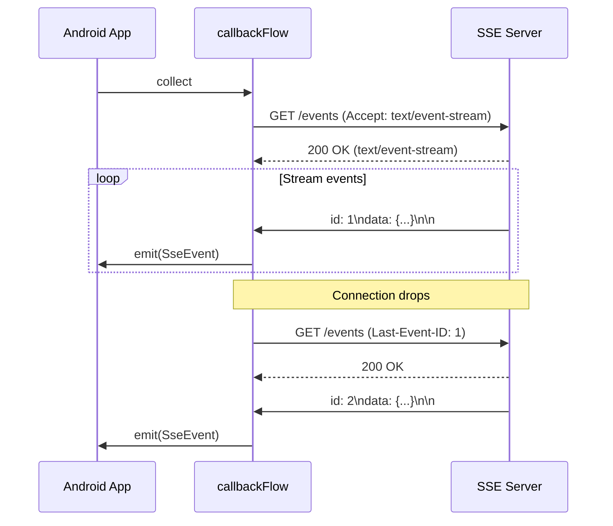

# SSE on Android with Kotlin Flow

---

## Why SSE on Mobile?

Server-Sent Events deliver **real-time server-to-client updates** over plain HTTP — live scores, chat messages, stock tickers, LLM token streaming. On Android, you don't get the browser's `EventSource` API, so you build your own on top of OkHttp and Kotlin Flow.

| Aspect | SSE | WebSocket | Polling |
|--------|-----|-----------|---------|
| **Direction** | Server → Client | Bidirectional | Client → Server |
| **Transport** | Standard HTTP | Upgraded TCP | Standard HTTP |
| **Reconnection** | Protocol-level (`Last-Event-ID`) | Manual | N/A |
| **Proxy friendliness** | Excellent | Often needs config | Excellent |
| **Battery impact** | One long-lived connection | One long-lived connection | Repeated wake-ups |

!!! tip "When to Prefer SSE"
    If you only need server-to-client push (notifications, feeds, AI streaming), SSE is simpler than WebSocket — no upgrade handshake, no custom framing, and natural fit for HTTP infrastructure.

---

## Wire Format Recap

SSE is plain-text UTF-8, `Content-Type: text/event-stream`. Each event is a block of `field: value` lines terminated by `\n\n`.

```
id: 42
event: price-update
data: {"symbol": "AAPL", "price": 187.50}

```

| Field | Purpose |
|-------|---------|
| `data` | Payload (multiple lines joined with `\n`) |
| `event` | Event type name (default: `message`) |
| `id` | Sent back as `Last-Event-ID` on reconnect |
| `retry` | Server-suggested reconnect interval (ms) |

---

## OkHttp + Flow: Core Implementation

The pattern: OkHttp opens a streaming HTTP response, a `callbackFlow` emits parsed events, and Flow operators handle reconnection and backpressure.

### Data Model

```kotlin
data class SseEvent(
    val id: String? = null,
    val event: String = "message",
    val data: String = "",
    val retry: Long? = null
)
```

### SSE Parser

```kotlin
fun parseEventStream(reader: BufferedSource): Sequence<SseEvent> = sequence {
    var id: String? = null
    var event = "message"
    var data = StringBuilder()
    var retry: Long? = null

    while (!reader.exhausted()) {
        val line = reader.readUtf8Line() ?: break

        when {
            line.startsWith("data:") -> data.appendLine(line.removePrefix("data:").trim())
            line.startsWith("event:") -> event = line.removePrefix("event:").trim()
            line.startsWith("id:") -> id = line.removePrefix("id:").trim()
            line.startsWith("retry:") -> retry = line.removePrefix("retry:").trim().toLongOrNull()
            line.isEmpty() && data.isNotEmpty() -> {
                yield(SseEvent(id, event, data.toString().trimEnd(), retry))
                data = StringBuilder()
                event = "message"
                retry = null
            }
        }
    }
}
```

### Flow-Based SSE Client

```kotlin
class SseClient(
    private val okHttpClient: OkHttpClient,
    private val baseRetryMs: Long = 3_000L,
    private val maxRetryMs: Long = 30_000L,
    private val maxRetries: Int = Int.MAX_VALUE
) {
    fun connect(url: String, headers: Map<String, String> = emptyMap()): Flow<SseEvent> =
        callbackFlow {
            val requestBuilder = Request.Builder()
                .url(url)
                .header("Accept", "text/event-stream")
                .header("Cache-Control", "no-cache")

            headers.forEach { (k, v) -> requestBuilder.header(k, v) }

            val request = requestBuilder.build()
            val call = okHttpClient.newCall(request)

            call.enqueue(object : Callback {
                override fun onFailure(call: Call, e: IOException) {
                    close(e)
                }

                override fun onResponse(call: Call, response: Response) {
                    if (response.code != 200) {
                        close(IOException("SSE connection failed: HTTP ${response.code}"))
                        return
                    }

                    try {
                        val source = response.body?.source()
                            ?: run { close(IOException("Empty body")); return }

                        for (event in parseEventStream(source)) {
                            trySend(event)
                        }
                        close()
                    } catch (e: Exception) {
                        close(e)
                    }
                }
            })

            awaitClose { call.cancel() }
        }
}
```

---

## Automatic Reconnection with Last-Event-ID

The SSE protocol defines `Last-Event-ID` for resumption. Wrap the base flow with retry logic:

```kotlin
fun SseClient.connectWithReconnect(
    url: String,
    headers: Map<String, String> = emptyMap(),
    maxRetries: Int = 10,
    baseDelay: Long = 3_000L,
    maxDelay: Long = 30_000L
): Flow<SseEvent> = flow {
    var lastEventId: String? = null
    var attempt = 0

    while (attempt < maxRetries) {
        val reqHeaders = buildMap {
            putAll(headers)
            lastEventId?.let { put("Last-Event-ID", it) }
        }

        try {
            connect(url, reqHeaders).collect { event ->
                attempt = 0
                event.id?.let { lastEventId = it }
                emit(event)
            }
        } catch (_: Exception) {
            attempt++
            if (attempt >= maxRetries) throw SseReconnectExhaustedException(attempt)
            val delay = (baseDelay * 2.0.pow(attempt - 1)).toLong().coerceAtMost(maxDelay)
            kotlinx.coroutines.delay(delay)
        }
    }
}
```



---

## ViewModel Integration

### Exposing SSE as StateFlow

```kotlin
class LiveScoreViewModel(
    private val sseClient: SseClient
) : ViewModel() {

    val scores: StateFlow<ScoreState> = sseClient
        .connectWithReconnect("https://api.example.com/scores/live")
        .filter { it.event == "score-update" }
        .map { event ->
            val score = Json.decodeFromString<Score>(event.data)
            ScoreState.Live(score)
        }
        .catch { emit(ScoreState.Error(it.message)) }
        .stateIn(
            scope = viewModelScope,
            started = SharingStarted.WhileSubscribed(5_000),
            initialValue = ScoreState.Loading
        )
}

sealed interface ScoreState {
    data object Loading : ScoreState
    data class Live(val score: Score) : ScoreState
    data class Error(val message: String?) : ScoreState
}
```

### Collecting in Compose

```kotlin
@Composable
fun LiveScoreScreen(viewModel: LiveScoreViewModel) {
    val state by viewModel.scores.collectAsStateWithLifecycle()

    when (val s = state) {
        is ScoreState.Loading -> CircularProgressIndicator()
        is ScoreState.Live -> ScoreCard(s.score)
        is ScoreState.Error -> ErrorBanner(s.message)
    }
}
```

!!! warning "WhileSubscribed Stops the SSE Connection"
    `SharingStarted.WhileSubscribed(5_000)` cancels the upstream SSE flow when no collectors remain for 5 seconds. This saves battery when the screen is off, but means events are missed. For critical data, use `SharingStarted.Eagerly` and replay missed events via `Last-Event-ID` on re-subscribe.

---

## Handling Different Event Types

SSE supports named event types via the `event:` field. Route them in your Flow pipeline:

```kotlin
val sseFlow = sseClient.connectWithReconnect(url)

// Fan out by event type
val priceUpdates: Flow<Price> = sseFlow
    .filter { it.event == "price-update" }
    .map { Json.decodeFromString<Price>(it.data) }

val alerts: Flow<Alert> = sseFlow
    .filter { it.event == "alert" }
    .map { Json.decodeFromString<Alert>(it.data) }
```

To share one SSE connection across multiple collectors:

```kotlin
val sharedSse: SharedFlow<SseEvent> = sseClient
    .connectWithReconnect(url)
    .shareIn(
        scope = viewModelScope,
        started = SharingStarted.WhileSubscribed(5_000),
        replay = 0
    )

val prices = sharedSse.filter { it.event == "price-update" }
val alerts = sharedSse.filter { it.event == "alert" }
```

---

## LLM / AI Streaming on Android

SSE is the standard protocol for streaming AI responses (OpenAI, Anthropic, etc.). The pattern differs from persistent SSE — it's a **finite stream** from a POST request.

```kotlin
fun streamChat(
    client: OkHttpClient,
    messages: List<Message>,
    apiKey: String
): Flow<String> = callbackFlow {
    val body = Json.encodeToString(ChatRequest(messages, stream = true))
        .toRequestBody("application/json".toMediaType())

    val request = Request.Builder()
        .url("https://api.example.com/chat/completions")
        .post(body)
        .header("Authorization", "Bearer $apiKey")
        .header("Accept", "text/event-stream")
        .build()

    val call = client.newCall(request)

    call.enqueue(object : Callback {
        override fun onFailure(call: Call, e: IOException) { close(e) }

        override fun onResponse(call: Call, response: Response) {
            val source = response.body?.source() ?: run { close(); return }

            for (event in parseEventStream(source)) {
                if (event.data == "[DONE]") break
                val chunk = Json.decodeFromString<ChatChunk>(event.data)
                chunk.choices.firstOrNull()?.delta?.content?.let { trySend(it) }
            }
            close()
        }
    })

    awaitClose { call.cancel() }
}
```

```kotlin
// ViewModel — accumulate tokens into full response
val chatResponse: StateFlow<ChatState> = streamChat(client, messages, apiKey)
    .runningFold("") { acc, token -> acc + token }
    .map<String, ChatState> { ChatState.Streaming(it) }
    .onCompletion { cause ->
        if (cause == null) emit(ChatState.Complete)
    }
    .catch { emit(ChatState.Error(it.message)) }
    .stateIn(viewModelScope, SharingStarted.Eagerly, ChatState.Idle)
```

---

## Backpressure Considerations

When the server pushes events faster than the UI can render, you need a strategy.

| Strategy | Operator | Behavior |
|----------|----------|----------|
| **Buffer** | `.buffer(64)` | Queue events; producer runs ahead |
| **Conflate** | `.conflate()` | Drop intermediate values, keep latest |
| **Cancel old** | `.collectLatest { }` | Cancel in-progress processing for new events |
| **Sample** | `.sample(100.milliseconds)` | Emit latest value at fixed intervals |

```kotlin
// High-frequency price ticker — only latest matters
sseClient.connectWithReconnect(priceUrl)
    .filter { it.event == "tick" }
    .map { Json.decodeFromString<Price>(it.data) }
    .conflate()
    .collect { updatePriceUI(it) }
```

See [Backpressure in Kotlin Flow](../concurrency/backpressure.md) for a deep dive.

---

## Network-Aware SSE

Avoid holding a dead connection when the device loses connectivity:

```kotlin
fun connectivityAwareSse(
    context: Context,
    sseClient: SseClient,
    url: String
): Flow<SseEvent> {
    val connectivityManager = context.getSystemService<ConnectivityManager>()!!

    val isOnline: Flow<Boolean> = callbackFlow {
        val callback = object : ConnectivityManager.NetworkCallback() {
            override fun onAvailable(network: Network) { trySend(true) }
            override fun onLost(network: Network) { trySend(false) }
        }
        connectivityManager.registerDefaultNetworkCallback(callback)
        awaitClose { connectivityManager.unregisterNetworkCallback(callback) }
    }.distinctUntilChanged()

    return isOnline
        .filter { it }
        .flatMapLatest { sseClient.connectWithReconnect(url) }
}
```

This cancels the SSE connection on network loss and reconnects (with `Last-Event-ID`) when connectivity returns.

---

## OkHttp Configuration for SSE

```kotlin
val sseHttpClient = OkHttpClient.Builder()
    .readTimeout(0, TimeUnit.SECONDS)    // SSE streams are indefinite
    .connectTimeout(10, TimeUnit.SECONDS)
    .retryOnConnectionFailure(true)
    .addInterceptor(HttpLoggingInterceptor().apply {
        level = HttpLoggingInterceptor.Level.HEADERS
    })
    .build()
```

!!! warning "Read Timeout Must Be Zero"
    OkHttp's default 10-second read timeout will close your SSE connection during quiet periods. Set `readTimeout(0, ...)` for long-lived streams.

---

## Testing SSE Flows

### With MockWebServer

```kotlin
@Test
fun `parses SSE events correctly`() = runTest {
    val server = MockWebServer()
    server.enqueue(
        MockResponse()
            .setHeader("Content-Type", "text/event-stream")
            .setChunkedBody(
                "id: 1\nevent: update\ndata: {\"value\":42}\n\n" +
                "id: 2\ndata: {\"value\":43}\n\n",
                5
            )
    )
    server.start()

    val client = SseClient(OkHttpClient())

    client.connect(server.url("/events").toString()).test {
        val first = awaitItem()
        assertEquals("1", first.id)
        assertEquals("update", first.event)
        assertEquals("{\"value\":42}", first.data)

        val second = awaitItem()
        assertEquals("2", second.id)
        assertEquals("message", second.event)

        awaitComplete()
    }

    server.shutdown()
}
```

### With Fake Flow

```kotlin
class FakeSseClient : SseClient {
    private val _events = MutableSharedFlow<SseEvent>()

    override fun connect(url: String, headers: Map<String, String>) = _events.asSharedFlow()

    suspend fun emit(event: SseEvent) = _events.emit(event)
}

@Test
fun `ViewModel maps SSE to UI state`() = runTest {
    val fake = FakeSseClient()
    val viewModel = LiveScoreViewModel(fake)

    viewModel.scores.test {
        assertEquals(ScoreState.Loading, awaitItem())
        fake.emit(SseEvent(event = "score-update", data = """{"home":1,"away":0}"""))
        assertEquals(ScoreState.Live(Score(1, 0)), awaitItem())
    }
}
```

---

??? question "Interview Questions"

    **Q: How do you consume SSE on Android without EventSource?**

    Use OkHttp to make a long-lived HTTP GET request with `Accept: text/event-stream`. Set `readTimeout(0)` to prevent premature disconnection. Read the response body as a stream, parse the `field: value\n\n` format line by line, and emit parsed events into a `callbackFlow`. Wrap with retry logic that sends `Last-Event-ID` header on reconnection.

    **Q: Why use callbackFlow instead of a regular flow { } builder for SSE?**

    OkHttp's async API uses callbacks (`enqueue`), which are not suspending functions. `callbackFlow` bridges callback-based APIs into the Flow world — it provides a `ProducerScope` with `trySend()` for non-suspending emission and `awaitClose` for cleanup when the collector cancels.

    **Q: How does Last-Event-ID work on Android?**

    The protocol is the same as in browsers. The client tracks the `id:` field of the last received event. On reconnection, it includes `Last-Event-ID: <value>` as an HTTP header. The server uses this to replay missed events. On Android, you manage this manually — store the last ID in the retry wrapper and attach it to the reconnect request.

    **Q: What happens to the SSE connection during configuration changes?**

    If the flow is collected directly from a Fragment/Activity, the connection is cancelled and restarted. With `stateIn(viewModelScope, WhileSubscribed(5_000))`, the upstream SSE flow survives short config changes (under 5 seconds) because the ViewModel outlives the Activity. The 5-second window covers rotation, which typically takes 1-2 seconds.

    **Q: How do you handle multiple SSE event types in a single stream?**

    Use `shareIn` to create a shared SSE flow from one connection, then `filter` by `event` field for each consumer. This avoids opening multiple HTTP connections. Each downstream flow sees only its event type and can apply independent mapping and backpressure strategies.

    **Q: What backpressure strategy should you use for SSE on Android?**

    It depends on the use case. For UI updates where only the latest state matters (stock prices, scores), use `conflate()` — it drops intermediate values. For event logs where every event matters, use `buffer()` and process asynchronously. For search-as-you-type over SSE, use `collectLatest` to cancel stale processing. See the backpressure doc for details.

    **Q: How do you make SSE battery-efficient on Android?**

    Three strategies: (1) Use `WhileSubscribed` to cancel the SSE connection when the UI is not visible. (2) Monitor connectivity state and only connect when online — avoids burning battery on retry loops. (3) Use `Last-Event-ID` to resume on reconnect rather than re-fetching all data.

    **Q: Why is SSE preferred over WebSocket for AI/LLM streaming?**

    LLM inference is inherently unidirectional — client sends one prompt, server streams tokens back. SSE fits perfectly: it's simple HTTP (works with standard proxies, CDNs, and auth), has built-in reconnection semantics, and the text-based event format maps naturally to token-by-token output. WebSocket's bidirectional capability is unnecessary overhead for this use case.

!!! tip "Further Reading"
    - [HTML Living Standard — Server-Sent Events](https://html.spec.whatwg.org/multipage/server-sent-events.html)
    - [OkHttp — Streaming Responses](https://square.github.io/okhttp/)
    - [Kotlin callbackFlow documentation](https://kotlinlang.org/api/kotlinx.coroutines/kotlinx-coroutines-core/kotlinx.coroutines.flow/callback-flow.html)
    - [SSE Protocol Internals](../../../infra/networking/sse.md) — wire format, server implementation, and scaling
