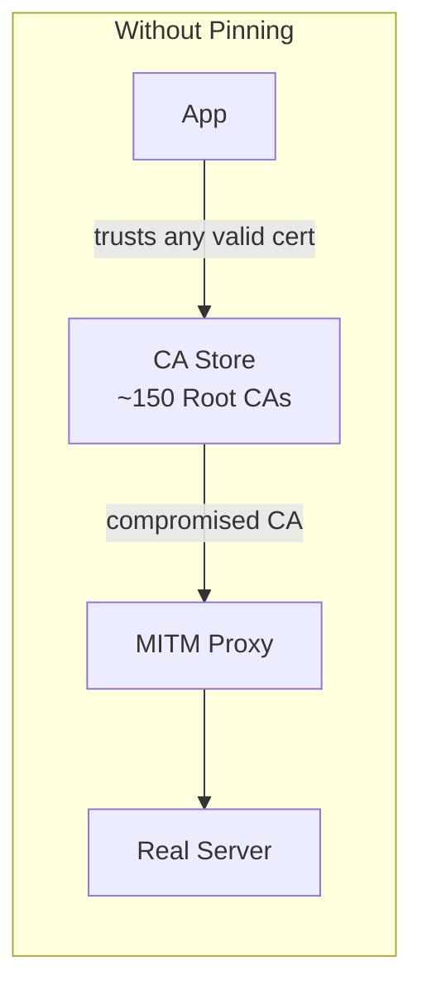
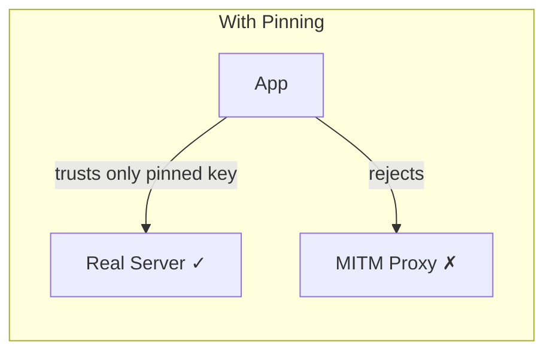
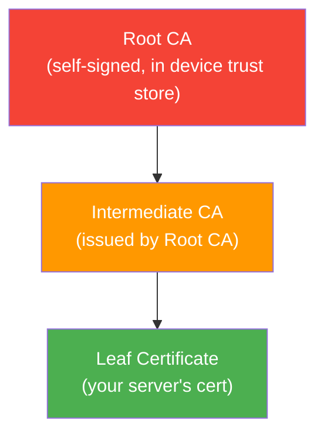

# SSL Pinning

---

## Why SSL Pinning?

HTTPS verifies the server's certificate against the device's **trusted CA store** (~150 root CAs on Android). If any one of those CAs is compromised or a rogue CA is installed, an attacker can issue a valid certificate for your domain and intercept traffic.

SSL pinning solves this by hardcoding the expected certificate or public key — the app trusts **only** the pinned identity, not the entire CA system.





---

## Threat Model

| Attack | How It Works | Pinning Prevents? |
|--------|-------------|-------------------|
| **Compromised CA** | Attacker obtains a valid cert from a breached/coerced CA | Yes |
| **Rogue CA on device** | Corporate MDM or malware installs a custom root CA | Yes |
| **DNS spoofing + proxy** | Traffic redirected to attacker's server with a fraudulent cert | Yes |
| **Server-side compromise** | Attacker obtains the real server's private key | No — the pin matches |
| **App binary tampering** | Attacker modifies the app to remove pins | No — requires code integrity checks |

!!! warning "Pinning Is Not a Silver Bullet"
    Pinning protects the **transport layer** from MITM attacks. It does not protect against a compromised server, a rooted device with a modified app binary, or vulnerabilities in your API logic.

---

## What to Pin

### Certificate vs Public Key

| | Certificate Pinning | Public Key Pinning |
|---|---|---|
| **Pins** | The entire X.509 certificate (DER-encoded) | Just the Subject Public Key Info (SPKI) hash |
| **Survives cert renewal** | No — new cert = new pin | Yes — if the same key pair is reused |
| **Granularity** | Exact certificate identity | Key identity only |
| **Recommended** | Rarely | Yes — more resilient to rotation |

### Which Certificate in the Chain?



| Pin Target | Pros | Cons |
|-----------|------|------|
| **Leaf cert** | Most specific, tightest security | Breaks on every cert renewal |
| **Intermediate CA** | Survives leaf renewal, still scoped | Breaks if CA changes intermediates |
| **Root CA** | Most stable, rarely changes | Least specific — trusts everything from that CA |

!!! tip "Recommendation"
    Pin the **leaf certificate's public key** plus a **backup pin** (e.g., the intermediate CA's key or a standby key pair you control). This balances security with operational resilience.

---

## Implementation on Android

### OkHttp CertificatePinner

```kotlin
val certificatePinner = CertificatePinner.Builder()
    .add("api.example.com", "sha256/AAAAAAAAAAAAAAAAAAAAAAAAAAAAAAAAAAAAAAAAAAA=")
    .add("api.example.com", "sha256/BBBBBBBBBBBBBBBBBBBBBBBBBBBBBBBBBBBBBBBBBBB=") // backup
    .build()

val client = OkHttpClient.Builder()
    .certificatePinner(certificatePinner)
    .build()
```

- Applies **only** to requests made through this `OkHttpClient` instance
- Throws `SSLPeerUnverifiedException` on pin mismatch
- Supports wildcard patterns: `*.example.com`

### Network Security Config (Declarative)

```xml
<!-- res/xml/network_security_config.xml -->
<network-security-config>
    <domain-config>
        <domain includeSubdomains="true">api.example.com</domain>
        <pin-set expiration="2026-06-01">
            <pin digest="SHA-256">AAAAAAAAAAAAAAAAAAAAAAAAAAAAAAAAAAAAAAAAAAA=</pin>
            <pin digest="SHA-256">BBBBBBBBBBBBBBBBBBBBBBBBBBBBBBBBBBBBBBBBBBB=</pin>
        </pin-set>
    </domain-config>
</network-security-config>
```

```xml
<!-- AndroidManifest.xml -->
<application android:networkSecurityConfig="@xml/network_security_config" />
```

- Applies to **all** HTTP traffic from the app (OkHttp, WebView, third-party SDKs)
- Built-in `expiration` attribute — pins are ignored after the date, preventing bricked apps
- Preferred for most use cases

### Custom TrustManager (Low-Level)

For cases where you need full control (e.g., dynamic pins fetched from a server):

```kotlin
fun createPinnedSslSocketFactory(pins: Set<String>): SSLSocketFactory {
    val trustManager = object : X509TrustManager {
        private val defaultTm = TrustManagerFactory.getInstance(
            TrustManagerFactory.getDefaultAlgorithm()
        ).apply { init(null as KeyStore?) }
            .trustManagers.first() as X509TrustManager

        override fun checkServerTrusted(chain: Array<X509Certificate>, authType: String) {
            // First, validate the chain normally
            defaultTm.checkServerTrusted(chain, authType)

            // Then verify at least one cert in the chain matches a pin
            val pinMatched = chain.any { cert ->
                val spki = MessageDigest.getInstance("SHA-256")
                    .digest(cert.publicKey.encoded)
                val pin = "sha256/${Base64.encodeToString(spki, Base64.NO_WRAP)}"
                pin in pins
            }
            if (!pinMatched) {
                throw CertificateException("Certificate pinning failure")
            }
        }

        override fun checkClientTrusted(chain: Array<X509Certificate>, authType: String) =
            defaultTm.checkClientTrusted(chain, authType)

        override fun getAcceptedIssuers(): Array<X509Certificate> =
            defaultTm.acceptedIssuers
    }

    return SSLContext.getInstance("TLS").apply {
        init(null, arrayOf(trustManager), null)
    }.socketFactory
}
```

!!! warning "Avoid Custom TrustManagers When Possible"
    Custom `TrustManager` implementations are error-prone and a common source of security vulnerabilities. Prefer OkHttp's `CertificatePinner` or Network Security Config. Only use a custom `TrustManager` if you need dynamic pin updates.

### Choosing an Approach

| Criteria | OkHttp Pinner | Network Security Config | Custom TrustManager |
|----------|--------------|------------------------|---------------------|
| Scope | OkHttp requests only | All app traffic | Per-connection |
| Configuration | Code | XML | Code |
| Pin expiration | Manual | Built-in `expiration` | Manual |
| Dynamic pins | No | No | Yes |
| WebView support | No | Yes | No |
| Minimum API | Any | API 24 (Android 7.0) | Any |
| Complexity | Low | Low | High |

---

## Extracting Pin Hashes

### From a Live Server

```bash
# Extract the SPKI hash of the leaf certificate
openssl s_client -connect api.example.com:443 -servername api.example.com </dev/null 2>/dev/null \
  | openssl x509 -pubkey -noout \
  | openssl pkey -pubin -outform DER \
  | openssl dgst -sha256 -binary \
  | openssl enc -base64
```

### From a Certificate File

```bash
# From a PEM file
openssl x509 -in cert.pem -pubkey -noout \
  | openssl pkey -pubin -outform DER \
  | openssl dgst -sha256 -binary \
  | openssl enc -base64
```

### Using OkHttp's Error Message

Connect to the server **without** pinning configured, then deliberately add a wrong pin. OkHttp's `SSLPeerUnverifiedException` message includes the actual pin hashes of the server's certificate chain:

```
Certificate pinning failure!
  Peer certificate chain:
    sha256/afwiKY3RxoMmLkuRW1l7QsPZTJPwDS2pdDROQjXw8ig=: CN=api.example.com
    sha256/klO23nT2ehFDXCfx3eHTDRESMz3asj1muO+4aIdjiuY=: CN=Let's Encrypt R3
```

---

## Pin Rotation Strategy

Rotating pins safely is the hardest part of SSL pinning. A botched rotation bricks every deployed app that hasn't updated.

### Recommended Approach

```mermaid
sequenceDiagram
    participant App as Deployed App
    participant Server as Server

    Note over App: App ships with Pin A + Pin B (backup)
    App->>Server: Connects with Pin A ✓

    Note over Server: Time to rotate certificate
    Note over Server: Generate new key pair (Pin C)

    rect rgb(40, 44, 52)
        Note over App,Server: Step 1: App update adds Pin C
        Note over App: App now has Pin A + Pin B + Pin C
        App->>Server: Still connects with Pin A ✓
    end

    rect rgb(40, 44, 52)
        Note over App,Server: Step 2: Wait for adoption (~95%+ updated)
        Note over Server: Switch to cert using Pin C
        App->>Server: Connects with Pin C ✓
    end

    rect rgb(40, 44, 52)
        Note over App,Server: Step 3: Next app update removes Pin A
        Note over App: App now has Pin B + Pin C
    end
```



### Key Principles

1. **Always have at least two pins** — current + backup from a different key pair
2. **Add the new pin to the app before using it on the server** — the app must recognize the new pin before the server starts using it
3. **Wait for sufficient app adoption** before switching the server certificate
4. **Use Network Security Config's `expiration`** — after the expiry date, pins are ignored and the app falls back to standard CA validation (prevents permanent bricking)
5. **Consider a remote kill switch** — a server endpoint that tells the app to disable pinning if something goes wrong

!!! warning "The Bricking Problem"
    If all deployed apps have pins that don't match the server's new certificate, those apps cannot connect — period. There is no way to push a fix because the app can't reach your servers. Users must manually update the app from the Play Store. This has caused major outages at companies including Starbucks and HSBC.

---

## Debugging and Testing

### Debug Builds

Disable pinning in debug builds to allow traffic inspection with tools like Charles Proxy:

```xml
<!-- res/xml/network_security_config.xml -->
<network-security-config>
    <debug-overrides>
        <trust-anchors>
            <certificates src="user" />  <!-- trust user-installed CAs -->
        </trust-anchors>
    </debug-overrides>

    <domain-config>
        <domain includeSubdomains="true">api.example.com</domain>
        <pin-set expiration="2026-06-01">
            <pin digest="SHA-256">AAAA...=</pin>
            <pin digest="SHA-256">BBBB...=</pin>
        </pin-set>
    </domain-config>
</network-security-config>
```

`<debug-overrides>` only applies when `android:debuggable="true"` — it has no effect on release builds.

### Unit Testing with MockWebServer

```kotlin
@Test
fun `pinning rejects wrong certificate`() {
    val server = MockWebServer()
    server.useHttps(sslSocketFactory, false)
    server.start()

    val wrongPinClient = OkHttpClient.Builder()
        .certificatePinner(
            CertificatePinner.Builder()
                .add(server.hostName, "sha256/WRONG_PIN_HERE")
                .build()
        )
        .sslSocketFactory(sslSocketFactory, trustManager)
        .build()

    val request = Request.Builder().url(server.url("/")).build()

    assertThrows<SSLPeerUnverifiedException> {
        wrongPinClient.newCall(request).execute()
    }
}
```

### Verifying Pins in CI

```bash
# Fail the build if the server's pin doesn't match expected values
ACTUAL_PIN=$(openssl s_client -connect api.example.com:443 -servername api.example.com </dev/null 2>/dev/null \
  | openssl x509 -pubkey -noout \
  | openssl pkey -pubin -outform DER \
  | openssl dgst -sha256 -binary \
  | openssl enc -base64)

EXPECTED_PIN="afwiKY3RxoMmLkuRW1l7QsPZTJPwDS2pdDROQjXw8ig="

if [ "$ACTUAL_PIN" != "$EXPECTED_PIN" ]; then
    echo "ERROR: Server certificate pin has changed!"
    exit 1
fi
```

---

## Common Bypass Techniques (Defensive Awareness)

Understanding how attackers bypass pinning helps you strengthen your implementation:

| Technique | How It Works | Mitigation |
|-----------|-------------|------------|
| **Frida / Xposed hooks** | Runtime instrumentation overrides pin checks | Root/tamper detection, code obfuscation |
| **Repackaging the APK** | Decompile, remove pin code, re-sign | Signature verification, Play Integrity API |
| **Magisk + custom module** | Systemless root + certificate injection | SafetyNet/Play Integrity checks |
| **Proxy tools (mitmproxy, Charles)** | Install proxy CA as system cert on rooted device | Restrict trust to specific CAs in Network Security Config |
| **Objection / SSL Kill Switch** | Automated Frida scripts targeting common pin implementations | Multiple pinning layers, native code pinning |

!!! note "Defense in Depth"
    No single measure prevents all bypasses on a rooted/compromised device. Combine pinning with root detection, app integrity checks (Play Integrity API), and server-side anomaly detection for high-security apps (banking, payments).

---

## Best Practices Summary

| Practice | Why |
|----------|-----|
| Pin **public keys**, not certificates | Survives cert renewal if the same key pair is reused |
| Include **at least 2 pins** | Prevents bricking if one key is rotated |
| Set **pin expiration** (Network Security Config) | Falls back to CA validation instead of bricking |
| Use **debug-overrides** for dev builds | Allows proxy-based debugging without weakening release security |
| **Add new pins before rotating** server certs | Ensures deployed apps recognize the new certificate |
| Monitor **pin failure rates** server-side | Early warning of MITM attacks or rotation issues |
| Pin in **Network Security Config** when possible | Covers all app traffic including WebViews |
| Have a **remote kill switch** for pinning | Emergency escape hatch if rotation goes wrong |

---

??? question "Interview Questions"

    **Q: What is SSL/certificate pinning and why is it needed?**

    SSL pinning hardcodes the expected server certificate or public key in the app. Standard HTTPS trusts ~150 root CAs on the device — if any CA is compromised, an attacker can issue a valid cert for your domain. Pinning restricts trust to only the pinned identity, preventing MITM attacks even with a rogue CA.

    **Q: What's the difference between certificate pinning and public key pinning?**

    Certificate pinning pins the entire X.509 certificate — it breaks whenever the certificate is renewed. Public key pinning pins only the SPKI (Subject Public Key Info) hash — it survives certificate renewal as long as the same key pair is reused. Public key pinning is preferred.

    **Q: What are the risks of SSL pinning?**

    The main risk is **bricking** — if the pinned certificate rotates and the app hasn't been updated with the new pin, the app cannot connect to the server at all. There's no way to push a fix OTA because the app can't reach your servers. Mitigation: always pin multiple keys, use Network Security Config's expiration, and maintain a remote kill switch.

    **Q: How would you implement SSL pinning on Android?**

    Three approaches: (1) **Network Security Config** — declarative XML, covers all app traffic, has built-in expiration. Best for most cases. (2) **OkHttp CertificatePinner** — programmatic, only for OkHttp requests. (3) **Custom TrustManager** — full control for dynamic pins, but error-prone. Prefer NSC unless you need OkHttp-specific or dynamic behavior.

    **Q: How do you safely rotate pinned certificates?**

    Three-phase approach: (1) Ship an app update that adds the new pin alongside the existing pins. (2) Wait for sufficient app adoption (~95%+). (3) Switch the server to the new certificate. Never rotate the server cert before apps are updated with the new pin. Always keep at least two pins active.

    **Q: Can SSL pinning be bypassed?**

    On a rooted device, yes — tools like Frida and Xposed can hook into the TLS verification logic at runtime. Repackaging the APK can also remove pin checks. Pinning is not a defense against a compromised device; it protects against network-level MITM attacks. For high-security apps, combine pinning with root detection, app integrity verification (Play Integrity API), and code obfuscation.

    **Q: What happens to pinning on API < 24 (pre-Android 7.0)?**

    Network Security Config requires API 24+. For older devices, use OkHttp's `CertificatePinner` or a custom `TrustManager`. Note that pre-API 24 devices also trust user-installed CAs by default, making them more vulnerable to MITM attacks.

!!! tip "Further Reading"
    - [OWASP Certificate Pinning Cheat Sheet](https://cheatsheetseries.owasp.org/cheatsheets/Pinning_Cheat_Sheet.html)
    - [Android Network Security Configuration docs](https://developer.android.com/privacy-and-security/security-config)
    - [OkHttp CertificatePinner API](https://square.github.io/okhttp/features/https/#certificate-pinning)
    - [RFC 7469 — HTTP Public Key Pinning (HPKP)](https://datatracker.ietf.org/doc/html/rfc7469) — deprecated for browsers but concepts still apply to mobile
