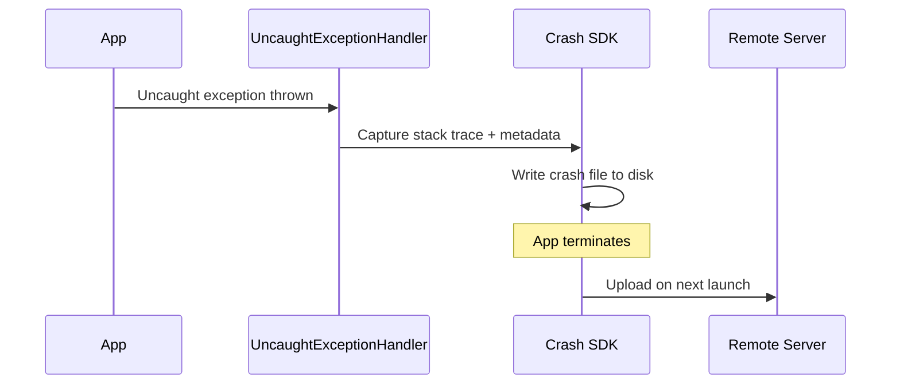
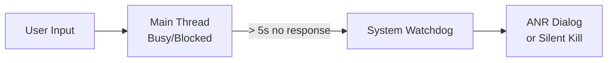

# Crash Reporting & ANRs

## How Crashes Are Captured

When an uncaught exception propagates to the top of the call stack, the JVM invokes the thread's `UncaughtExceptionHandler`. Crash reporting SDKs set a custom handler at app startup to intercept these.



### Native Crashes

Native (NDK) crashes produce a signal (SIGSEGV, SIGABRT) instead of a Java exception. Crash SDKs install a signal handler to capture these.

| Crash Type | Mechanism | Stack Trace |
|-----------|-----------|-------------|
| **JVM/Kotlin** | `UncaughtExceptionHandler` | Full symbolicated Kotlin/Java trace |
| **Native (NDK)** | Signal handler (SIGSEGV, etc.) | Requires `.so` symbol files for deobfuscation |
| **ANR** | Watchdog thread detects main thread blocked | Main thread trace + all thread dumps |

---

## ANR Detection

An **Application Not Responding** error occurs when the main thread is blocked for:

- **5 seconds** — for input events (touch, key press)
- **5 seconds** — for `BroadcastReceiver.onReceive()` (foreground)
- **10 seconds** — for `BroadcastReceiver.onReceive()` (background)



### Common ANR Causes

| Cause | Example |
|-------|---------|
| **Disk I/O on main thread** | SharedPreferences `commit()`, database query without suspend |
| **Network on main thread** | Synchronous HTTP call (rare but fatal) |
| **Lock contention** | Main thread waiting on a lock held by a background thread |
| **Deadlock** | Two threads waiting on each other's locks |
| **Heavy computation** | JSON parsing, bitmap decoding on main thread |

!!! warning "StrictMode for Development"
    Enable StrictMode to catch disk/network access on the main thread during development:

    ```kotlin
    if (BuildConfig.DEBUG) {
        StrictMode.setThreadPolicy(
            StrictMode.ThreadPolicy.Builder()
                .detectDiskReads()
                .detectDiskWrites()
                .detectNetwork()
                .penaltyLog()
                .build()
        )
    }
    ```

---

## Firebase Crashlytics Setup

=== "Gradle (libs.versions.toml)"

    ```toml
    [versions]
    crashlytics = "19.4.0"
    crashlytics-plugin = "3.0.3"

    [libraries]
    firebase-crashlytics = { module = "com.google.firebase:firebase-crashlytics-ktx", version.ref = "crashlytics" }

    [plugins]
    crashlytics = { id = "com.google.firebase.crashlytics", version.ref = "crashlytics-plugin" }
    ```

=== "App build.gradle.kts"

    ```kotlin
    plugins {
        alias(libs.plugins.crashlytics)
    }

    dependencies {
        implementation(libs.firebase.crashlytics)
    }
    ```

---

## Breadcrumbs & Custom Keys

Breadcrumbs provide context about what the user was doing before the crash.

```kotlin
// Log breadcrumbs for user actions
Firebase.crashlytics.log("User tapped checkout button")
Firebase.crashlytics.log("Cart contains ${cart.itemCount} items")

// Set custom keys for filtering in dashboard
Firebase.crashlytics.setCustomKey("screen", "CheckoutScreen")
Firebase.crashlytics.setCustomKey("user_tier", "premium")
Firebase.crashlytics.setCustomKey("cart_value", cart.totalPrice)

// Set user identifier (never use PII)
Firebase.crashlytics.setUserId(hashedUserId)
```

---

## Non-Fatal Exception Reporting

Not every error should crash the app, but you still want visibility:

```kotlin
try {
    val result = riskyOperation()
} catch (e: ParseException) {
    // Report but don't crash
    Firebase.crashlytics.recordException(e)
    // Show fallback UI
    showGenericError()
}
```

!!! note "Non-Fatal vs Fatal"
    Non-fatals don't affect crash-free rate but help identify degraded experiences. Track them separately — a spike in non-fatals often precedes a spike in fatals.

---

## Symbolication & ProGuard

Obfuscated builds produce unreadable stack traces. Upload mapping files to decode them:

| Build Tool | Mapping File | Upload |
|-----------|-------------|--------|
| **R8/ProGuard** | `mapping.txt` | Crashlytics Gradle plugin auto-uploads |
| **NDK** | `.so` debug symbols | Manual upload or `ndk { debugSymbolLevel = "FULL" }` |

```kotlin
// build.gradle.kts
android {
    buildTypes {
        release {
            isMinifyEnabled = true
            proguardFiles(getDefaultProguardFile("proguard-android-optimize.txt"), "proguard-rules.pro")
        }
    }
    ndkVersion = "26.1.10909125"
}
```

---

## Alerting Strategy

| Alert Level | Trigger | Action |
|-------------|---------|--------|
| **P0 — Critical** | Crash-free rate drops below 99% | Page on-call immediately |
| **P1 — High** | New crash cluster > 100 users | Investigate within 4 hours |
| **P2 — Medium** | Regression in known crash | Triage in next sprint |
| **P3 — Low** | Non-fatal spike | Monitor trend |

---

??? question "Common Interview Questions"

    **Q: How does Crashlytics capture crashes if the app is about to die?**
    It writes crash data to disk *synchronously* before the process terminates. On the next app launch, the persisted crash report is uploaded to the server. This is why the first launch after a crash may be slightly slower.

    **Q: What's the difference between a crash and an ANR?**
    A crash is an unhandled exception or signal that terminates the process. An ANR is the system detecting that the main thread hasn't responded to input within the timeout — the app may still be running but is unresponsive. Both degrade user experience, but ANRs are harder to diagnose because they involve thread scheduling.

    **Q: How do you debug an ANR in production?**
    1. Look at the main thread stack trace — it shows what the main thread was doing when the ANR was captured.
    2. Check all thread dumps for lock contention or deadlocks.
    3. Look for patterns: specific device, OS version, or app state.
    4. Use breadcrumbs to reconstruct the user journey.
    5. Reproduce locally with StrictMode and systrace.

    **Q: Should you catch all exceptions to prevent crashes?**
    No. A blanket `try-catch(Throwable)` masks bugs and leads to undefined app state. Only catch exceptions you can meaningfully recover from. Let everything else crash — you'll get a clean stack trace and can fix the root cause.

!!! tip "Further Reading"
    - [Firebase Crashlytics best practices](https://firebase.google.com/docs/crashlytics/customize-crash-reports)
    - [Android ANR documentation](https://developer.android.com/topic/performance/vitals/anr)
    - [Diagnosing ANRs with Perfetto](https://developer.android.com/topic/performance/tracing)
