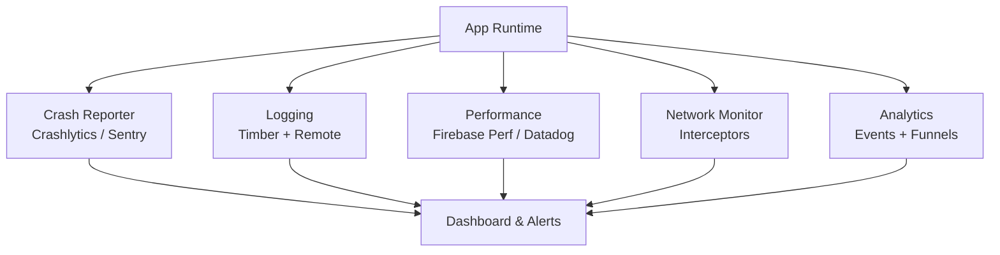

# Mobile Observability

Observability is the ability to understand what your app is doing in production — not just whether it crashed, but *why* it's slow, *where* users drop off, and *what* the network layer is doing under real-world conditions. A well-instrumented app turns production into a feedback loop.

---

## Sub-Topics

| Topic | What It Covers |
|-------|---------------|
| [Crash Reporting & ANRs](crash-reporting.md) | Crash capture, ANR detection, symbolication, Firebase Crashlytics, breadcrumbs |
| [Logging Strategies](logging.md) | Timber, structured logging, log levels, remote logging, privacy considerations |
| [Performance Monitoring](performance-monitoring.md) | App startup traces, frame rendering, Firebase Performance, custom traces, Macrobenchmark |
| [Network Monitoring](network-monitoring.md) | OkHttp interceptors, request/response logging, Flipper, connectivity tracking |

---

## Why Observability Matters on Mobile

Unlike server-side systems, mobile apps run on devices you don't control:

| Challenge | Server | Mobile |
|-----------|--------|--------|
| **Environment** | Homogeneous fleet | Thousands of device/OS combos |
| **Network** | Reliable, low-latency | Flaky, variable bandwidth |
| **Debugging** | SSH in, read logs | Can't access user's device |
| **Deployment** | Roll back in seconds | Users may not update for weeks |
| **State** | Mostly stateless services | Complex lifecycle + local state |

---

## Observability Stack Overview

---

## Key Metrics to Track

| Category | Metrics |
|----------|---------|
| **Stability** | Crash-free rate, ANR rate, crash count by version |
| **Performance** | App startup time (cold/warm/hot), frame drop rate, slow renders |
| **Network** | Request latency (p50/p95/p99), error rate, timeout rate |
| **Engagement** | Session length, screen time, funnel completion |
| **Device** | Low-memory kills, battery drain, storage usage |

!!! tip "Crash-Free Rate Target"
    Google considers **99.5%+** crash-free sessions as healthy. Top apps target **99.9%+**. Below 99%, you likely have a systemic issue.

!!! tip "Further Reading"
    - [Firebase Crashlytics docs](https://firebase.google.com/docs/crashlytics)
    - [Android Vitals](https://developer.android.com/topic/performance/vitals)
    - [Sentry for Android](https://docs.sentry.io/platforms/android/)
