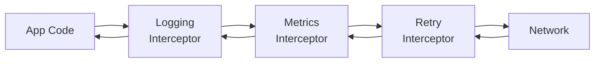

```mermaid
gantt
    title HTTP Request Timeline
    dateFormat X
    axisFormat %sms

    section Phases
    DNS Resolve      :0, 50
    TCP Connect      :50, 100
    TLS Handshake    :100, 180
    Request Send     :180, 200
    Server Process   :200, 350
    Response Read    :350, 400
```

# Network Monitoring

## OkHttp Interceptors

OkHttp's interceptor chain is the primary hook for network observability in Android apps.



| Interceptor Type | Position | Sees |
|-----------------|----------|------|
| **Application** | Before OkHttp internals | Original request, final response (after redirects/retries) |
| **Network** | After OkHttp internals | Actual wire request, including redirects, retries, caching |

---

## Logging Interceptor

=== "HttpLoggingInterceptor (Square)"

    ```kotlin
    val client = OkHttpClient.Builder()
        .addInterceptor(
            HttpLoggingInterceptor().apply {
                level = if (BuildConfig.DEBUG)
                    HttpLoggingInterceptor.Level.BODY
                else
                    HttpLoggingInterceptor.Level.NONE
            }
        )
        .build()
    ```

=== "Custom Metrics Interceptor"

    ```kotlin
    class NetworkMetricsInterceptor : Interceptor {
        override fun intercept(chain: Interceptor.Chain): Response {
            val request = chain.request()
            val startMs = System.currentTimeMillis()

            val response = try {
                chain.proceed(request)
            } catch (e: IOException) {
                trackNetworkError(request, e)
                throw e
            }

            val durationMs = System.currentTimeMillis() - startMs

            trackNetworkMetric(
                url = request.url.encodedPath,
                method = request.method,
                statusCode = response.code,
                durationMs = durationMs,
                requestBytes = request.body?.contentLength() ?: 0,
                responseBytes = response.body?.contentLength() ?: 0
            )

            return response
        }
    }
    ```

---

## Key Network Metrics

| Metric | What to Track | Alert Threshold |
|--------|--------------|-----------------|
| **Latency (p50/p95/p99)** | Response time distribution | p99 > 5s |
| **Error rate** | 4xx + 5xx / total requests | > 5% |
| **Timeout rate** | Timeouts / total requests | > 2% |
| **Payload size** | Request + response bytes | Avg > 1MB |
| **Retry rate** | Retried requests / total | > 10% |
| **DNS time** | DNS resolution duration | p95 > 500ms |
| **TLS time** | TLS handshake duration | p95 > 1s |

---

## Event Listener for Connection Metrics

OkHttp's `EventListener` provides granular timing for each connection phase:

```kotlin
class TimingEventListener : EventListener() {
    private var callStart = 0L
    private var dnsStart = 0L
    private var connectStart = 0L
    private var tlsStart = 0L

    override fun callStart(call: Call) { callStart = now() }

    override fun dnsStart(call: Call, domainName: String) { dnsStart = now() }
    override fun dnsEnd(call: Call, domainName: String, inetAddressList: List<InetAddress>) {
        trackMetric("dns_duration_ms", now() - dnsStart)
    }

    override fun connectStart(call: Call, inetSocketAddress: InetSocketAddress, proxy: Proxy) {
        connectStart = now()
    }
    override fun connectEnd(call: Call, inetSocketAddress: InetSocketAddress, proxy: Proxy, protocol: Protocol?) {
        trackMetric("connect_duration_ms", now() - connectStart)
    }

    override fun secureConnectStart(call: Call) { tlsStart = now() }
    override fun secureConnectEnd(call: Call, handshake: Handshake?) {
        trackMetric("tls_duration_ms", now() - tlsStart)
    }

    override fun callEnd(call: Call) {
        trackMetric("total_duration_ms", now() - callStart)
    }

    override fun callFailed(call: Call, ioe: IOException) {
        trackError(call, ioe)
    }

    private fun now() = SystemClock.elapsedRealtime()
}

// Register
val client = OkHttpClient.Builder()
    .eventListenerFactory { TimingEventListener() }
    .build()
```



---

## Connectivity Monitoring

Track network state changes to correlate with errors:

```kotlin
class ConnectivityMonitor(context: Context) {
    private val connectivityManager = context.getSystemService<ConnectivityManager>()

    val networkState: StateFlow<NetworkState> = callbackFlow {
        val callback = object : ConnectivityManager.NetworkCallback() {
            override fun onAvailable(network: Network) {
                trySend(NetworkState.Connected)
            }

            override fun onLost(network: Network) {
                trySend(NetworkState.Disconnected)
            }

            override fun onCapabilitiesChanged(
                network: Network,
                caps: NetworkCapabilities
            ) {
                val type = when {
                    caps.hasTransport(NetworkCapabilities.TRANSPORT_WIFI) -> "wifi"
                    caps.hasTransport(NetworkCapabilities.TRANSPORT_CELLULAR) -> "cellular"
                    else -> "other"
                }
                trySend(NetworkState.Connected(type))
            }
        }

        val request = NetworkRequest.Builder().build()
        connectivityManager?.registerNetworkCallback(request, callback)

        awaitClose {
            connectivityManager?.unregisterNetworkCallback(callback)
        }
    }.stateIn(CoroutineScope(Dispatchers.IO), SharingStarted.Eagerly, NetworkState.Unknown)
}
```

---

## Debug Tools

| Tool | Use Case | Production? |
|------|----------|-------------|
| **Flipper** | Visual network inspector (like Chrome DevTools) | No — debug only |
| **Charles Proxy** | MITM proxy for traffic inspection | No — local dev |
| **Chucker** | In-app network inspector notification | Debug builds only |
| **Stetho** | Chrome DevTools bridge (deprecated) | No |

### Chucker Setup (Debug Builds)

```kotlin
val client = OkHttpClient.Builder()
    .apply {
        if (BuildConfig.DEBUG) {
            addInterceptor(
                ChuckerInterceptor.Builder(context)
                    .maxContentLength(250_000L)
                    .redactHeaders("Authorization", "Cookie")
                    .build()
            )
        }
    }
    .build()
```

---

## Network Monitoring Dashboard

What a production network monitoring dashboard should show:

| Panel | Data |
|-------|------|
| **Request volume** | Requests/min, broken down by endpoint |
| **Latency distribution** | p50/p90/p99 per endpoint |
| **Error breakdown** | 4xx vs 5xx, by endpoint and error type |
| **Payload efficiency** | Avg response size, compression ratio |
| **Connection reuse** | % of requests using pooled connections |
| **Retry heatmap** | Which endpoints trigger the most retries |
| **Geographic breakdown** | Latency by region/CDN edge |

---

??? question "Common Interview Questions"

    **Q: Application interceptor vs Network interceptor — when to use which?**
    Application interceptors see the logical request/response (after redirects, before cache). Use for logging business-level metrics. Network interceptors see wire-level details including cache hits, redirects, and connection reuse. Use for low-level performance profiling and header inspection.

    **Q: How do you monitor network performance without impacting app performance?**
    Use OkHttp's EventListener for zero-overhead timing (it's callback-based, no reflection). Buffer metrics in memory and flush in batches to avoid per-request I/O. Sample at 100% for errors but 10-20% for successful request latencies to limit data volume. Upload metrics using WorkManager to respect battery.

    **Q: How would you detect API degradation in production?**
    Track p95/p99 latency per endpoint over time. Set alerts for when latency exceeds 2x the baseline. Correlate with error rate spikes. Segment by device network type (WiFi vs cellular) to distinguish client-side vs server-side issues. Use rolling averages to avoid false positives from transient spikes.

    **Q: What's connection pooling and why does it matter?**
    OkHttp maintains a pool of idle HTTP/2 and HTTP/1.1 connections. Reusing connections avoids DNS lookup, TCP handshake, and TLS negotiation for each request — saving 100-300ms per request. Monitor pool hit rate; low reuse suggests too many different hosts or aggressive connection timeouts.

!!! tip "Further Reading"
    - [OkHttp Interceptors](https://square.github.io/okhttp/features/interceptors/)
    - [OkHttp EventListener](https://square.github.io/okhttp/features/events/)
    - [Chucker GitHub](https://github.com/ChuckerTeam/chucker)
