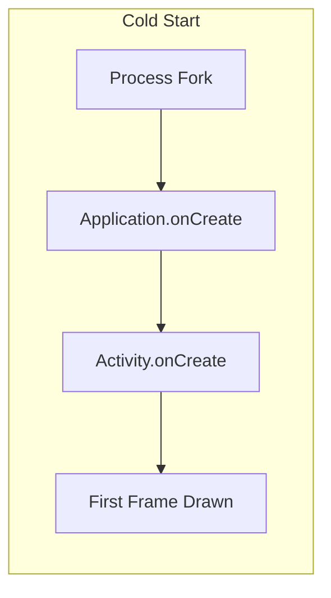
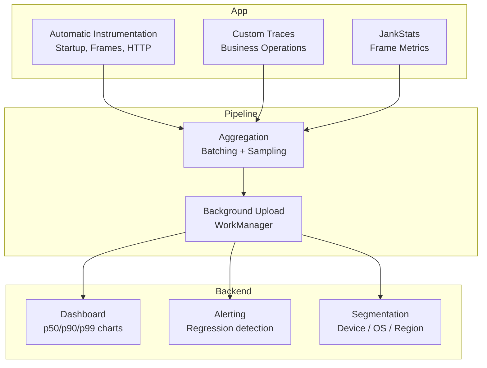

```mermaid
gantt
    title Perfetto Trace Timeline
    dateFormat X
    axisFormat %s

    section Main Thread
    onCreate         :0, 80
    setContent       :80, 150
    Compose Layout   :150, 200
    First Draw       :200, 220

    section IO Thread
    DB Query         :50, 180
    Network Call     :60, 250
```

# Performance Monitoring

## App Startup Time

Android defines three startup states:

| Type | Definition | Typical Target |
|------|-----------|----------------|
| **Cold** | Process not running — full initialization | < 500ms to first frame |
| **Warm** | Process alive but Activity needs recreation | < 300ms |
| **Hot** | Activity in back stack, just brought forward | < 100ms |



### Measuring Startup

=== "Logcat (TTID)"

    ```bash
    # Time to Initial Display — system reports automatically
    adb logcat -s ActivityTaskManager | grep "Displayed"
    # Output: Displayed com.app/.MainActivity: +487ms
    ```

=== "ReportFullyDrawn (TTFD)"

    ```kotlin
    class MainActivity : ComponentActivity() {
        override fun onCreate(savedInstanceState: Bundle?) {
            super.onCreate(savedInstanceState)
            setContent {
                // When meaningful content is ready:
                LaunchedEffect(dataLoaded) {
                    if (dataLoaded) reportFullyDrawn()
                }
            }
        }
    }
    ```

=== "Macrobenchmark"

    ```kotlin
    @RunWith(AndroidJUnit4::class)
    class StartupBenchmark {
        @get:Rule
        val rule = MacrobenchmarkRule()

        @Test
        fun startupCold() = rule.measureRepeated(
            packageName = "com.example.app",
            metrics = listOf(StartupTimingMetric()),
            iterations = 10,
            startupMode = StartupMode.COLD
        ) {
            pressHome()
            startActivityAndWait()
        }
    }
    ```

---

## Frame Rendering Performance

Android targets **60 FPS** (16.67ms per frame) or **90/120 FPS** on high-refresh displays.

| Metric | What It Means |
|--------|--------------|
| **Janky frames** | Frames that took > 1 vsync period to render |
| **Frozen frames** | Frames that took > 700ms — effectively a freeze |
| **Frame duration (p95)** | 95th percentile render time — captures tail latency |

### JankStats API

```kotlin
class MainActivity : ComponentActivity() {
    private lateinit var jankStats: JankStats

    override fun onCreate(savedInstanceState: Bundle?) {
        super.onCreate(savedInstanceState)

        jankStats = JankStats.createAndTrack(window) { frameData ->
            if (frameData.isJank) {
                Timber.w("Jank: ${frameData.frameDurationUiNanos / 1_000_000}ms, " +
                    "states: ${frameData.states}")
            }
        }
    }

    override fun onResume() {
        super.onResume()
        jankStats.isTrackingEnabled = true
    }

    override fun onPause() {
        super.onPause()
        jankStats.isTrackingEnabled = false
    }
}
```

---

## Firebase Performance Monitoring

### Automatic Traces

Firebase Performance automatically captures:

- **App start** trace (cold/warm)
- **Screen rendering** (slow/frozen frames per Activity/Fragment)
- **HTTP/S network requests** (latency, payload size, success rate)

### Custom Traces

```kotlin
// Trace a specific operation
val trace = Firebase.performance.newTrace("load_feed")
trace.start()

trace.putAttribute("feed_type", "home")
trace.putMetric("item_count", feedItems.size.toLong())

val items = repository.loadFeed()

trace.putMetric("item_count", items.size.toLong())
trace.stop()
```

### Custom Traces with Extension Functions

```kotlin
suspend inline fun <T> trace(name: String, block: Trace.() -> T): T {
    val trace = Firebase.performance.newTrace(name)
    trace.start()
    return try {
        trace.block()
    } finally {
        trace.stop()
    }
}

// Usage
val result = trace("checkout_flow") {
    putAttribute("payment_method", "card")
    processCheckout(cart)
}
```

---

## Systrace & Perfetto

System-level tracing for deep performance analysis.

| Tool | Scope | Use Case |
|------|-------|----------|
| **Systrace** | System + app traces | Legacy, still works |
| **Perfetto** | Full system tracing | Modern replacement, richer UI |
| **Android Studio Profiler** | CPU, memory, network | Attached debugging sessions |

### Adding Custom Trace Sections

```kotlin
import androidx.tracing.trace

// Appears in Perfetto/Systrace timeline
fun loadExpensiveData(): List<Item> = trace("loadExpensiveData") {
    database.getAllItems()
}
```



---

## Android Vitals (Play Console)

Google Play automatically collects performance data from opted-in users:

| Vital | Bad Behavior Threshold |
|-------|----------------------|
| **ANR rate** | > 0.47% of sessions |
| **Crash rate** | > 1.09% of sessions |
| **Excessive wakeups** | > 10 per hour |
| **Stuck wake locks** | > 1 hour held |
| **Slow cold start** | > 5 seconds |
| **Slow warm start** | > 2 seconds |
| **Slow hot start** | > 1.5 seconds |
| **Frozen frames** | > 0.1% of frames |

!!! warning "Play Store Impact"
    Exceeding bad behavior thresholds can reduce your app's visibility in Play Store search results and trigger warning labels on your listing.

---

## Monitoring Architecture



---

??? question "Common Interview Questions"

    **Q: What's the difference between TTID and TTFD?**
    TTID (Time to Initial Display) is when the system draws the first frame — reported automatically. TTFD (Time to Full Display) is when the app calls `reportFullyDrawn()`, indicating meaningful content is visible. TTID shows skeleton UI speed; TTFD shows real content readiness.

    **Q: How do you identify jank in production?**
    Use JankStats API to detect frames exceeding the vsync deadline. Correlate with PerformanceClass states (e.g., which RecyclerView was scrolling). In Firebase Performance, monitor the slow/frozen frame percentage per screen. For deep diagnosis, use Perfetto traces from local reproduction.

    **Q: How would you reduce cold start time?**
    1. Defer non-critical initialization (lazy singletons, background init).
    2. Use App Startup library to control initialization order.
    3. Use baseline profiles to pre-compile hot paths (AOT).
    4. Minimize Application.onCreate work — move to background or on-demand.
    5. Use a splash screen with a proper SplashScreen API (not a full Activity).

    **Q: What's a baseline profile and how does it help performance?**
    A baseline profile is a list of classes and methods that should be AOT-compiled at install time, rather than JIT-compiled on first use. This eliminates JIT compilation overhead for critical user paths. Generated using Macrobenchmark and bundled in the APK.

!!! tip "Further Reading"
    - [Firebase Performance Monitoring](https://firebase.google.com/docs/perf-mon)
    - [Macrobenchmark](https://developer.android.com/topic/performance/benchmarking/macrobenchmark-overview)
    - [Perfetto tracing](https://perfetto.dev/docs/)
    - [Baseline Profiles](https://developer.android.com/topic/performance/baselineprofiles/overview)
