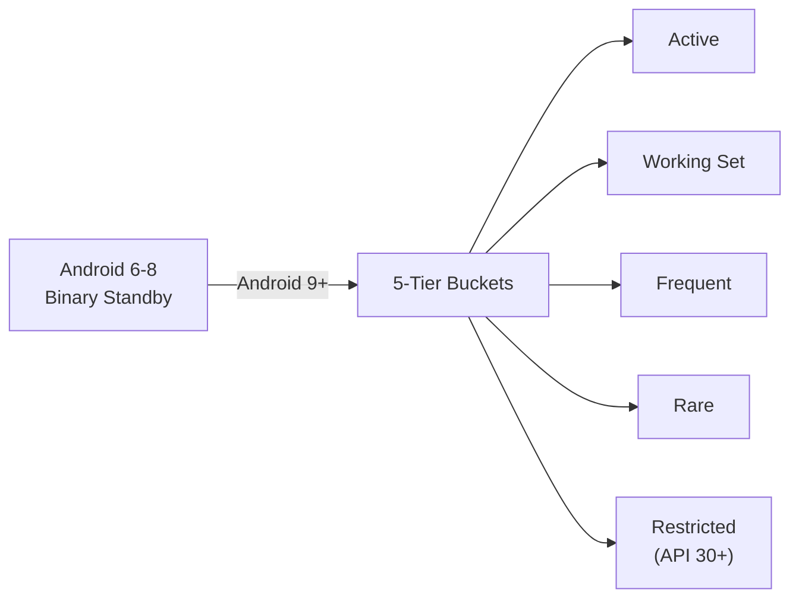
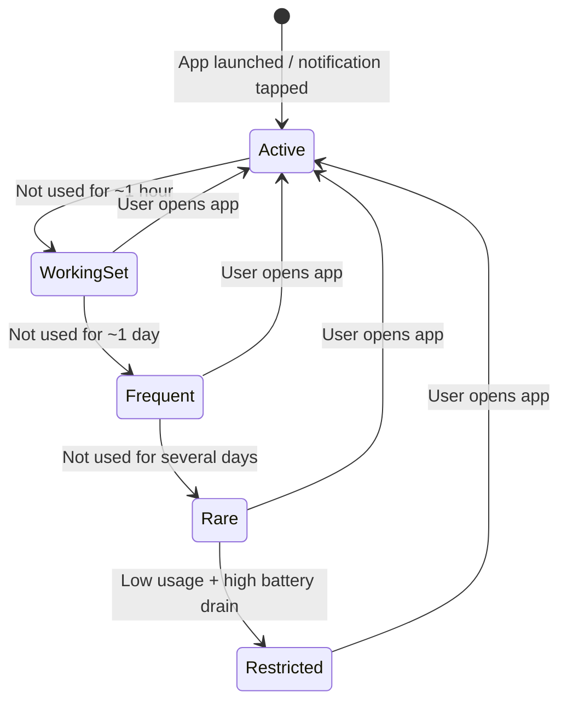

# App Standby Buckets

Android 9 (API 28) replaced the binary "standby or not" model with **five priority buckets** that control how aggressively the system restricts an app's background work. The bucket your app lands in determines job frequency, alarm delivery, network access, and FCM message handling — making it one of the most impactful battery-management mechanisms to understand.

---

## Why Buckets Exist

Before Android 9, App Standby was binary: either an app was in standby (restricted) or it wasn't. This was too coarse — a news app opened daily and a game opened once a month received the same restrictions once the standby timer expired. Buckets introduce a **gradient of restriction** tied to how recently and frequently the user engages with the app.



---

## The Five Buckets

| Bucket | Numeric Value | Typical Scenario |
|--------|:---:|----------------|
| **Active** | 10 | App is currently in the foreground, or was just used |
| **Working Set** | 20 | App runs regularly — e.g., a messaging app opened most days |
| **Frequent** | 30 | App used often but not daily — e.g., a fitness app opened a few times a week |
| **Rare** | 40 | App seldom opened — e.g., a travel app used only before trips |
| **Restricted** | 45 | Very low usage **and** high battery drain (API 30+) |

### Restrictions Per Bucket

| Capability | Active | Working Set | Frequent | Rare | Restricted |
|-----------|:---:|:---:|:---:|:---:|:---:|
| **Jobs** | No limit | Deferred ≤ 2 hr | Deferred ≤ 8 hr | Deferred ≤ 24 hr | Once per day |
| **Alarms** | No limit | Deferred ≤ 6 min | Deferred ≤ 30 min | Deferred ≤ 2 hr | No alarms |
| **Network** | Unrestricted | Unrestricted | Unrestricted | Once per day | Once per day |
| **FCM high-priority** | Immediate | Immediate | ~3/hr cap | ~2/hr cap | ~1/hr cap |
| **Foreground Service launch** | Allowed | Allowed | Allowed | Allowed | Blocked (API 31+) |

!!! warning "Restricted bucket is severe"
    Apps in the Restricted bucket (API 30+) effectively lose the ability to do any background work. Jobs run at most once per day, alarms are suppressed entirely, and on Android 12+ the app cannot even launch a foreground service from the background.

---

## How the System Assigns Buckets

The system uses **UsageStats signals** processed by a platform-level prediction model to place apps into buckets. The assignment is dynamic — it changes as usage patterns evolve.

### Signals That Influence Bucket Placement

| Signal | Effect |
|--------|--------|
| **App launch** (Activity brought to foreground) | Immediately promotes to **Active** |
| **Notification tap** | Promotes to **Active** |
| **Sync adapter execution** triggered by the user | Promotes to **Active** |
| **Recency of last use** | Primary decay signal — unused apps drift toward Rare |
| **Frequency of use** | Frequently-used apps stay in Working Set / Frequent longer |
| **Notification dismissal rate** | High dismissal without taps signals low engagement |
| **Battery usage** | High drain accelerates demotion; combined with low usage triggers Restricted |

### Bucket Lifecycle



!!! note "Timings are approximate"
    The exact demotion thresholds vary by OEM and Android version. The platform prediction model considers multiple signals, so an app used briefly but frequently may stay in Working Set longer than one used for a long session but rarely.

---

## Checking and Monitoring Your Bucket

### Query Current Bucket

```kotlin
val usageStatsManager = getSystemService(Context.USAGE_STATS_SERVICE) as UsageStatsManager
val bucket = usageStatsManager.appStandbyBucket

when (bucket) {
    UsageStatsManager.STANDBY_BUCKET_ACTIVE      -> "Active"
    UsageStatsManager.STANDBY_BUCKET_WORKING_SET  -> "Working Set"
    UsageStatsManager.STANDBY_BUCKET_FREQUENT     -> "Frequent"
    UsageStatsManager.STANDBY_BUCKET_RARE         -> "Rare"
    UsageStatsManager.STANDBY_BUCKET_RESTRICTED   -> "Restricted"
    else -> "Unknown ($bucket)"
}
```

!!! note "Permission required"
    Reading bucket info requires `android.permission.PACKAGE_USAGE_STATS`, which is a system-level permission. However, an app can always query **its own** bucket without any special permission.

### Listen for Bucket Changes

Register a `BroadcastReceiver` for bucket change events:

```kotlin
class BucketChangeReceiver : BroadcastReceiver() {
    override fun onReceive(context: Context, intent: Intent) {
        if (intent.action == UsageStatsManager.ACTION_USAGE_STATS_GRANTED) {
            val usm = context.getSystemService(Context.USAGE_STATS_SERVICE) as UsageStatsManager
            val newBucket = usm.appStandbyBucket
            Log.d("Bucket", "Bucket changed to: $newBucket")
        }
    }
}
```

A more reliable approach is to check the bucket each time your app performs background work and adapt accordingly:

```kotlin
class SyncWorker(context: Context, params: WorkerParameters) : CoroutineWorker(context, params) {
    override suspend fun doWork(): Result {
        val usm = applicationContext.getSystemService(Context.USAGE_STATS_SERVICE) as UsageStatsManager
        val bucket = usm.appStandbyBucket

        return when {
            bucket <= UsageStatsManager.STANDBY_BUCKET_ACTIVE -> {
                fullSync()
                Result.success()
            }
            bucket <= UsageStatsManager.STANDBY_BUCKET_FREQUENT -> {
                incrementalSync()
                Result.success()
            }
            else -> {
                criticalOnlySync()
                Result.success()
            }
        }
    }
}
```

---

## Designing for Buckets

### Strategies to Stay in Favorable Buckets

| Strategy | Why It Helps |
|----------|-------------|
| **Deliver valuable notifications** | Tapped notifications promote to Active; dismissed notifications hurt |
| **Use FCM wisely** | Engaging push messages drive opens, which reset the bucket |
| **Minimize background battery drain** | High drain + low usage = Restricted bucket |
| **Don't wake the device unnecessarily** | Excessive wakelocks and alarms signal battery-draining behavior |

### Adapting Work to Your Current Bucket

Rather than fighting the bucket system, design your app to **degrade gracefully**:

=== "Active / Working Set"

    Full sync frequency. Pre-fetch content. Update widgets in real time.

    ```kotlin
    val syncInterval = 15.minutes
    val constraints = Constraints.Builder()
        .setRequiredNetworkType(NetworkType.CONNECTED)
        .build()

    PeriodicWorkRequestBuilder<SyncWorker>(syncInterval)
        .setConstraints(constraints)
        .build()
    ```

=== "Frequent"

    Reduce sync frequency. Skip non-essential pre-fetching.

    ```kotlin
    val syncInterval = 2.hours

    PeriodicWorkRequestBuilder<SyncWorker>(syncInterval)
        .setConstraints(constraints)
        .build()
    ```

=== "Rare / Restricted"

    Sync only critical data. Rely on FCM for time-sensitive updates. Batch all work into a single execution window.

    ```kotlin
    val syncInterval = 24.hours

    PeriodicWorkRequestBuilder<CriticalSyncWorker>(syncInterval)
        .setConstraints(constraints)
        .build()
    ```

!!! tip "WorkManager respects bucket limits automatically"
    You don't need to manually enforce bucket restrictions on WorkManager jobs — the system does this for you. However, adapting your sync **scope** (full vs. incremental vs. critical-only) based on the bucket provides a better user experience when they do return to the app.

---

## Exemptions

Certain conditions keep an app out of restrictive buckets regardless of usage patterns:

| Condition | Bucket Override |
|-----------|----------------|
| App is in the foreground | Always **Active** |
| Active foreground service with notification | Stays in **Active** |
| App is a device admin / device owner | Exempt from bucketing |
| App is on the battery optimization whitelist | Exempt from Rare / Restricted |
| App has `SYSTEM_ALERT_WINDOW` permission and an active overlay | Minimum **Working Set** |
| Carrier-privileged app | Exempt from bucketing |

!!! warning "Foreground service exemption has limits"
    While a foreground service keeps the app in Active, abusing foreground services solely to avoid bucket restrictions violates Google Play policies. Android 12+ added foreground service type requirements and restrictions on background FGS launches.

---

## Testing with ADB

### Set a Specific Bucket

```bash
# Force app into a specific bucket
adb shell am set-standby-bucket com.example.app active
adb shell am set-standby-bucket com.example.app working_set
adb shell am set-standby-bucket com.example.app frequent
adb shell am set-standby-bucket com.example.app rare
adb shell am set-standby-bucket com.example.app restricted
```

### Query Current Bucket

```bash
# Check which bucket the app is in
adb shell am get-standby-bucket com.example.app
```

### View All App Buckets

```bash
# List buckets for all installed apps
adb shell am get-standby-bucket
```

### Test Workflow

1. Install and launch your app (confirms Active bucket)
2. Force into `rare` or `restricted` bucket
3. Schedule a WorkManager job or set an alarm
4. Observe that the job/alarm is deferred according to bucket restrictions
5. Force back to `active` and confirm immediate execution

```bash
# Full test sequence
adb shell am set-standby-bucket com.example.app rare
adb shell dumpsys jobscheduler | grep com.example.app
# Wait and observe deferral behavior
adb shell am set-standby-bucket com.example.app active
# Observe job executes promptly
```

---

## Version History

| API | Android Version | Bucket Change |
|:---:|:---:|---|
| 28 | 9.0 (Pie) | App Standby Buckets introduced with four tiers: Active, Working Set, Frequent, Rare |
| 30 | 11 | **Restricted** bucket added for high-drain, low-usage apps |
| 31 | 12 | Apps in Restricted bucket cannot launch foreground services from background |
| 33 | 13 | Tighter FCM rate limits for lower buckets; per-app battery settings UI |
| 34 | 14 | Improved ML-based bucket prediction; stricter enforcement of Restricted bucket |

---

??? question "Common Interview Questions"

    **Q: What are App Standby Buckets and why were they introduced?**
    Five priority tiers (Active, Working Set, Frequent, Rare, Restricted) introduced in Android 9 to replace binary App Standby. They provide a gradient of restriction proportional to how recently and frequently the user engages with an app, improving battery life without punishing actively-used apps.

    **Q: How does the system decide which bucket an app belongs in?**
    The platform uses a UsageStats-based prediction model that considers recency of last use, frequency of use, notification engagement (taps vs. dismissals), and battery consumption. Any direct user interaction (app launch, notification tap) immediately promotes to Active.

    **Q: What is the Restricted bucket and when was it added?**
    Added in Android 11 (API 30), Restricted is the most aggressive bucket. An app lands here when it has very low usage **and** high battery drain. Jobs run at most once per day, alarms are suppressed, network is limited to once per day, and on Android 12+ the app cannot launch foreground services from the background.

    **Q: How should an app adapt its behavior based on its current bucket?**
    Query `UsageStatsManager.appStandbyBucket` and adjust sync scope — full sync in Active/Working Set, incremental in Frequent, critical-only in Rare/Restricted. WorkManager automatically respects system-imposed job limits, but adapting the work **scope** ensures users see fresh content when they return.

    **Q: Can an app prevent itself from being demoted to a lower bucket?**
    Not directly — bucket assignment is system-controlled. However, delivering valuable notifications that users tap, minimizing background battery drain, and providing genuine user value keep the app in favorable buckets. Apps with active foreground services stay in Active, but abusing this violates Play policies.

    **Q: How do you test App Standby Buckets during development?**
    Use `adb shell am set-standby-bucket <package> <bucket>` to force a specific bucket, then observe how scheduled jobs, alarms, and network requests behave. Use `adb shell am get-standby-bucket <package>` to verify the current assignment.

    **Q: How do buckets affect FCM message delivery?**
    High-priority FCM messages are delivered immediately for Active and Working Set apps. For Frequent, Rare, and Restricted buckets, the system applies rate limits (~3/hr, ~2/hr, and ~1/hr respectively), which means time-sensitive messages may be delayed.

!!! tip "Further Reading"
    - [App Standby Buckets — Android Developers](https://developer.android.com/topic/performance/appstandby)
    - [Power management restrictions — Android Developers](https://developer.android.com/topic/performance/power)
    - [Optimize for Doze and App Standby — Android Developers](https://developer.android.com/training/monitoring-device-state/doze-standby)
    - [UsageStatsManager — API Reference](https://developer.android.com/reference/android/app/usage/UsageStatsManager)
