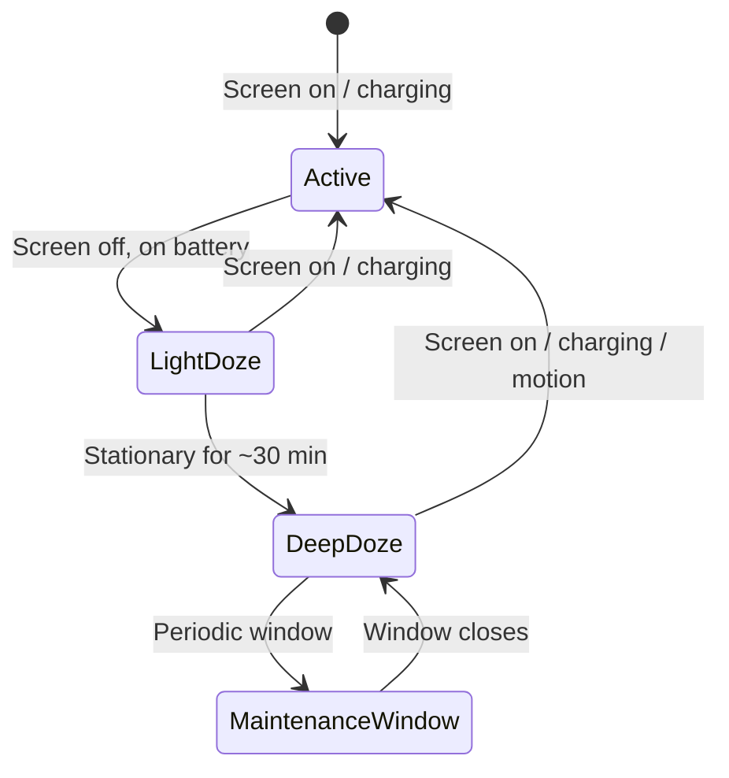

# Doze Mode & App Standby

Android aggressively restricts background work to preserve battery. **Doze mode** activates when the device is idle, while **App Standby** targets individual apps the user hasn't interacted with recently. Both defer network access, syncs, alarms, and jobs — your app must adapt or its background work silently stops.

---

## Doze Mode

Introduced in Android 6.0 (API 23). The system enters Doze when the device is **unplugged**, **stationary**, and the **screen is off** for an extended period.

### How It Works



Doze has two stages since Android 7.0:

| Stage | Trigger | Restrictions |
|-------|---------|-------------|
| **Light Doze** | Screen off, on battery (even if moving) | Defers jobs and syncs; network access limited |
| **Deep Doze** | Screen off, stationary, on battery for ~30 min | All restrictions from Light Doze **plus** no network, no wakelocks, alarms deferred, GPS/Wi-Fi scans stopped |

### Maintenance Windows

The system periodically opens short **maintenance windows** during Deep Doze. All deferred work (syncs, jobs, alarms) executes in this window. The intervals between windows grow exponentially — from ~1 minute up to several hours.

```
Deep Doze → [1 min] → Window → [2 min] → Window → [4 min] → ... → [hours] → Window
```

!!! warning "You cannot control when maintenance windows open"
    The system schedules them. Batching your work properly (via WorkManager or JobScheduler) is the only way to ensure it runs during these windows.

### What Gets Restricted

| Resource | Behavior in Doze |
|----------|-----------------|
| **Network** | Blocked (Deep), limited (Light) |
| **AlarmManager** | `set()` / `setRepeating()` deferred to maintenance window |
| **WakeLocks** | Ignored |
| **Wi-Fi scans** | Stopped |
| **JobScheduler** | Jobs deferred to maintenance window |
| **SyncAdapter** | Syncs deferred to maintenance window |
| **GPS** | Stopped (Deep Doze) |

---

## App Standby

Introduced alongside Doze in Android 6.0. Targets **individual apps** rather than the whole device. An app enters Standby when the user hasn't interacted with it recently — no foreground Activity, no notification tap, no explicit launch.

### App Standby Buckets (Android 9+)

Android 9 refined App Standby into **five buckets** based on usage recency and frequency. The bucket determines how aggressively the system restricts the app.

| Bucket | Usage Pattern | Job Frequency | Alarm Frequency | Network |
|--------|--------------|---------------|-----------------|---------|
| **Active** | Currently in use or just used | No restrictions | No restrictions | No restrictions |
| **Working Set** | Used regularly but not active right now | Deferred up to 2 hours | Deferred up to 6 min | No restrictions |
| **Frequent** | Used often, not every day | Deferred up to 8 hours | Deferred up to 30 min | No restrictions |
| **Rare** | Seldom used | Deferred up to 24 hours | Deferred up to 2 hours | Limited to once/day |
| **Restricted** (API 30+) | Very low usage + high battery drain | Runs once/day | No alarms | Limited to once/day |

!!! note "How the system assigns buckets"
    The system uses **machine learning** (UsageStatsManager) to predict which bucket an app belongs in. Factors include:

    - How recently the app was used
    - How frequently it's used
    - How much battery it consumes
    - Whether the app triggers notifications the user engages with

### Checking Your Bucket

```kotlin
val usageStatsManager = getSystemService(Context.USAGE_STATS_SERVICE) as UsageStatsManager
val bucket = usageStatsManager.appStandbyBucket

val bucketName = when (bucket) {
    UsageStatsManager.STANDBY_BUCKET_ACTIVE -> "Active"
    UsageStatsManager.STANDBY_BUCKET_WORKING_SET -> "Working Set"
    UsageStatsManager.STANDBY_BUCKET_FREQUENT -> "Frequent"
    UsageStatsManager.STANDBY_BUCKET_RARE -> "Rare"
    UsageStatsManager.STANDBY_BUCKET_RESTRICTED -> "Restricted"
    else -> "Unknown ($bucket)"
}
Log.d("Standby", "Current bucket: $bucketName")
```

---

## Doze vs App Standby

| | Doze Mode | App Standby |
|---|-----------|-------------|
| **Scope** | Entire device | Individual app |
| **Trigger** | Device idle (screen off, stationary, on battery) | User hasn't interacted with the app recently |
| **Network** | Blocked (Deep) / limited (Light) | Limited based on bucket |
| **Alarms** | Deferred to maintenance window | Deferred based on bucket |
| **Can affect foreground apps?** | No — exits Doze when screen turns on | No — Active bucket has no restrictions |
| **API level** | 23+ | 23+ (buckets at 28+) |

---

## Adapting Your App

### Use WorkManager for Background Work

WorkManager respects Doze and Standby constraints automatically. Work is deferred to maintenance windows or until the app exits Doze.

```kotlin
val uploadWork = OneTimeWorkRequestBuilder<UploadWorker>()
    .setConstraints(
        Constraints.Builder()
            .setRequiredNetworkType(NetworkType.CONNECTED)
            .build()
    )
    .build()

WorkManager.getInstance(context).enqueue(uploadWork)
```

### High-Priority FCM for Urgent Messages

FCM high-priority messages are **exempt from Doze**. They wake the device and grant a short execution window. Use them for time-sensitive notifications (chat messages, alerts).

```json
{
  "message": {
    "token": "device_token",
    "android": {
      "priority": "high"
    },
    "data": {
      "type": "incoming_call"
    }
  }
}
```

!!! warning "Abuse triggers throttling"
    If high-priority FCM messages don't result in a user-visible notification, Android may reclassify future messages as normal priority. Always show a notification for high-priority messages.

### Exact Alarms That Survive Doze

=== "setExactAndAllowWhileIdle()"

    ```kotlin
    val alarmManager = getSystemService(Context.ALARM_SERVICE) as AlarmManager

    alarmManager.setExactAndAllowWhileIdle(
        AlarmManager.ELAPSED_REALTIME_WAKEUP,
        SystemClock.elapsedRealtime() + 60_000,
        pendingIntent
    )
    ```

    Fires during Doze but is **rate-limited** — at most once per 9 minutes in Deep Doze.

=== "setAlarmClock()"

    ```kotlin
    val alarmClockInfo = AlarmManager.AlarmClockInfo(
        System.currentTimeMillis() + 60_000,
        pendingIntent
    )
    alarmManager.setAlarmClock(alarmClockInfo, pendingIntent)
    ```

    Always fires on time. The system treats alarm clock apps specially — fully exempt from Doze.

!!! tip "Decision guide"
    - **Periodic sync / data upload** → WorkManager
    - **Incoming chat message** → FCM high-priority
    - **User-set alarm (wake up at 7 AM)** → `setAlarmClock()`
    - **Periodic check-in (heartbeat, location)** → `setExactAndAllowWhileIdle()` (rate-limited)

### Foreground Services

A running foreground service (with a visible notification) **partially exempts** the app from App Standby restrictions. The app stays in the Active bucket while the foreground service runs. However, foreground services **do not exempt from Deep Doze** network restrictions.

---

## Battery Optimization Whitelist

Users can manually exempt apps from Doze and App Standby via **Settings > Battery > Battery Optimization**. You can request this programmatically:

```kotlin
val pm = getSystemService(Context.POWER_SERVICE) as PowerManager
if (!pm.isIgnoringBatteryOptimizations(packageName)) {
    val intent = Intent(Settings.ACTION_REQUEST_IGNORE_BATTERY_OPTIMIZATIONS).apply {
        data = Uri.parse("package:$packageName")
    }
    startActivity(intent)
}
```

!!! warning "Google Play policy"
    Requesting `REQUEST_IGNORE_BATTERY_OPTIMIZATIONS` is only allowed for apps whose **core function** requires exemption (e.g., messaging, VoIP, health monitoring). Using it for non-essential features risks Play Store rejection.

---

## Testing

### Simulate Doze

```bash
# Enable Doze (device must be unplugged)
adb shell dumpsys deviceidle force-idle

# Check Doze state
adb shell dumpsys deviceidle

# Exit Doze
adb shell dumpsys deviceidle unforce

# Step through Doze states one at a time
adb shell dumpsys deviceidle step
```

### Simulate App Standby

```bash
# Put app into Standby
adb shell am set-inactive com.example.app true

# Check if app is in Standby
adb shell am get-inactive com.example.app

# Set a specific bucket (Android 9+)
adb shell am set-standby-bucket com.example.app rare

# Check current bucket
adb shell am get-standby-bucket com.example.app
```

### Verify Behavior

1. Schedule work with WorkManager or AlarmManager
2. Force Doze with `adb shell dumpsys deviceidle force-idle`
3. Confirm the work does **not** execute
4. Run `adb shell dumpsys deviceidle step` to trigger a maintenance window
5. Confirm the work executes during the window

---

## Timeline of Power Management Changes

| API | Version | Change |
|-----|---------|--------|
| 23 | 6.0 (Marshmallow) | Doze mode + App Standby introduced |
| 24 | 7.0 (Nougat) | Light Doze added (activates without stationary requirement) |
| 26 | 8.0 (Oreo) | Background execution limits, implicit broadcast restrictions |
| 28 | 9.0 (Pie) | App Standby Buckets replace binary standby |
| 30 | 11 | Restricted bucket added for high-drain, low-usage apps |
| 31 | 12 | Exact alarm permission (`SCHEDULE_EXACT_ALARM`) required |
| 33 | 13 | `USE_EXACT_ALARM` for alarm clock apps; battery settings per-app |

---

??? question "Common Interview Questions"

    **Q: What is Doze mode and when does it activate?**
    Doze is a system-level power optimization that restricts network, alarms, jobs, and wakelocks when the device is unplugged, screen-off, and stationary. Light Doze activates when the screen is off on battery; Deep Doze adds the stationary requirement after ~30 minutes.

    **Q: How does App Standby differ from Doze?**
    Doze restricts the **entire device** when idle. App Standby restricts **individual apps** based on how recently the user interacted with them. An app can be in Standby even while the device is actively being used.

    **Q: How do you ensure critical background work runs during Doze?**
    Use FCM high-priority messages (exempt from Doze) for urgent server-triggered work. Use `setExactAndAllowWhileIdle()` for time-sensitive local alarms (rate-limited to ~1 per 9 min). Use WorkManager for deferrable work — it executes during maintenance windows.

    **Q: What are App Standby Buckets?**
    Five tiers (Active, Working Set, Frequent, Rare, Restricted) introduced in Android 9 that determine how aggressively an app's background work is restricted. The system assigns buckets using ML-based usage prediction. Lower buckets have increasingly strict limits on jobs, alarms, and network access.

    **Q: Can an app opt out of Doze and App Standby?**
    Users can whitelist apps in Battery Optimization settings. Apps can request `REQUEST_IGNORE_BATTERY_OPTIMIZATIONS`, but Google Play restricts this to apps whose core function requires it (messaging, VoIP, health monitoring).

    **Q: What happens to AlarmManager alarms in Doze?**
    Regular `set()` and `setRepeating()` alarms are deferred to maintenance windows. `setExactAndAllowWhileIdle()` fires during Doze but is rate-limited. `setAlarmClock()` is fully exempt — it always fires on schedule.

    **Q: How do you test Doze and App Standby?**
    Use `adb shell dumpsys deviceidle force-idle` to force Doze and `adb shell dumpsys deviceidle step` to step through states. Use `adb shell am set-standby-bucket <package> <bucket>` to simulate specific App Standby buckets.

!!! tip "Further Reading"
    - [Optimize for Doze and App Standby — Android Developers](https://developer.android.com/training/monitoring-device-state/doze-standby)
    - [Power management restrictions — Android Developers](https://developer.android.com/topic/performance/power)
    - [App Standby Buckets — Android Developers](https://developer.android.com/topic/performance/appstandby)
    - [WorkManager — Android Developers](https://developer.android.com/topic/libraries/architecture/workmanager)
