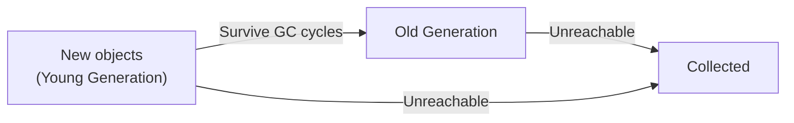
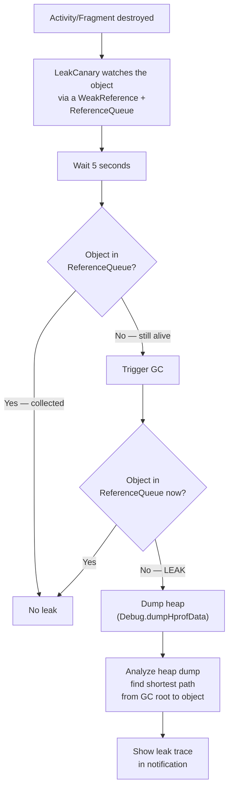

# Memory Management

## Memory Areas

| Area | What Lives Here | Scope |
|------|----------------|-------|
| **Heap** | Objects, arrays, class instances | Per-app — each app gets its own Dalvik/ART heap |
| **Stack** | Local variables, function call frames, primitive types | Per-thread — each thread has its own call stack (LIFO) |
| **Native Heap** | C/C++ allocations (JNI, NDK), bitmap pixel data (Android 8.0+) | Per-process |
| **Metaspace** | Class metadata, static variables, method bytecode | Shared across the runtime |

!!! note "Heap Limit"
    Each app has a maximum heap size set by the device manufacturer — typically **128-512MB** depending on RAM and device class. Check at runtime:

    ```kotlin
    val maxHeap = Runtime.getRuntime().maxMemory() / 1024 / 1024
    Log.d("Memory", "Max heap: ${maxHeap}MB")
    ```

    Exceeding this limit triggers `OutOfMemoryError`.

---

## Garbage Collection

Android's ART runtime uses **generational garbage collection**. Objects are divided by age:



| Generation | Characteristics |
|-----------|----------------|
| **Young gen** | Newly allocated objects. GC runs frequently here (minor GC) — fast because most objects die young. |
| **Old gen** | Objects that survived multiple young-gen GC cycles. GC runs less frequently here (major GC) — slower, may pause the app. |

### GC Roots

An object is reachable (alive) if it can be traced back to a **GC root**. GC roots include:

- **Local variables** on thread stacks
- **Static fields** of loaded classes
- **Active threads** (the `Thread` objects themselves)
- **JNI references** from native code
- **Monitor objects** (synchronized locks)

Any object not reachable from a GC root is eligible for collection.

!!! info "GC Pauses"
    When GC runs, the app is briefly paused. ART uses concurrent GC to minimize pauses, but a major GC (old gen) can still cause frame drops. At 60 FPS, each frame has a **16ms budget** — a GC pause that exceeds this causes visible jank.

??? question "Can we force GC?"
    No. `System.gc()` is only a **suggestion** to the runtime. There is no guarantee it will trigger garbage collection. ART may ignore it entirely.

---

## OutOfMemoryError

Occurs when the runtime cannot allocate an object because the heap is full. The line where OOM is thrown may not be the actual cause — a slow leak elsewhere fills the heap, and the next innocent allocation triggers the error.

!!! note "OOM is Preloaded"
    The `OutOfMemoryError` class is preloaded into Metaspace at startup. When the heap is full, the existing instance is thrown without needing a new allocation.

---

## Memory Leaks

A memory leak occurs when objects that are no longer needed remain reachable from a GC root, preventing garbage collection.

### Common Leak Patterns

=== "Static Reference to Activity"

    ```kotlin
    // BAD — Activity can never be GC'd
    companion object {
        lateinit var activity: Activity
    }
    ```

    **Fix:** Use `applicationContext` or `WeakReference`.

=== "Unregistered Listeners"

    ```kotlin
    // BAD — sensorManager holds a reference to the Activity
    override fun onResume() {
        sensorManager.registerListener(this, sensor, SENSOR_DELAY_NORMAL)
    }
    // If onPause never unregisters → leak
    ```

    **Fix:** Always unregister in the symmetric lifecycle callback.

=== "Inner Class Holding Outer Reference"

    ```kotlin
    // BAD — non-static inner class holds implicit reference to Activity
    class MainActivity : AppCompatActivity() {
        inner class MyTask : Runnable {
            override fun run() {
                // If posted to a Handler and Activity is destroyed
                // before the Runnable executes → leak
            }
        }
    }
    ```

    **Fix:** Use a `static` nested class (or top-level class) with a `WeakReference` to the Activity.

=== "Handler with Implicit Activity Reference"

    ```kotlin
    // BAD — anonymous Runnable captures Activity reference
    handler.postDelayed({
        updateUI() // 'this' is the Activity
    }, 30_000)
    ```

    **Fix:** Remove callbacks in `onDestroy()`:

    ```kotlin
    override fun onDestroy() {
        super.onDestroy()
        handler.removeCallbacksAndMessages(null)
    }
    ```

### How to Avoid Leaks

- **Use lifecycle-aware components**: `LiveData`, `Flow` with `collectAsStateWithLifecycle`
- **Never store Activity context in singletons** — use `applicationContext`
- **Unregister listeners** in the symmetric lifecycle callback (`onPause`/`onStop`/`onDestroy`)
- **Use `WeakReference`** for long-lived objects that need a reference to an Activity
- **Close resources**: file streams, cursors, database connections
- **Remove Handler callbacks** in `onDestroy()`

---

## LeakCanary

LeakCanary is a memory leak detection library that runs in debug builds and alerts you when a leak is found.

### How It Works Internally



1. When an Activity or Fragment is destroyed, LeakCanary stores a `WeakReference` to it paired with a `ReferenceQueue`
2. After a 5-second delay, it checks if the `WeakReference` was enqueued (meaning the object was GC'd)
3. If not enqueued, it triggers `Runtime.gc()` and checks again
4. If the object is still alive, it dumps the heap and uses the **Shark** library to analyze the heap dump
5. Shark finds the shortest strong reference path from a GC root to the leaked object and displays it as a leak trace

```kotlin
// Setup — just add the dependency; no code needed
// build.gradle.kts
dependencies {
    debugImplementation("com.squareup.leakcanary:leakcanary-android:2.14")
}
// LeakCanary auto-installs via its ContentProvider
```

---

## Memory Profiler

Android Studio's Memory Profiler provides real-time visibility into heap usage.

### Key Capabilities

| Feature | What It Shows |
|---------|--------------|
| **Live allocations** | Real-time graph of memory usage by category (Java, Native, Graphics, Stack) |
| **Heap dump** | Snapshot of all objects on the heap — filter by class, package, or allocation site |
| **Allocation tracking** | Record allocations over time to find hot spots |
| **Leak detection** | Built-in leak detection in heap dump analysis |

### Workflow

1. **Attach** the profiler to a running debug app
2. **Reproduce** the suspected leak (e.g., rotate the screen 5 times)
3. **Force GC** (trash can icon) to collect unreachable objects
4. **Capture heap dump** — look for objects that should not exist (e.g., multiple Activity instances)
5. **Inspect references** — right-click an object to see what holds a reference to it

!!! tip "Finding leaks without LeakCanary"
    In the heap dump, filter by your Activity class. If you see more than one instance after rotating, one is leaked. Click it and trace the reference chain to find what is holding it alive.

---

## Bitmap Memory

Since **Android 8.0 (Oreo)**, bitmap pixel data is stored on the **native heap** instead of the Java heap. However, it is still counted against the app's heap limit for OOM purposes.

### Downsampling

Loading a full-resolution image when you only need a thumbnail wastes memory. Use `inSampleSize` to downsample:

```kotlin
fun decodeSampledBitmap(res: Resources, resId: Int, reqWidth: Int, reqHeight: Int): Bitmap {
    // First pass: decode bounds only (no pixels loaded)
    val options = BitmapFactory.Options().apply {
        inJustDecodeBounds = true
    }
    BitmapFactory.decodeResource(res, resId, options)

    // Calculate inSampleSize
    options.inSampleSize = calculateInSampleSize(options, reqWidth, reqHeight)

    // Second pass: decode with inSampleSize
    options.inJustDecodeBounds = false
    return BitmapFactory.decodeResource(res, resId, options)
}

fun calculateInSampleSize(options: BitmapFactory.Options, reqW: Int, reqH: Int): Int {
    val (height, width) = options.outHeight to options.outWidth
    var inSampleSize = 1
    if (height > reqH || width > reqW) {
        val halfHeight = height / 2
        val halfWidth = width / 2
        while (halfHeight / inSampleSize >= reqH && halfWidth / inSampleSize >= reqW) {
            inSampleSize *= 2
        }
    }
    return inSampleSize
}
```

!!! tip "In practice, use Coil or Glide"
    Image loading libraries handle downsampling, caching, and memory management automatically. Manual `BitmapFactory` decoding is only needed for custom use cases.

---

## Low Memory Killer (LMK)

Android's kernel-level Low Memory Killer daemon terminates processes based on priority when system memory is low.

### Process Priority (highest to lowest)

| Priority | Type | Example | Killed? |
|----------|------|---------|---------|
| 1 | **Foreground** | Activity in `onResume()`, Service running `startForeground()` | Last to be killed |
| 2 | **Visible** | Activity in `onPause()` (partially visible, e.g., behind a dialog) | Rarely killed |
| 3 | **Service** | Background Service running `startService()` (within 30 min) | Killed under pressure |
| 4 | **Cached** | Activity in `onStop()` — app is backgrounded | Killed freely, LRU order |
| 5 | **Empty** | Process with no active components | First to be killed |

!!! note "This is why background work needs WorkManager"
    A cached process can be killed at any time. If you need work to survive process death, use WorkManager (which persists the request to a database and uses JobScheduler to resume it).

---

## largeHeap

```xml
<application android:largeHeap="true" ... >
```

!!! warning "Why `largeHeap` is bad"
    - **Longer GC pauses** — more heap to scan means more pause time and more jank
    - **Not actually more memory on low-end devices** — the system may grant only marginally more heap
    - **Masks real problems** — the app still leaks, it just takes longer to OOM
    - **Competes with other apps** — the system has less memory for other processes, making the overall device slower

    `largeHeap` is acceptable only for apps that genuinely need large data in memory (photo editors, video editors). For everything else, fix the leak.

---

## Process Death & State Restoration

Process death is **not** the same as Activity destruction. The OS kills the **entire process** when it needs memory. When the user returns, the OS recreates the Activity from saved state.

```
User backgrounds app → OS needs memory → Process killed → User returns →
OS recreates Activity from saved state
```

### What Survives

| Mechanism | Config Change | Process Death | App Update |
|-----------|:---:|:---:|:---:|
| ViewModel | Yes | No | No |
| SavedStateHandle | Yes | Yes | No |
| onSaveInstanceState | Yes | Yes | No |
| Room / DataStore | Yes | Yes | Yes |

### SavedStateRegistry

`SavedStateHandle` (used in ViewModels) works through the `SavedStateRegistry`:

1. When the system calls `onSaveInstanceState()`, the `SavedStateRegistry` collects state from all registered `SavedStateProvider`s
2. State is bundled into the Activity's `Bundle`
3. On restore, `SavedStateHandle` reads from the restored `Bundle`

In Compose, `rememberSaveable` uses the same mechanism under the hood — it registers a `SavedStateProvider` with the `SavedStateRegistry` to persist state across process death.

```kotlin
// ViewModel with SavedStateHandle
@HiltViewModel
class SearchViewModel @Inject constructor(
    private val savedStateHandle: SavedStateHandle
) : ViewModel() {
    // Survives process death
    val query = savedStateHandle.getStateFlow("query", "")

    fun setQuery(q: String) {
        savedStateHandle["query"] = q
    }
}

// Compose — rememberSaveable survives process death
@Composable
fun SearchScreen() {
    var query by rememberSaveable { mutableStateOf("") }
    TextField(value = query, onValueChange = { query = it })
}
```

### How to Test Process Death

1. Background the app
2. Run `adb shell am kill com.example.app`
3. Re-open from recents
4. Verify the screen restores correctly

!!! warning "When this bites you"
    Process death is hard to reproduce naturally. Enable **"Don't keep activities"** in Developer Options to simulate aggressive destruction. Apps that don't handle process death show blank screens or crash when users return after a long background period.

---

## Performance Checklist

- [ ] Use **Profiler** and **LeakCanary** to find leaks
- [ ] Check heap limit with `Runtime.getRuntime().maxMemory()`
- [ ] Downsample bitmaps — never load full resolution into memory
- [ ] Use `onTrimMemory()` to clear caches when backgrounded
- [ ] Close resources (streams, cursors, database connections)
- [ ] Avoid `largeHeap` — fix the underlying problem instead
- [ ] Handle process death with `SavedStateHandle` and `rememberSaveable`
- [ ] Use `const val` for compile-time constants (avoids allocation)
- [ ] Avoid autoboxing — use primitive-friendly collections (`SparseArray`, `IntArray`)
- [ ] Use `RecyclerView` / `LazyColumn` instead of inflating large lists
