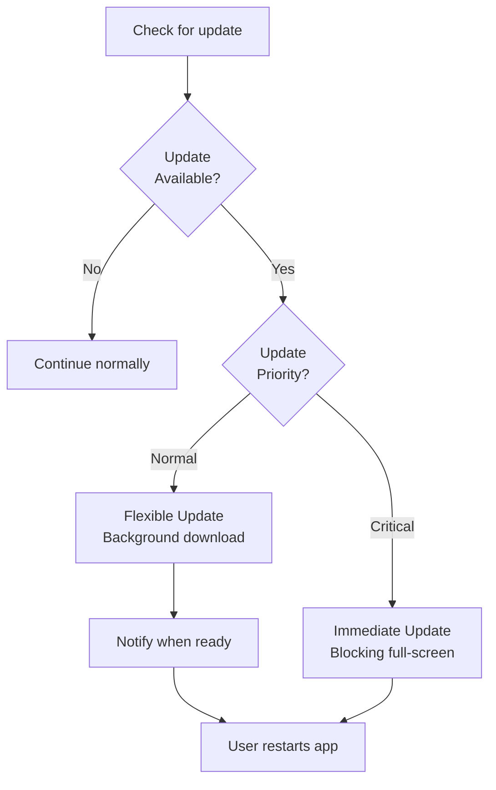
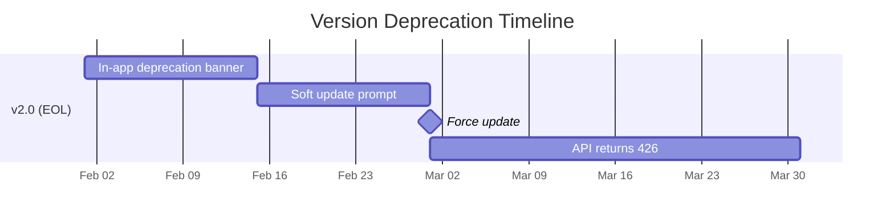

# App Updates

## In-App Update API

The Play Core In-App Update API prompts users to update without leaving the app.



### Update Types

| Type | UX | Use Case |
|------|-----|----------|
| **Immediate** | Full-screen blocking flow, app unusable until updated | Critical security fixes, broken API compatibility |
| **Flexible** | Downloads in background, user prompted to restart | Feature updates, non-critical fixes |

---

## Implementation

=== "Check for Update"

    ```kotlin
    class UpdateManager @Inject constructor(
        private val activity: Activity
    ) {
        private val appUpdateManager = AppUpdateManagerFactory.create(activity)

        fun checkForUpdate() {
            appUpdateManager.appUpdateInfo.addOnSuccessListener { info ->
                when {
                    info.updateAvailability() == UpdateAvailability.UPDATE_AVAILABLE
                        && info.updatePriority() >= 4
                        && info.isUpdateTypeAllowed(AppUpdateType.IMMEDIATE) -> {
                        startImmediateUpdate(info)
                    }
                    info.updateAvailability() == UpdateAvailability.UPDATE_AVAILABLE
                        && info.isUpdateTypeAllowed(AppUpdateType.FLEXIBLE) -> {
                        startFlexibleUpdate(info)
                    }
                }
            }
        }
    }
    ```

=== "Immediate Update"

    ```kotlin
    private fun startImmediateUpdate(info: AppUpdateInfo) {
        appUpdateManager.startUpdateFlowForResult(
            info,
            AppUpdateType.IMMEDIATE,
            activity,
            REQUEST_CODE_UPDATE
        )
    }

    // In onResume — handle case where user backs out
    override fun onResume() {
        super.onResume()
        appUpdateManager.appUpdateInfo.addOnSuccessListener { info ->
            if (info.updateAvailability() == UpdateAvailability.DEVELOPER_TRIGGERED_UPDATE_IN_PROGRESS) {
                // Force restart the update flow
                startImmediateUpdate(info)
            }
        }
    }
    ```

=== "Flexible Update"

    ```kotlin
    private fun startFlexibleUpdate(info: AppUpdateInfo) {
        val listener = InstallStateUpdatedListener { state ->
            when (state.installStatus()) {
                InstallStatus.DOWNLOADED -> showRestartSnackbar()
                InstallStatus.FAILED -> Timber.e("Update failed: ${state.installErrorCode()}")
                else -> {}
            }
        }

        appUpdateManager.registerListener(listener)
        appUpdateManager.startUpdateFlowForResult(
            info,
            AppUpdateType.FLEXIBLE,
            activity,
            REQUEST_CODE_UPDATE
        )
    }

    private fun showRestartSnackbar() {
        Snackbar.make(rootView, "Update ready to install", Snackbar.LENGTH_INDEFINITE)
            .setAction("Restart") { appUpdateManager.completeUpdate() }
            .show()
    }
    ```

---

## Update Priority

Set priority in Play Console or via Play Developer API (1-5):

| Priority | Meaning | Recommended UX |
|----------|---------|----------------|
| 0 | Default (no priority set) | Flexible |
| 1-2 | Low — cosmetic fixes | Flexible, dismissible |
| 3 | Medium — feature update | Flexible, persistent prompt |
| 4-5 | High — critical fix | Immediate (blocking) |

!!! note "Staleness"
    `info.clientVersionStalenessDays()` returns how many days since the update was published. Use this to escalate: show flexible for 7 days, then switch to immediate for stale installs.

---

## Forced Update (Custom Implementation)

For cases where the Play In-App Update API isn't sufficient (e.g., backend API deprecation):

```kotlin
data class VersionConfig(
    val minimumVersion: String,     // Below this = force update
    val recommendedVersion: String, // Below this = soft prompt
    val updateUrl: String
)

class ForceUpdateChecker @Inject constructor(
    private val remoteConfig: FirebaseRemoteConfig
) {
    fun check(currentVersion: String): UpdateAction {
        val config = getVersionConfig()
        val current = AppVersion.parse(currentVersion)
        val minimum = AppVersion.parse(config.minimumVersion)
        val recommended = AppVersion.parse(config.recommendedVersion)

        return when {
            current < minimum -> UpdateAction.ForceUpdate(config.updateUrl)
            current < recommended -> UpdateAction.SoftPrompt(config.updateUrl)
            else -> UpdateAction.None
        }
    }
}

sealed class UpdateAction {
    data class ForceUpdate(val url: String) : UpdateAction()
    data class SoftPrompt(val url: String) : UpdateAction()
    object None : UpdateAction()
}
```

### Force Update UI

```kotlin
@Composable
fun ForceUpdateScreen(updateUrl: String) {
    Column(
        modifier = Modifier.fillMaxSize().padding(32.dp),
        verticalArrangement = Arrangement.Center,
        horizontalAlignment = Alignment.CenterHorizontally
    ) {
        Icon(Icons.Default.SystemUpdate, contentDescription = null, modifier = Modifier.size(64.dp))
        Spacer(modifier = Modifier.height(16.dp))
        Text("Update Required", style = MaterialTheme.typography.headlineMedium)
        Spacer(modifier = Modifier.height(8.dp))
        Text("Please update to continue using the app.", textAlign = TextAlign.Center)
        Spacer(modifier = Modifier.height(24.dp))
        Button(onClick = { openPlayStore(updateUrl) }) {
            Text("Update Now")
        }
    }
    // Block back navigation
    BackHandler { /* no-op — cannot dismiss */ }
}
```

---

## Backward Compatibility

### API Versioning Strategy

| Strategy | How It Works | Trade-off |
|----------|-------------|-----------|
| **URL versioning** | `/api/v1/users`, `/api/v2/users` | Simple, but proliferates endpoints |
| **Header versioning** | `Api-Version: 2` header | Clean URLs, harder to cache |
| **Sunset headers** | `Sunset: Sat, 01 Mar 2025 00:00:00 GMT` | Standard deprecation notice |

### Supporting Multiple App Versions

```kotlin
// Backend returns minimum supported API version
data class ApiConfig(
    val currentApiVersion: Int,
    val minimumClientVersion: Int,
    val deprecatedVersions: List<Int>
)

// Client-side: intercept responses for version mismatch
class ApiVersionInterceptor(
    private val clientVersion: Int
) : Interceptor {
    override fun intercept(chain: Interceptor.Chain): Response {
        val request = chain.request().newBuilder()
            .header("X-Client-Version", clientVersion.toString())
            .build()

        val response = chain.proceed(request)

        if (response.code == 426) { // Upgrade Required
            // Trigger force update flow
            EventBus.post(ForceUpdateEvent)
        }

        return response
    }
}
```

---

## Deprecation Communication

| Channel | When to Use |
|---------|-------------|
| **In-app banner** | 30 days before sunset — non-blocking |
| **Soft update prompt** | 14 days before — dismissible dialog |
| **Force update** | On sunset day — blocking |
| **Push notification** | 7 days and 1 day before — reminder |
| **API 426 response** | After sunset — old versions can't function |



---

??? question "Common Interview Questions"

    **Q: Immediate vs Flexible in-app update — how do you decide?**
    Use Immediate for security vulnerabilities, broken API compatibility, or data corruption bugs — anything where running the old version actively harms the user. Use Flexible for everything else — feature additions, performance improvements, non-critical fixes. Consider using staleness days to escalate: start flexible, switch to immediate after 14 days.

    **Q: Can you force a user to update their app?**
    Not truly — you can't remotely uninstall or modify their APK. But you can: (1) show a blocking UI with no dismiss option, (2) return HTTP 426 from your API so the app can't function, (3) use Immediate in-app update flow. Users can still disable auto-update or remain offline, so plan for grace periods.

    **Q: How do you handle the transition period where both old and new app versions are in the wild?**
    Backend API must support both versions simultaneously during the transition. Use API versioning (URL or header). Set a deprecation timeline with clear communication. Track the percentage of requests from old versions — once below threshold (e.g., <1%), sunset the old API version.

    **Q: What's the user experience if an immediate update fails?**
    The In-App Update API shows an error state. In `onResume`, check if `DEVELOPER_TRIGGERED_UPDATE_IN_PROGRESS` — if so, restart the flow. For persistent failures (network issues), show a manual "Go to Play Store" button as fallback. Log the failure to crashlytics with `installErrorCode` for debugging.

!!! tip "Further Reading"
    - [In-App Updates documentation](https://developer.android.com/guide/playcore/in-app-updates)
    - [Play Developer API](https://developers.google.com/android-publisher)
    - [HTTP 426 Upgrade Required](https://developer.mozilla.org/en-US/docs/Web/HTTP/Status/426)
