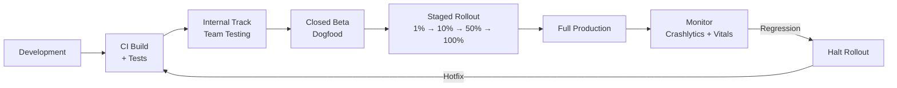

# Mobile Release Strategy

Shipping an Android app involves far more than pressing "publish." A mature release strategy covers versioning, build pipelines, staged rollouts, feature flags, and update mechanisms — each designed to reduce blast radius and increase deployment confidence.

---

## Sub-Topics

| Topic | What It Covers |
|-------|---------------|
| [Release Pipeline](release-pipeline.md) | CI/CD setup, signing, Play Store deployment, internal/beta tracks |
| [Versioning](versioning.md) | Version codes, semantic versioning, version management across variants |
| [Staged Rollouts & Feature Flags](staged-rollouts.md) | Phased rollouts, percentage-based releases, remote config, feature gates |
| [App Updates](app-updates.md) | In-app update API, forced updates, backward compatibility, deprecation |

---

## Release Lifecycle

---

## Play Store Tracks

| Track | Audience | Purpose |
|-------|----------|---------|
| **Internal testing** | Up to 100 testers | Quick smoke testing, no review |
| **Closed testing (Alpha)** | Invited testers | Broader QA, specific user groups |
| **Open testing (Beta)** | Anyone can opt in | Public beta, collect feedback |
| **Production** | All users | Staged or full release |

!!! note "Review Times"
    Internal track has no review. Closed/Open beta typically reviewed within hours. Production review can take 1-7 days for new apps, usually <24h for updates to established apps.

---

## Release Checklist

| Phase | Action |
|-------|--------|
| **Pre-release** | Run full test suite, check ProGuard/R8 mapping, verify feature flags, update changelog |
| **Build** | Bump version code, sign with release keystore, generate AAB |
| **Deploy** | Upload to internal track, QA sign-off, promote to beta/production |
| **Monitor** | Watch crash-free rate for 24h, monitor ANR rate, check Android Vitals |
| **Rollback** | Halt rollout if crash-free < 99.5%, push hotfix if critical |

---

## Key Principles

| Principle | What It Means |
|-----------|--------------|
| **Ship small, ship often** | Smaller releases = smaller blast radius, easier rollbacks |
| **Automate everything** | Human error is the #1 release failure cause |
| **Progressive delivery** | Never go from 0% to 100% — always stage |
| **Monitor before expanding** | Wait for stability signal before increasing rollout |
| **Decouple deploy from release** | Feature flags let you deploy code without activating features |

!!! tip "Further Reading"
    - [Play Console release management](https://support.google.com/googleplay/android-developer/answer/9859348)
    - [Android App Bundle](https://developer.android.com/guide/app-bundle)
    - [Supply (Fastlane for Android)](https://docs.fastlane.tools/actions/supply/)
