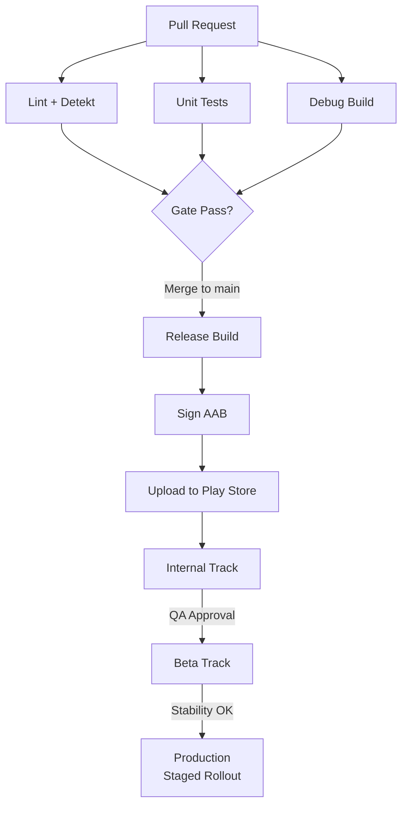

# Release Pipeline

## CI/CD Architecture



---

## Signing Configuration

### Release Signing

```kotlin
// build.gradle.kts (app module)
android {
    signingConfigs {
        create("release") {
            storeFile = file(System.getenv("KEYSTORE_PATH") ?: "../keystore.jks")
            storePassword = System.getenv("KEYSTORE_PASSWORD") ?: ""
            keyAlias = System.getenv("KEY_ALIAS") ?: ""
            keyPassword = System.getenv("KEY_PASSWORD") ?: ""
        }
    }

    buildTypes {
        release {
            signingConfig = signingConfigs.getByName("release")
            isMinifyEnabled = true
            isShrinkResources = true
            proguardFiles(
                getDefaultProguardFile("proguard-android-optimize.txt"),
                "proguard-rules.pro"
            )
        }
    }
}
```

!!! warning "Keystore Security"
    Never commit keystores or passwords to version control. Store the keystore in a secure vault (e.g., GitHub Secrets, Google Cloud KMS) and inject via CI environment variables.

### Play App Signing

| Approach | Who Holds Upload Key | Who Holds App Signing Key |
|----------|---------------------|--------------------------|
| **Play App Signing (recommended)** | You | Google |
| **Self-managed** | You | You |

With Play App Signing, you sign with an upload key and Google re-signs with the app signing key. If you lose your upload key, Google can reset it. If you self-manage and lose the signing key, the app is unrecoverable.

---

## GitHub Actions Pipeline

```yaml
name: Release

on:
  push:
    tags:
      - 'v*'

jobs:
  release:
    runs-on: ubuntu-latest
    steps:
      - uses: actions/checkout@v4

      - uses: actions/setup-java@v4
        with:
          distribution: 'temurin'
          java-version: '17'

      - uses: gradle/actions/setup-gradle@v3

      - name: Decode keystore
        run: echo "${{ secrets.KEYSTORE_BASE64 }}" | base64 -d > keystore.jks

      - name: Build release AAB
        env:
          KEYSTORE_PATH: keystore.jks
          KEYSTORE_PASSWORD: ${{ secrets.KEYSTORE_PASSWORD }}
          KEY_ALIAS: ${{ secrets.KEY_ALIAS }}
          KEY_PASSWORD: ${{ secrets.KEY_PASSWORD }}
        run: ./gradlew bundleRelease

      - name: Upload to Play Store (Internal)
        uses: r0adkll/upload-google-play@v1
        with:
          serviceAccountJsonPlainText: ${{ secrets.PLAY_SERVICE_ACCOUNT }}
          packageName: com.example.app
          releaseFiles: app/build/outputs/bundle/release/app-release.aab
          track: internal
          mappingFile: app/build/outputs/mapping/release/mapping.txt
```

---

## Fastlane Alternative

```ruby
# Fastfile
default_platform(:android)

platform :android do
  lane :deploy_internal do
    gradle(task: "bundleRelease")
    upload_to_play_store(
      track: "internal",
      aab: "app/build/outputs/bundle/release/app-release.aab",
      skip_upload_metadata: true,
      skip_upload_changelogs: false
    )
  end

  lane :promote_to_production do |options|
    upload_to_play_store(
      track: "internal",
      track_promote_to: "production",
      rollout: options[:rollout] || "0.01"
    )
  end
end
```

---

## Build Artifacts

| Artifact | Format | Purpose |
|----------|--------|---------|
| **AAB** | `.aab` | Play Store upload (dynamic delivery, smaller downloads) |
| **APK** | `.apk` | Direct install, side-loading, alternative stores |
| **Mapping file** | `mapping.txt` | ProGuard/R8 deobfuscation |
| **Native symbols** | `.so` debug symbols | NDK crash symbolication |
| **Test results** | JUnit XML | CI reporting |

!!! note "AAB vs APK"
    Google Play requires AAB for new apps. AAB enables Dynamic Delivery — Google generates optimized APKs per device configuration (ABI, screen density, language). This can reduce download size by 15-30%.

---

## Pipeline Quality Gates

| Gate | Tool | Failure Action |
|------|------|---------------|
| **Lint** | Android Lint + custom rules | Block merge |
| **Static analysis** | Detekt (Kotlin) | Block merge |
| **Unit tests** | JUnit + Mockk | Block merge |
| **UI tests** | Espresso / Compose tests | Block release |
| **Code coverage** | Kover / JaCoCo | Warn if < threshold |
| **APK size** | Custom script | Warn if > budget |
| **Dependency check** | Dependabot / Renovate | Auto-PR |
| **Security scan** | OWASP dependency-check | Block release |

---

## Release Branching Strategy

=== "Trunk-Based (Recommended)"

    ```mermaid
    gitGraph
        commit id: "feat A"
        commit id: "feat B"
        branch release/1.5.0
        commit id: "bump version"
        commit id: "cherry-pick fix"
        checkout main
        commit id: "feat C"
        commit id: "feat D"
    ```

    - All development on `main`
    - Cut release branch when ready to ship
    - Only cherry-pick critical fixes to release branch
    - Feature flags gate unreleased features

=== "Git Flow"

    ```mermaid
    gitGraph
        commit id: "init"
        branch develop
        commit id: "feat A"
        commit id: "feat B"
        branch release/1.5.0
        commit id: "stabilize"
        checkout main
        merge release/1.5.0 id: "v1.5.0" tag: "v1.5.0"
        checkout develop
        commit id: "feat C"
    ```

    - `develop` branch for integration
    - Release branches for stabilization
    - Merge back to `main` and tag for release

---

??? question "Common Interview Questions"

    **Q: Why AAB over APK for Play Store distribution?**
    AAB (Android App Bundle) enables Dynamic Delivery — Google generates optimized APKs per device, including only the relevant ABI, screen density, and language resources. This reduces download size by 15-30%. It also enables on-demand feature modules and asset packs for large content.

    **Q: What happens if you lose your app signing key?**
    With Play App Signing: contact Google to reset your upload key — the app signing key is safe in Google's infrastructure. Without Play App Signing: the app is permanently unrecoverable — you cannot publish updates to the same package name. This is why Play App Signing is strongly recommended.

    **Q: How do you handle hotfixes for a released version?**
    Cherry-pick the fix to the release branch, bump the version code, build and sign, upload to internal track for quick smoke test, then promote to production with an accelerated rollout (skip staged rollout for critical fixes). Never merge untested code directly to production.

    **Q: Trunk-based vs Git Flow for mobile?**
    Trunk-based with feature flags is preferred for mobile because: releases are time-boxed (not feature-gated), it avoids long-lived branches that drift, and feature flags decouple deployment from activation. Git Flow adds overhead without benefit when CI/CD and feature flags handle the same problems.

!!! tip "Further Reading"
    - [Play App Signing](https://developer.android.com/studio/publish/app-signing)
    - [Fastlane for Android](https://docs.fastlane.tools/getting-started/android/setup/)
    - [GitHub Actions for Android](https://github.com/marketplace/actions/upload-android-release-to-play-store)
