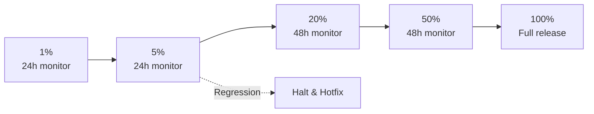
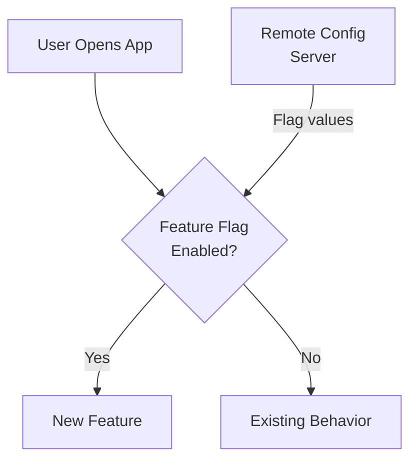

# Staged Rollouts & Feature Flags

## Staged Rollouts on Play Store

A staged rollout delivers an update to a percentage of your user base, allowing you to monitor stability before full deployment.



### Rollout Percentages

| Stage | % Users | Duration | Gate Criteria |
|-------|---------|----------|---------------|
| 1 | 1% | 24 hours | No new crash clusters |
| 2 | 5% | 24 hours | Crash-free > 99.5% |
| 3 | 20% | 48 hours | No ANR spike, vitals stable |
| 4 | 50% | 48 hours | No user-reported regressions |
| 5 | 100% | — | All metrics stable |

!!! note "User Assignment is Sticky"
    Once a user is in the rollout percentage, they stay in. The percentage determines who *can* receive the update — users are randomly assigned and don't flip between versions.

### Halting a Rollout

```bash
# Using Fastlane
fastlane supply --track production --rollout 0 --version_code 42

# Or in Play Console: Release > Production > Halt rollout
```

When you halt:

- Users who already updated keep the new version
- No new users receive the update
- You can resume at any percentage or create a new release

---

## Feature Flags

Feature flags decouple **deployment** from **release**. Code ships to all users, but functionality is gated behind a remote config check.



### Firebase Remote Config

```kotlin
class FeatureFlags @Inject constructor(
    private val remoteConfig: FirebaseRemoteConfig
) {
    // Fetch flags on app start
    suspend fun initialize() {
        remoteConfig.setDefaultsAsync(R.xml.remote_config_defaults).await()
        remoteConfig.fetchAndActivate().await()
    }

    val isNewCheckoutEnabled: Boolean
        get() = remoteConfig.getBoolean("new_checkout_enabled")

    val maxCartItems: Long
        get() = remoteConfig.getLong("max_cart_items")

    val searchAlgorithm: String
        get() = remoteConfig.getString("search_algorithm")
}
```

```xml
<!-- res/xml/remote_config_defaults.xml -->
<?xml version="1.0" encoding="utf-8"?>
<defaultsMap>
    <entry>
        <key>new_checkout_enabled</key>
        <value>false</value>
    </entry>
    <entry>
        <key>max_cart_items</key>
        <value>50</value>
    </entry>
</defaultsMap>
```

### Feature Flag in Compose UI

```kotlin
@Composable
fun CheckoutScreen(featureFlags: FeatureFlags = hiltViewModel<CheckoutVM>().featureFlags) {
    if (featureFlags.isNewCheckoutEnabled) {
        NewCheckoutFlow()
    } else {
        LegacyCheckoutFlow()
    }
}
```

---

## Flag Lifecycle

| Phase | Action |
|-------|--------|
| **Create** | Add flag with default = off, deploy code behind flag |
| **Test** | Enable for internal team, then beta users |
| **Rollout** | Gradually increase percentage (1% → 10% → 50% → 100%) |
| **Stabilize** | Monitor metrics, ensure no regressions |
| **Cleanup** | Remove flag and old code path, delete remote config entry |

!!! warning "Flag Debt"
    Flags that live forever become technical debt. Set a removal date when creating the flag. Stale flags increase code complexity, testing surface, and cognitive load. Aim to clean up within 2 sprints of full rollout.

---

## A/B Testing with Feature Flags

```kotlin
class ExperimentManager @Inject constructor(
    private val remoteConfig: FirebaseRemoteConfig,
    private val analytics: FirebaseAnalytics
) {
    fun getCheckoutVariant(): CheckoutVariant {
        val variant = remoteConfig.getString("checkout_experiment")
        // Log exposure for experiment analysis
        analytics.logEvent("experiment_exposure") {
            param("experiment", "checkout_redesign")
            param("variant", variant)
        }
        return CheckoutVariant.valueOf(variant.uppercase())
    }
}

enum class CheckoutVariant {
    CONTROL,    // Existing flow
    VARIANT_A,  // Single-page checkout
    VARIANT_B   // Progressive disclosure
}
```

---

## Targeting & Segmentation

| Criterion | Example Use Case |
|-----------|-----------------|
| **App version** | Only enable for 2.5.0+ (requires client code support) |
| **Country** | Comply with regional regulations |
| **Device** | Disable heavy animations on low-end devices |
| **User property** | Enable for premium tier first |
| **Random percentage** | Gradual rollout to N% of users |
| **User ID list** | Internal dogfood group |

```kotlin
// Firebase Remote Config conditions (set in console)
// Condition: "Beta Users" → User property "beta_tester" == "true"
// Condition: "US Only" → Country/Region in [US]
// Condition: "Gradual 10%" → Random percentile <= 10
```

---

## Kill Switch Pattern

A kill switch immediately disables a feature in production without an app update:

```kotlin
class KillSwitch @Inject constructor(
    private val remoteConfig: FirebaseRemoteConfig
) {
    fun isFeatureKilled(featureKey: String): Boolean {
        return remoteConfig.getBoolean("kill_${featureKey}")
    }
}

// Usage in critical paths
fun processPayment(order: Order) {
    if (killSwitch.isFeatureKilled("payments")) {
        showMaintenanceMessage()
        return
    }
    // Normal payment flow
}
```

---

## Monitoring During Rollout

| Metric | Source | What to Watch |
|--------|--------|---------------|
| **Crash-free rate** | Crashlytics | Segmented by flag state (on/off) |
| **ANR rate** | Android Vitals | Compare control vs treatment |
| **Revenue** | Analytics | Conversion rate per variant |
| **Engagement** | Analytics | Session length, feature usage |
| **Performance** | Firebase Perf | Startup time, frame rate per variant |

---

??? question "Common Interview Questions"

    **Q: How does a staged rollout differ from a feature flag?**
    A staged rollout controls which users receive a new *binary* (APK/AAB version). A feature flag controls which users see a new *feature* within the same binary. Staged rollouts require a Play Store update; feature flags can change instantly via remote config. Best practice: combine both — deploy behind a flag, then enable gradually after the binary is widely distributed.

    **Q: What happens if you find a critical bug at 5% rollout?**
    Halt the rollout immediately (stops new installs). Users who already updated keep the buggy version — you can't force a downgrade. Options: (1) push a hotfix build with higher version code, (2) use a kill switch to disable the broken feature remotely, (3) if the flag-gated feature is the issue, disable the flag.

    **Q: How do you prevent feature flag spaghetti?**
    1. Enforce a flag lifecycle policy — every flag has an owner and expiration date.
    2. Limit nesting (no flag inside a flag inside a flag).
    3. Run automated checks for stale flags (> 30 days at 100%).
    4. Treat flag cleanup as part of the feature's "done" criteria.
    5. Keep a registry of active flags with ownership.

    **Q: How do you test all flag combinations?**
    You don't — combinatorial explosion makes it impossible. Test: all flags on, all flags off, and each flag individually toggled. For critical interactions, test specific known combinations. Use dependency metadata to track which flags interact.

!!! tip "Further Reading"
    - [Firebase Remote Config](https://firebase.google.com/docs/remote-config)
    - [Play Store staged rollouts](https://support.google.com/googleplay/android-developer/answer/6346149)
    - [Feature Flags best practices (Martin Fowler)](https://martinfowler.com/articles/feature-toggles.html)
