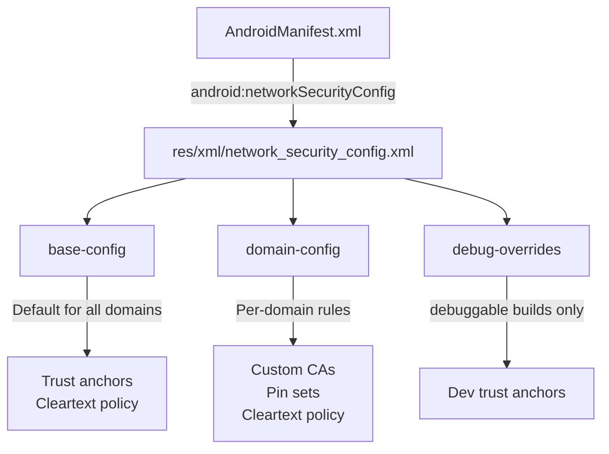
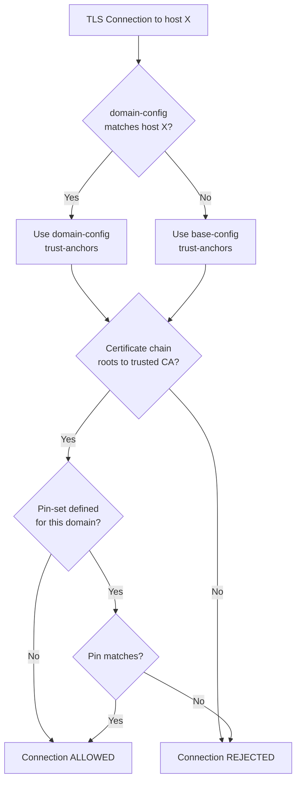

# Network Security Config

---

## What Is Network Security Config?

**Network Security Config** (NSC) is a declarative XML framework introduced in **Android 7.0 (API 24)** that lets you customize your app's network security settings without modifying code. It controls:

- Which CAs your app trusts
- Whether cleartext (HTTP) traffic is allowed
- Certificate pinning rules
- Debug-specific overrides

NSC applies to **all network traffic** from the app — OkHttp, HttpURLConnection, WebView, and third-party SDKs.



---

## Setup

### 1. Create the Config File

```xml
<!-- res/xml/network_security_config.xml -->
<network-security-config>
    <base-config cleartextTrafficPermitted="false">
        <trust-anchors>
            <certificates src="system" />
        </trust-anchors>
    </base-config>
</network-security-config>
```

### 2. Reference in Manifest

```xml
<!-- AndroidManifest.xml -->
<application
    android:networkSecurityConfig="@xml/network_security_config"
    ... >
```

!!! note "Default Behavior by API Level"
    If no NSC is specified, the platform defaults depend on `targetSdkVersion`:

    | Target SDK | Cleartext (HTTP) | Trusted CAs |
    |-----------|------------------|-------------|
    | **< 24** | Allowed | System + User-installed |
    | **24–27** | Allowed | System only |
    | **≥ 28** | **Blocked** | System only |

---

## Base Config

The `<base-config>` element sets defaults for all connections that don't match a specific `<domain-config>`.

```xml
<network-security-config>
    <base-config cleartextTrafficPermitted="false">
        <trust-anchors>
            <certificates src="system" />
        </trust-anchors>
    </base-config>
</network-security-config>
```

| Attribute | Values | Default (SDK ≥ 28) |
|-----------|--------|-------------------|
| `cleartextTrafficPermitted` | `true` / `false` | `false` |
| `<certificates src="...">` | `system`, `user`, file path | `system` |

!!! warning "Cleartext Traffic"
    Starting with Android 9 (API 28), cleartext HTTP is blocked by default. If your app needs HTTP for specific domains (e.g., local dev servers, legacy APIs), use `<domain-config>` to allowlist only those domains rather than enabling cleartext globally.

---

## Domain Config

`<domain-config>` applies rules to specific domains, overriding the base config.

```xml
<network-security-config>
    <base-config cleartextTrafficPermitted="false">
        <trust-anchors>
            <certificates src="system" />
        </trust-anchors>
    </base-config>

    <!-- Allow cleartext only for local dev server -->
    <domain-config cleartextTrafficPermitted="true">
        <domain includeSubdomains="false">10.0.2.2</domain>
    </domain-config>

    <!-- Pin certificates for API domain -->
    <domain-config>
        <domain includeSubdomains="true">api.example.com</domain>
        <pin-set expiration="2027-01-01">
            <pin digest="SHA-256">AAAAAAAAAAAAAAAAAAAAAAAAAAAAAAAAAAAAAAAAAAA=</pin>
            <pin digest="SHA-256">BBBBBBBBBBBBBBBBBBBBBBBBBBBBBBBBBBBBBBBBBBB=</pin>
        </pin-set>
    </domain-config>

    <!-- Trust a private CA for internal services -->
    <domain-config>
        <domain includeSubdomains="true">internal.corp.com</domain>
        <trust-anchors>
            <certificates src="@raw/internal_ca" />
        </trust-anchors>
    </domain-config>
</network-security-config>
```

### Domain Matching Rules

| Pattern | Matches | Does Not Match |
|---------|---------|----------------|
| `api.example.com` | `api.example.com` | `sub.api.example.com` |
| `api.example.com` + `includeSubdomains="true"` | `api.example.com`, `v2.api.example.com` | `example.com` |
| `example.com` + `includeSubdomains="true"` | `example.com`, `api.example.com`, `a.b.example.com` | `notexample.com` |

### Nesting Domain Configs

Domain configs can be nested — the most specific match wins:

```xml
<domain-config>
    <domain includeSubdomains="true">example.com</domain>
    <trust-anchors>
        <certificates src="system" />
    </trust-anchors>

    <!-- More specific: overrides parent for api.example.com -->
    <domain-config>
        <domain>api.example.com</domain>
        <pin-set expiration="2027-01-01">
            <pin digest="SHA-256">AAAA...=</pin>
        </pin-set>
    </domain-config>
</domain-config>
```

---

## Trust Anchors

Trust anchors define which Certificate Authorities the app trusts for TLS connections.

### Certificate Sources

| Source | Description | Use Case |
|--------|-------------|----------|
| `system` | Pre-installed CAs in `/system/etc/security/cacerts/` | Default — trust public CAs |
| `user` | CAs installed by the user or MDM profiles | Corporate proxies, testing |
| `@raw/ca_cert` | A CA certificate bundled in `res/raw/` | Self-signed / private CA servers |

### Trusting a Custom CA

For internal servers or staging environments using self-signed certificates:

```xml
<domain-config>
    <domain includeSubdomains="true">staging.internal.com</domain>
    <trust-anchors>
        <certificates src="system" />
        <certificates src="@raw/staging_ca" />
    </trust-anchors>
</domain-config>
```

Place the CA certificate (PEM or DER format) in `res/raw/staging_ca.pem`.

!!! warning "Never Trust User CAs in Production"
    Adding `<certificates src="user" />` to your base config allows any user-installed CA to be trusted — this enables MITM attacks via proxy tools. Only use `user` CAs in `<debug-overrides>` or scoped to specific dev domains.

### Trust Anchor Evaluation



---

## Debug Overrides

`<debug-overrides>` applies **only** when the app is built with `android:debuggable="true"` (debug builds). It has zero effect on release builds.

```xml
<network-security-config>
    <debug-overrides>
        <trust-anchors>
            <!-- Trust user-installed CAs for proxy debugging -->
            <certificates src="user" />
            <!-- Trust a team-specific debug CA -->
            <certificates src="@raw/debug_ca" />
        </trust-anchors>
    </debug-overrides>

    <base-config cleartextTrafficPermitted="false">
        <trust-anchors>
            <certificates src="system" />
        </trust-anchors>
    </base-config>
</network-security-config>
```

This lets developers use **Charles Proxy**, **mitmproxy**, or **Proxyman** to inspect HTTPS traffic during development without weakening release security.

### Debug Override Does Not Disable Pinning

A common misconception: `<debug-overrides>` adds trusted CAs but does **not** bypass `<pin-set>` rules. If you pin certificates, those pins are still enforced in debug builds. To debug pinned connections, either:

1. Temporarily remove the `<pin-set>` in debug builds using build flavors
2. Use a tool like Frida on a rooted test device

---

## Certificate Pinning via NSC

NSC provides declarative certificate pinning with a built-in expiration mechanism. For a full deep-dive on pinning strategies, see [SSL Pinning](../networking/ssl-pinning.md).

```xml
<domain-config>
    <domain includeSubdomains="true">api.example.com</domain>
    <pin-set expiration="2027-01-01">
        <pin digest="SHA-256">AAAAAAAAAAAAAAAAAAAAAAAAAAAAAAAAAAAAAAAAAAA=</pin>
        <pin digest="SHA-256">BBBBBBBBBBBBBBBBBBBBBBBBBBBBBBBBBBBBBBBBBBB=</pin>
    </pin-set>
</domain-config>
```

| Feature | Behavior |
|---------|----------|
| **Expiration** | After the date, pins are ignored and standard CA validation applies — prevents bricked apps |
| **Multiple pins** | At least one must match; always include a backup pin |
| **Scope** | All traffic to the domain — OkHttp, WebView, third-party SDKs |
| **Digest** | Only `SHA-256` is supported |

!!! tip "NSC vs OkHttp CertificatePinner"
    Prefer NSC for pinning — it covers **all** app traffic (including WebViews and third-party SDKs), has built-in expiration, and doesn't require code changes. Use OkHttp's `CertificatePinner` only when you need programmatic control or must support API < 24.

---

## Cleartext Traffic Policy

### Global Block

```xml
<base-config cleartextTrafficPermitted="false">
    <trust-anchors>
        <certificates src="system" />
    </trust-anchors>
</base-config>
```

### Per-Domain Allowlist

```xml
<base-config cleartextTrafficPermitted="false">
    <trust-anchors>
        <certificates src="system" />
    </trust-anchors>
</base-config>

<!-- Legacy API that hasn't migrated to HTTPS -->
<domain-config cleartextTrafficPermitted="true">
    <domain includeSubdomains="false">legacy-api.example.com</domain>
</domain-config>

<!-- Android emulator localhost -->
<domain-config cleartextTrafficPermitted="true">
    <domain includeSubdomains="false">10.0.2.2</domain>
</domain-config>
```

### How Cleartext Blocking Works

| Component | Respects `cleartextTrafficPermitted`? |
|-----------|--------------------------------------|
| `HttpURLConnection` | Yes |
| `OkHttp` | Yes (checks `NetworkSecurityPolicy`) |
| `WebView` | Yes (Android 8.0+) |
| Raw sockets / `SSLSocket` | **No** — must check `NetworkSecurityPolicy.isCleartextTrafficPermitted()` manually |
| Third-party native HTTP libraries | Depends on implementation |

!!! note "StrictMode Detection"
    Even without NSC, `StrictMode.VmPolicy.Builder().detectCleartextNetwork()` can detect cleartext traffic at runtime and log violations.

---

## Common Configurations

=== "Production App"

    ```xml
    <network-security-config>
        <base-config cleartextTrafficPermitted="false">
            <trust-anchors>
                <certificates src="system" />
            </trust-anchors>
        </base-config>

        <domain-config>
            <domain includeSubdomains="true">api.myapp.com</domain>
            <pin-set expiration="2027-06-01">
                <pin digest="SHA-256">PRIMARY_PIN_HASH</pin>
                <pin digest="SHA-256">BACKUP_PIN_HASH</pin>
            </pin-set>
        </domain-config>

        <debug-overrides>
            <trust-anchors>
                <certificates src="user" />
            </trust-anchors>
        </debug-overrides>
    </network-security-config>
    ```

=== "Enterprise / Internal App"

    ```xml
    <network-security-config>
        <base-config cleartextTrafficPermitted="false">
            <trust-anchors>
                <certificates src="system" />
            </trust-anchors>
        </base-config>

        <domain-config>
            <domain includeSubdomains="true">internal.corp.com</domain>
            <trust-anchors>
                <certificates src="system" />
                <certificates src="@raw/corp_root_ca" />
            </trust-anchors>
        </domain-config>

        <debug-overrides>
            <trust-anchors>
                <certificates src="user" />
            </trust-anchors>
        </debug-overrides>
    </network-security-config>
    ```

=== "Dev / Staging Only"

    ```xml
    <network-security-config>
        <base-config cleartextTrafficPermitted="false">
            <trust-anchors>
                <certificates src="system" />
            </trust-anchors>
        </base-config>

        <!-- Emulator loopback -->
        <domain-config cleartextTrafficPermitted="true">
            <domain includeSubdomains="false">10.0.2.2</domain>
        </domain-config>

        <!-- Physical device to local machine -->
        <domain-config cleartextTrafficPermitted="true">
            <domain includeSubdomains="false">192.168.1.100</domain>
        </domain-config>

        <debug-overrides>
            <trust-anchors>
                <certificates src="user" />
                <certificates src="@raw/local_dev_ca" />
            </trust-anchors>
        </debug-overrides>
    </network-security-config>
    ```

---

## Programmatic Access

You can query NSC settings at runtime via `NetworkSecurityPolicy`:

```kotlin
val policy = NetworkSecurityPolicy.getInstance()

// Check if cleartext is allowed globally
val cleartextAllowed = policy.isCleartextTrafficPermitted

// Check for a specific hostname (API 24+)
val cleartextForHost = policy.isCleartextTrafficPermitted("api.example.com")
```

This is useful for libraries and raw socket implementations that don't automatically respect NSC.

---

## API Level Compatibility

| Feature | Minimum API | Notes |
|---------|-------------|-------|
| Network Security Config | 24 (7.0) | Core feature |
| `cleartextTrafficPermitted` | 24 | Default `false` from API 28 |
| `<debug-overrides>` | 24 | |
| `<pin-set>` with expiration | 24 | |
| `<domain-config>` nesting | 24 | |
| WebView cleartext blocking | 26 (8.0) | Earlier versions ignore the flag |
| `usesCleartextTraffic` manifest attr | 23 (6.0) | Simpler predecessor — NSC overrides it |

### Pre-API 24 Fallback

For apps targeting API < 24, NSC is silently ignored. Handle this in code:

```kotlin
if (Build.VERSION.SDK_INT < Build.VERSION_CODES.N) {
    // Manually configure OkHttp CertificatePinner
    val pinner = CertificatePinner.Builder()
        .add("api.example.com", "sha256/PRIMARY_PIN=")
        .add("api.example.com", "sha256/BACKUP_PIN=")
        .build()

    okHttpClient = OkHttpClient.Builder()
        .certificatePinner(pinner)
        .build()
}
```

---

## Debugging NSC Issues

### Logcat Filters

```bash
# NSC violations and certificate errors
adb logcat | grep -E "NetworkSecurityConfig|CleartextNetwork|SSL|TrustManager"
```

### Common Errors

| Error | Cause | Fix |
|-------|-------|-----|
| `CLEARTEXT communication not permitted` | HTTP request to a domain without `cleartextTrafficPermitted="true"` | Add a `<domain-config>` allowing cleartext for that domain, or migrate to HTTPS |
| `Trust anchor for certification path not found` | Server cert not signed by a trusted CA | Add the CA to `<trust-anchors>` via `@raw/` or `user` source |
| `Certificate pinning failure` | Server cert doesn't match any pin in `<pin-set>` | Verify pin hashes; check if the server certificate was rotated |
| `SSLHandshakeException` on debug builds | User-installed proxy CA not trusted | Add `<debug-overrides>` with `<certificates src="user" />` |

### Validate Config at Build Time

The Android Gradle plugin validates NSC XML syntax at build time. Common build errors:

- Missing `digest` attribute on `<pin>`
- Invalid `expiration` date format (must be `yyyy-MM-dd`)
- Referencing a `@raw/` certificate file that doesn't exist

---

## Security Considerations

| Consideration | Recommendation |
|--------------|----------------|
| **Cleartext traffic** | Block globally; allowlist only domains that require it |
| **User-installed CAs** | Never trust in production — only in `<debug-overrides>` |
| **Pin expiration** | Set 6–12 months out; monitor and rotate before expiry |
| **Backup pins** | Always include at least one backup pin from a different key pair |
| **Custom CAs** | Scope to specific domains via `<domain-config>`; never add to `<base-config>` |
| **Third-party SDKs** | NSC applies to all traffic — test that SDKs work with your config |
| **WebView** | NSC covers WebView on API 26+; test WebView-heavy features |

!!! warning "NSC Is Not Tamper-Proof"
    On a rooted device, an attacker can modify the APK and change or remove the NSC file. NSC protects against **network-level** attacks (MITM, rogue CAs), not **device-level** compromise. For defense in depth, combine with [root detection](root-detection.md) and the Play Integrity API.

---

## Best Practices

| Practice | Why |
|----------|-----|
| **Always define an explicit NSC** | Don't rely on platform defaults — they vary across API levels |
| **Block cleartext globally** | Prevents accidental HTTP requests leaking data |
| **Use `<debug-overrides>` for proxy debugging** | Keeps release builds secure while enabling development workflows |
| **Scope custom CAs to specific domains** | Minimizes trust surface — a compromised CA only affects its scoped domains |
| **Set pin expiration dates** | Prevents permanent app bricking if certificate rotation fails |
| **Test on multiple API levels** | Behavior differs across Android versions; verify on your min SDK |
| **Keep NSC in version control** | Treat as a security policy — review changes in PRs |
| **Combine with OkHttp pinner for pre-API 24** | NSC is ignored below API 24; use programmatic fallback |

---

??? question "Interview Questions"

    **Q: What is Network Security Config and why does Android have it?**

    Network Security Config is a declarative XML framework (API 24+) that lets apps customize network security settings — trusted CAs, cleartext policy, and certificate pinning — without writing code. Android introduced it to give apps fine-grained control over TLS behavior, especially as the platform moved toward blocking cleartext traffic and restricting user-installed CAs by default.

    **Q: What's the difference between `base-config` and `domain-config`?**

    `base-config` sets the default security policy for all network connections. `domain-config` overrides those defaults for specific domains. The most specific matching `domain-config` wins. This lets you, for example, block cleartext globally but allow it for a legacy API domain, or pin certificates only for your API server.

    **Q: How does `debug-overrides` work and is it safe?**

    `debug-overrides` only takes effect when the app is built with `android:debuggable="true"`, which is never true for release builds signed with a release key. It's commonly used to trust user-installed CAs so developers can use HTTP proxy tools (Charles, mitmproxy) during development. It has zero impact on production security.

    **Q: What happens if you don't define a Network Security Config?**

    The platform uses defaults based on `targetSdkVersion`. For SDK ≥ 28: cleartext is blocked and only system CAs are trusted. For SDK 24–27: cleartext is allowed but only system CAs are trusted. For SDK < 24: cleartext is allowed and both system and user CAs are trusted. Explicitly defining NSC eliminates ambiguity.

    **Q: How does NSC relate to OkHttp's CertificatePinner?**

    NSC applies to **all** HTTP traffic from the app — OkHttp, WebView, third-party SDKs. OkHttp's `CertificatePinner` only applies to requests made through that specific `OkHttpClient` instance. NSC also has a built-in pin expiration feature. They can be used together, but NSC is preferred for its broader scope and declarative nature. OkHttp's pinner is needed as a fallback for API < 24.

    **Q: How would you handle a scenario where your app needs to connect to an internal server with a self-signed certificate?**

    Use a `<domain-config>` scoped to that server's domain, and add the self-signed CA's certificate as a trust anchor via `@raw/`. Never add it to `<base-config>` — that would trust the custom CA for all domains. Place the CA certificate (PEM or DER) in `res/raw/` and reference it with `<certificates src="@raw/cert_name" />`.

    **Q: What is the `cleartextTrafficPermitted` attribute and how does it interact with the manifest's `usesCleartextTraffic`?**

    Both control whether HTTP (non-TLS) traffic is allowed. `usesCleartextTraffic` (manifest attribute, API 23+) is a simple global flag. NSC's `cleartextTrafficPermitted` (API 24+) is more granular — it can be set per-domain via `<domain-config>`. When both are present, NSC takes precedence. Always prefer NSC for its per-domain control.

    **Q: Can Network Security Config be bypassed?**

    On a rooted device, yes — an attacker can repackage the APK with a modified NSC file, or use Frida to hook the `NetworkSecurityPolicy` class. NSC defends against network-level attacks (MITM, rogue CAs on the network path), not device-level compromise. For high-security apps, combine NSC with root detection, code obfuscation, and Play Integrity API attestation.

!!! tip "Further Reading"
    - [Android Network Security Configuration — official docs](https://developer.android.com/privacy-and-security/security-config)
    - [OWASP Mobile — Network Communication](https://mas.owasp.org/MASTG/Android/0x05g-Testing-Network-Communication/)
    - [SSL Pinning deep-dive](../networking/ssl-pinning.md)
    - [Android 9 cleartext changes](https://developer.android.com/about/versions/pie/android-9.0-changes-28#framework-security-changes)
