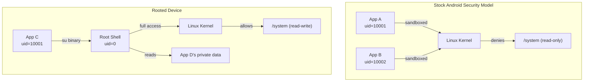
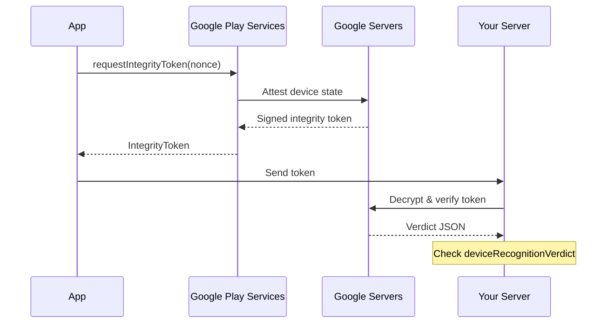
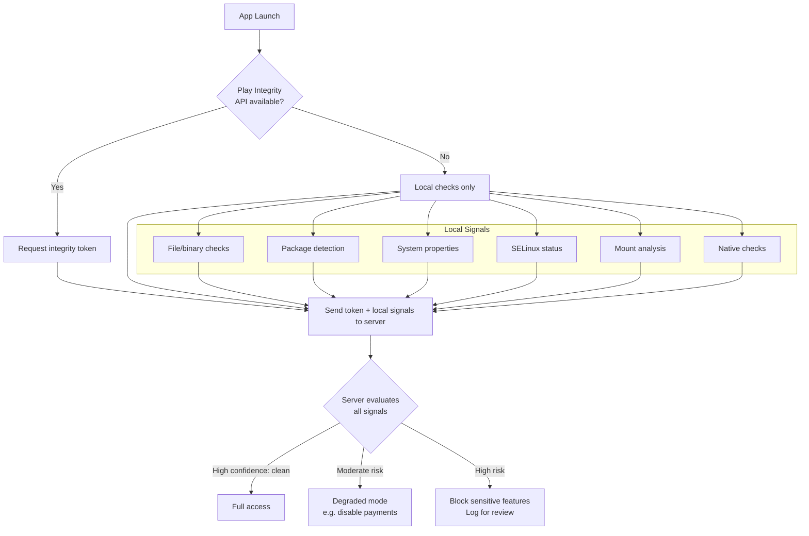

# Root Detection

---

## What Is Rooting?

Rooting is the process of gaining **superuser (root) access** on an Android device, bypassing the security model enforced by the Linux kernel and Android framework. A rooted device can:

- Run apps with `uid 0` (root privileges)
- Modify system partitions (`/system`, `/vendor`)
- Access other apps' private data directories
- Intercept and modify any process at runtime



---

## How Devices Get Rooted

| Method | Mechanism | Detectable? |
|--------|-----------|-------------|
| **Magisk (systemless)** | Patches the boot image; mounts modifications via overlays without touching `/system` | Hard — designed to hide from detection |
| **SuperSU (legacy)** | Installs `su` binary to `/system/xbin` and a manager app | Moderate — leaves filesystem artifacts |
| **KernelSU** | Embeds root access directly into a custom kernel; no `su` binary on disk | Very hard — no userspace artifacts |
| **Bootloader unlock + custom recovery** | Unlocks the bootloader, flashes TWRP/custom recovery, then installs a root solution | Bootloader status is detectable |
| **Exploit-based (one-click roots)** | Uses kernel or driver vulnerabilities to escalate privileges at runtime | Varies — often leaves traces |

!!! note "Magisk Dominates"
    As of 2025, **Magisk** is the most common root method. Its "MagiskHide" (now "Zygisk + DenyList") feature specifically targets root detection, making it the primary adversary for detection logic.

---

## Why Detect Root?

Root detection is critical for apps handling sensitive data or financial transactions. A rooted device breaks the assumptions your security model depends on.

| Risk | Impact |
|------|--------|
| **Credential theft** | Malware with root can read your app's SharedPreferences, databases, and Keystore-backed keys |
| **Runtime tampering** | Frida/Xposed can hook any method — bypass auth, modify API responses, extract encryption keys |
| **SSL pinning bypass** | Root enables tools that neutralize certificate pinning (see [SSL Pinning](../networking/ssl-pinning.md)) |
| **License/DRM circumvention** | Root allows patching license checks or extracting protected content |
| **Regulatory compliance** | PCI-DSS, PSD2, and banking regulations may require device integrity checks |

!!! warning "Not All Rooted Users Are Malicious"
    Power users root for legitimate reasons (ad blocking, custom ROMs, accessibility). Decide whether to **block entirely**, **degrade functionality** (disable payments), or **log and monitor** based on your threat model.

---

## Detection Methods

### 1. File & Binary Checks

The most basic approach — look for files that only exist on rooted devices.

```kotlin
object RootFileDetector {
    private val suPaths = listOf(
        "/system/bin/su", "/system/xbin/su",
        "/sbin/su", "/data/local/su",
        "/data/local/bin/su", "/data/local/xbin/su",
        "/system/app/Superuser.apk"
    )

    private val rootIndicators = listOf(
        "/system/app/Superuser.apk",
        "/system/etc/init.d",
        "/system/xbin/daemonsu",
        "/data/adb/magisk",
        "/sbin/.magisk"
    )

    fun isRooted(): Boolean {
        return suPaths.any { File(it).exists() } ||
               rootIndicators.any { File(it).exists() }
    }
}
```

| Pros | Cons |
|------|------|
| Simple to implement | Magisk hides these paths via mount namespaces |
| Catches legacy root methods (SuperSU) | File paths change across root solutions |
| No permissions required | `File.exists()` can be hooked by Frida |

### 2. Execute `su` and `which`

Attempt to actually run the `su` binary — more reliable than checking if the file exists.

```kotlin
fun canExecuteSu(): Boolean {
    return try {
        val process = Runtime.getRuntime().exec(arrayOf("which", "su"))
        val reader = BufferedReader(InputStreamReader(process.inputStream))
        val result = reader.readLine()
        process.waitFor()
        result != null
    } catch (e: Exception) {
        false
    }
}
```

!!! warning "Side Effects"
    On some devices, executing `su` triggers a **root access prompt** visible to the user. Use `which su` instead for a non-intrusive check.

### 3. System Properties & Build Tags

```kotlin
fun hasRootIndicatorProperties(): Boolean {
    val testKeys = Build.TAGS?.contains("test-keys") == true
    val debugBuild = Build.TYPE == "userdebug" || Build.TYPE == "eng"
    
    val dangerousProps = mapOf(
        "ro.debuggable" to "1",
        "ro.secure" to "0",
        "service.adb.root" to "1"
    )

    val propsModified = dangerousProps.any { (key, expected) ->
        try {
            val process = Runtime.getRuntime().exec(arrayOf("getprop", key))
            val value = process.inputStream.bufferedReader().readLine()?.trim()
            process.waitFor()
            value == expected
        } catch (e: Exception) {
            false
        }
    }

    return testKeys || debugBuild || propsModified
}
```

| Property | Stock Value | Rooted Value |
|----------|-------------|-------------|
| `ro.build.tags` | `release-keys` | `test-keys` |
| `ro.debuggable` | `0` | `1` |
| `ro.secure` | `1` | `0` |
| `Build.TYPE` | `user` | `userdebug` / `eng` |

### 4. Installed Package Detection

Check for known root management and hooking framework apps.

```kotlin
fun hasRootApps(context: Context): Boolean {
    val rootPackages = listOf(
        "com.topjohnwu.magisk",
        "eu.chainfire.supersu",
        "com.koushikdutta.superuser",
        "com.noshufou.android.su",
        "me.weishu.kernelsu",
        "de.robv.android.xposed.installer",
        "org.lsposed.manager",
        "com.saurik.substrate"
    )

    return rootPackages.any { pkg ->
        try {
            context.packageManager.getPackageInfo(pkg, 0)
            true
        } catch (e: PackageManager.NameNotFoundException) {
            false
        }
    }
}
```

!!! note "Package Renaming"
    Magisk allows users to **randomize its package name** during installation. Checking for `com.topjohnwu.magisk` alone is insufficient — the app could be `com.random.string12345`.

### 5. SELinux Status

Stock Android enforces SELinux in **Enforcing** mode. Rooting often requires switching to **Permissive**.

```kotlin
fun isSELinuxPermissive(): Boolean {
    return try {
        val process = Runtime.getRuntime().exec("getenforce")
        val status = process.inputStream.bufferedReader().readLine()?.trim()
        process.waitFor()
        status?.equals("Permissive", ignoreCase = true) == true
    } catch (e: Exception) {
        false
    }
}
```

### 6. Mount & Filesystem Analysis

Rooting tools often remount `/system` as read-write or create overlay mounts.

```kotlin
fun hasSuspiciousMounts(): Boolean {
    return try {
        val process = Runtime.getRuntime().exec("mount")
        val output = process.inputStream.bufferedReader().readText()
        process.waitFor()
        
        val suspiciousPatterns = listOf(
            "/system.*rw",     // /system should be read-only
            "magisk",          // Magisk overlay mounts
            "tmpfs.*sbin",     // tmpfs in sbin (Magisk staging)
            "/su"              // SuperSU mount point
        )
        
        suspiciousPatterns.any { pattern ->
            Regex(pattern, RegexOption.IGNORE_CASE).containsMatchIn(output)
        }
    } catch (e: Exception) {
        false
    }
}
```

### 7. Native (JNI) Detection

Java-level checks are trivially hooked by Frida. Moving detection to native code raises the bar significantly.

```cpp
// root_check.cpp
#include <jni.h>
#include <sys/stat.h>
#include <cstdio>

extern "C" JNIEXPORT jboolean JNICALL
Java_com_example_RootDetector_nativeCheck(JNIEnv* env, jobject) {
    struct stat sb;
    
    // Direct syscall — harder to hook than Java File.exists()
    const char* paths[] = {
        "/system/bin/su", "/system/xbin/su",
        "/sbin/su", "/data/adb/magisk",
        "/system/app/Superuser.apk"
    };
    
    for (const char* path : paths) {
        if (stat(path, &sb) == 0) {
            return JNI_TRUE;
        }
    }
    
    // Check if /system is writable
    FILE* f = fopen("/system/test_root_check", "w");
    if (f != nullptr) {
        fclose(f);
        remove("/system/test_root_check");
        return JNI_TRUE;
    }
    
    return JNI_FALSE;
}
```

```kotlin
object RootDetector {
    init { System.loadLibrary("rootcheck") }
    external fun nativeCheck(): Boolean
}
```

### 8. Google Play Integrity API

The **Play Integrity API** (successor to SafetyNet) provides server-verified device integrity attestation.



```kotlin
val integrityManager = IntegrityManagerFactory.create(applicationContext)

val request = IntegrityTokenRequest.builder()
    .setNonce(generateNonce()) // server-generated, single-use
    .build()

integrityManager.requestIntegrityToken(request)
    .addOnSuccessListener { response ->
        val token = response.token()
        // Send token to your server for verification
        sendToServer(token)
    }
    .addOnFailureListener { e ->
        // Handle error — device may lack Play Services
    }
```

**Server-side verdict fields:**

| Field | Values | Meaning |
|-------|--------|---------|
| `deviceRecognitionVerdict` | `MEETS_DEVICE_INTEGRITY` | Genuine device, not rooted |
| | `MEETS_BASIC_INTEGRITY` | Device may be rooted or running a custom ROM |
| | _(empty)_ | Failed integrity — emulator, rooted, or tampered |
| `appRecognitionVerdict` | `PLAY_RECOGNIZED` | APK matches Play Store version |
| `accountDetails` | `LICENSED` | User has a Play Store license for this app |

!!! tip "Always Verify Server-Side"
    Never trust the integrity verdict on the client. The token is cryptographically signed by Google — only your server (with Google's API) can reliably decrypt and verify it. Client-side verification can be hooked.

---

## Detection Strategy

No single check is sufficient. Combine multiple signals and make the final decision server-side.



### Layered Approach

| Layer | Method | Bypassed By |
|-------|--------|-------------|
| **L1 — Basic** | File checks, package detection, build tags | Magisk DenyList, package renaming |
| **L2 — Intermediate** | `su` execution, SELinux, mount analysis | Zygisk modules, namespace isolation |
| **L3 — Advanced** | Native (JNI) checks, anti-Frida detection | Custom Frida scripts, kernel-level hiding |
| **L4 — Server-verified** | Play Integrity API | Hardware-level attacks (rare), Xposed on Play Services (patched) |

!!! tip "Recommendation"
    For most apps: **L1 + L4 (Play Integrity)** is sufficient. For banking/payments: combine **all four layers** with server-side decision logic and runtime tamper detection.

---

## Common Bypass Techniques

Understanding bypasses helps you design more resilient detection.

| Bypass | How It Works | Countermeasure |
|--------|-------------|----------------|
| **Magisk DenyList** | Unmounts Magisk overlays for specific apps; hides `su` and Magisk files from the target process | Native checks, Play Integrity |
| **Zygisk + modules** | Loads modules into the app's process via Zygote; can intercept any Java method | Native code detection, obfuscation |
| **Frida hooking** | Injects a JavaScript engine into the process; hooks Java and native methods at runtime | Anti-Frida checks (scan for Frida ports, detect injected libraries) |
| **Xposed/LSPosed** | Framework-level hooks that modify any app's behavior without touching APK files | Detect Xposed artifacts, stack trace analysis |
| **APK repackaging** | Decompile the APK, remove detection code, re-sign and install | Signature verification, Play App Signing, code obfuscation |

### Anti-Frida Detection (Advanced)

```kotlin
fun isFridaRunning(): Boolean {
    // Check for default Frida server port
    val fridaPorts = listOf(27042, 27043)
    return fridaPorts.any { port ->
        try {
            java.net.Socket("127.0.0.1", port).use { true }
        } catch (e: Exception) {
            false
        }
    }
}
```

```cpp
// Native: scan /proc/self/maps for Frida artifacts
bool detectFridaNative() {
    FILE* fp = fopen("/proc/self/maps", "r");
    if (!fp) return false;
    
    char line[512];
    while (fgets(line, sizeof(line), fp)) {
        if (strstr(line, "frida") || strstr(line, "gadget")) {
            fclose(fp);
            return true;
        }
    }
    fclose(fp);
    return false;
}
```

!!! warning "Arms Race"
    Root detection vs. bypass is a continuous arms race. Sophisticated attackers can bypass any client-side check given enough effort. The goal is to raise the cost of attack, not achieve perfect detection. **Server-side verification** (Play Integrity) is always your strongest signal.

---

## Third-Party Libraries

| Library | Approach | Notes |
|---------|----------|-------|
| **[RootBeer](https://github.com/nickcapurso/RootBeer)** | Open-source; combines file checks, binary checks, build tags, BusyBox detection | Good starting point; patterns are well-known to bypass tools |
| **[Play Integrity API](https://developer.android.com/google/play/integrity)** | Google server-side attestation | Most reliable; requires Play Services |
| **ProGuard / R8** | Code obfuscation | Makes reverse engineering harder; not detection per se |
| **DexGuard / iXGuard** | Commercial obfuscation + tamper detection + root detection | Enterprise-grade; includes RASP (Runtime Application Self-Protection) |

---

## Best Practices

| Practice | Why |
|----------|-----|
| **Combine multiple detection methods** | No single check catches all root solutions |
| **Move logic to native code** | Java methods are trivially hooked by Frida/Xposed |
| **Make decisions server-side** | Client-side responses can be patched out |
| **Use Play Integrity API** | Cryptographically verified by Google — hardest to bypass |
| **Obfuscate detection code** | Makes it harder for attackers to locate and disable checks |
| **Don't reveal which check failed** | Generic "device not supported" prevents targeted bypasses |
| **Respond gracefully** | Degrade functionality instead of crashing — better UX and harder to detect |
| **Update detection regularly** | Bypass tools evolve; your detection should too |
| **Avoid false positives** | Custom ROMs and development builds can trigger detections — test broadly |
| **Log detection events server-side** | Helps identify attack patterns and tune detection |

---

??? question "Interview Questions"

    **Q: What is device rooting and why is it a security concern?**

    Rooting grants superuser (uid 0) access on Android, bypassing the Linux sandbox. A rooted device allows any app to read other apps' private data, hook into runtime methods (via Frida/Xposed), bypass SSL pinning, and modify system behavior. For apps handling sensitive data (banking, payments), this breaks the trust assumptions the security model relies on.

    **Q: What are the main methods to detect a rooted device?**

    Key methods: (1) **File/binary checks** — look for `su`, Magisk, or SuperSU artifacts. (2) **Package detection** — check for root management apps. (3) **System property checks** — `test-keys`, `ro.debuggable=1`. (4) **SELinux status** — should be Enforcing, not Permissive. (5) **Native (JNI) checks** — harder to hook than Java. (6) **Play Integrity API** — server-verified attestation from Google. No single method is reliable alone; combine multiple layers.

    **Q: What is Magisk and how does it evade root detection?**

    Magisk is a "systemless" root solution that patches the boot image instead of modifying `/system`. It uses mount namespaces to hide root artifacts from specific apps (DenyList). Zygisk loads modules directly into app processes via Zygote. This makes traditional file-based detection ineffective — the files literally don't appear in the app's mount namespace.

    **Q: How does the Play Integrity API work?**

    The app requests an integrity token from Google Play Services, which attests the device state using hardware-backed signals. The token is sent to your server, which calls Google's API to decrypt and verify it. The verdict includes `deviceRecognitionVerdict` (genuine vs. tampered), `appRecognitionVerdict` (matches Play Store), and `accountDetails`. Verification must happen server-side — client-side checks can be hooked.

    **Q: Why should root detection decisions be made server-side?**

    Any client-side decision can be bypassed by hooking the method that acts on the result. If your app checks `isRooted()` and shows a dialog, an attacker hooks `isRooted()` to return `false`. By sending detection signals to the server, the server makes the access control decision — the attacker would need to compromise both the client and the server-side logic.

    **Q: What's the difference between SafetyNet and Play Integrity API?**

    SafetyNet Attestation is deprecated (sunset 2024). Play Integrity API is its successor with broader coverage: it adds app integrity (APK matches Play Store) and account licensing on top of device integrity. The API also supports standard and classic request modes — standard uses on-device caching for lower latency, classic calls Google servers each time.

    **Q: How would you handle root detection in a banking app?**

    Layer all available checks: file/binary scans, package detection, system properties, SELinux, native JNI checks, and Play Integrity API. Send all signals to the server. The server applies a risk score — high risk blocks sensitive operations (transfers, payments), moderate risk requires step-up authentication, low risk allows full access. Log all detection events for fraud analytics. Update detection logic regularly as bypass tools evolve.

    **Q: Can root detection cause false positives?**

    Yes. Custom ROMs (LineageOS, GrapheneOS) may have `test-keys` build tags or non-standard system properties. Developer devices in `userdebug` mode trigger build-type checks. Some OEM modifications trip mount analysis. Always test on a range of devices and ROM variants. Use Play Integrity's `MEETS_BASIC_INTEGRITY` tier to distinguish between "custom but not malicious" and "actively tampered."

!!! tip "Further Reading"
    - [Google Play Integrity API documentation](https://developer.android.com/google/play/integrity)
    - [OWASP Mobile Security Testing Guide — Android Anti-Reversing](https://mas.owasp.org/MASTG/Android/0x05j-Testing-Resiliency-Against-Reverse-Engineering/)
    - [Magisk documentation](https://topjohnwu.github.io/Magisk/)
    - [RootBeer — open-source root detection library](https://github.com/nickcapurso/RootBeer)
