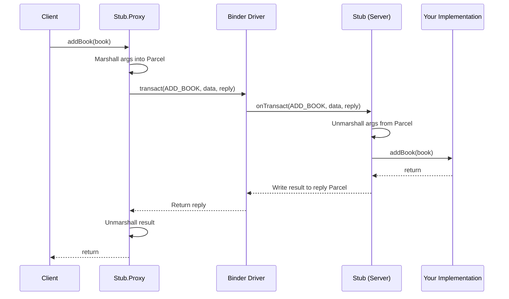

# AIDL (Android Interface Definition Language)

## What is AIDL?

AIDL is a mechanism that allows you to define a **programming interface** for IPC (Inter-Process Communication) between Android processes. It generates the boilerplate code needed for a client in one process to call methods on an object in another process, as if calling a local method.

Under the hood, AIDL is built on top of Android's **Binder** framework — the kernel-level IPC driver that handles marshalling/unmarshalling data and routing calls between processes.


---

## When to Use AIDL

AIDL is needed when:

- You need **cross-process method calls** (not just message passing)
- Multiple apps need to interact with your service **concurrently**
- You need a **typed, structured API** between processes

| Mechanism | Same Process | Cross-Process | Concurrent Clients | Typed API |
|---|---|---|---|---|
| **Bound Service (Binder)** | Yes | No | N/A | Yes |
| **Messenger** | Yes | Yes | No (sequential) | No (Message-based) |
| **AIDL** | Yes | Yes | Yes | Yes |
| **Content Provider** | Yes | Yes | Yes | CRUD only |

!!! tip "Rule of Thumb"
    - Same process → use a Binder directly  
    - Cross-process, simple → use Messenger  
    - Cross-process, concurrent, structured → use AIDL

---

## How AIDL Works — Step by Step

### Step 1: Define the AIDL Interface

Create a `.aidl` file (e.g., `IBookManager.aidl`):

```java
// src/main/aidl/com/example/IBookManager.aidl
package com.example;

import com.example.Book;

interface IBookManager {
    List<Book> getBookList();
    void addBook(in Book book);
    void registerCallback(IOnBookAddedListener listener);
}
```

### Step 2: Define Parcelable Data Classes

If you pass custom objects, you need both a `.aidl` declaration and a `Parcelable` implementation.

```java
// src/main/aidl/com/example/Book.aidl
package com.example;

parcelable Book;
```

```kotlin
// src/main/java/com/example/Book.kt
@Parcelize
data class Book(
    val id: Int,
    val name: String
) : Parcelable
```

### Step 3: Implement the Service

The Android build system generates a `Stub` class from the `.aidl` file. You implement this in your service.

```kotlin
class BookManagerService : Service() {

    private val bookList = mutableListOf<Book>()

    // The generated Stub is an abstract class with your AIDL methods
    private val binder = object : IBookManager.Stub() {

        override fun getBookList(): List<Book> {
            return bookList
        }

        override fun addBook(book: Book) {
            bookList.add(book)
        }

        override fun registerCallback(listener: IOnBookAddedListener) {
            // Store and notify listeners
        }
    }

    override fun onBind(intent: Intent): IBinder = binder
}
```

### Step 4: Connect from the Client

```kotlin
class BookClientActivity : AppCompatActivity() {

    private var bookManager: IBookManager? = null

    private val connection = object : ServiceConnection {

        override fun onServiceConnected(name: ComponentName, service: IBinder) {
            // Convert IBinder to your AIDL interface
            bookManager = IBookManager.Stub.asInterface(service)

            // Now call methods as if they were local
            val books = bookManager?.bookList
            bookManager?.addBook(Book(1, "Android Internals"))
        }

        override fun onServiceDisconnected(name: ComponentName) {
            bookManager = null
        }
    }

    override fun onCreate(savedInstanceState: Bundle?) {
        super.onCreate(savedInstanceState)

        val intent = Intent("com.example.BOOK_SERVICE").apply {
            setPackage("com.example.server")  // Required for Android 5.0+
        }
        bindService(intent, connection, Context.BIND_AUTO_CREATE)
    }

    override fun onDestroy() {
        super.onDestroy()
        unbindService(connection)
    }
}
```

---

## Generated Code — What Happens Under the Hood

The AIDL compiler generates a Java interface with two inner classes:

```
IBookManager
├── Stub (extends Binder, implements IBookManager)
│   └── asInterface(IBinder)  → returns Proxy if cross-process, or cast if same process
└── Stub.Proxy (implements IBookManager)
    └── Each method → writes args to Parcel, calls transact(), reads result from reply Parcel
```



### Key Detail: `asInterface()`

```kotlin
// Same process → returns the Stub itself (no IPC overhead)
// Different process → returns a Proxy that marshalls calls through Binder
val manager = IBookManager.Stub.asInterface(service)
```

---

## AIDL Directional Tags

Parameters in AIDL methods must be tagged with a direction:

| Tag | Meaning | Performance |
|---|---|---|
| `in` | Data flows **client → server** only | Cheapest — server gets a copy, changes aren't sent back |
| `out` | Data flows **server → client** only | Server fills an empty object, result sent back |
| `inout` | Data flows **both ways** | Most expensive — marshalled twice |

```java
void updateBook(inout Book book);  // Server can read AND modify the book
void addBook(in Book book);        // Server only reads the book
void getBook(out Book book);       // Server fills in the book data
```

!!! warning
    Primitive types (`int`, `long`, `boolean`, `String`) are always `in` and don't need a tag.

---

## Callbacks with AIDL

To push data from server → client, define a callback interface:

```java
// IOnBookAddedListener.aidl
interface IOnBookAddedListener {
    void onBookAdded(in Book book);
}
```

Use `RemoteCallbackList` on the server to manage client callbacks safely:

```kotlin
private val listeners = RemoteCallbackList<IOnBookAddedListener>()

override fun registerCallback(listener: IOnBookAddedListener) {
    listeners.register(listener)
}

private fun notifyBookAdded(book: Book) {
    val count = listeners.beginBroadcast()
    for (i in 0 until count) {
        listeners.getBroadcastItem(i).onBookAdded(book)
    }
    listeners.finishBroadcast()
}
```

!!! note "Why RemoteCallbackList?"
    Regular lists can't detect when a remote client process dies. `RemoteCallbackList` automatically handles **death recipients** — it removes dead callbacks and prevents crashes from calling methods on defunct proxies.

---

## Threading Model

| Side | Threading Behavior |
|---|---|
| **Client** | AIDL calls are **synchronous and blocking** by default. The calling thread blocks until the server returns. |
| **Server** | Calls are dispatched on a **Binder thread pool** (not the main thread). You must handle thread safety yourself. |

!!! warning "ANR Risk"
    Never call an AIDL method from the **main thread** if it may take time — it blocks until the server responds. Use a background thread or coroutine.

```kotlin
// Safe: call from a coroutine
lifecycleScope.launch(Dispatchers.IO) {
    val books = bookManager?.bookList
    withContext(Dispatchers.Main) {
        updateUI(books)
    }
}
```

For truly asynchronous AIDL, use the `oneway` keyword:

```java
oneway interface IAsyncService {
    void doWork(in Bundle params);  // Returns immediately, no result
}
```

`oneway` methods are **non-blocking** and cannot return values or throw exceptions.

---

## Security

### Permission Enforcement

```xml
<!-- Declare a custom permission -->
<permission
    android:name="com.example.permission.ACCESS_BOOK_SERVICE"
    android:protectionLevel="signature" />
```

```kotlin
// Check in onBind or inside each method
override fun onBind(intent: Intent): IBinder? {
    if (checkCallingPermission("com.example.permission.ACCESS_BOOK_SERVICE")
        != PackageManager.PERMISSION_GRANTED) {
        return null  // Deny binding
    }
    return binder
}
```

### Caller Identity

```kotlin
override fun addBook(book: Book) {
    val callingUid = Binder.getCallingUid()
    val callingPid = Binder.getCallingPid()
    // Validate caller before proceeding
}
```

---

## Practical Use Cases

| Use Case | Example |
|---|---|
| **System Services** | `ActivityManagerService`, `PackageManagerService` — all system services use AIDL internally |
| **Multi-process apps** | App with a separate `:remote` process for heavy computation or media playback |
| **SDK / Plugin architecture** | Exposing a service API to third-party apps (e.g., payment SDKs, media players) |
| **Background music player** | Music service in a separate process, controlled by multiple activities or a widget |
| **Inter-app communication** | Two apps from the same company sharing user session data |

---

## AIDL vs Alternatives

| Feature | AIDL | Messenger | Bound Service | Content Provider |
|---|---|---|---|---|
| Cross-process | Yes | Yes | No | Yes |
| Concurrent calls | Yes | No | N/A | Yes |
| Return values | Yes | No (async) | Yes | Yes (Cursor) |
| Typed interface | Yes | No | Yes | CRUD schema |
| Complexity | High | Low | Low | Medium |
| Use case | Structured API | Simple messages | In-process | Data sharing |

---

## Common Interview Questions

??? question "What is AIDL and why is it needed?"
    AIDL generates the marshalling/unmarshalling code needed for type-safe IPC on Android. It's needed when multiple client processes need to call methods on a remote service concurrently with a structured API. Without AIDL, you'd have to write all the Parcel serialization and Binder transaction code manually.

??? question "How is AIDL different from Messenger?"
    Messenger handles one message at a time (sequential queue via Handler), while AIDL supports **concurrent** calls from multiple threads. Messenger uses `Message` objects (untyped), while AIDL provides a **typed interface**. Use Messenger for simple cases; AIDL when you need parallelism and structured APIs.

??? question "What thread does an AIDL call execute on?"
    On the **client side**, the calling thread blocks until the server returns. On the **server side**, calls arrive on a **Binder thread pool** — not the main thread. This means server implementations must be **thread-safe**.

??? question "What does `oneway` do?"
    `oneway` makes the call **non-blocking** — the client returns immediately without waiting for the server. The method cannot return a value or throw an exception. Useful for fire-and-forget calls.

??? question "Explain `in`, `out`, `inout` tags."
    These control the direction of data marshalling. `in` = client sends data to server (most common). `out` = server fills data and sends back. `inout` = data flows both ways (most expensive, marshalled twice). Primitives are always `in`.

??? question "How does `Stub.asInterface()` work?"
    It checks if the IBinder is in the same process. If **same process**, it returns the Stub directly (no IPC overhead — just a cast). If **different process**, it returns a `Stub.Proxy` that marshalls each call through the Binder driver. This is the **same-process optimization**.
