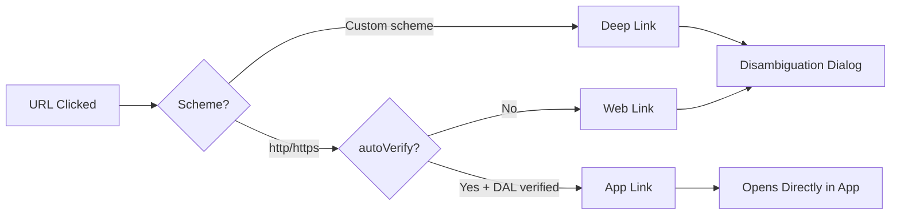
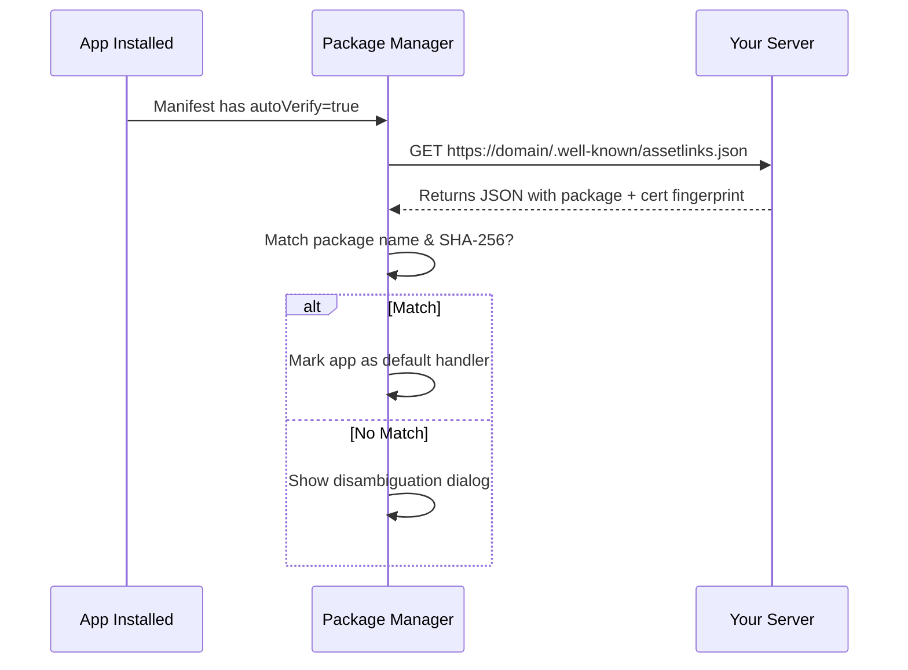

# Deep Linking

Deep linking is a mechanism that allows URLs to navigate users directly to specific content within an Android app, bypassing the home screen or main activity.

## Types of Deep Links

| Type | Scheme | Verification | Disambiguation Dialog |
|---|---|---|---|
| **URI Scheme (Deep Link)** | Custom (`myapp://`) | None | Yes — user may see app chooser |
| **Web Link** | `http://` or `https://` | None | Yes — browser or app chooser |
| **App Link** | `https://` only | Domain verification via DAL | No — opens directly in app |



---

## 1. URI Scheme Deep Links

The simplest form. You define a custom scheme (e.g., `myapp://`) in the manifest.

### Manifest Setup

```xml
<activity android:name=".ProductActivity"
    android:exported="true">
    <intent-filter>
        <action android:name="android.intent.action.VIEW" />
        <category android:name="android.intent.category.DEFAULT" />
        <category android:name="android.intent.category.BROWSABLE" />

        <data
            android:scheme="myapp"
            android:host="product" />
    </intent-filter>
</activity>
```

This handles URLs like `myapp://product?id=123`.

!!! warning "Custom Scheme Risks"
    Any app can register the same custom scheme. There's no ownership verification, so another app could intercept your deep links. Use App Links for production apps.

---

## 2. Web Links

Standard `http`/`https` URLs declared in intent filters. The system shows a disambiguation dialog if multiple apps (including browsers) can handle the URL.

```xml
<activity android:name=".ArticleActivity"
    android:exported="true">
    <intent-filter>
        <action android:name="android.intent.action.VIEW" />
        <category android:name="android.intent.category.DEFAULT" />
        <category android:name="android.intent.category.BROWSABLE" />

        <data
            android:scheme="https"
            android:host="www.example.com"
            android:pathPrefix="/article" />
    </intent-filter>
</activity>
```

---

## 3. App Links (Android 6.0+)

App Links are verified `https` deep links. When verified, the system opens your app **directly** — no chooser dialog.

### Requirements

1. Intent filter with `android:autoVerify="true"`
2. A **Digital Asset Links (DAL)** JSON file hosted at `https://yourdomain.com/.well-known/assetlinks.json`

### Manifest Setup

```xml
<activity android:name=".ProductActivity"
    android:exported="true">
    <intent-filter android:autoVerify="true">
        <action android:name="android.intent.action.VIEW" />
        <category android:name="android.intent.category.DEFAULT" />
        <category android:name="android.intent.category.BROWSABLE" />

        <data
            android:scheme="https"
            android:host="www.example.com"
            android:pathPrefix="/product" />
    </intent-filter>
</activity>
```

### Digital Asset Links File

Host this JSON at `https://www.example.com/.well-known/assetlinks.json`:

```json
[{
  "relation": ["delegate_permission/common.handle_all_urls"],
  "target": {
    "namespace": "android_app",
    "package_name": "com.example.myapp",
    "sha256_cert_fingerprints": [
      "AB:CD:EF:12:34:..."
    ]
  }
}]
```

!!! tip "Get SHA-256 Fingerprint"
    ```bash
    # Debug keystore
    keytool -list -v -keystore ~/.android/debug.keystore -alias androiddebugkey -storepass android

    # Release keystore
    keytool -list -v -keystore your-release-key.keystore
    ```

### Verification Flow



---

## Handling Deep Links in Code

### Activity-based

```kotlin
class ProductActivity : AppCompatActivity() {
    override fun onCreate(savedInstanceState: Bundle?) {
        super.onCreate(savedInstanceState)
        handleDeepLink(intent)
    }

    // Called when activity is already running (singleTop/singleTask)
    override fun onNewIntent(intent: Intent) {
        super.onNewIntent(intent)
        handleDeepLink(intent)
    }

    private fun handleDeepLink(intent: Intent?) {
        if (intent?.action != Intent.ACTION_VIEW) return
        val uri = intent.data ?: return

        val productId = uri.getQueryParameter("id")
        val path = uri.pathSegments  // ["product", "details"]
        loadProduct(productId)
    }
}
```

!!! warning "Don't Forget `onNewIntent`"
    If your activity uses `launchMode="singleTop"` or `singleTask`, the deep link intent arrives via `onNewIntent()` when the activity is already on top of the stack. Always handle both `onCreate` and `onNewIntent`.

### Navigation Component

```kotlin
// In your NavGraph (nav_graph.xml)
<fragment
    android:id="@+id/productFragment"
    android:name=".ProductFragment">
    <deepLink
        app:uri="https://www.example.com/product/{id}" />
    <argument
        android:name="id"
        app:argType="string" />
</fragment>
```

```xml
<!-- Manifest — single intent filter for NavGraph -->
<activity android:name=".MainActivity">
    <nav-graph android:value="@navigation/nav_graph" />
</activity>
```

The Navigation library automatically parses `{id}` from the URL and passes it as a fragment argument.

---

## Deferred Deep Links

Deferred deep links handle the case where the user clicks a link but the app is **not yet installed**. The flow:

1. User clicks link → app not installed → redirected to Play Store
2. User installs and opens app
3. App retrieves the original deep link and navigates to the intended screen

### Implementation Options

| Method | How It Works |
|---|---|
| **Google Play Install Referrer** | Play Store passes referrer data to the app after install |
| **Firebase Dynamic Links** | *(Deprecated)* — was the standard solution |
| **Third-party SDKs** | Branch.io, Adjust, AppsFlyer — handle attribution + deferred deep links |
| **Custom server** | Store link mapping server-side, retrieve via device fingerprinting after install |

---

## Testing Deep Links

### ADB

```bash
# Test a deep link
adb shell am start -a android.intent.action.VIEW \
    -d "https://www.example.com/product?id=123" \
    com.example.myapp

# Test a custom scheme
adb shell am start -a android.intent.action.VIEW \
    -d "myapp://product?id=123"
```

### Verify App Links

```bash
# Check verification status (Android 12+)
adb shell pm get-app-links com.example.myapp

# Re-trigger verification
adb shell pm verify-app-links --re-verify com.example.myapp
```

### Common Debugging Checklist

- [ ] Intent filter has `ACTION_VIEW`, `CATEGORY_DEFAULT`, and `CATEGORY_BROWSABLE`
- [ ] `android:exported="true"` on the activity
- [ ] For App Links: `autoVerify="true"` and valid `assetlinks.json`
- [ ] `assetlinks.json` served over HTTPS with `Content-Type: application/json`
- [ ] SHA-256 fingerprint matches the signing key (debug vs. release)
- [ ] Handle both `onCreate` and `onNewIntent`

---

## Deep Link vs App Link — When to Use What

| Use Case | Recommendation |
|---|---|
| Internal navigation between own apps | Custom URI scheme is fine |
| Marketing links, web-to-app | App Links (verified HTTPS) |
| Cross-platform links (iOS + Android) | App Links + Universal Links (iOS) |
| Links that should work without app | Web Links (fallback to browser) |

!!! tip "Interview Key Points"
    - **Three types**: URI scheme, Web Links, App Links — know the differences
    - **App Links** eliminate the disambiguation dialog via domain verification (DAL file)
    - **`autoVerify="true"`** triggers the system to verify ownership at install time
    - Always handle `onNewIntent` for `singleTop`/`singleTask` launch modes
    - Deferred deep links require a third-party solution or custom server-side logic
