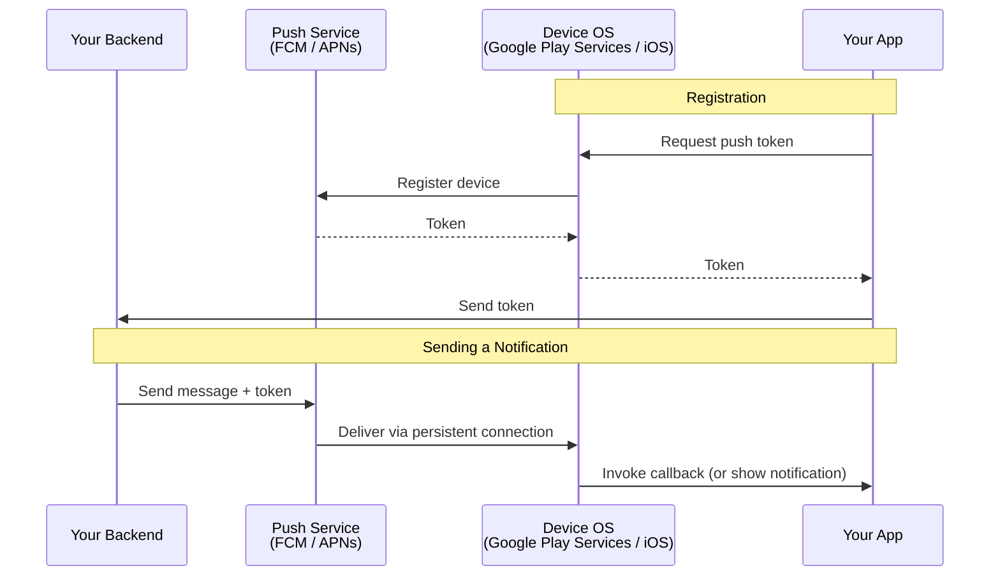
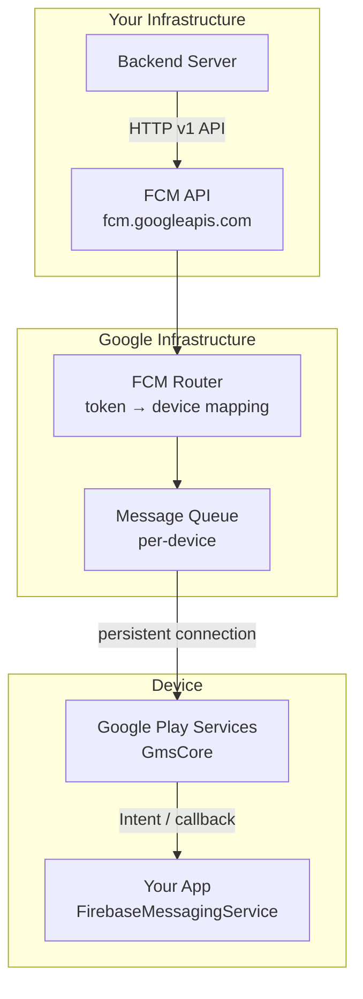
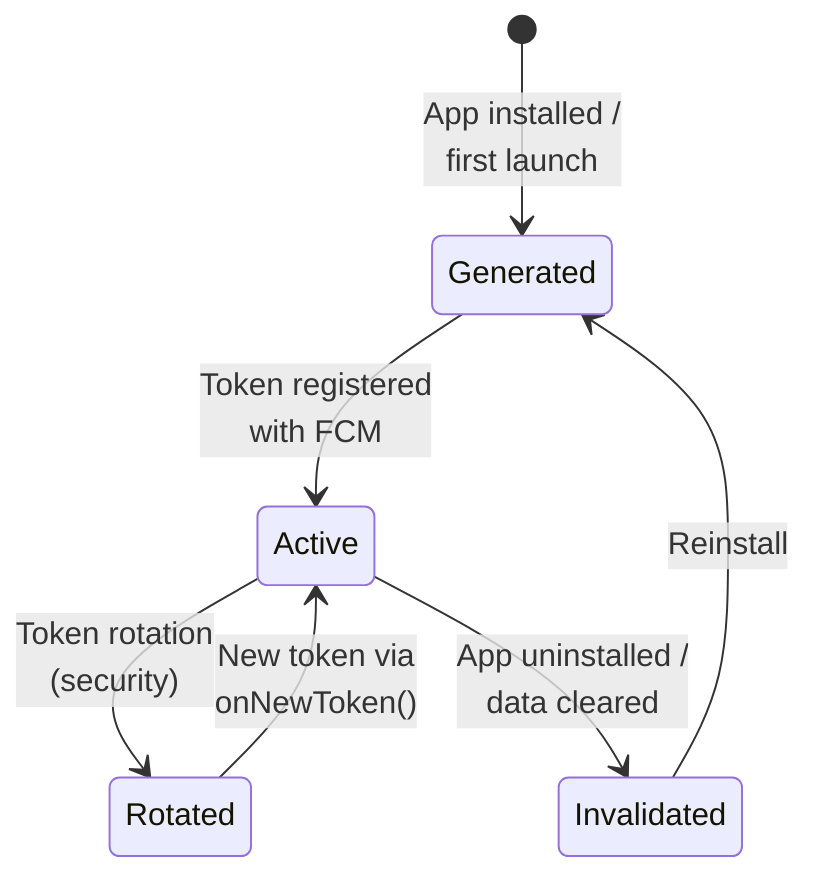
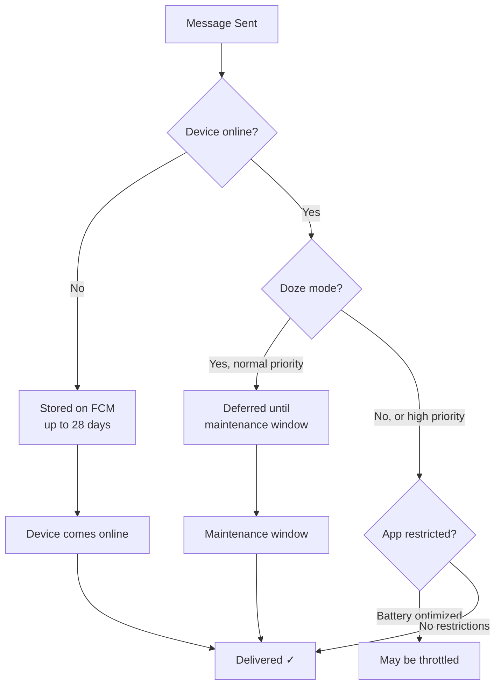
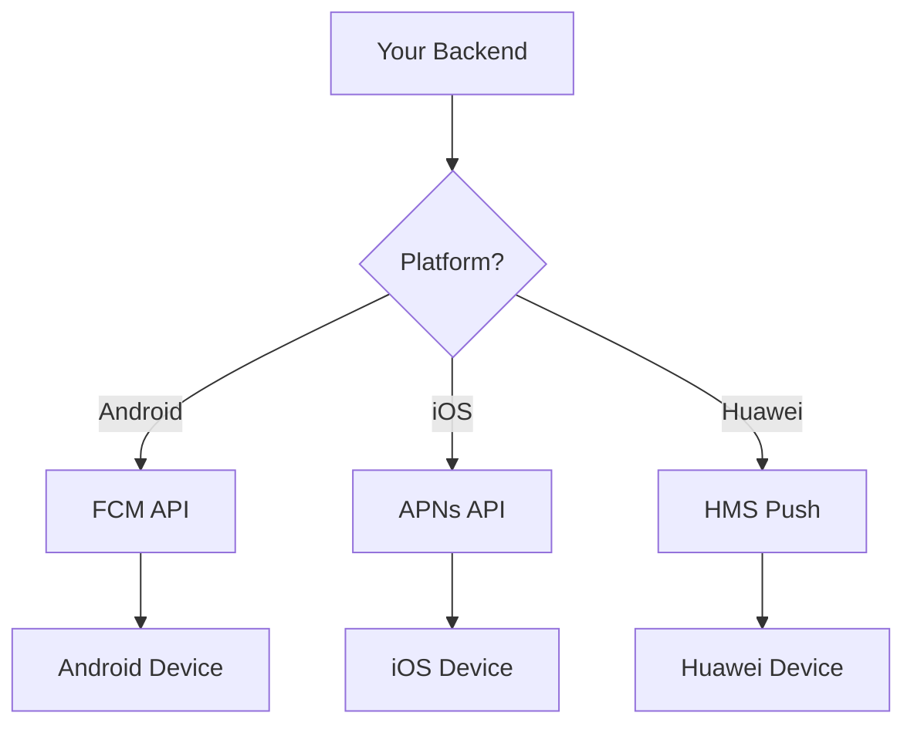

# Push Notification Architecture

How push notifications work end-to-end — from your backend server to the user's device. Covers the architecture of FCM, APNs, and the system-level mechanics that make push delivery reliable and battery-efficient.

---

## End-to-End Flow



---

## Why a Push Service?

Without a centralized push service, every app would need its own persistent connection to its server — destroying battery life.

| Approach | Connections | Battery Impact |
|----------|------------|---------------|
| Each app maintains a WebSocket | N connections (one per app) | Keeps radio active, drains battery |
| **Shared push service** | **1 connection** (Google Play Services) | Single connection for all apps |

FCM (Android) and APNs (iOS) maintain a **single persistent connection** per device that multiplexes messages for all apps. This is why push notifications are a platform service, not an app-level feature.

---

## FCM (Firebase Cloud Messaging) Architecture



### Connection Management

Google Play Services (`GmsCore`) maintains a persistent **TLS connection** to `mtalk.google.com` (FCM's push endpoint). This connection:

1. Uses **heartbeat keep-alives** (every 15-28 minutes depending on network)
2. Multiplexes messages for all apps on the device
3. Reconnects automatically on network changes
4. Respects Doze mode and battery optimization

### Token Lifecycle



| Event | What Happens | Action Required |
|-------|-------------|-----------------|
| First install | New token generated | Send to your server |
| `onNewToken()` called | Token rotated (old token invalid) | Update on your server |
| App uninstall | Token becomes invalid | FCM returns `NotRegistered` on next send |
| Data cleared | Token invalidated | New token on next launch |

!!! warning "Token Expiration"
    Tokens don't have a fixed expiry time, but they can be invalidated at any time. Always handle `onNewToken()` and implement server-side cleanup for tokens that return `NotRegistered` errors.

---

## Message Types

### Notification vs Data Messages

| Aspect | Notification Message | Data Message |
|--------|---------------------|-------------|
| **Payload** | `"notification": {"title": "...", "body": "..."}` | `"data": {"key": "value"}` |
| **App in foreground** | `onMessageReceived()` called | `onMessageReceived()` called |
| **App in background** | **System tray automatically** (no code runs) | `onMessageReceived()` called |
| **App killed** | System tray automatically | `onMessageReceived()` called |
| **Customization** | Limited (system handles display) | Full control |

```json
{
  "message": {
    "token": "device_token_here",
    "notification": {
      "title": "New Message",
      "body": "You have a message from Alice"
    },
    "data": {
      "conversation_id": "abc123",
      "sender": "alice",
      "deep_link": "myapp://chat/abc123"
    }
  }
}
```

!!! tip "Always Use Data Messages"
    Notification messages bypass your code when the app is in background — you can't customize the notification, add actions, or process data. Send **data-only messages** and build the notification yourself in `onMessageReceived()` for full control.

### Message Priority

| Priority | Behavior | Use Case |
|----------|----------|----------|
| **High** | Delivered immediately, wakes device from Doze | Chat messages, calls, urgent alerts |
| **Normal** (default) | Batched and delivered opportunistically | Marketing, non-urgent updates |

```json
{
  "message": {
    "token": "...",
    "android": {
      "priority": "high"
    },
    "data": { "type": "incoming_call" }
  }
}
```

---

## Delivery Reliability

### Why Notifications Get Lost



| Failure Reason | Cause | Mitigation |
|---------------|-------|------------|
| Device offline | No internet | FCM stores up to 28 days (configurable TTL) |
| Doze mode | Device idle, normal priority | Use high priority for urgent messages |
| App standby bucket | Infrequent app usage | Cannot override — OS decision |
| Battery optimization | OEM-specific restrictions (Xiaomi, Huawei) | Guide user to whitelist app |
| Collapsible message replaced | Same `collapse_key`, newer message overwrites | By design for "latest state" updates |
| TTL expired | Device offline too long | Set appropriate `time_to_live` |

### Collapsible vs Non-Collapsible

```json
// Collapsible — only latest message delivered
{
  "message": {
    "token": "...",
    "android": {
      "collapse_key": "score_update"
    },
    "data": { "score": "3-2" }
  }
}

// Non-collapsible (default) — every message delivered
{
  "message": {
    "token": "...",
    "data": { "chat_message": "Hello!" }
  }
}
```

| Type | Behavior | Use Case |
|------|----------|----------|
| **Collapsible** | New message replaces old with same key | Score updates, sync triggers, weather |
| **Non-collapsible** | Every message queued and delivered | Chat messages, transactions |

---

## Topic & Group Messaging

### Topics

Server-managed pub/sub. Clients subscribe to topics; server sends to a topic.

```kotlin
// Client subscribes
FirebaseMessaging.getInstance().subscribeToTopic("sports_news")

// Server sends to topic (HTTP v1)
{
  "message": {
    "topic": "sports_news",
    "data": { "headline": "..." }
  }
}
```

### Device Groups

Send to all devices belonging to a user (phone + tablet + watch).

### Targeting Comparison

| Method | Targeting | Scale | Use Case |
|--------|----------|-------|----------|
| **Single token** | One device | 1 | Direct message, personal notification |
| **Topic** | All subscribers | Unlimited | News, category updates |
| **Condition** | Topic boolean (`'A' in topics && 'B' in topics`) | Limited to 5 topics | Segmented broadcasts |
| **Device group** | All devices of a user | ~20 devices | Cross-device sync |
| **Batch** | Up to 500 tokens per API call | 500 | Targeted campaigns |

---

## APNs (Apple Push Notification Service)

iOS equivalent of FCM. Key architectural differences:

| Aspect | FCM (Android) | APNs (iOS) |
|--------|--------------|------------|
| **Connection** | Single TCP via Google Play Services | Single TCP via iOS system daemon |
| **Protocol** | Proprietary (protobuf over TLS) | HTTP/2 (since 2015) |
| **Auth** | OAuth 2.0 / API key | JWT token or TLS certificate |
| **Payload limit** | 4 KB | 4 KB |
| **Feedback** | Immediate HTTP response | Immediate HTTP/2 response |
| **Silent push** | Data-only message | `content-available: 1` |
| **Rich media** | Built via notification style | Notification Service Extension |

### Unified Backend Pattern



!!! tip "Use an Abstraction Layer"
    Libraries like Firebase Admin SDK, OneSignal, or Amazon SNS abstract over FCM/APNs/HMS, providing a unified API. This avoids duplicating push logic per platform.

---

## Battery & Performance Considerations

| Mechanism | Impact | Details |
|-----------|--------|---------|
| **Doze mode** | Defers normal-priority messages | High-priority messages bypass Doze (quota: ~10/hour) |
| **App Standby Buckets** | Throttles based on usage frequency | Active → Working → Frequent → Rare → Restricted |
| **Heartbeat interval** | Affects connection freshness | WiFi: 15 min, Mobile: 28 min |
| **OEM battery optimization** | May kill background services | Xiaomi, Huawei, Samsung have aggressive killers |
| **High-priority quota** | Limited to prevent abuse | ~10 high-priority messages/hour (varies) |

---

??? question "Interview Questions"

    **Q: Why can't apps just use WebSockets instead of FCM?**

    Each WebSocket connection keeps the cellular radio active, consuming significant battery. With 50 apps each maintaining a connection, battery drain is severe. FCM uses a single shared connection (via Google Play Services) for all apps, with optimized heartbeat intervals. The OS manages this connection efficiently alongside Doze mode.

    **Q: What's the difference between notification and data messages in FCM?**

    Notification messages have a `notification` payload that the system displays automatically when the app is in the background — your code never runs. Data messages always invoke `onMessageReceived()` regardless of app state, giving you full control over notification display and data processing. Use data messages for anything beyond basic alerts.

    **Q: How do you handle unreliable push delivery?**

    Push is best-effort, not guaranteed. Mitigate with: (1) use high priority for urgent messages, (2) set appropriate TTL, (3) implement a server-side read/delivery receipt system, (4) use periodic sync (WorkManager) as a fallback to catch missed messages, (5) use collapsible messages for state updates to avoid stale data.

    **Q: What happens to push notifications in Doze mode?**

    Normal-priority messages are deferred until the next Doze maintenance window (initially every ~15 min, stretching to ~1 hour). High-priority messages are delivered immediately but have a quota (~10/hour). If the quota is exceeded, remaining high-priority messages are treated as normal priority.

!!! tip "Further Reading"
    - [FCM Architecture Overview](https://firebase.google.com/docs/cloud-messaging/concept-options)
    - [APNs Overview](https://developer.apple.com/documentation/usernotifications/setting_up_a_remote_notification_server)
    - [Doze and App Standby](https://developer.android.com/training/monitoring-device-state/doze-standby)
