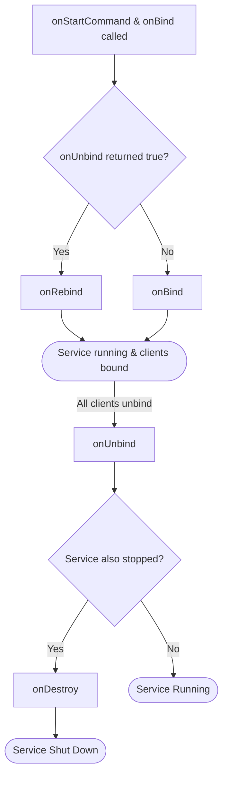

# Android Services

An Android **Service** is an application component that performs long-running operations in the background without a user interface. Services are declared in the manifest and run on the **main thread** by default.

- Started via `startService()` / stopped via `stopSelf()` or `stopService()`
- Services have **higher priority** than activities during resource crunch, making them less likely to be killed by the system

## Service Lifecycles

### Started vs Bound Service

```mermaid
flowchart TD
    subgraph Started["Started Service"]
        S1([startService]) --> S2[onCreate]
        S2 --> S3[onStartCommand]
        S3 --> S4([Service Running])
        S4 -->|Stopped by self or client| S5[onDestroy]
        S5 --> S6([Service Shut Down])
    end

    subgraph Bound["Bound Service"]
        B1([bindService]) --> B2[onCreate]
        B2 --> B3[onBind]
        B3 --> B4([Clients Bound])
        B4 -->|All clients unbind| B5[onUnbind]
        B5 --> B6[onDestroy]
        B6 --> B7([Service Shut Down])
    end
```



### Combined Service Lifecycle (Started + Bound)

A service can be **both started and bound**. In this case it stays alive until it is both stopped and all clients unbind.



## onStartCommand Return Constants

The return value of `onStartCommand()` determines how the system restarts the service if it is killed.

| Constant | Behavior | Use Case |
|---|---|---|
| `START_STICKY` | System restarts service, delivers **null** intent | Music player |
| `START_NON_STICKY` | System does **not** restart | Periodic tasks |
| `START_REDELIVER_INTENT` | System restarts service, re-delivers the **same** intent | File download |

## Bound Service Communication

### Local Binding (IBinder)

Used when the service runs in the **same process** as the client. The service implements `onBind()` returning an `IBinder`, and the client uses a `ServiceConnection` to receive it.

```kotlin
class LocalService : Service() {
    private val binder = LocalBinder()

    inner class LocalBinder : Binder() {
        fun getService(): LocalService = this@LocalService
    }

    override fun onBind(intent: Intent): IBinder = binder
}

// Client side
val connection = object : ServiceConnection {
    override fun onServiceConnected(name: ComponentName, service: IBinder) {
        val binder = service as LocalService.LocalBinder
        val myService = binder.getService()
    }

    override fun onServiceDisconnected(name: ComponentName) {}
}

bindService(intent, connection, Context.BIND_AUTO_CREATE)
```

### Messenger (Cross-Process)

Used for IPC between **different processes**. It is a wrapper around `Binder` with a `Handler` reference. Communication follows a chain: Service exposes a `Messenger` -> Client sends `Message` -> Service handles via `Handler`.

```kotlin
class MessengerService : Service() {
    private val handler = object : Handler(Looper.getMainLooper()) {
        override fun handleMessage(msg: Message) {
            // Handle incoming messages from clients
        }
    }

    private val messenger = Messenger(handler)

    override fun onBind(intent: Intent): IBinder = messenger.binder
}
```

### AIDL (Android Interface Definition Language)

Used for IPC between **different processes or apps**. Supports handling **multiple concurrent clients**.

1. Create a `.aidl` file defining the interface
2. Implement the interface in your service
3. Expose the `IBinder` to clients via `onBind()`

## Service Types

### IntentService

Handles asynchronous work on a **background thread** via `onHandleIntent()`.

!!! warning "Deprecated"
    IntentService stops working when the app goes to background (Android 8+). Use `JobIntentService` or `WorkManager` instead.

### JobIntentService

Extends IntentService with a callback on stop and automatic **wake lock** management.

!!! warning "Limitations"
    - Stops when the app is killed
    - Cannot be stopped explicitly
    - No support for periodic execution

### JobService

Provides `onStartJob()`, `onStopJob()`, and `jobFinished()` callbacks. Scheduled via `JobScheduler` with conditions.

```kotlin
class MyJobService : JobService() {
    override fun onStartJob(params: JobParameters): Boolean {
        // Return true if work is still running in background
        return true
    }

    override fun onStopJob(params: JobParameters): Boolean {
        // Return true to reschedule
        return true
    }
}

// Schedule with conditions
val jobScheduler = getSystemService(Context.JOB_SCHEDULER_SERVICE) as JobScheduler
val jobInfo = JobInfo.Builder(JOB_ID, ComponentName(this, MyJobService::class.java))
    .setRequiredNetworkType(JobInfo.NETWORK_TYPE_UNMETERED)
    .setRequiresCharging(true)
    .build()
jobScheduler.schedule(jobInfo)
```

### Foreground Service

A service that the system **will not kill** because it shows a persistent notification to the user.

```kotlin
// AndroidManifest.xml
// <uses-permission android:name="android.permission.FOREGROUND_SERVICE" />
// <service android:name=".MyForegroundService"
//     android:foregroundServiceType="location" />

class MyForegroundService : Service() {
    override fun onStartCommand(intent: Intent?, flags: Int, startId: Int): Int {
        val notification = buildNotification()
        startForeground(NOTIFICATION_ID, notification)
        return START_STICKY
    }

    override fun onBind(intent: Intent?): IBinder? = null
}
```

!!! tip
    Foreground services require the `FOREGROUND_SERVICE` permission and a declared `foregroundServiceType` in the manifest (Android 10+).

---

## Interview Q&A

??? question "What is the difference between a Started Service and a Bound Service?"
    A Started Service runs indefinitely until it stops itself or is stopped by a client, and it does not return a result. A Bound Service provides a client-server interface via `IBinder`, allowing components to bind, interact, and unbind. A service can be both started and bound simultaneously — it stays alive until it is both stopped and all clients unbind.

??? question "What are the differences between START_STICKY, START_NOT_STICKY, and START_REDELIVER_INTENT?"
    `START_STICKY` restarts the service with a null intent after the system kills it — suitable for music players. `START_NOT_STICKY` does not restart the service — suitable for periodic tasks. `START_REDELIVER_INTENT` restarts the service and re-delivers the original intent — suitable for file downloads where the work must complete.

??? question "Why does a Service run on the main thread by default, and how do you handle long-running work?"
    Android Services share the main thread with Activities and UI components. For long-running work, you should use a separate thread, `CoroutineWorker`, or `WorkManager`. Foreground services with their own threads or `IntentService` (deprecated) were common patterns. Today, `WorkManager` or coroutines launched in a service are preferred.

??? question "When should you use a Foreground Service vs WorkManager?"
    Use a Foreground Service for tasks that the user is actively aware of and that need to run continuously, such as music playback or navigation. Use WorkManager for deferrable background tasks that need guaranteed execution, such as syncing data or uploading logs. Foreground services require a visible notification and the `FOREGROUND_SERVICE` permission.

??? question "What is AIDL and when would you use it over Messenger?"
    AIDL (Android Interface Definition Language) enables IPC between different processes or apps and supports handling multiple concurrent client requests. Messenger is simpler but serializes all requests through a single Handler, making it unsuitable for concurrent access. Use AIDL when multiple clients need to call service methods simultaneously.

!!! tip "Further Reading"
    - [Services overview - Android Developers](https://developer.android.com/develop/background-work/services)
    - [Bound Services - Android Developers](https://developer.android.com/develop/background-work/services/bound-services)
    - [Foreground Services - Android Developers](https://developer.android.com/develop/background-work/services/foreground-services)
    - [AIDL - Android Developers](https://developer.android.com/develop/background-work/services/aidl)
