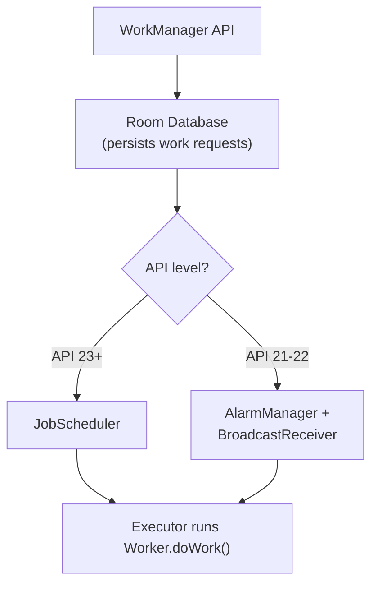

# WorkManager

**WorkManager** is the recommended solution for scheduling deferrable, asynchronous tasks that must run reliably — even if the app exits or the device restarts.

---

## Internal Implementation



WorkManager uses a **Room database** internally to persist all work requests, constraints, and state. This is why work survives device restarts and app updates — the database is durable storage. On API 23+, it delegates scheduling to **JobScheduler**. On older APIs, it falls back to **AlarmManager + BroadcastReceiver**.

---

## Core Components

### Worker

Extend the `Worker` class and override `doWork()`. Return a `Result` to indicate the outcome.

```kotlin
class UploadWorker(
    context: Context,
    params: WorkerParameters
) : Worker(context, params) {

    override fun doWork(): Result {
        val filePath = inputData.getString("file_path") ?: return Result.failure()

        return try {
            uploadFile(filePath)
            val output = workDataOf("upload_url" to "https://cdn.example.com/file.png")
            Result.success(output)
        } catch (e: Exception) {
            Result.retry()
        }
    }
}
```

| Result | Behavior |
|--------|----------|
| `Result.success()` | Work completed successfully. Optional output data passed to next worker in chain. |
| `Result.retry()` | Work should be retried later using the backoff policy. |
| `Result.failure()` | Work failed permanently. Dependent work in the chain is also marked failed. |

### CoroutineWorker

For coroutine-based work, extend `CoroutineWorker`. The `doWork()` function is a `suspend` function that runs on `Dispatchers.Default` by default.

```kotlin
class SyncWorker(
    context: Context,
    params: WorkerParameters
) : CoroutineWorker(context, params) {

    override suspend fun doWork(): Result {
        return try {
            val data = apiService.fetchData()
            database.insertAll(data)
            Result.success()
        } catch (e: Exception) {
            if (runAttemptCount < 3) Result.retry() else Result.failure()
        }
    }
}
```

---

## Constraints

Define conditions that must be met before work runs.

```kotlin
val constraints = Constraints.Builder()
    .setRequiredNetworkType(NetworkType.UNMETERED)   // Wi-Fi only
    .setRequiresBatteryNotLow(true)
    .setRequiresCharging(true)
    .setRequiresDeviceIdle(true)                     // API 23+
    .setRequiresStorageNotLow(true)
    .build()
```

---

## WorkRequest

=== "OneTimeWorkRequest"

    ```kotlin
    val uploadWork = OneTimeWorkRequestBuilder<UploadWorker>()
        .setConstraints(constraints)
        .setInputData(workDataOf("file_path" to "/storage/file.txt"))
        .addTag("upload")
        .build()

    WorkManager.getInstance(context).enqueue(uploadWork)
    ```

=== "PeriodicWorkRequest"

    ```kotlin
    val syncWork = PeriodicWorkRequestBuilder<SyncWorker>(
        1, TimeUnit.HOURS
    )
        .setConstraints(constraints)
        .build()

    WorkManager.getInstance(context).enqueue(syncWork)
    ```

!!! warning "Periodic work minimum interval is 15 minutes"
    This is an Android platform constraint driven by battery optimization. `PeriodicWorkRequestBuilder` will silently clamp any interval below 15 minutes to 15 minutes. For more frequent work, use `OneTimeWorkRequest` that re-enqueues itself, but be aware this works against battery optimization.

---

## Input / Output Data

Workers communicate through `Data` objects. Pass input when enqueuing and read output from `WorkInfo`.

```kotlin
// Pass input data
val inputData = workDataOf(
    "user_id" to 42,
    "file_path" to "/storage/photo.jpg"
)

val work = OneTimeWorkRequestBuilder<UploadWorker>()
    .setInputData(inputData)
    .build()

// Read input inside the Worker
override fun doWork(): Result {
    val userId = inputData.getInt("user_id", -1)
    val filePath = inputData.getString("file_path")
    // ...
    return Result.success(workDataOf("upload_url" to url))
}

// In a chain, output of one worker becomes input of the next
WorkManager.getInstance(context)
    .beginWith(compressWork)    // output: compressed_path
    .then(uploadWork)           // input: compressed_path (automatic)
    .enqueue()
```

!!! warning "10KB size limit"
    `Data` objects are limited to **10KB**. For larger payloads, write to a file and pass the file path as input.

---

## Backoff Policy

When a worker returns `Result.retry()`, WorkManager re-enqueues it using the configured backoff policy.

```kotlin
val work = OneTimeWorkRequestBuilder<SyncWorker>()
    .setBackoffCriteria(
        BackoffPolicy.EXPONENTIAL,  // or LINEAR
        30, TimeUnit.SECONDS        // initial delay
    )
    .build()
```

| Policy | Retry 1 | Retry 2 | Retry 3 | Retry 4 |
|--------|---------|---------|---------|---------|
| **LINEAR** | 30s | 60s | 90s | 120s |
| **EXPONENTIAL** | 30s | 60s | 120s | 240s |

Maximum backoff is capped at **5 hours**.

---

## Chaining Work

Chain multiple work requests to run in **sequence** or **parallel**.

```kotlin
WorkManager.getInstance(context)
    // Run these two in parallel
    .beginWith(listOf(downloadWork1, downloadWork2))
    // Then run after both complete
    .then(processWork)
    // Then run last
    .then(uploadWork)
    .enqueue()
```

If any worker in the chain fails, all dependent workers are marked `FAILED`. If a worker is cancelled, all dependent workers are `CANCELLED`.

---

## Expedited Work

For **time-sensitive** tasks that must start immediately (e.g., processing a payment, sending a message). Replaces the use of foreground services for short-lived urgent work.

```kotlin
val expeditedWork = OneTimeWorkRequestBuilder<PaymentWorker>()
    .setExpedited(OutOfQuotaPolicy.RUN_AS_NON_EXPEDITED_WORK_REQUEST)
    .build()

WorkManager.getInstance(context).enqueue(expeditedWork)
```

| OutOfQuotaPolicy | Behavior when quota is exhausted |
|-----------------|--------------------------------|
| `RUN_AS_NON_EXPEDITED_WORK_REQUEST` | Falls back to regular (non-expedited) execution |
| `DROP_WORK_REQUEST` | Drops the work request entirely |

!!! note "Quota"
    The system limits how often an app can run expedited work to prevent abuse. The quota resets over time and varies by device state (charging, idle).

---

## Foreground Services in WorkManager

For **long-running work** that needs a visible notification (e.g., file download with progress, music playback).

```kotlin
class DownloadWorker(
    context: Context,
    params: WorkerParameters
) : CoroutineWorker(context, params) {

    override suspend fun doWork(): Result {
        setForeground(createForegroundInfo("Downloading..."))

        for (progress in 0..100 step 10) {
            delay(500)
            setProgress(workDataOf("progress" to progress))
            setForeground(createForegroundInfo("Downloading... $progress%"))
        }

        return Result.success()
    }

    private fun createForegroundInfo(text: String): ForegroundInfo {
        val notification = NotificationCompat.Builder(applicationContext, "download")
            .setContentTitle("File Download")
            .setContentText(text)
            .setSmallIcon(R.drawable.ic_download)
            .setOngoing(true)
            .build()

        return ForegroundInfo(NOTIFICATION_ID, notification)
    }
}
```

---

## Unique Work

Prevent duplicate work with `enqueueUniqueWork`:

```kotlin
WorkManager.getInstance(context).enqueueUniqueWork(
    "sync_data",
    ExistingWorkPolicy.KEEP,
    OneTimeWorkRequestBuilder<SyncWorker>().build()
)

// For periodic work
WorkManager.getInstance(context).enqueueUniquePeriodicWork(
    "periodic_sync",
    ExistingPeriodicWorkPolicy.KEEP,
    periodicSyncRequest
)
```

| Policy | Behavior |
|--------|----------|
| `KEEP` | If work with this name exists, ignore the new request |
| `REPLACE` | Cancel existing work, enqueue new |
| `APPEND` | Chain after existing work |
| `APPEND_OR_REPLACE` | Append if existing work is not failed/cancelled, otherwise replace |

!!! tip "Staff POV"
    Always use unique work for sync operations. Without it, rapid user actions (pull-to-refresh spam) can queue dozens of identical sync workers. `KEEP` is usually the right policy — "a sync is already running, don't start another."

---

## WorkInfo & Observing State

```
BLOCKED → ENQUEUED → RUNNING → SUCCEEDED / FAILED / CANCELLED
```

```kotlin
WorkManager.getInstance(context)
    .getWorkInfoByIdLiveData(work.id)
    .observe(this) { workInfo ->
        when (workInfo?.state) {
            WorkInfo.State.RUNNING -> {
                val progress = workInfo.progress.getInt("progress", 0)
                updateProgressBar(progress)
            }
            WorkInfo.State.SUCCEEDED -> {
                val result = workInfo.outputData.getString("result_key")
                showSuccess(result)
            }
            WorkInfo.State.FAILED -> showError()
            else -> {}
        }
    }

// Flow-based observation
WorkManager.getInstance(context)
    .getWorkInfoByIdFlow(work.id)
    .collect { workInfo -> /* ... */ }
```

---

## Cancelling Work

```kotlin
// By tag
WorkManager.getInstance(context).cancelAllWorkByTag("upload")

// By ID
WorkManager.getInstance(context).cancelWorkById(work.id)

// By unique name
WorkManager.getInstance(context).cancelUniqueWork("sync_data")

// Everything
WorkManager.getInstance(context).cancelAllWork()
```

!!! note "Cancellation is cooperative"
    Calling `cancel` sets the worker's state to `CANCELLED` and calls `onStopped()`, but does not immediately stop `doWork()`. Check `isStopped` in long-running loops:

    ```kotlin
    override fun doWork(): Result {
        for (item in items) {
            if (isStopped) return Result.failure()
            process(item)
        }
        return Result.success()
    }
    ```

---

## WorkManager Initialization

### Default (Auto-Init)

WorkManager auto-initializes via a `ContentProvider` — no code needed. This runs before `Application.onCreate()`.

### Custom Initialization

Remove the default provider and initialize manually for custom configuration:

```xml
<!-- AndroidManifest.xml — disable auto-init -->
<provider
    android:name="androidx.startup.InitializationProvider"
    android:authorities="${applicationId}.androidx-startup"
    tools:node="merge">
    <meta-data
        android:name="androidx.work.WorkManagerInitializer"
        android:value="androidx.startup"
        tools:node="remove" />
</provider>
```

```kotlin
// Application.onCreate()
class MyApp : Application(), Configuration.Provider {

    override val workManagerConfiguration: Configuration
        get() = Configuration.Builder()
            .setMinimumLoggingLevel(Log.DEBUG)
            .setWorkerFactory(myCustomWorkerFactory)  // for DI injection
            .setExecutor(Executors.newFixedThreadPool(4))
            .build()
}
```

!!! tip "Hilt + WorkManager"
    Use `@HiltWorker` and `HiltWorkerFactory` to inject dependencies into workers. Custom initialization is required for this.

---

## Testing

```kotlin
@RunWith(AndroidJUnit4::class)
class SyncWorkerTest {

    private lateinit var context: Context

    @Before
    fun setup() {
        context = ApplicationProvider.getApplicationContext()

        // Initialize WorkManager for testing
        val config = Configuration.Builder()
            .setMinimumLoggingLevel(Log.DEBUG)
            .setExecutor(SynchronousExecutor())
            .build()

        WorkManagerTestInitHelper.initializeTestWorkManager(context, config)
    }

    @Test
    fun `sync worker returns success`() {
        // Build a test worker with input data
        val worker = TestListenableWorkerBuilder<SyncWorker>(context)
            .setInputData(workDataOf("user_id" to 42))
            .build()

        // Run synchronously
        val result = worker.startWork().get()

        assertEquals(Result.success(), result)
    }

    @Test
    fun `sync worker retries on network error`() {
        val worker = TestListenableWorkerBuilder<SyncWorker>(context)
            .setInputData(workDataOf("simulate_error" to true))
            .build()

        val result = worker.startWork().get()

        assertEquals(Result.retry(), result)
    }

    @Test
    fun `periodic sync is enqueued correctly`() {
        val workManager = WorkManager.getInstance(context)

        workManager.enqueueUniquePeriodicWork(
            "periodic_sync",
            ExistingPeriodicWorkPolicy.KEEP,
            PeriodicWorkRequestBuilder<SyncWorker>(1, TimeUnit.HOURS).build()
        )

        val workInfos = workManager.getWorkInfosForUniqueWork("periodic_sync").get()
        assertEquals(1, workInfos.size)
        assertEquals(WorkInfo.State.ENQUEUED, workInfos[0].state)
    }
}
```

---

## Interview Q&A

??? question "How does WorkManager guarantee that work survives app restarts and device reboots?"
    WorkManager persists all work requests, constraints, and state in an internal Room database. On API 23+, it delegates scheduling to JobScheduler, and on older APIs it falls back to AlarmManager + BroadcastReceiver. Because the work metadata is stored in durable storage, it survives process death and device restarts.

??? question "What is the difference between OneTimeWorkRequest and PeriodicWorkRequest?"
    `OneTimeWorkRequest` executes work exactly once and can be chained with other work requests. `PeriodicWorkRequest` repeats at a specified interval with a minimum of 15 minutes. Periodic work cannot be chained, and each execution is independent.

??? question "What is the difference between Expedited Work and regular work in WorkManager?"
    Expedited work is for time-sensitive tasks that must start immediately, like processing a payment. It runs with higher priority and fewer delays than regular work. When the system's expedited quota is exhausted, the `OutOfQuotaPolicy` determines whether the work falls back to regular execution or is dropped entirely.

??? question "How do you prevent duplicate work requests in WorkManager?"
    Use `enqueueUniqueWork()` or `enqueueUniquePeriodicWork()` with a unique name and an `ExistingWorkPolicy`. The `KEEP` policy ignores new requests if work with that name already exists, `REPLACE` cancels existing work and enqueues new, and `APPEND` chains after existing work.

??? question "How do you inject dependencies into a Worker with Hilt?"
    Annotate the worker with `@HiltWorker` and use `@AssistedInject` for the constructor. You must use custom WorkManager initialization with `HiltWorkerFactory` so that Hilt can create worker instances with injected dependencies. This requires disabling the default auto-initialization ContentProvider.

!!! tip "Further Reading"
    - [WorkManager overview - Android Developers](https://developer.android.com/develop/background-work/background-tasks/persistent/getting-started)
    - [WorkManager Advanced Concepts - Android Developers](https://developer.android.com/develop/background-work/background-tasks/persistent/threading)
    - [Custom WorkManager Configuration - Android Developers](https://developer.android.com/develop/background-work/background-tasks/persistent/configuration/custom-configuration)
    - [Testing WorkManager - Android Developers](https://developer.android.com/develop/background-work/background-tasks/persistent/testing)
```
