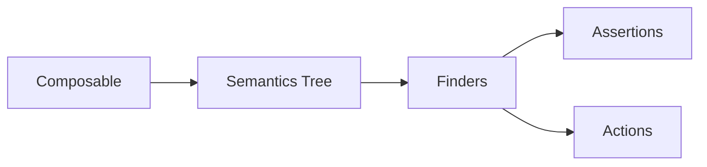

# Compose Testing

---

## Overview

Compose UI testing is built on **semantics** — the meaning your UI exposes rather than its visual layout. Instead of finding views by ID (`R.id.button`), you query a **semantics tree** using test tags, text content, or accessibility roles. Tests run on a real or virtual device via the `androidTest/` source set.



---

## Setup

Add the testing dependencies to your module's `build.gradle.kts`:

```kotlin
androidTestImplementation("androidx.compose.ui:ui-test-junit4:$composeVersion")
debugImplementation("androidx.compose.ui:ui-test-manifest:$composeVersion")
```

| Artifact | Purpose |
|----------|---------|
| `ui-test-junit4` | `ComposeTestRule`, finders, assertions, actions |
| `ui-test-manifest` | Provides the `ComponentActivity` used by `createComposeRule()` |

!!! warning "Manifest Dependency"
    `ui-test-manifest` must be a `debugImplementation` — it exposes an activity in the manifest that should never ship in release builds.

---

## Test Rules

The test rule hosts your composable and drives the semantics tree.

=== "createComposeRule()"

    Creates a blank `ComponentActivity` — use when testing a composable in isolation.

    ```kotlin
    @get:Rule
    val composeTestRule = createComposeRule()

    @Test
    fun greeting_displays_name() {
        composeTestRule.setContent {
            Greeting(name = "Sandy")
        }

        composeTestRule
            .onNodeWithText("Hello, Sandy!")
            .assertIsDisplayed()
    }
    ```

=== "createAndroidComposeRule<T>()"

    Wraps a real `Activity` — use when you need `Activity` context, resources, or `Intent` extras.

    ```kotlin
    @get:Rule
    val composeTestRule = createAndroidComposeRule<MainActivity>()

    @Test
    fun main_screen_renders() {
        composeTestRule
            .onNodeWithTag("main_screen")
            .assertExists()
    }
    ```

---

## Semantics & Test Tags

The semantics tree is the bridge between your composable and the test. Every node in the tree carries **semantic properties** like text, content description, role, and test tags.

### Adding Test Tags

```kotlin
@Composable
fun LoginButton(onClick: () -> Unit) {
    Button(
        onClick = onClick,
        modifier = Modifier.semantics { testTag = "login_button" }
    ) {
        Text("Log In")
    }
}
```

Shorthand with `testTag` modifier:

```kotlin
Button(
    onClick = onClick,
    modifier = Modifier.testTag("login_button")
) {
    Text("Log In")
}
```

!!! tip "When to Use Test Tags"
    Prefer finding nodes by **text** or **content description** — these match what users see and keep tests behavior-driven. Reserve `testTag` for nodes without meaningful text (icons, containers, lazy lists) or when text is ambiguous.

### useUnmergedTree

By default, Compose **merges** semantics nodes. A `Button` containing a `Text` produces a single merged node with the text property. To inspect child nodes individually, pass `useUnmergedTree = true`.

```kotlin
composeTestRule
    .onNodeWithTag("card", useUnmergedTree = true)
    .onChildren()
    .assertCountEquals(3)
```

---

## Finders

Finders locate nodes in the semantics tree. They return a `SemanticsNodeInteraction` (single) or `SemanticsNodeInteractionCollection` (multiple).

### Single-Node Finders

| Finder | Matches on |
|--------|-----------|
| `onNodeWithText("Submit")` | Displayed text |
| `onNodeWithTag("submit_btn")` | Test tag |
| `onNodeWithContentDescription("Close")` | Accessibility label |
| `onNode(hasText("Submit") and hasClickAction())` | Custom matcher combination |

### Multi-Node Finders

| Finder | Returns |
|--------|---------|
| `onAllNodesWithText("Item")` | All nodes matching text |
| `onAllNodesWithTag("list_item")` | All nodes matching tag |
| `onAllNodes(hasParent(hasTag("list")))` | All nodes matching a matcher |

### Chaining

```kotlin
composeTestRule
    .onNodeWithTag("user_list")
    .onChildren()
    .filter(hasText("Active"))
    .assertCountEquals(3)
```

---

## Assertions

Assertions verify the state of found nodes.

| Assertion | Checks |
|-----------|--------|
| `assertIsDisplayed()` | Node is visible on screen |
| `assertExists()` | Node is in the tree (may be off-screen) |
| `assertDoesNotExist()` | Node is not in the tree |
| `assertIsEnabled()` / `assertIsNotEnabled()` | Enabled state |
| `assertIsSelected()` / `assertIsNotSelected()` | Selection state |
| `assertIsOn()` / `assertIsOff()` | Toggle state |
| `assertTextEquals("Hello")` | Exact text match |
| `assertTextContains("Hel")` | Partial text match |
| `assertCountEquals(n)` | Collection size (on `SemanticsNodeInteractionCollection`) |

```kotlin
composeTestRule
    .onNodeWithTag("error_message")
    .assertTextContains("Invalid email")
    .assertIsDisplayed()
```

---

## Actions

Actions simulate user interactions.

| Action | Simulates |
|--------|-----------|
| `performClick()` | Tap |
| `performTextInput("hello")` | Typing into a text field |
| `performTextClearance()` | Clearing a text field |
| `performTextReplacement("new")` | Replace all text |
| `performScrollTo()` | Scroll until node is visible |
| `performScrollToIndex(5)` | Scroll lazy list to index |
| `performTouchInput { swipeUp() }` | Gesture (swipe, drag, pinch) |
| `performImeAction()` | Submit keyboard action (search, done) |

### Example: Login Form Test

```kotlin
@Test
fun login_with_valid_credentials_navigates() {
    composeTestRule.setContent {
        LoginScreen(onLoginSuccess = { /* track */ })
    }

    composeTestRule
        .onNodeWithTag("email_field")
        .performTextInput("user@example.com")

    composeTestRule
        .onNodeWithTag("password_field")
        .performTextInput("secret123")

    composeTestRule
        .onNodeWithTag("login_button")
        .performClick()

    composeTestRule
        .onNodeWithText("Welcome")
        .assertIsDisplayed()
}
```

---

## Waiting & Synchronization

Compose tests auto-synchronize with the UI — the framework **waits for idle** before executing finders and assertions. This means pending recompositions, animations, and coroutine dispatches complete before assertions run.

### When Auto-Sync Fails

For async work outside Compose's awareness (network calls, Room queries, custom executors), use `waitUntil`:

```kotlin
composeTestRule.waitUntil(timeoutMillis = 5_000) {
    composeTestRule
        .onAllNodesWithTag("list_item")
        .fetchSemanticsNodes()
        .isNotEmpty()
}
```

### Idle Resources

For more complex async coordination, register an `IdlingResource`:

```kotlin
val idlingResource = object : IdlingResource {
    override val isIdleNow: Boolean
        get() = !repository.isLoading

    override fun getDiagnostics(): String? = null
}

composeTestRule.registerIdlingResource(idlingResource)
```

!!! tip "Prefer waitUntil Over Thread.sleep"
    `Thread.sleep` is flaky — it either waits too long (slow tests) or not long enough (intermittent failures). `waitUntil` polls the condition and returns as soon as it's true.

---

## Testing State & Recomposition

### Testing State Hoisting

```kotlin
@Test
fun counter_increments_on_click() {
    composeTestRule.setContent {
        var count by remember { mutableStateOf(0) }
        Counter(
            count = count,
            onIncrement = { count++ }
        )
    }

    composeTestRule.onNodeWithText("Count: 0").assertExists()
    composeTestRule.onNodeWithTag("increment_btn").performClick()
    composeTestRule.onNodeWithText("Count: 1").assertExists()
}
```

### Testing with ViewModels

Inject a fake or real ViewModel to control state:

```kotlin
@Test
fun error_state_shows_retry_button() {
    val fakeViewModel = FakeProfileViewModel(
        initialState = ProfileUiState.Error("Network error")
    )

    composeTestRule.setContent {
        ProfileScreen(viewModel = fakeViewModel)
    }

    composeTestRule
        .onNodeWithText("Network error")
        .assertIsDisplayed()

    composeTestRule
        .onNodeWithText("Retry")
        .assertIsDisplayed()
        .performClick()

    // Verify ViewModel received the retry action
    assertTrue(fakeViewModel.retryClicked)
}
```

!!! note "Fakes Over Mocks"
    Prefer `FakeViewModel` implementations over MockK mocks for UI tests. Fakes let your composable run through real state transitions, catching integration bugs that mocks hide.

---

## Testing Navigation

Use `TestNavHostController` to verify navigation events without launching real destinations:

```kotlin
@Test
fun tapping_settings_navigates_to_settings_screen() {
    val navController = TestNavHostController(
        ApplicationProvider.getApplicationContext()
    )

    composeTestRule.setContent {
        navController.navigatorProvider.addNavigator(
            ComposeNavigator()
        )
        AppNavGraph(navController = navController)
    }

    composeTestRule
        .onNodeWithContentDescription("Settings")
        .performClick()

    assertEquals("settings", navController.currentDestination?.route)
}
```

---

## Testing Lazy Lists

Lazy lists (LazyColumn, LazyRow) only compose visible items. Use `performScrollToIndex` or `performScrollToNode` to bring items into composition before asserting.

```kotlin
@Test
fun lazy_list_renders_all_items() {
    val items = (1..50).map { "Item $it" }

    composeTestRule.setContent {
        LazyColumn(Modifier.testTag("list")) {
            items(items) { item ->
                Text(item, Modifier.testTag("item_$item"))
            }
        }
    }

    // Scroll to the last item
    composeTestRule
        .onNodeWithTag("list")
        .performScrollToIndex(49)

    composeTestRule
        .onNodeWithText("Item 50")
        .assertIsDisplayed()
}
```

For scrolling to a node matching a condition:

```kotlin
composeTestRule
    .onNodeWithTag("list")
    .performScrollToNode(hasText("Item 42"))
```

---

## Screenshot Testing with Paparazzi

Paparazzi captures composable snapshots on the JVM — no device needed. Useful for catching unintended visual regressions.

```kotlin
class ButtonScreenshotTest {
    @get:Rule
    val paparazzi = Paparazzi()

    @Test
    fun primary_button_default() {
        paparazzi.snapshot {
            MyTheme {
                PrimaryButton(text = "Submit", onClick = {})
            }
        }
    }

    @Test
    fun primary_button_disabled() {
        paparazzi.snapshot {
            MyTheme {
                PrimaryButton(
                    text = "Submit",
                    onClick = {},
                    enabled = false
                )
            }
        }
    }
}
```

| Tool | Runs on | Best for |
|------|---------|----------|
| **Paparazzi** | JVM | Fast feedback, CI-friendly, no device |
| **Roborazzi** | JVM (Robolectric) | Robolectric-based projects, interaction screenshots |
| **Shot / Dropshots** | Device/Emulator | Pixel-accurate rendering, real GPU |

---

## Debugging Tests

### Print Semantics Tree

When a finder fails, dump the tree to understand what's available:

```kotlin
composeTestRule.onRoot().printToLog("SEMANTICS")

// Or print a subtree
composeTestRule
    .onNodeWithTag("login_form")
    .printToLog("LOGIN_FORM")
```

This prints the full semantics tree to Logcat, showing every node's properties, text, tags, and actions.

### Common Pitfalls

| Problem | Cause | Fix |
|---------|-------|-----|
| `AssertionError: no node found` | Node not in tree or wrong matcher | Use `printToLog` to inspect tree; check `useUnmergedTree` |
| Node exists but `assertIsDisplayed()` fails | Node is off-screen in a scrollable | Use `performScrollTo()` first |
| Test passes alone, fails in suite | Shared state leaking between tests | Ensure each test sets its own content; reset singletons |
| Flaky timeout on `waitUntil` | Async work not coordinated | Register an `IdlingResource` or increase timeout |
| Text assertion fails | Merged semantics concatenates text | Use `assertTextContains` or `useUnmergedTree` |

---

## Test Organization

### Recommended Structure

```
app/
├── src/
│   ├── main/          # Production code
│   ├── test/          # Unit tests (JVM) — ViewModels, UseCases
│   └── androidTest/   # UI tests (device) — Compose tests
│       └── ui/
│           ├── LoginScreenTest.kt
│           ├── HomeScreenTest.kt
│           └── components/
│               ├── PrimaryButtonTest.kt
│               └── UserCardTest.kt
```

### Naming Convention

```kotlin
class LoginScreenTest {

    @Test
    fun emptyEmail_showsValidationError() { ... }

    @Test
    fun validCredentials_navigatesToHome() { ... }

    @Test
    fun networkError_showsRetryButton() { ... }
}
```

Pattern: `condition_expectedResult` — mirrors the ViewModel testing style.

!!! tip "One Screen, One Test Class"
    Group tests by the screen or component under test. This keeps test files focused and makes it easy to find tests when a screen breaks.

---

??? question "Common Interview Questions"

    **Q: How does Compose testing differ from Espresso?**
    Compose tests query a **semantics tree** instead of a view hierarchy. There are no `R.id` references — you find nodes by text, test tags, or matchers. Compose tests auto-synchronize with recomposition, while Espresso synchronizes with the `Looper` and `AsyncTask`.

    **Q: What is the semantics tree?**
    A parallel tree that describes the **meaning** of the UI (text content, roles, states, actions) rather than its visual layout. It powers both testing and accessibility. When you call `onNodeWithText`, you're querying this tree.

    **Q: When should you use `testTag` vs text-based finders?**
    Prefer text or content description — they test what users see and survive visual refactors. Use `testTag` for nodes without meaningful text (layout containers, icons without descriptions, specific items in a list).

    **Q: How do you test a composable that depends on a ViewModel?**
    Inject a fake ViewModel with controllable state. Set the desired state before running assertions. This decouples the UI test from backend behavior and eliminates flakiness from real network/database calls.

    **Q: What is `useUnmergedTree`?**
    By default, Compose merges semantics from parent and child nodes (e.g., a Button's text becomes part of the Button node). `useUnmergedTree = true` exposes the raw tree, letting you inspect individual child nodes.

    **Q: How do you test items in a LazyColumn?**
    Items outside the viewport aren't composed. Use `performScrollToIndex()` or `performScrollToNode(matcher)` to bring them into view before asserting. Never assume all items exist in the semantics tree at once.

    **Q: How do you handle async operations in Compose tests?**
    Compose auto-synchronizes with its own recomposition cycle. For external async work, use `waitUntil { condition }` with a timeout, or register an `IdlingResource` to integrate with the test framework's synchronization.

---

!!! tip "Further Reading"
    - [Compose Testing Official Guide](https://developer.android.com/develop/ui/compose/testing)
    - [Semantics in Compose](https://developer.android.com/develop/ui/compose/semantics)
    - [Testing Cheat Sheet](https://developer.android.com/develop/ui/compose/testing/testing-cheatsheet)
    - [Paparazzi GitHub](https://github.com/cashapp/paparazzi)
