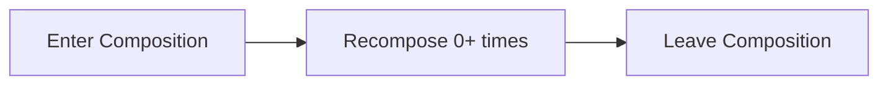
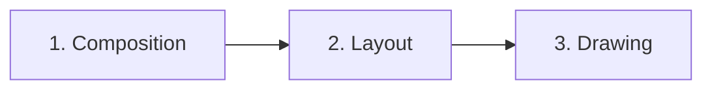

# Jetpack Compose

---

## Core Concepts

### What is Compose?

Jetpack Compose is Android's **declarative UI toolkit**. Unlike the traditional View system, Compose is not part of `android.jar` — it ships as a separate library dependency. Instead of imperatively mutating views (`textView.text = "Hello"`), you describe UI as a function of state. When state changes, the framework re-invokes the function and efficiently updates only what changed.

Under the hood, Compose relies on two key components:

- **Kotlin Compiler Plugin** — transforms `@Composable` functions at compile time (not an annotation processor). It adds hidden parameters, generates groups for identity tracking, and enables the runtime to manage the composition tree.
- **Compose Runtime** — a general-purpose tree management system. It is not Android-specific — Compose can target any platform (Desktop, Web, iOS via KMP).

### @Composable Annotation

The `@Composable` annotation does not work like typical annotations. It fundamentally changes the function's signature and behavior at the compiler level.

When you write:

```kotlin
@Composable
fun Greeting(name: String) {
    Text("Hello, $name")
}
```

The compiler transforms this into something conceptually like:

```kotlin
fun Greeting(name: String, $composer: Composer, $changed: Int) {
    $composer.startRestartGroup(...)
    // ... body ...
    $composer.endRestartGroup()?.updateScope { nextComposer, _ ->
        Greeting(name, nextComposer, $changed)
    }
}
```

Key transformations the compiler performs:

- **Adds a `$composer` parameter** — this is how the runtime threads composition context through the call tree. It is why you can only call `@Composable` functions from other `@Composable` functions.
- **Generates restart groups** — wraps the function body so the runtime can re-invoke it later during recomposition.
- **Adds a `$changed` bitmask** — tracks which parameters have changed since the last composition, enabling skip logic.

!!! note "Not an Annotation Processor"
    Unlike Dagger's `@Inject` or Room's `@Entity`, the `@Composable` annotation is processed by a **Kotlin compiler plugin**, not KAPT/KSP. This means it can modify the function's actual compiled output, not just generate side files.

### Modifiers

Modifiers configure and decorate composables. They handle layout, drawing, interaction, and semantics. The critical thing to understand is that **order matters** — modifiers are applied left-to-right, which means outside-in.

```kotlin
// Padding is OUTSIDE the background (background has padding around it)
Box(
    modifier = Modifier
        .padding(16.dp)
        .background(Color.Blue)
        .size(100.dp)
)

// Padding is INSIDE the background (padding is within the blue area)
Box(
    modifier = Modifier
        .background(Color.Blue)
        .padding(16.dp)
        .size(100.dp)
)
```

Think of each modifier as wrapping the element in a layer. The first modifier is the outermost layer.

Common modifier categories:

| Category | Modifiers |
|----------|-----------|
| **Size** | `size()`, `fillMaxWidth()`, `fillMaxSize()`, `wrapContentSize()`, `requiredSize()` |
| **Padding** | `padding()` (no margin in Compose — use padding on the parent) |
| **Drawing** | `background()`, `border()`, `clip()`, `shadow()`, `alpha()` |
| **Layout** | `offset()`, `weight()` (in Row/Column), `align()` |
| **Interaction** | `clickable()`, `toggleable()`, `draggable()`, `scrollable()` |
| **Semantics** | `semantics()`, `testTag()`, `contentDescription` |

!!! tip "Modifier.Node API"
    Since Compose 1.5, the recommended way to create custom modifiers is using the **Modifier.Node API**, which replaces `Modifier.composed`. The Node API is more performant because it avoids per-composition allocation — the node is created once and updated in place, rather than creating a new composed modifier on every recomposition.

### Slot-based API Pattern

Compose uses **slot-based APIs** extensively. Instead of taking specific child types, composables accept `@Composable` lambdas as parameters, letting the caller decide what content to place in each "slot."

```kotlin
// Button's signature — content is a slot
@Composable
fun Button(
    onClick: () -> Unit,
    modifier: Modifier = Modifier,
    enabled: Boolean = true,
    // ... other params
    content: @Composable RowScope.() -> Unit  // slot
)

// Usage — caller fills the slot
Button(onClick = { /* ... */ }) {
    Icon(Icons.Default.Send, contentDescription = null)
    Spacer(Modifier.width(8.dp))
    Text("Send")
}
```

The `RowScope.()` receiver means the content lambda has access to `RowScope` functions like `Modifier.weight()`. This pattern makes composables highly flexible — `Scaffold` has slots for `topBar`, `bottomBar`, `floatingActionButton`, and `content`.

---

## State Management

### remember

`remember` caches a value across recompositions. It stores the value in the **slot table** — Compose's internal data structure that holds composition state. The cached value is keyed by the composable's **call site position** in the composition tree.

```kotlin
@Composable
fun Counter() {
    // count survives recompositions but NOT config changes or process death
    var count by remember { mutableIntStateOf(0) }
    Button(onClick = { count++ }) {
        Text("Count: $count")
    }
}
```

Key behaviors:

- The lambda `{ mutableIntStateOf(0) }` runs only on **first composition**. On recomposition, the cached value is returned.
- When the composable **leaves the composition** (e.g., an `if` branch no longer includes it), the remembered value is **forgotten** and garbage collected.
- `remember` can take keys: `remember(userId) { expensiveComputation(userId) }` — the cached value is recomputed when the key changes.

### mutableStateOf

`mutableStateOf()` creates an observable state object backed by Compose's **snapshot system**. When you write to it, any composable scope that read it is scheduled for recomposition.

Three equivalent ways to declare state:

=== "State object"

    ```kotlin
    val count = remember { mutableIntStateOf(0) }
    Text("Count: ${count.intValue}")
    count.intValue++
    ```

=== "Property delegate"

    ```kotlin
    var count by remember { mutableIntStateOf(0) }
    Text("Count: $count")
    count++
    ```

=== "Destructuring"

    ```kotlin
    val (count, setCount) = remember { mutableStateOf(0) }
    Text("Count: $count")
    setCount(count + 1)
    ```

!!! note "Specialized State Types"
    Use `mutableIntStateOf`, `mutableLongStateOf`, `mutableFloatStateOf`, and `mutableDoubleStateOf` for primitives. These avoid autoboxing overhead compared to `mutableStateOf<Int>()`.

### rememberSaveable

`rememberSaveable` survives **configuration changes** (rotation, locale change) AND **process death**. It works by serializing the value into a `Bundle`.

```kotlin
var text by rememberSaveable { mutableStateOf("") }
TextField(value = text, onValueChange = { text = it })
```

By default, it can save anything that goes into a `Bundle` (primitives, strings, parcelables). For custom types, provide a `Saver`:

=== "mapSaver"

    ```kotlin
    data class City(val name: String, val country: String)

    val CitySaver = mapSaver(
        save = { mapOf("name" to it.name, "country" to it.country) },
        restore = { City(it["name"] as String, it["country"] as String) }
    )

    var city by rememberSaveable(stateSaver = CitySaver) {
        mutableStateOf(City("Tokyo", "Japan"))
    }
    ```

=== "listSaver"

    ```kotlin
    val CitySaver = listSaver(
        save = { listOf(it.name, it.country) },
        restore = { City(it[0] as String, it[1] as String) }
    )
    ```

`rememberSaveable` also saves state when items **leave composition temporarily** — for example, when a `LazyColumn` item scrolls off-screen. When it scrolls back, the saved state is restored.

### rememberRetained (Circuit by Slack)

`rememberRetained` is part of the **Circuit** library by Slack. It survives configuration changes like a ViewModel, but is scoped to the composable's position in the UI tree rather than to a `ViewModelStoreOwner`.

```kotlin
// Survives config changes, does NOT survive process death
val state = rememberRetained { SomeExpensiveObject() }
```

Key differences from `rememberSaveable`:

| | `rememberSaveable` | `rememberRetained` |
|---|---|---|
| **Config change** | Survives | Survives |
| **Process death** | Survives | Does NOT survive |
| **Mechanism** | Bundle serialization | Held in memory |
| **Types** | Must be serializable | Any type |
| **Scope** | Call site in composition | Call site in composition |

This is useful when you want ViewModel-like retention but scoped to a specific part of the UI tree, not at the navigation destination level.

### State Hoisting

State hoisting is the pattern of moving state out of a composable to make it **stateless**. The caller owns the state and passes it down; the composable sends events up.

```kotlin
// Stateful — owns its state (hard to test, not reusable)
@Composable
fun SearchBar() {
    var query by remember { mutableStateOf("") }
    TextField(value = query, onValueChange = { query = it })
}

// Stateless — hoisted (testable, reusable, previewable)
@Composable
fun SearchBar(query: String, onQueryChange: (String) -> Unit) {
    TextField(value = query, onValueChange = onQueryChange)
}

// Caller manages state
@Composable
fun SearchScreen() {
    var query by remember { mutableStateOf("") }
    SearchBar(query = query, onQueryChange = { query = it })
}
```

The pattern follows **unidirectional data flow**: state flows down, events flow up. This makes composables easier to test (pass known state, assert events), reuse in different contexts, and preview.

### Collecting External State

=== "collectAsStateWithLifecycle"

    ```kotlin
    @Composable
    fun UserScreen(viewModel: UserViewModel = viewModel()) {
        val uiState by viewModel.uiState.collectAsStateWithLifecycle()
        // ...
    }
    ```

    **Preferred** for Android. Stops collecting the Flow when the lifecycle drops below the specified state (default: `STARTED`). This avoids wasting resources when the app is in the background.

=== "collectAsState"

    ```kotlin
    val uiState by viewModel.uiState.collectAsState()
    ```

    Keeps collecting regardless of lifecycle. Use for non-Android Compose targets or when you need collection to continue in the background.

=== "observeAsState"

    ```kotlin
    val data by viewModel.liveData.observeAsState(initial = "")
    ```

    For `LiveData` interop. Converts LiveData observation into Compose state.

!!! warning "collectAsState vs collectAsStateWithLifecycle"
    Always prefer `collectAsStateWithLifecycle()` on Android. With plain `collectAsState()`, if a Flow emits while the app is in the background, it triggers recomposition for UI nobody is looking at — wasting CPU and potentially causing crashes if the composable interacts with the Activity.

---

## Recomposition

### What Triggers Recomposition

Recomposition is triggered when a **`State` object that was read during composition changes**. Simply creating or holding a `State` object does not trigger anything — it must be **read** within a composable scope.

```kotlin
@Composable
fun Example() {
    val counter = remember { mutableIntStateOf(0) }

    // This scope reads counter.intValue — it will recompose when counter changes
    Text("Count: ${counter.intValue}")

    // This scope does NOT read counter — it will NOT recompose
    Button(onClick = { counter.intValue++ }) {
        Text("Increment")  // This Text does not recompose when counter changes
    }
}
```

### Recomposition Scope

Recomposition happens at the granularity of the **nearest restartable scope**. A restartable scope is any non-inline `@Composable` function. Inline composables (like `Column`, `Row`, `Box`) are not separate scopes — their parent is the restart boundary.

```kotlin
@Composable
fun Parent() {             // restartable scope
    val name by remember { mutableStateOf("Alice") }

    Column {               // inline — NOT a separate scope
        Text(name)         // reads name → Parent recomposes
        ChildComposable()  // restartable scope — skipped if params unchanged
    }
}
```

### Smart Recomposition

Compose tracks exactly which `State` objects are read in which scopes. When a state changes, only the scopes that actually read that state are recomposed. Other parts of the tree are left untouched.

### Skipping

When a composable is scheduled for recomposition, Compose first checks if it can be **skipped**. A composable is skipped if:

1. All parameters are **stable** types
2. All parameters are **equal** to the previous composition's values (using `equals()`)

If both conditions are met, the composable's body is not re-executed.

### Rules of Recomposition

- Recomposition can happen in **any order** — do not depend on composables executing top-to-bottom.
- Recomposition can run in **parallel** — composable functions must be safe to call from multiple threads.
- Recomposition should be **side-effect free** — do not write to shared variables, trigger network calls, or mutate external state directly from a composable. Use effect handlers instead.
- Recomposition is **optimistic** — Compose may start recomposing and then cancel if state changes again before completion.

---

## Composable Lifecycle

A composable has a simple lifecycle:



- **Enter Composition** — the composable is called for the first time. `remember` blocks execute, effects start.
- **Recompose** — the composable is called again because state it reads changed. Remembered values are preserved.
- **Leave Composition** — the composable is no longer part of the UI tree. Remembered values are forgotten, effects are cleaned up.

### Call Site Identity

Compose identifies composable instances by their **source position** (call site) in the code. Two calls to the same composable at different positions are tracked as different instances with independent state.

```kotlin
@Composable
fun TwoCounters() {
    Counter()  // Instance A — has its own remembered state
    Counter()  // Instance B — independent state from A
}
```

### The key Composable

When the call site is the same but you need different identities (e.g., inside a `when` or conditional), use `key()`:

```kotlin
@Composable
fun UserProfile(isAdmin: Boolean) {
    // Without key: switching isAdmin reuses state from the previous composable
    // at this position, which causes bugs
    key(isAdmin) {
        // With key: Compose treats this as a new instance when isAdmin changes
        // Old state is disposed, new state is created
        EditForm()
    }
}
```

`LazyColumn` uses `key` internally — when you provide `key = { item.id }`, Compose can correctly match items across reorderings.

### Slot Table

Internally, Compose stores all composition state in a **slot table** — a flat array structured as a gap buffer. It stores:

- Composable group markers (start/end)
- Remembered values
- State objects
- CompositionLocal values

The gap buffer design makes insertions and removals at the current position O(1), which is efficient for tree-building operations during composition.

---

## Stability System

The stability system determines whether Compose can **skip** recomposition of a composable. Understanding it is critical for performance.

### Stable Types

A type is considered **stable** if Compose can rely on its `equals()` for comparison. These types are stable by default:

- All primitive types (`Int`, `Float`, `Boolean`, etc.)
- `String`
- Function types (lambdas)
- Enum classes
- `@Immutable` or `@Stable` annotated classes
- Data classes where **all properties** are stable types

### Unstable Types

These are unstable and will **prevent skipping**:

- `List`, `Set`, `Map` from `kotlin.collections` (because they could be backed by mutable implementations)
- Classes with `var` properties
- Classes with properties of unstable types
- Third-party classes that Compose cannot analyze

### @Stable vs @Immutable

=== "@Stable"

    ```kotlin
    @Stable
    class UiState(
        val items: ImmutableList<Item>,
        val isLoading: Boolean
    )
    ```

    `@Stable` is a contract that tells the Compose compiler:

    1. If `equals()` returns `true` for two instances, they are interchangeable for composition purposes.
    2. If a public property changes, composition will be **notified** (i.e., changes happen through Compose's snapshot system or observable mechanisms).
    3. All public properties are also stable.

=== "@Immutable"

    ```kotlin
    @Immutable
    data class Route(
        val path: String,
        val params: ImmutableMap<String, String>
    )
    ```

    `@Immutable` is a **stronger guarantee**: all public properties will **never change** after construction. This is a promise — the compiler does not enforce immutability, but if you lie, you will get stale UI.

### ImmutableList from kotlinx.collections.immutable

The most common stability fix is replacing Kotlin stdlib collections with their immutable counterparts:

```kotlin
// UNSTABLE — List could be a MutableList at runtime
data class ScreenState(
    val items: List<Item>         // unstable
)

// STABLE — ImmutableList guarantees no mutation
data class ScreenState(
    val items: ImmutableList<Item>  // stable
)
```

Add the dependency:

```kotlin
implementation("org.jetbrains.kotlinx:kotlinx-collections-immutable:0.3.7")
```

Convert with `.toImmutableList()`, `.toPersistentList()`, or use `persistentListOf()`.

### Strong Skipping Mode

Since Compose compiler **1.5.4**, strong skipping mode is enabled by default. This changes skipping behavior significantly:

- **Unstable parameters** are now compared by **referential equality** (`===`). If the same object reference is passed, the composable skips even if the type is unstable.
- **Lambdas** are **automatically remembered** by the compiler, so passing a lambda no longer forces recomposition.

```kotlin
// Before strong skipping: this would ALWAYS recompose UserCard
// because List<String> is unstable
@Composable
fun UserCard(tags: List<String>) { /* ... */ }

// With strong skipping: if the same List instance is passed (===),
// UserCard is skipped. Only recomposes if a NEW list object is passed.
```

!!! warning "Strong Skipping is Not a Silver Bullet"
    Strong skipping helps with referential equality, but if you create new object instances on every recomposition (e.g., `listOf()` in a composable body), it will not help. You still need `remember` or stable types for those cases.

---

## CompositionLocal

`CompositionLocal` provides implicit data passing through the composition tree — similar in concept to dependency injection scoped to the UI tree. It avoids threading values through every composable's parameter list.

### compositionLocalOf vs staticCompositionLocalOf

=== "compositionLocalOf"

    ```kotlin
    val LocalUserPreferences = compositionLocalOf<UserPreferences> {
        error("No UserPreferences provided")
    }
    ```

    When the provided value changes, **only composables that actually read** `LocalUserPreferences.current` are recomposed. The runtime tracks reads at a fine-grained level. Use this for values that change relatively often.

=== "staticCompositionLocalOf"

    ```kotlin
    val LocalAnalytics = staticCompositionLocalOf<Analytics> {
        error("No Analytics provided")
    }
    ```

    When the provided value changes, the **entire subtree** below the provider is recomposed — no fine-grained tracking. More efficient when the value rarely (or never) changes because it avoids the overhead of read tracking. Theme colors, analytics, context, and similar "set once" values are good candidates.

### Providing Values

```kotlin
@Composable
fun App() {
    val preferences = remember { UserPreferences(darkMode = true) }
    val analytics = remember { AnalyticsImpl() }

    CompositionLocalProvider(
        LocalUserPreferences provides preferences,
        LocalAnalytics provides analytics
    ) {
        // All composables in this subtree can access both values
        MainScreen()
    }
}

@Composable
fun MainScreen() {
    val prefs = LocalUserPreferences.current  // reads the provided value
    // ...
}
```

### Common Built-in CompositionLocals

| CompositionLocal | Type | Description |
|---|---|---|
| `LocalContext` | `Context` | The current Android Context |
| `LocalLifecycleOwner` | `LifecycleOwner` | Current lifecycle owner |
| `LocalDensity` | `Density` | Screen density for dp/px conversion |
| `LocalConfiguration` | `Configuration` | Device configuration (orientation, locale, etc.) |
| `LocalView` | `View` | The parent Android View hosting Compose |
| `LocalFocusManager` | `FocusManager` | Manages focus within Compose |

---

## Composition Phases

Compose renders UI in three sequential phases. Understanding these phases is important for performance because **state reads are tracked per phase**.



### Phase 1: Composition

Runs your `@Composable` functions. Builds or updates the **UI tree** (the internal representation of what nodes exist and their properties). This is where `remember`, state reads, and control flow (`if`/`when`/`for`) execute.

### Phase 2: Layout

Two sub-steps performed in a **single pass** (children are measured exactly once):

1. **Measure** — each node measures its children, then determines its own size
2. **Place** — each node positions its children within its bounds

### Phase 3: Drawing

Renders the laid-out nodes to the **Canvas**. Executes draw commands (`drawRect`, `drawText`, etc.).

### Why Phases Matter for Performance

State reads are tracked per phase. If you read state only in the Draw phase, a state change triggers **only a redraw** — no recomposition, no re-layout. This is the basis of the "defer reads" optimization.

```kotlin
// BAD: reads color in Composition phase → full recomposition on change
Box(modifier = Modifier.background(animatedColor.value))

// GOOD: reads color in Draw phase → only redraw on change
Box(modifier = Modifier.drawBehind {
    drawRect(animatedColor.value)
})
```

```kotlin
// BAD: reads offset in Composition phase → recomposition + layout + draw
Box(modifier = Modifier.offset(x = offsetX.value, y = 0.dp))

// GOOD: reads offset in Layout phase → only layout + draw
Box(modifier = Modifier.offset { IntOffset(offsetX.value.roundToPx(), 0) })
```

---

## Interop with Views

### ComposeView in XML Layouts

Embed Compose content inside a traditional XML layout:

```xml
<!-- activity_main.xml -->
<androidx.compose.ui.platform.ComposeView
    android:id="@+id/compose_view"
    android:layout_width="match_parent"
    android:layout_height="wrap_content" />
```

```kotlin
// In Activity or Fragment
val composeView = findViewById<ComposeView>(R.id.compose_view)
composeView.setContent {
    MaterialTheme {
        Greeting("World")
    }
}
```

### AndroidView in Compose

Embed a traditional View inside a Compose hierarchy:

```kotlin
@Composable
fun MapScreen() {
    AndroidView(
        factory = { context ->
            MapView(context).apply {
                // one-time setup
            }
        },
        update = { mapView ->
            // called on recomposition — update the view with new state
            mapView.moveCamera(cameraPosition)
        }
    )
}
```

### ViewCompositionStrategy

Controls when the Compose composition is **disposed**. This matters in Fragments where the view lifecycle and Fragment lifecycle diverge.

| Strategy | Behavior | Use Case |
|----------|----------|----------|
| `DisposeOnDetachedFromWindow` | Default. Disposes when the `ComposeView` detaches from the window. | Activities |
| `DisposeOnViewTreeLifecycleDestroyed` | Disposes when the view's `LifecycleOwner` is destroyed. | **Fragments** — follows the fragment's view lifecycle |
| `DisposeOnLifecycleDestroyed` | Disposes when a specific `Lifecycle` is destroyed. | Custom lifecycle scoping |

```kotlin
// In a Fragment
composeView.setViewCompositionStrategy(
    ViewCompositionStrategy.DisposeOnViewTreeLifecycleDestroyed
)
```

!!! warning "Fragment Gotcha"
    Without setting `DisposeOnViewTreeLifecycleDestroyed`, Compose disposes when the view detaches. In Fragments with transitions or view recreation (e.g., navigating back), this causes Compose to dispose and lose state prematurely.

---

## Navigation

### Route-based Navigation

Compose Navigation uses **routes** (string paths) to identify destinations. Each destination maps to a composable screen.

```kotlin
@Composable
fun AppNavigation() {
    val navController = rememberNavController()

    NavHost(navController = navController, startDestination = "home") {
        composable("home") {
            HomeScreen(
                onNavigateToDetail = { id ->
                    navController.navigate("detail/$id")
                }
            )
        }
        composable(
            route = "detail/{itemId}",
            arguments = listOf(navArgument("itemId") { type = NavType.StringType })
        ) { backStackEntry ->
            DetailScreen(
                itemId = backStackEntry.arguments?.getString("itemId") ?: ""
            )
        }
    }
}
```

### Type-safe Navigation (Navigation 2.8+)

Since Navigation 2.8, you can define routes as `@Serializable` data classes instead of strings, bringing compile-time safety:

```kotlin
@Serializable
object Home

@Serializable
data class Detail(val itemId: String)

@Composable
fun AppNavigation() {
    val navController = rememberNavController()

    NavHost(navController = navController, startDestination = Home) {
        composable<Home> {
            HomeScreen(
                onNavigateToDetail = { id ->
                    navController.navigate(Detail(itemId = id))
                }
            )
        }
        composable<Detail> { backStackEntry ->
            val detail: Detail = backStackEntry.toRoute()
            DetailScreen(itemId = detail.itemId)
        }
    }
}
```

This eliminates string-matching bugs and gives you IDE autocompletion and refactoring support for route arguments.

### movableContentOf

`movableContentOf` allows moving composed content between different parents **without recomposing** it. The state and nodes are transferred as-is.

```kotlin
val movableContent = remember {
    movableContentOf {
        // This composable and its state will survive being moved
        VideoPlayer(url = videoUrl)
    }
}

if (isFullScreen) {
    FullScreenContainer { movableContent() }
} else {
    InlineContainer { movableContent() }
}
```

Without `movableContentOf`, switching between the `if` branches would destroy the `VideoPlayer` and create a new one. With it, the player (and its playback state, buffered data, etc.) is moved intact.
