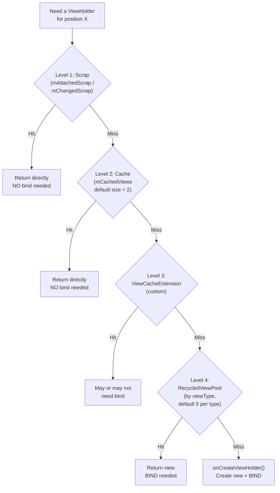

# RecyclerView Internals

## Core Components

| Component | Role |
|-----------|------|
| **Adapter** | Holds the data list and binds data to ViewHolders |
| **LayoutManager** | Positions items on screen (Linear, Grid, StaggeredGrid) |
| **ItemAnimator** | Handles add, remove, and move animations |
| **ViewHolder** | Holds direct view references — avoids repeated `findViewById()` |

---

## 4-Level Caching System

RecyclerView uses a multi-level caching system to minimize view creation and binding.



| Level | Cache | Bound to Position? | `onBindViewHolder` Called? | Details |
|-------|-------|:---:|:---:|---------|
| 1 | **Scrap** (mAttachedScrap) | Yes | No | Views temporarily detached during layout. Returned as-is. |
| 2 | **Cache** (mCachedViews) | Yes | No | Recently scrolled-off views. Default capacity: **2**. Matched by position. |
| 3 | **ViewCacheExtension** | Custom | Custom | Developer hook — rarely used. For custom caching logic. |
| 4 | **RecycledViewPool** | No | Yes | Dirty views grouped by `viewType`. Default: **5 per type**. Must be rebound. |

!!! tip "Tuning the cache"
    For scroll-heavy lists (chat, feeds), increase the cache size:

    ```kotlin
    recyclerView.setItemViewCacheSize(10) // default is 2
    ```

    For nested RecyclerViews with the same view type, share a pool:

    ```kotlin
    recyclerView.setRecycledViewPool(sharedPool)
    ```

---

## Prefetch

`LayoutManager` uses **GapWorker** to pre-fetch items during scroll idle time, leveraging the **RenderThread** to avoid blocking the UI thread.

```
UI Thread: [layout frame N] [idle gap] [layout frame N+1]
                                  ↑
                    GapWorker pre-fetches items here
```

Prefetching is **enabled by default** for `LinearLayoutManager` and `GridLayoutManager`. It looks ahead by 1 item in the scroll direction and creates/binds ViewHolders during idle time.

```kotlin
// Disable if causing issues (rare)
(recyclerView.layoutManager as LinearLayoutManager).isItemPrefetchEnabled = false

// For nested RecyclerViews, set initial prefetch count
(innerLayoutManager as LinearLayoutManager).initialPrefetchItemCount = 4
```

---

## ViewHolder Pattern

!!! tip "Why ViewHolder?"
    `findViewById()` traverses the entire view hierarchy — expensive for deep layouts. ViewHolder caches direct references to child views, called once in `onCreateViewHolder()` and reused across binds.

```kotlin
class UserViewHolder(itemView: View) : RecyclerView.ViewHolder(itemView) {
    private val nameText: TextView = itemView.findViewById(R.id.name)
    private val avatarImage: ImageView = itemView.findViewById(R.id.avatar)

    fun bind(user: User) {
        nameText.text = user.name
        avatarImage.load(user.avatarUrl)
    }
}
```

---

## DiffUtil & ListAdapter

### The Problem

`notifyDataSetChanged()` redraws **every visible item** — expensive and kills item animations. On large lists, this causes visible jank.

### DiffUtil

Calculates the **minimum set of updates** between two lists using Myers' diff algorithm.

```kotlin
class UserDiffCallback : DiffUtil.ItemCallback<User>() {
    override fun areItemsTheSame(oldItem: User, newItem: User): Boolean {
        return oldItem.id == newItem.id  // identity check
    }

    override fun areContentsTheSame(oldItem: User, newItem: User): Boolean {
        return oldItem == newItem  // content equality (data class equals)
    }
}
```

!!! warning "areItemsTheSame vs areContentsTheSame"
    - `areItemsTheSame` = "Is this the same entity?" (compare IDs)
    - `areContentsTheSame` = "Has anything changed?" (compare all fields)
    - If `areItemsTheSame` returns `false`, the item is treated as removed + inserted. `areContentsTheSame` is only called when `areItemsTheSame` returns `true`.

### ListAdapter

Wraps `DiffUtil` with async diffing on a background thread. **This is the standard approach.**

```kotlin
class UserAdapter : ListAdapter<User, UserViewHolder>(UserDiffCallback()) {

    override fun onCreateViewHolder(parent: ViewGroup, viewType: Int): UserViewHolder {
        val view = LayoutInflater.from(parent.context)
            .inflate(R.layout.item_user, parent, false)
        return UserViewHolder(view)
    }

    override fun onBindViewHolder(holder: UserViewHolder, position: Int) {
        holder.bind(getItem(position))
    }
}

// Submit new list — diffing happens on background thread
adapter.submitList(newUserList)
```

### Partial Binding with Payloads

When only one field changes (e.g., a like count), rebinding the entire ViewHolder is wasteful. Use payloads.

```kotlin
override fun areContentsTheSame(oldItem: Post, newItem: Post) = oldItem == newItem

override fun getChangePayload(oldItem: Post, newItem: Post): Any? {
    if (oldItem.likeCount != newItem.likeCount) return "LIKE_CHANGED"
    return null  // full rebind
}

// In adapter
override fun onBindViewHolder(holder: PostViewHolder, position: Int, payloads: List<Any>) {
    if (payloads.contains("LIKE_CHANGED")) {
        holder.updateLikeCount(getItem(position).likeCount)  // partial update
    } else {
        super.onBindViewHolder(holder, position, payloads)  // full bind
    }
}
```

!!! tip "Staff POV"
    Always use `ListAdapter` over raw `RecyclerView.Adapter`. The async diffing is free performance. The only exception is when you need `notifyItemChanged(position, payload)` for partial binds — then override `getChangePayload()` in your `DiffUtil.ItemCallback`.

---

## ConcatAdapter

Combine multiple adapters into a single RecyclerView — useful for headers, footers, and mixed-content lists.

```kotlin
val headerAdapter = HeaderAdapter()
val userAdapter = UserAdapter()
val footerAdapter = FooterAdapter()

// ConcatAdapter merges them into one
val concatAdapter = ConcatAdapter(headerAdapter, userAdapter, footerAdapter)
recyclerView.adapter = concatAdapter

// Each adapter manages its own data independently
headerAdapter.setTitle("Users")
userAdapter.submitList(users)
footerAdapter.showLoading(true)
```

### Config Options

```kotlin
val config = ConcatAdapter.Config.Builder()
    .setIsolateViewTypes(true)    // each adapter has its own view type namespace (default: true)
    .setStableIdMode(NO_STABLE_IDS)
    .build()

val adapter = ConcatAdapter(config, headerAdapter, userAdapter, footerAdapter)
```

!!! note "View type isolation"
    With `setIsolateViewTypes(true)` (the default), view types from different adapters are treated as separate — a `ViewHolder` from the header adapter will never be recycled into the user adapter's pool. Set to `false` if multiple adapters share the same view type and you want cross-adapter recycling.

---

## ItemDecoration

Draw custom decorations around or between items — dividers, spacing, section headers.

```kotlin
// Simple spacing decoration
class SpacingDecoration(private val spacing: Int) : RecyclerView.ItemDecoration() {

    override fun getItemOffsets(
        outRect: Rect, view: View,
        parent: RecyclerView, state: RecyclerView.State
    ) {
        outRect.bottom = spacing
        // First item gets top spacing too
        if (parent.getChildAdapterPosition(view) == 0) {
            outRect.top = spacing
        }
    }
}

// Divider decoration
class DividerDecoration(context: Context) : RecyclerView.ItemDecoration() {
    private val divider = ContextCompat.getDrawable(context, R.drawable.divider)!!

    override fun onDrawOver(c: Canvas, parent: RecyclerView, state: RecyclerView.State) {
        val left = parent.paddingLeft
        val right = parent.width - parent.paddingRight

        for (i in 0 until parent.childCount - 1) {
            val child = parent.getChildAt(i)
            val top = child.bottom + (child.layoutParams as RecyclerView.LayoutParams).bottomMargin
            val bottom = top + divider.intrinsicHeight
            divider.setBounds(left, top, right, bottom)
            divider.draw(c)
        }
    }
}

// Apply
recyclerView.addItemDecoration(SpacingDecoration(16.dp))
recyclerView.addItemDecoration(DividerDecoration(context))
```

Multiple decorations can be stacked — they are drawn in the order they are added.

---

## ItemTouchHelper

Swipe-to-delete and drag-to-reorder with a single callback.

```kotlin
val touchHelper = ItemTouchHelper(object : ItemTouchHelper.SimpleCallback(
    ItemTouchHelper.UP or ItemTouchHelper.DOWN,  // drag directions
    ItemTouchHelper.LEFT or ItemTouchHelper.RIGHT // swipe directions
) {
    override fun onMove(
        recyclerView: RecyclerView,
        viewHolder: RecyclerView.ViewHolder,
        target: RecyclerView.ViewHolder
    ): Boolean {
        val from = viewHolder.adapterPosition
        val to = target.adapterPosition
        adapter.moveItem(from, to)
        return true
    }

    override fun onSwiped(viewHolder: RecyclerView.ViewHolder, direction: Int) {
        val position = viewHolder.adapterPosition
        adapter.removeItem(position)
    }

    // Optional: customize swipe background
    override fun onChildDraw(
        c: Canvas, recyclerView: RecyclerView,
        viewHolder: RecyclerView.ViewHolder,
        dX: Float, dY: Float,
        actionState: Int, isCurrentlyActive: Boolean
    ) {
        if (actionState == ItemTouchHelper.ACTION_STATE_SWIPE) {
            // Draw red background behind swiped item
            val background = ColorDrawable(Color.RED)
            background.setBounds(
                viewHolder.itemView.right + dX.toInt(), viewHolder.itemView.top,
                viewHolder.itemView.right, viewHolder.itemView.bottom
            )
            background.draw(c)
        }
        super.onChildDraw(c, recyclerView, viewHolder, dX, dY, actionState, isCurrentlyActive)
    }
})

touchHelper.attachToRecyclerView(recyclerView)
```

---

## SnapHelper

Control how items snap into position after a scroll or fling.

| Helper | Behavior | Use Case |
|--------|----------|----------|
| `LinearSnapHelper` | Snaps to the **nearest** item edge | Horizontal carousels |
| `PagerSnapHelper` | Snaps to **center**, one item at a time (like ViewPager) | Onboarding, card decks |

```kotlin
// Carousel behavior — snaps to nearest item
val linearSnap = LinearSnapHelper()
linearSnap.attachToRecyclerView(recyclerView)

// Pager behavior — one item at a time, centered
val pagerSnap = PagerSnapHelper()
pagerSnap.attachToRecyclerView(recyclerView)
```

---

## Shared RecycledViewPool

When you have the same view type across multiple nested RecyclerViews (e.g., horizontal lists inside a vertical list), share a pool to avoid creating redundant ViewHolders.

```kotlin
class OuterAdapter(
    private val sections: List<Section>
) : RecyclerView.Adapter<OuterViewHolder>() {

    private val sharedPool = RecyclerView.RecycledViewPool()

    override fun onCreateViewHolder(parent: ViewGroup, viewType: Int): OuterViewHolder {
        val view = LayoutInflater.from(parent.context)
            .inflate(R.layout.item_section, parent, false)
        return OuterViewHolder(view)
    }

    override fun onBindViewHolder(holder: OuterViewHolder, position: Int) {
        holder.innerRecyclerView.apply {
            adapter = InnerAdapter(sections[position].items)
            setRecycledViewPool(sharedPool)
            (layoutManager as LinearLayoutManager).initialPrefetchItemCount = 4
        }
    }

    override fun getItemCount() = sections.size
}
```

---

## RecyclerView vs LazyColumn

| Aspect | RecyclerView | LazyColumn |
|--------|-------------|------------|
| **Framework** | View system | Jetpack Compose |
| **View recycling** | Explicit (ViewHolder pattern) | Implicit (Compose runtime handles it) |
| **DiffUtil** | Manual setup with ListAdapter | Automatic with `key` parameter in `items()` |
| **Nested lists** | Shared RecycledViewPool for performance | Nested `LazyColumn` is discouraged — use `item` blocks |
| **Complex layouts** | Better — shared pools, custom LayoutManagers | Simpler API, less control |
| **ItemDecoration** | Flexible custom drawing | Use `Modifier.padding()`, `Divider()` composables |
| **Drag & drop** | ItemTouchHelper | Requires custom implementation |
| **Performance** | Highly optimized for large, complex lists | Good for standard lists, less tunable |

!!! tip "When to use which"
    Use **LazyColumn** for standard Compose UIs — it is simpler and integrates naturally with the Compose ecosystem. Use **RecyclerView** (even in Compose via `AndroidView`) when you need shared view pools across nested lists, custom `LayoutManager` implementations, or fine-grained caching control that LazyColumn does not expose.

---

## Performance Checklist

- [ ] Use `ListAdapter` with `DiffUtil` — never `notifyDataSetChanged()`
- [ ] Set `setHasFixedSize(true)` if item count does not change layout size
- [ ] Share `RecycledViewPool` for nested RecyclerViews with the same view type
- [ ] Avoid heavy work in `onBindViewHolder` — pre-compute in the data layer
- [ ] Tune `setItemViewCacheSize()` for scroll-heavy lists
- [ ] Set `initialPrefetchItemCount` for inner RecyclerViews in nested layouts
- [ ] Use payloads for partial binding when only one field changes
- [ ] Use `ConcatAdapter` instead of multiple view types in a single adapter (when sections are logically separate)

---

## Interview Q&A

??? question "Explain RecyclerView's 4-level caching system."
    RecyclerView caches ViewHolders at four levels: **Scrap** (views temporarily detached during layout, returned as-is), **Cache** (recently scrolled-off views matched by position, default size 2, no rebind needed), **ViewCacheExtension** (custom developer hook, rarely used), and **RecycledViewPool** (dirty views grouped by viewType, default 5 per type, requires rebinding). Each miss falls through to the next level, and a total miss triggers `onCreateViewHolder()`.

??? question "What is the difference between areItemsTheSame and areContentsTheSame in DiffUtil?"
    `areItemsTheSame` checks **identity** — whether two items represent the same entity (compare IDs). `areContentsTheSame` checks **equality** — whether the content has changed (compare all fields). `areContentsTheSame` is only called when `areItemsTheSame` returns true. If identity differs, the item is treated as a removal plus insertion.

??? question "Why should you use ListAdapter instead of a raw RecyclerView.Adapter?"
    `ListAdapter` wraps `DiffUtil` with async diffing on a background thread. You call `submitList(newList)` and it automatically calculates the minimal set of updates and dispatches them with proper animations. A raw adapter often leads to `notifyDataSetChanged()`, which redraws every visible item, kills animations, and causes jank.

??? question "When and why would you share a RecycledViewPool across multiple RecyclerViews?"
    When you have nested RecyclerViews (e.g., horizontal carousels inside a vertical list) that use the same view type, sharing a `RecycledViewPool` avoids creating redundant ViewHolders. Each inner RecyclerView can reuse ViewHolders recycled by other inner lists, reducing memory usage and creation cost.

??? question "What is the GapWorker prefetch mechanism?"
    `GapWorker` pre-fetches ViewHolders during idle time between frames while the user is scrolling. It looks ahead by one item in the scroll direction and creates/binds ViewHolders before they are needed. This is enabled by default for `LinearLayoutManager` and `GridLayoutManager` and reduces jank during fast scrolling.

!!! tip "Further Reading"
    - [RecyclerView overview](https://developer.android.com/develop/ui/views/layout/recyclerview)
    - [Create dynamic lists with RecyclerView](https://developer.android.com/develop/ui/views/layout/recyclerview)
    - [DiffUtil documentation](https://developer.android.com/reference/androidx/recyclerview/widget/DiffUtil)
    - [ConcatAdapter documentation](https://developer.android.com/reference/androidx/recyclerview/widget/ConcatAdapter)
    - [RecyclerView Ins and Outs - Google I/O talk](https://www.youtube.com/watch?v=LqBlYJTfLP4)
