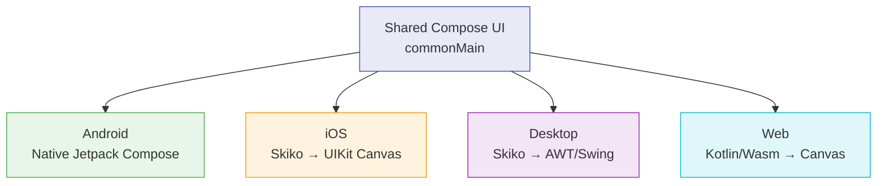

# Compose Multiplatform

Compose Multiplatform (CMP) extends Jetpack Compose to iOS, Desktop, and Web. Write shared UI in Kotlin that compiles natively for each platform.

---

## How It Works



| Platform | Rendering | Status |
|---|---|---|
| Android | Native Jetpack Compose (zero overhead) | Stable |
| Desktop | Skiko (Skia for Kotlin) over AWT | Stable |
| iOS | Skiko rendering on UIKit Canvas | Beta |
| Web (Wasm) | Canvas-based via Kotlin/Wasm | Alpha |

On Android, CMP **is** Jetpack Compose — no abstraction layer, no performance penalty. On other platforms, Skiko renders Compose UI using Skia, the same graphics engine behind Chrome and Flutter.

---

## Project Setup

```kotlin
// shared/build.gradle.kts
plugins {
    kotlin("multiplatform")
    id("org.jetbrains.compose")
    id("org.jetbrains.kotlin.plugin.compose")
}

kotlin {
    androidTarget()
    iosX64()
    iosArm64()
    iosSimulatorArm64()
    jvm("desktop")

    sourceSets {
        commonMain.dependencies {
            implementation(compose.runtime)
            implementation(compose.foundation)
            implementation(compose.material3)
            implementation(compose.ui)
            implementation(compose.components.resources)
        }
    }
}
```

---

## Shared Resources

CMP provides a multiplatform resource system for strings, images, fonts, and files.

### Directory Structure

```
shared/
└── src/
    └── commonMain/
        └── composeResources/
            ├── drawable/        # Images (PNG, SVG, WebP, XML vector)
            ├── values/          # strings.xml, plurals
            ├── font/            # .ttf, .otf files
            └── files/           # Raw files (JSON, etc.)
```

### Usage

```kotlin
// Generated accessor (type-safe, like Android R class)
@Composable
fun ProfileScreen() {
    Image(
        painter = painterResource(Res.drawable.avatar_placeholder),
        contentDescription = "Avatar"
    )
    Text(text = stringResource(Res.string.welcome_message))
}
```

### Localization

```xml
<!-- composeResources/values/strings.xml -->
<resources>
    <string name="welcome_message">Welcome</string>
</resources>

<!-- composeResources/values-es/strings.xml -->
<resources>
    <string name="welcome_message">Bienvenido</string>
</resources>
```

CMP resolves the correct locale automatically on each platform.

---

## Platform-Specific UI

Use `expect`/`actual` composables or runtime platform checks to branch UI per platform.

### expect/actual Composables

=== "Common"

    ```kotlin
    @Composable
    expect fun PlatformDatePicker(
        selectedDate: LocalDate,
        onDateSelected: (LocalDate) -> Unit
    )
    ```

=== "Android"

    ```kotlin
    @Composable
    actual fun PlatformDatePicker(
        selectedDate: LocalDate,
        onDateSelected: (LocalDate) -> Unit
    ) {
        AndroidView(factory = { context ->
            DatePicker(context).apply {
                // Native Android DatePicker
            }
        })
    }
    ```

=== "iOS"

    ```kotlin
    @Composable
    actual fun PlatformDatePicker(
        selectedDate: LocalDate,
        onDateSelected: (LocalDate) -> Unit
    ) {
        UIKitView(factory = {
            // Wraps UIDatePicker from UIKit
            UIDatePicker().apply {
                datePickerMode = UIDatePickerMode.UIDatePickerModeDate
            }
        })
    }
    ```

### UIKitView Interop

Embed native UIKit views inside Compose on iOS:

```kotlin
@Composable
fun NativeMapView(location: LatLng) {
    UIKitView(
        factory = {
            MKMapView().apply {
                mapType = MKMapType.MKMapTypeStandard
            }
        },
        update = { mapView ->
            val coordinate = CLLocationCoordinate2DMake(location.lat, location.lng)
            val region = MKCoordinateRegionMakeWithDistance(coordinate, 1000.0, 1000.0)
            mapView.setRegion(region, animated = true)
        },
        modifier = Modifier.fillMaxSize()
    )
}
```

!!! warning "UIKitView limitations"
    UIKit views rendered inside Compose on iOS sit in a separate layer. This means z-ordering issues — Compose content cannot render **on top** of a UIKitView. Use interop views sparingly and for full-screen components (maps, video players, WebViews).

---

## Navigation

CMP doesn't include a built-in navigation framework. Several multiplatform options exist:

| Library | Approach | Key Feature |
|---|---|---|
| **Voyager** | Screen-based, similar to Jetpack Navigation | Simple API, BottomSheet support |
| **Decompose** | Component-based, lifecycle-aware | Full control over back stack, no Compose dependency in logic |
| **Appyx** | Node-based, gesture-driven transitions | Complex transition animations |
| **Jetpack Navigation (experimental)** | Official Jetpack Navigation for CMP | AndroidX parity, type-safe routes |

### Voyager Example

```kotlin
// Screen definition
class HomeScreen : Screen {
    @Composable
    override fun Content() {
        val navigator = LocalNavigator.currentOrThrow
        Column {
            Text("Home")
            Button(onClick = { navigator.push(DetailScreen(id = "123")) }) {
                Text("Go to Detail")
            }
        }
    }
}

class DetailScreen(val id: String) : Screen {
    @Composable
    override fun Content() {
        Text("Detail for $id")
    }
}

// Root
@Composable
fun App() {
    Navigator(HomeScreen())
}
```

### Decompose Example

```kotlin
// Component (pure Kotlin, no Compose dependency)
interface RootComponent {
    val childStack: Value<ChildStack<*, Child>>

    sealed class Child {
        data class Home(val component: HomeComponent) : Child()
        data class Detail(val component: DetailComponent) : Child()
    }
}

class DefaultRootComponent(
    componentContext: ComponentContext
) : RootComponent, ComponentContext by componentContext {

    private val navigation = StackNavigation<Config>()

    override val childStack = childStack(
        source = navigation,
        initialConfiguration = Config.Home,
        childFactory = ::createChild,
    )

    private fun createChild(config: Config, context: ComponentContext): RootComponent.Child =
        when (config) {
            Config.Home -> RootComponent.Child.Home(DefaultHomeComponent(context) {
                navigation.push(Config.Detail(it))
            })
            is Config.Detail -> RootComponent.Child.Detail(DefaultDetailComponent(context, config.id))
        }

    @Serializable
    private sealed class Config {
        @Serializable data object Home : Config()
        @Serializable data class Detail(val id: String) : Config()
    }
}
```

!!! tip "Decompose vs Voyager"
    Decompose separates navigation logic from Compose, making it testable without a UI framework. Voyager is simpler and faster to set up. Choose Decompose for complex apps with deep back stacks; Voyager for straightforward screen flows.

---

## Theming & Adaptive UI

### Shared Material Theme

```kotlin
@Composable
fun AppTheme(
    darkTheme: Boolean = isSystemInDarkTheme(),
    content: @Composable () -> Unit
) {
    val colorScheme = if (darkTheme) darkColorScheme(
        primary = Color(0xFF90CAF9),
        secondary = Color(0xFFA5D6A7),
    ) else lightColorScheme(
        primary = Color(0xFF1565C0),
        secondary = Color(0xFF2E7D32),
    )

    MaterialTheme(
        colorScheme = colorScheme,
        typography = AppTypography, // shared typography
        content = content
    )
}
```

### Platform-Adaptive Components

```kotlin
@Composable
fun AdaptiveScaffold(content: @Composable () -> Unit) {
    val platform = getPlatform()
    when {
        platform.isIOS -> {
            // iOS: respect safe areas, use iOS-style navigation bar
            Box(modifier = Modifier.windowInsetsPadding(WindowInsets.safeArea)) {
                content()
            }
        }
        else -> {
            Scaffold { padding ->
                Box(modifier = Modifier.padding(padding)) {
                    content()
                }
            }
        }
    }
}
```

---

## Image Loading

[Coil 3](https://coil-kt.github.io/coil/) provides multiplatform image loading for Compose:

```kotlin
// commonMain dependencies
implementation("io.coil-kt.coil3:coil-compose:3.0.0")
implementation("io.coil-kt.coil3:coil-network-ktor3:3.0.0")

// Usage
@Composable
fun UserAvatar(url: String) {
    AsyncImage(
        model = url,
        contentDescription = "User avatar",
        modifier = Modifier.size(48.dp).clip(CircleShape),
        contentScale = ContentScale.Crop,
        placeholder = painterResource(Res.drawable.avatar_placeholder),
        error = painterResource(Res.drawable.avatar_error),
    )
}
```

---

## Performance Considerations

### iOS-Specific

| Area | Concern | Mitigation |
|---|---|---|
| **Rendering** | Skiko renders on a canvas, not native UIKit views | Profile with Instruments; keep complex lists virtualized with `LazyColumn` |
| **Text rendering** | Custom text engine, not native `UILabel` | May differ slightly from native iOS text rendering |
| **Startup time** | Kotlin/Native initialization adds overhead | Use `NativeCoroutines` or background init for heavy shared modules |
| **Binary size** | Kotlin/Native + Skiko adds ~15-20 MB | Use `-Xallocator=mimalloc` and strip debug symbols for release |

### General

- **Recomposition**: Same rules as Jetpack Compose — use `remember`, stable types, `derivedStateOf`
- **Lazy layouts**: Use `LazyColumn`/`LazyRow` for lists, not `Column` with `forEach`
- **State management**: Prefer `StateFlow` over `mutableStateOf` for shared state that crosses the Compose/platform boundary

---

## Testing Compose Multiplatform

```kotlin
// commonTest — shared UI tests
class ProfileScreenTest {
    @OptIn(ExperimentalTestApi::class)
    @Test
    fun displaysUserName() = runComposeUiTest {
        setContent {
            ProfileScreen(user = User(name = "Alice", email = "alice@example.com"))
        }

        onNodeWithText("Alice").assertIsDisplayed()
        onNodeWithText("alice@example.com").assertIsDisplayed()
    }

    @OptIn(ExperimentalTestApi::class)
    @Test
    fun editButtonNavigates() = runComposeUiTest {
        var editClicked = false
        setContent {
            ProfileScreen(
                user = testUser,
                onEdit = { editClicked = true }
            )
        }

        onNodeWithText("Edit Profile").performClick()
        assertTrue(editClicked)
    }
}
```

!!! note
    `runComposeUiTest` works on all platforms. On Android it uses Robolectric or instrumented tests; on Desktop/iOS it uses headless rendering.

---

??? question "Common Interview Questions"

    **Q: How does Compose Multiplatform render on iOS?**
    CMP uses Skiko (Skia for Kotlin) to render Compose UI on a UIKit canvas. It does NOT use native UIKit views — everything is drawn by Skia, similar to Flutter. Native views can be embedded via `UIKitView` interop.

    **Q: What's the performance difference between CMP on Android vs iOS?**
    On Android, CMP IS Jetpack Compose — zero overhead. On iOS, there's a rendering layer (Skiko) and Kotlin/Native overhead. Real-world performance is good for most apps but can lag behind pure SwiftUI for complex animations or heavy list scrolling.

    **Q: Should we use CMP or keep native UI?**
    Keep native UI if: iOS team is large and invested in SwiftUI, app requires heavy platform-specific UI (custom transitions, platform design language). Use CMP if: small team, design is already Material-based, rapid iteration matters more than pixel-perfect platform fidelity.

    **Q: How do you handle platform-specific UI in CMP?**
    Three approaches: (1) `expect`/`actual` composables for entirely different implementations, (2) `UIKitView`/`AndroidView` interop for embedding native views, (3) runtime platform checks for small conditional differences.

!!! tip "Further Reading"
    - [Compose Multiplatform Documentation](https://www.jetbrains.com/compose-multiplatform/)
    - [Compose Multiplatform iOS Stability Roadmap](https://blog.jetbrains.com/kotlin/category/compose-multiplatform/)
    - [Coil 3 Multiplatform](https://coil-kt.github.io/coil/)
