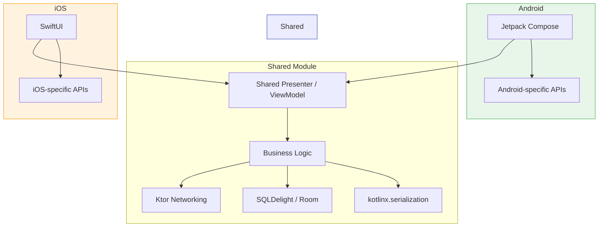
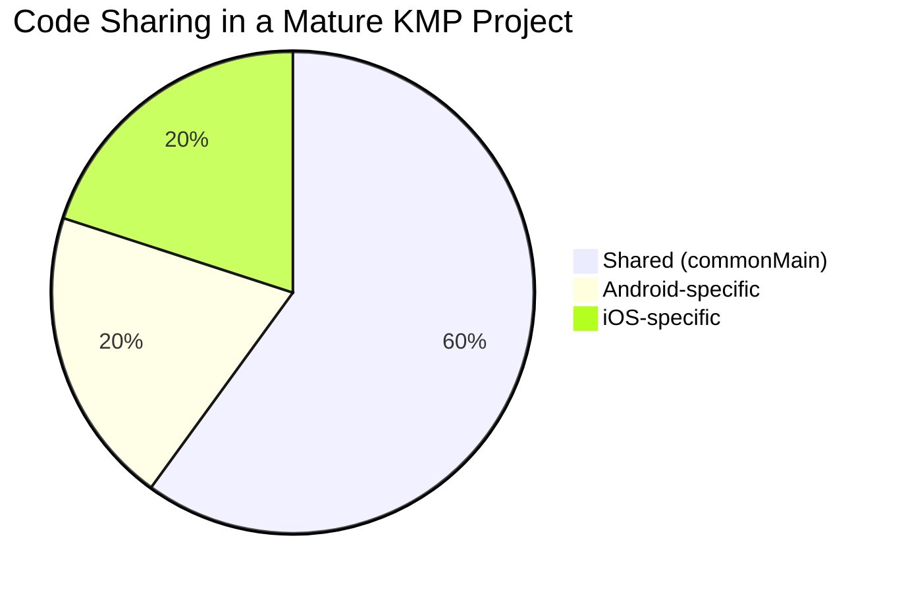

# Kotlin Multiplatform for Mobile

Kotlin Multiplatform (KMP) lets you share business logic, networking, and data layers across Android and iOS while keeping platform-native UI. This section covers the practical engineering aspects of building and shipping KMP in production mobile apps.

!!! tip "Language-level reference"
    For KMP fundamentals — source sets, `expect`/`actual`, project structure, and the library ecosystem — see the [KMP language reference](../../../programming/languages/kotlin/kmp.md).

---

## Why KMP for Mobile

| Dimension | KMP | Flutter | React Native |
|---|---|---|---|
| **Language** | Kotlin (shared) + Swift (iOS UI) | Dart | JavaScript/TypeScript |
| **UI approach** | Native per platform (or Compose Multiplatform) | Custom rendering engine (Skia) | Native views via bridge |
| **Shared scope** | Business logic, data layer | Everything including UI | Everything including UI |
| **iOS interop** | Direct (Obj-C framework) | Platform channels | Native modules |
| **Team model** | Android + iOS devs collaborate on shared code | Dedicated Flutter team | Dedicated RN team |
| **Maturity** | Stable (logic sharing), Beta (Compose MP on iOS) | Stable | Stable |

KMP's differentiator: it doesn't force a UI framework. iOS teams keep SwiftUI, Android teams keep Jetpack Compose. The shared layer handles what both platforms do identically — networking, caching, validation, analytics.

---

## What to Read Next

| Topic | What You'll Learn |
|---|---|
| [Compose Multiplatform](compose-multiplatform.md) | Sharing UI across platforms with Compose, navigation, resources, platform-specific adaptations |
| [iOS Integration](ios-integration.md) | Swift interop patterns, framework distribution via SPM/CocoaPods, debugging Kotlin from Xcode |
| [Shared Architecture](shared-architecture.md) | Architecture patterns (MVI, MVVM, Circuit), shared state management, DI, and navigation |
| [Migration & Adoption](migration-adoption.md) | Decision framework, incremental adoption strategy, team dynamics, and common pitfalls |

---

## KMP at a Glance

### Typical Sharing Breakdown

Most teams start by sharing the **data layer** (models, repositories, networking) and expand to shared presentation logic once comfortable. UI remains native unless using Compose Multiplatform.
