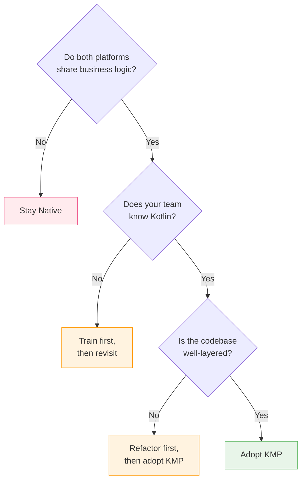

# KMP Migration & Adoption

A practical guide to evaluating, adopting, and incrementally migrating to Kotlin Multiplatform in existing mobile projects.

---

## Should You Adopt KMP?

### Decision Matrix

| Factor | Favors KMP | Favors Staying Native |
|---|---|---|
| **Team composition** | Strong Kotlin devs on both platforms | iOS team doesn't know Kotlin |
| **Code duplication** | Significant logic duplicated across platforms | Platforms have different business logic |
| **Release cadence** | Both platforms release together | Independent release schedules |
| **App maturity** | Active development, frequent feature work | Maintenance mode, few changes |
| **UI complexity** | Standard UI patterns | Heavy platform-specific UI/animations |
| **Timeline pressure** | Can invest 2-3 months for setup + first module | Need immediate ROI |
| **Existing architecture** | Clean separation of data/domain/presentation | Monolithic, tightly coupled |



!!! warning "The iOS team factor"
    KMP adoption fails most often because the iOS team resists. Common reasons: unfamiliar tooling (Gradle, IntelliJ), debugging Kotlin from Xcode is harder, and framework binary size concerns. Address these early with SKIE (better Swift APIs), the Xcode-Kotlin debugger plugin, and a clear plan for framework distribution.

---

## Incremental Adoption Strategy

### Phase 1: Data Models & Serialization (Week 1-2)

Start with the lowest-risk, highest-impact code: shared data models.

```kotlin
// commonMain — move DTOs to shared module
@Serializable
data class UserResponse(
    val id: String,
    val name: String,
    val email: String,
    @SerialName("created_at") val createdAt: Long
)

@Serializable
data class ApiError(
    val code: Int,
    val message: String
)
```

**Why start here:**

- Zero platform dependencies
- Eliminates the most common source of bugs (model drift between platforms)
- Easy to validate — both platforms parse the same JSON identically
- Low risk — if it doesn't work out, rolling back is trivial

### Phase 2: Networking Layer (Week 3-4)

Move API client logic to shared code using Ktor.

```kotlin
// commonMain
class UserApi(private val client: HttpClient) {
    suspend fun getUser(id: String): UserResponse =
        client.get("users/$id").body()

    suspend fun updateUser(id: String, request: UpdateUserRequest): UserResponse =
        client.put("users/$id") {
            contentType(ContentType.Application.Json)
            setBody(request)
        }.body()
}

// Shared HttpClient factory
expect fun createPlatformEngine(): HttpClientEngine

fun createHttpClient(): HttpClient = HttpClient(createPlatformEngine()) {
    install(ContentNegotiation) { json() }
    install(Logging) { level = LogLevel.HEADERS }
    defaultRequest {
        url("https://api.example.com/v1/")
    }
}
```

=== "Android Engine"

    ```kotlin
    actual fun createPlatformEngine(): HttpClientEngine = OkHttp.create {
        // Reuse existing OkHttpClient config if migrating
    }
    ```

=== "iOS Engine"

    ```kotlin
    actual fun createPlatformEngine(): HttpClientEngine = Darwin.create {
        configureSession {
            // NSURLSession configuration
        }
    }
    ```

### Phase 3: Business Logic & Repositories (Week 5-8)

Move validation, transformation, and repository logic.

```kotlin
// commonMain
class UserRepository(
    private val api: UserApi,
    private val cache: UserCache
) {
    suspend fun getUser(id: String): User {
        cache.get(id)?.let { return it }
        val response = api.getUser(id)
        val user = response.toDomain()
        cache.put(user)
        return user
    }

    fun observeUser(id: String): Flow<User> =
        cache.observe(id).filterNotNull()
}

// Pure business logic — easiest to share
object UserValidator {
    fun validateEmail(email: String): ValidationResult {
        if (email.isBlank()) return ValidationResult.Error("Email required")
        if (!email.contains("@")) return ValidationResult.Error("Invalid email")
        return ValidationResult.Valid
    }

    fun validatePassword(password: String): ValidationResult {
        if (password.length < 8) return ValidationResult.Error("Min 8 characters")
        if (!password.any { it.isUpperCase() }) return ValidationResult.Error("Need uppercase")
        return ValidationResult.Valid
    }
}
```

### Phase 4: Presentation Logic (Optional, Week 9+)

Share ViewModels or presenters if the team is comfortable.

```kotlin
// commonMain — shared ViewModel
class UserProfileViewModel(
    private val repository: UserRepository
) : ViewModel() {
    private val _state = MutableStateFlow(ProfileState())
    val state: StateFlow<ProfileState> = _state.asStateFlow()

    fun loadUser(id: String) {
        viewModelScope.launch {
            _state.update { it.copy(loading = true) }
            when (val result = repository.getUser(id)) {
                is Result.Success -> _state.update {
                    it.copy(user = result.data, loading = false)
                }
                is Result.Failure -> _state.update {
                    it.copy(error = result.error.message, loading = false)
                }
            }
        }
    }
}
```

---

## Migration Patterns

### Strangler Fig Pattern

Gradually replace native implementations with shared code, one module at a time.

```mermaid
flowchart LR
    subgraph Before
        A_NET[Android Networking]
        I_NET[iOS Networking]
        A_MOD[Android Models]
        I_MOD[iOS Models]
        A_REPO[Android Repos]
        I_REPO[iOS Repos]
    end

    subgraph Phase 1
        KMP_MOD[Shared Models]
        A_NET2[Android Networking]
        I_NET2[iOS Networking]
        A_REPO2[Android Repos]
        I_REPO2[iOS Repos]
    end

    subgraph Phase 2
        KMP_MOD2[Shared Models]
        KMP_NET[Shared Networking]
        A_REPO3[Android Repos]
        I_REPO3[iOS Repos]
    end

    subgraph Phase 3
        KMP_ALL[Shared Models +<br/>Networking + Repos]
    end

    Before --> Phase 1 --> Phase 2 --> Phase 3

    style KMP_MOD fill:#e8f5e9,stroke:#4caf50
    style KMP_MOD2 fill:#e8f5e9,stroke:#4caf50
    style KMP_NET fill:#e8f5e9,stroke:#4caf50
    style KMP_ALL fill:#e8f5e9,stroke:#4caf50
```

### Adapter Pattern for Gradual Migration

Keep existing platform code working while migrating to shared implementations.

```kotlin
// Android — adapter wraps shared repository with existing interface
class UserRepositoryAdapter(
    private val sharedRepo: SharedUserRepository // KMP
) : LegacyUserRepository { // existing Android interface

    override fun getUser(id: String, callback: Callback<User>) {
        CoroutineScope(Dispatchers.Main).launch {
            try {
                val user = sharedRepo.getUser(id)
                callback.onSuccess(user.toAndroidModel())
            } catch (e: Exception) {
                callback.onFailure(e)
            }
        }
    }
}
```

---

## Project Structure for Migration

### Monorepo (Recommended)

```
project/
├── androidApp/                 # Existing Android app
├── iosApp/                     # Existing iOS app (Xcode project)
├── shared/                     # New KMP shared module
│   ├── src/
│   │   ├── commonMain/kotlin/
│   │   ├── androidMain/kotlin/
│   │   └── iosMain/kotlin/
│   └── build.gradle.kts
├── build.gradle.kts            # Root build file
└── settings.gradle.kts
```

### Separate Repository

For organizations where iOS and Android repos can't merge:

```
kmp-shared/                     # Standalone KMP module
├── src/commonMain/
├── src/androidMain/
├── src/iosMain/
├── build.gradle.kts
└── publish.gradle.kts          # Publishes to Maven + XCFramework

android-app/                    # Consumes via Maven
├── build.gradle.kts            # implementation("com.example:shared:1.0")

ios-app/                        # Consumes via SPM or CocoaPods
├── Package.swift               # .binaryTarget for XCFramework
```

!!! tip "Start with a monorepo"
    Even if you plan to separate later, a monorepo simplifies initial development. You get instant feedback when shared code changes — no publish-consume cycle. Split repos once the shared module API is stable.

---

## Common Pitfalls

### 1. Sharing Too Much Too Soon

Sharing UI before the data layer is stable leads to fighting two problems at once. Start with models → networking → repositories → presentation → UI.

### 2. Ignoring iOS Developer Experience

```kotlin
// BAD — leaks Kotlin idioms into Swift API
fun getUsers(): Flow<List<User>> // Swift can't use Flow without SKIE

// GOOD — provide iOS-friendly wrapper
class UserListObserver(private val repo: UserRepository) {
    fun observe(onChange: (List<User>) -> Unit): Closeable {
        val scope = CoroutineScope(SupervisorJob() + Dispatchers.Main)
        scope.launch {
            repo.getUsers().collect { onChange(it) }
        }
        return Closeable { scope.cancel() }
    }
}
```

### 3. Not Setting Up CI Early

```yaml
# GitHub Actions — build all targets
jobs:
  build:
    strategy:
      matrix:
        os: [ubuntu-latest, macos-latest]
    runs-on: ${{ matrix.os }}
    steps:
      - uses: actions/checkout@v4
      - uses: actions/setup-java@v4
        with:
          java-version: '17'
          distribution: 'zulu'
      - name: Build shared module
        run: ./gradlew :shared:build
      - name: Build iOS framework (macOS only)
        if: matrix.os == 'macos-latest'
        run: ./gradlew :shared:assembleSharedXCFramework
```

!!! warning
    iOS/macOS targets can only compile on macOS. Your CI must include a macOS runner for iOS framework builds. Android and JVM targets build on any OS.

### 4. Build Time Regression

Kotlin/Native compilation is slower than JVM compilation. Mitigate with:

| Strategy | How |
|---|---|
| Gradle build cache | `org.gradle.caching=true` |
| Kotlin/Native compiler caches | `kotlin.native.cacheKind.iosArm64=static` |
| Parallel compilation | `kotlin.native.binary.memoryModel=experimental` |
| Minimal shared module | Only include what's actually shared |
| CI caching | Cache `~/.gradle` and `~/.konan` directories |

### 5. Version Conflicts

```kotlin
// Enforce consistent versions across all modules
// build.gradle.kts (root)
plugins {
    kotlin("multiplatform") version "2.1.0" apply false
}

// Use a version catalog (gradle/libs.versions.toml)
[versions]
kotlin = "2.1.0"
ktor = "3.0.0"
coroutines = "1.9.0"

[libraries]
ktor-client-core = { module = "io.ktor:ktor-client-core", version.ref = "ktor" }
coroutines-core = { module = "org.jetbrains.kotlinx:kotlinx-coroutines-core", version.ref = "coroutines" }
```

---

## Measuring Success

| Metric | How to Measure | Target |
|---|---|---|
| **Code sharing %** | Lines in commonMain / total shared module lines | 60-80% |
| **Bug parity** | Bugs that exist on one platform but not the other | Decrease over time |
| **Feature velocity** | Time to ship a feature on both platforms | 30-50% reduction |
| **Build time** | CI pipeline duration | < 2x single-platform build |
| **iOS dev satisfaction** | Survey / retro feedback | No degradation |

---

??? question "Common Interview Questions"

    **Q: How would you introduce KMP to an existing mobile project?**
    Start with shared data models and serialization — zero platform dependencies, eliminates model drift, easy to roll back. Then move networking (Ktor), then repositories, then optionally presentation logic. Use the strangler fig pattern: wrap shared implementations behind existing interfaces so platform code migrates incrementally.

    **Q: What are the biggest risks of adopting KMP?**
    (1) iOS team resistance due to unfamiliar tooling. (2) Build time regression from Kotlin/Native compilation. (3) Debugging shared code from Xcode is harder. (4) Kotlin-Swift interop friction without SKIE. Mitigate each with team investment, build caching, debugger plugins, and SKIE respectively.

    **Q: How do you handle the case where Android and iOS have different business logic?**
    Use `expect`/`actual` for compile-time platform branching, or dependency injection for runtime branching. If the logic is fundamentally different (not just implementation details), keep it native — forcing shared code where platforms genuinely diverge creates worse code than duplication.

    **Q: What's the minimum viable KMP setup for a team evaluation?**
    One shared module with data models + one API client + one repository. Integrate into both apps behind an adapter. This proves the build pipeline, framework distribution, and developer experience with minimal risk. Takes 2-3 weeks for a team that knows Kotlin.

    **Q: How do you keep the iOS team productive during KMP adoption?**
    Use SKIE for Swift-friendly APIs from day one. Set up the Xcode-Kotlin debugger plugin. Distribute the shared framework via CocoaPods or SPM (not manual XCFramework copies). Include iOS devs in shared module code reviews. Consider pairing an Android + iOS dev on initial shared code.

!!! tip "Further Reading"
    - [KMP Adoption Guide — JetBrains](https://kotlinlang.org/docs/multiplatform-expect-actual.html)
    - [Touchlab KMP Migration Guides](https://touchlab.co/kmp)
    - [Netflix KMP Adoption Case Study](https://netflixtechblog.com/)
