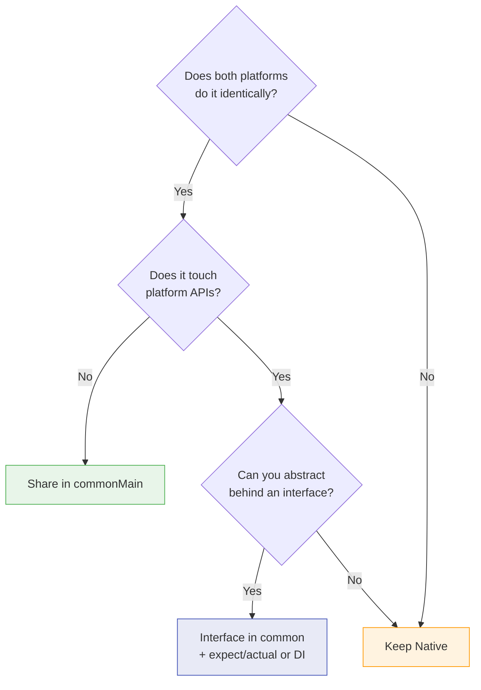
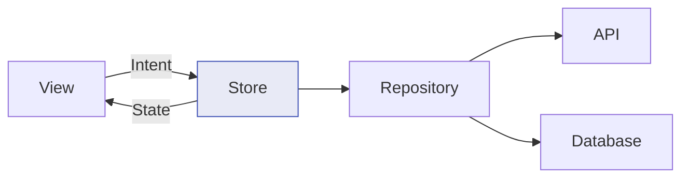
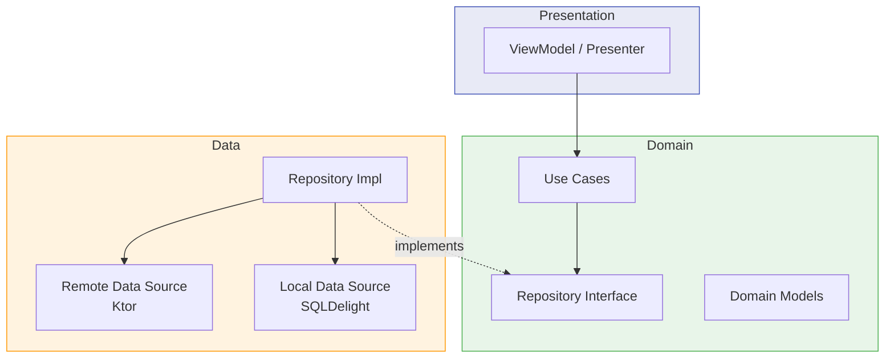

# KMP Shared Architecture

Architecture patterns for structuring shared Kotlin Multiplatform code — covering state management, presentation logic, dependency injection, and navigation across Android and iOS.

---

## Deciding What to Share



### Sharing Spectrum

| Layer | Share? | Notes |
|---|---|---|
| Data models / DTOs | Always | Pure Kotlin, no platform deps |
| Serialization | Always | kotlinx.serialization |
| Networking | Always | Ktor with platform engines |
| Business logic / Validation | Always | Pure functions, domain rules |
| Repository / Data access | Almost always | Abstract storage behind interfaces |
| Presentation / ViewModel | Often | Depends on pattern chosen |
| Navigation | Sometimes | Decompose, Voyager (with CMP) |
| UI | Optional | Compose Multiplatform |

---

## Presentation Patterns

### Pattern 1: Shared ViewModel (KMP-ViewModel)

Use Jetpack's `ViewModel` directly in shared code with [KMP-ViewModel](https://github.com/nicklama/KMP-ViewModel) or the official `lifecycle-viewmodel` KMP artifact.

```kotlin
// commonMain
class UserListViewModel(
    private val repository: UserRepository
) : ViewModel() {

    private val _state = MutableStateFlow(UserListState())
    val state: StateFlow<UserListState> = _state.asStateFlow()

    init {
        viewModelScope.launch {
            repository.observeUsers()
                .collect { users ->
                    _state.update { it.copy(users = users, loading = false) }
                }
        }
    }

    fun refresh() {
        viewModelScope.launch {
            _state.update { it.copy(loading = true) }
            repository.refresh()
        }
    }
}

data class UserListState(
    val users: List<User> = emptyList(),
    val loading: Boolean = true,
    val error: String? = null
)
```

=== "Android"

    ```kotlin
    @Composable
    fun UserListScreen(viewModel: UserListViewModel = koinViewModel()) {
        val state by viewModel.state.collectAsStateWithLifecycle()
        // Render state...
    }
    ```

=== "iOS (SwiftUI)"

    ```swift
    struct UserListView: View {
        @StateObject var viewModel = UserListViewModel(repository: /* DI */)

        var body: some View {
            // Observe state via SKIE's AsyncSequence
            List(viewModel.state.value.users) { user in
                Text(user.name)
            }
        }
    }
    ```

### Pattern 2: MVI (Model-View-Intent)

Unidirectional data flow with explicit intents. Works well for complex screens.

```kotlin
// commonMain
class UserListStore(
    private val repository: UserRepository,
    private val scope: CoroutineScope
) {
    private val _state = MutableStateFlow(UserListState())
    val state: StateFlow<UserListState> = _state.asStateFlow()

    fun dispatch(intent: UserListIntent) {
        when (intent) {
            is UserListIntent.Load -> load()
            is UserListIntent.Refresh -> refresh()
            is UserListIntent.Search -> search(intent.query)
        }
    }

    private fun load() {
        scope.launch {
            _state.update { it.copy(loading = true) }
            try {
                val users = repository.getUsers()
                _state.update { it.copy(users = users, loading = false) }
            } catch (e: Exception) {
                _state.update { it.copy(error = e.message, loading = false) }
            }
        }
    }

    private fun refresh() { /* ... */ }
    private fun search(query: String) { /* ... */ }
}

sealed class UserListIntent {
    data object Load : UserListIntent()
    data object Refresh : UserListIntent()
    data class Search(val query: String) : UserListIntent()
}

data class UserListState(
    val users: List<User> = emptyList(),
    val loading: Boolean = false,
    val error: String? = null
)
```



### Pattern 3: Circuit by Slack

[Circuit](https://slackhq.github.io/circuit/) is a multiplatform architecture framework that combines Presenter + UI in a single screen.

```kotlin
// commonMain
@CircuitInject(UserListScreen::class, AppScope::class)
@Composable
fun UserListPresenter(navigator: Navigator): UserListState {
    val users by produceState<List<User>>(emptyList()) {
        value = repository.getUsers()
    }

    return UserListState(
        users = users,
        onRefresh = { /* ... */ },
        onUserClick = { navigator.goTo(UserDetailScreen(it.id)) }
    )
}

@CircuitInject(UserListScreen::class, AppScope::class)
@Composable
fun UserList(state: UserListState) {
    LazyColumn {
        items(state.users) { user ->
            Text(user.name, modifier = Modifier.clickable { state.onUserClick(user) })
        }
    }
}
```

### Comparison

| Pattern | Complexity | Testability | Best For |
|---|---|---|---|
| Shared ViewModel | Low | Good | Simple screens, teams familiar with MVVM |
| MVI | Medium | Excellent | Complex state, many user actions, audit trail |
| Circuit | Medium | Excellent | Compose Multiplatform apps, Slack-scale teams |
| Decompose | High | Excellent | Complex navigation, deep lifecycle control |

---

## Dependency Injection

### Koin (Recommended for KMP)

Koin is the most KMP-friendly DI framework — no code generation, pure Kotlin DSL.

```kotlin
// commonMain — shared module definitions
val sharedModule = module {
    single<UserApi> { KtorUserApi(get()) }
    single<UserRepository> { UserRepositoryImpl(get(), get()) }
    factory { UserListViewModel(get()) }

    single { createHttpClient() } // expect/actual for engine
    single { createDatabase() }   // expect/actual for driver
}
```

=== "Android"

    ```kotlin
    // androidMain
    val androidModule = module {
        single<HttpClientEngine> { OkHttp.create() }
        single<SqlDriver> { AndroidSqliteDriver(AppDatabase.Schema, get(), "app.db") }
    }

    // Application.onCreate
    startKoin {
        androidContext(this@App)
        modules(sharedModule, androidModule)
    }
    ```

=== "iOS"

    ```kotlin
    // iosMain
    val iosModule = module {
        single<HttpClientEngine> { Darwin.create() }
        single<SqlDriver> { NativeSqliteDriver(AppDatabase.Schema, "app.db") }
    }

    // Called from Swift AppDelegate
    fun initKoin() {
        startKoin {
            modules(sharedModule, iosModule)
        }
    }
    ```

```swift
// Swift — resolve from Koin
let viewModel: UserListViewModel = KoinHelper.shared.get()
```

### kotlin-inject

Compile-time DI with KSP. Type-safe but requires more setup for KMP.

```kotlin
// commonMain
@Component
abstract class SharedComponent {
    abstract val userRepository: UserRepository

    @Provides fun api(client: HttpClient): UserApi = KtorUserApi(client)
    @Provides fun repository(api: UserApi, db: UserDatabase): UserRepository =
        UserRepositoryImpl(api, db)
}

// Platform components extend and provide platform deps
// androidMain
@Component
abstract class AndroidComponent(
    @get:Provides val context: Context
) : SharedComponent() {
    @Provides fun httpEngine(): HttpClientEngine = OkHttp.create()
}
```

| Feature | Koin | kotlin-inject |
|---|---|---|
| Code generation | None (runtime) | KSP (compile-time) |
| Error detection | Runtime crashes if missing | Compile-time errors |
| KMP support | First-class | Good (needs KSP per target) |
| Learning curve | Low | Medium |
| Performance | Slight runtime overhead | Zero runtime overhead |

---

## State Management Across Platforms

### StateFlow as the Universal State Holder

```kotlin
// commonMain — shared state
class SessionManager(private val storage: KeyValueStorage) {
    private val _authState = MutableStateFlow<AuthState>(AuthState.Unknown)
    val authState: StateFlow<AuthState> = _authState.asStateFlow()

    suspend fun checkSession() {
        val token = storage.getString("auth_token")
        _authState.value = if (token != null) {
            AuthState.Authenticated(token)
        } else {
            AuthState.Unauthenticated
        }
    }
}

sealed class AuthState {
    data object Unknown : AuthState()
    data object Unauthenticated : AuthState()
    data class Authenticated(val token: String) : AuthState()
}
```

=== "Android (Compose)"

    ```kotlin
    val authState by sessionManager.authState.collectAsStateWithLifecycle()
    when (authState) {
        is AuthState.Authenticated -> MainScreen()
        AuthState.Unauthenticated -> LoginScreen()
        AuthState.Unknown -> SplashScreen()
    }
    ```

=== "iOS (SwiftUI + SKIE)"

    ```swift
    // SKIE converts StateFlow to AsyncSequence
    @MainActor
    class AuthObserver: ObservableObject {
        @Published var state: AuthState = .unknown

        func observe(_ sessionManager: SessionManager) {
            Task {
                for await state in sessionManager.authState {
                    self.state = state
                }
            }
        }
    }
    ```

---

## Error Handling Strategy

### Sealed Result Type

```kotlin
// commonMain
sealed class Result<out T> {
    data class Success<T>(val data: T) : Result<T>()
    data class Failure(val error: AppError) : Result<Nothing>()
}

sealed class AppError {
    data class Network(val code: Int, val message: String) : AppError()
    data class Auth(val reason: String) : AppError()
    data class Unknown(val throwable: Throwable) : AppError()
}

// Repository wraps all calls
class UserRepository(private val api: UserApi) {
    suspend fun getUser(id: String): Result<User> = try {
        Result.Success(api.getUser(id))
    } catch (e: ClientRequestException) {
        Result.Failure(AppError.Network(e.response.status.value, e.message))
    } catch (e: Exception) {
        Result.Failure(AppError.Unknown(e))
    }
}
```

!!! warning "Don't throw across the Kotlin-Swift boundary"
    Kotlin exceptions that cross into Swift become `NSError` objects, losing type information. Use sealed result types or `kotlin.Result` to make error handling explicit and type-safe on both platforms.

---

## Clean Architecture in KMP



```
shared/
├── src/commonMain/kotlin/com/example/
│   ├── domain/
│   │   ├── model/          # User, Order, etc.
│   │   ├── repository/     # Repository interfaces
│   │   └── usecase/        # GetUserUseCase, etc.
│   ├── data/
│   │   ├── remote/         # Ktor API clients
│   │   ├── local/          # SQLDelight DAOs
│   │   ├── repository/     # Repository implementations
│   │   └── mapper/         # DTO ↔ Domain mappers
│   └── presentation/
│       └── viewmodel/      # Shared ViewModels
```

Each layer depends only inward — presentation → domain ← data. Domain has zero platform dependencies.

---

??? question "Common Interview Questions"

    **Q: What's the best architecture pattern for KMP?**
    There's no single best pattern. Shared ViewModel (MVVM) is simplest for teams already using it. MVI scales better for complex state. Circuit is great for Compose Multiplatform apps. The key is keeping platform-specific code at the edges.

    **Q: How do you handle platform-specific dependencies in shared code?**
    Three approaches: (1) `expect`/`actual` declarations for platform-intrinsic things, (2) interfaces in commonMain with platform implementations injected via DI (preferred for testability), (3) Koin/kotlin-inject modules per platform.

    **Q: Why Koin over Dagger/Hilt for KMP?**
    Dagger/Hilt use annotation processing targeting JVM only — they don't work with Kotlin/Native. Koin uses a pure Kotlin DSL with no code generation, making it multiplatform-compatible. kotlin-inject uses KSP which supports all targets but has more setup.

    **Q: How do you share ViewModels between Android and iOS?**
    On Android, the shared ViewModel integrates with Jetpack lifecycle via `koinViewModel()` or AndroidX `ViewModelProvider`. On iOS, you instantiate the ViewModel directly and observe its `StateFlow` using SKIE (AsyncSequence) or manual Flow wrappers. The lifecycle is tied to the SwiftUI view's lifetime.

    **Q: How do you handle navigation in KMP?**
    For Compose Multiplatform: Voyager or Decompose handle multiplatform navigation. For native UI: navigation stays in platform code (Jetpack Navigation on Android, NavigationStack on iOS), and shared code exposes navigation events via callbacks or sealed classes that the platform interprets.

!!! tip "Further Reading"
    - [Circuit by Slack](https://slackhq.github.io/circuit/)
    - [Decompose — Component-based Architecture](https://arkivanov.github.io/Decompose/)
    - [Koin Multiplatform](https://insert-koin.io/docs/reference/koin-mp/kmp/)
