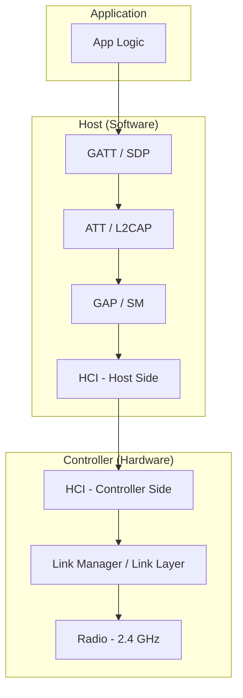
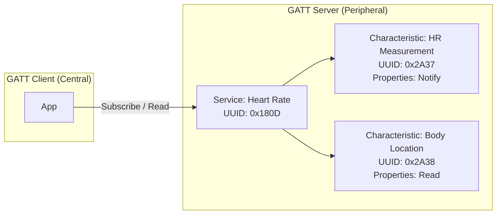

# Bluetooth Classic & BLE

Bluetooth is the most common short-range wireless technology for mobile device-to-device communication. The standard has two distinct variants: **Bluetooth Classic** (BR/EDR) for continuous, higher-throughput streams and **Bluetooth Low Energy** (BLE) for power-efficient, intermittent data exchange.

## Classic vs BLE

| Aspect | Bluetooth Classic (BR/EDR) | Bluetooth Low Energy (BLE) |
|---|---|---|
| **Optimized for** | Continuous data streams | Short bursts of data |
| **Throughput** | 1–3 Mbps | 125 kbps–2 Mbps (BLE 5) |
| **Power** | Medium | Very low |
| **Pairing** | Required before data exchange | Optional (can use advertisements) |
| **Connection time** | ~100 ms | ~3–6 ms |
| **Max connections** | 7 active slaves | Platform-dependent (often 10+) |
| **Use cases** | Audio (A2DP), file transfer (OPP), serial (SPP) | Sensors, beacons, wearables, health |
| **Coexistence** | Shares 2.4 GHz, uses frequency hopping | Shares 2.4 GHz, 40 channels (3 advertising) |

!!! note "Dual-Mode Devices"
    Modern smartphones are **dual-mode** — they support both Classic and BLE simultaneously using a single radio chipset. The choice of which to use is a software decision.

## Bluetooth Stack Architecture



| Layer | Role |
|---|---|
| **GAP** (Generic Access Profile) | Defines device roles, discovery, and connection procedures |
| **GATT** (Generic Attribute Profile) | Defines how BLE data is structured and exchanged (services/characteristics) |
| **ATT** (Attribute Protocol) | Low-level read/write operations on attributes |
| **SDP** (Service Discovery Protocol) | Classic Bluetooth service discovery |
| **L2CAP** | Logical link multiplexing and segmentation |
| **HCI** | Standardized interface between host software and controller hardware |

## BLE Communication Model

BLE uses a **client-server** model built on GATT:



| Concept | Description |
|---|---|
| **Peripheral** | Advertises its presence, acts as GATT server (e.g., fitness band) |
| **Central** | Scans for peripherals, acts as GATT client (e.g., phone) |
| **Service** | A collection of related characteristics, identified by UUID |
| **Characteristic** | A single data point with properties (read, write, notify, indicate) |
| **Descriptor** | Metadata about a characteristic (e.g., CCCD to enable notifications) |

## Android Implementation

### Permissions

```xml
<!-- AndroidManifest.xml -->
<!-- Android 12+ (API 31) -->
<uses-permission android:name="android.permission.BLUETOOTH_SCAN" />
<uses-permission android:name="android.permission.BLUETOOTH_CONNECT" />
<uses-permission android:name="android.permission.BLUETOOTH_ADVERTISE" />

<!-- Android 11 and below -->
<uses-permission android:name="android.permission.BLUETOOTH" />
<uses-permission android:name="android.permission.BLUETOOTH_ADMIN" />
<uses-permission android:name="android.permission.ACCESS_FINE_LOCATION" />
```

### BLE Scanning

```kotlin
private val scanner = BluetoothAdapter.getDefaultAdapter().bluetoothLeScanner

private val scanCallback = object : ScanCallback() {
    override fun onScanResult(callbackType: Int, result: ScanResult) {
        val device = result.device
        val rssi = result.rssi
        // Filter and display discovered devices
    }
}

fun startScan() {
    val filters = listOf(
        ScanFilter.Builder()
            .setServiceUuid(ParcelUuid(HEART_RATE_SERVICE_UUID))
            .build()
    )
    val settings = ScanSettings.Builder()
        .setScanMode(ScanSettings.SCAN_MODE_LOW_LATENCY)
        .build()

    scanner.startScan(filters, settings, scanCallback)
    // Always stop scanning after a timeout to save battery
    handler.postDelayed({ scanner.stopScan(scanCallback) }, 10_000)
}
```

### GATT Client Connection

```kotlin
private var gatt: BluetoothGatt? = null

fun connect(device: BluetoothDevice) {
    gatt = device.connectGatt(context, false, object : BluetoothGattCallback() {

        override fun onConnectionStateChange(gatt: BluetoothGatt, status: Int, newState: Int) {
            if (newState == BluetoothProfile.STATE_CONNECTED) {
                gatt.discoverServices()  // Must call after connect
            }
        }

        override fun onServicesDiscovered(gatt: BluetoothGatt, status: Int) {
            val service = gatt.getService(HEART_RATE_SERVICE_UUID)
            val characteristic = service?.getCharacteristic(HR_MEASUREMENT_UUID)
            characteristic?.let { enableNotifications(gatt, it) }
        }

        override fun onCharacteristicChanged(
            gatt: BluetoothGatt,
            characteristic: BluetoothGattCharacteristic,
            value: ByteArray
        ) {
            val heartRate = value[1].toInt() and 0xFF
            // Process incoming data
        }
    })
}

private fun enableNotifications(gatt: BluetoothGatt, char: BluetoothGattCharacteristic) {
    gatt.setCharacteristicNotification(char, true)
    val descriptor = char.getDescriptor(CCCD_UUID)
    descriptor.value = BluetoothGattDescriptor.ENABLE_NOTIFICATION_VALUE
    gatt.writeDescriptor(descriptor)
}
```

### Bluetooth Classic — Socket Connection

```kotlin
// Server side
fun startServer() {
    val serverSocket = bluetoothAdapter.listenUsingRfcommWithServiceRecord(
        "MyApp", MY_UUID
    )
    thread {
        val socket = serverSocket.accept()  // Blocks until connection
        handleConnection(socket)
        serverSocket.close()
    }
}

// Client side
fun connectToServer(device: BluetoothDevice) {
    val socket = device.createRfcommSocketToServiceRecord(MY_UUID)
    thread {
        bluetoothAdapter.cancelDiscovery()  // Always cancel before connect
        socket.connect()
        handleConnection(socket)
    }
}

private fun handleConnection(socket: BluetoothSocket) {
    val input = socket.inputStream
    val output = socket.outputStream
    val buffer = ByteArray(1024)

    while (true) {
        val bytes = input.read(buffer)
        // Process received data
        output.write("ACK".toByteArray())
    }
}
```

## iOS Implementation

### BLE Central (Scanner)

```swift
import CoreBluetooth

class BLECentral: NSObject, CBCentralManagerDelegate, CBPeripheralDelegate {
    private var centralManager: CBCentralManager!
    private var peripheral: CBPeripheral?

    override init() {
        super.init()
        centralManager = CBCentralManager(delegate: self, queue: nil)
    }

    func centralManagerDidUpdateState(_ central: CBCentralManager) {
        if central.state == .poweredOn {
            central.scanForPeripherals(
                withServices: [heartRateServiceUUID],
                options: nil
            )
        }
    }

    func centralManager(_ central: CBCentralManager,
                        didDiscover peripheral: CBPeripheral,
                        advertisementData: [String: Any],
                        rssi: NSNumber) {
        self.peripheral = peripheral
        central.stopScan()
        central.connect(peripheral, options: nil)
    }

    func centralManager(_ central: CBCentralManager,
                        didConnect peripheral: CBPeripheral) {
        peripheral.delegate = self
        peripheral.discoverServices([heartRateServiceUUID])
    }

    func peripheral(_ peripheral: CBPeripheral,
                    didDiscoverCharacteristicsFor service: CBService,
                    error: Error?) {
        guard let chars = service.characteristics else { return }
        for char in chars where char.uuid == hrMeasurementUUID {
            peripheral.setNotifyValue(true, for: char)
        }
    }
}
```

## BLE Scan Modes

| Mode | Android Constant | Interval | Window | Battery Impact |
|---|---|---|---|---|
| **Low Latency** | `SCAN_MODE_LOW_LATENCY` | Continuous | Continuous | High |
| **Balanced** | `SCAN_MODE_BALANCED` | ~5 s | ~2 s | Medium |
| **Low Power** | `SCAN_MODE_LOW_POWER` | ~10 s | ~1 s | Low |
| **Opportunistic** | `SCAN_MODE_OPPORTUNISTIC` | Piggybacks on other scans | — | Negligible |

!!! warning "Android Background Scanning Limits"
    Starting from Android 8.0, BLE scans are **throttled in the background** — a maximum of 5 scan starts per 30-second window. Use `PendingIntent`-based scanning or a foreground service for reliable background operation.

## Common Pitfalls

| Pitfall | Solution |
|---|---|
| Forgetting to stop scans | Always set a timeout; scanning drains battery fast |
| GATT 133 error (Android) | Retry with a short delay; often caused by stale cached connections |
| Not calling `discoverServices()` | Must be called after `onConnectionStateChange` reports connected |
| Assuming MTU size | Default MTU is 23 bytes (20 payload); call `requestMtu()` for larger packets |
| Operations overlapping | Queue GATT operations — only one read/write can be in-flight at a time |
| Missing `BLUETOOTH_CONNECT` permission | Android 12+ crash; check at runtime before any Bluetooth API call |

??? question "Common Interview Questions"

    **Q: How does BLE advertising work?**

    BLE peripherals broadcast **advertisement packets** on 3 dedicated channels (37, 38, 39) at regular intervals. These packets contain a limited payload (31 bytes, or 255 bytes with Extended Advertising in BLE 5). Centrals scan these channels to discover nearby devices. The advertising interval (20 ms – 10.24 s) trades off discoverability against power consumption.

    **Q: What is the maximum data you can send in a single BLE packet?**

    The default ATT MTU is 23 bytes (20 bytes usable payload). After MTU negotiation, BLE 4.2+ supports up to 512 bytes per ATT packet. BLE 5 introduced the **Data Length Extension** (DLE) allowing up to 251 bytes per link-layer packet. For large transfers, data must be chunked and reassembled at the application layer.

    **Q: How is BLE different from Bluetooth Classic at the protocol level?**

    They share the same 2.4 GHz radio but use completely different protocol stacks. Classic uses 79 channels with frequency hopping and connection-oriented profiles (SPP, A2DP). BLE uses 40 channels (3 advertising + 37 data) with a connectionless advertising model and the GATT/ATT attribute-based data model. BLE was designed from scratch for low duty-cycle communication.

    **Q: How would you implement a reliable file transfer over BLE?**

    Negotiate the maximum MTU, split the file into chunks matching the MTU payload size, add sequence numbers and checksums to each chunk, use write-with-response for reliability (or notifications from server to client), implement flow control to avoid buffer overflows, and add a final checksum verification for the complete file. Consider switching to L2CAP CoC (Connection-oriented Channels) for stream-oriented transfer without GATT overhead.

    **Q: Why does Android require location permission for Bluetooth scanning?**

    BLE scan results include device addresses and signal strength (RSSI), which can be used to determine physical location via triangulation — similar to Wi-Fi-based location. Starting in Android 12 (API 31), the `BLUETOOTH_SCAN` permission with `neverForLocation` attribute removes this requirement if you don't need scan result device names or physical location data.

!!! tip "Further Reading"
    - [Android Bluetooth Overview](https://developer.android.com/guide/topics/connectivity/bluetooth)
    - [Core Bluetooth (iOS)](https://developer.apple.com/documentation/corebluetooth)
    - [Bluetooth Core Specification 5.3](https://www.bluetooth.com/specifications/specs/core-specification-5-3/)
    - [Punch Through BLE Guide](https://punchthrough.com/android-ble-guide/)
