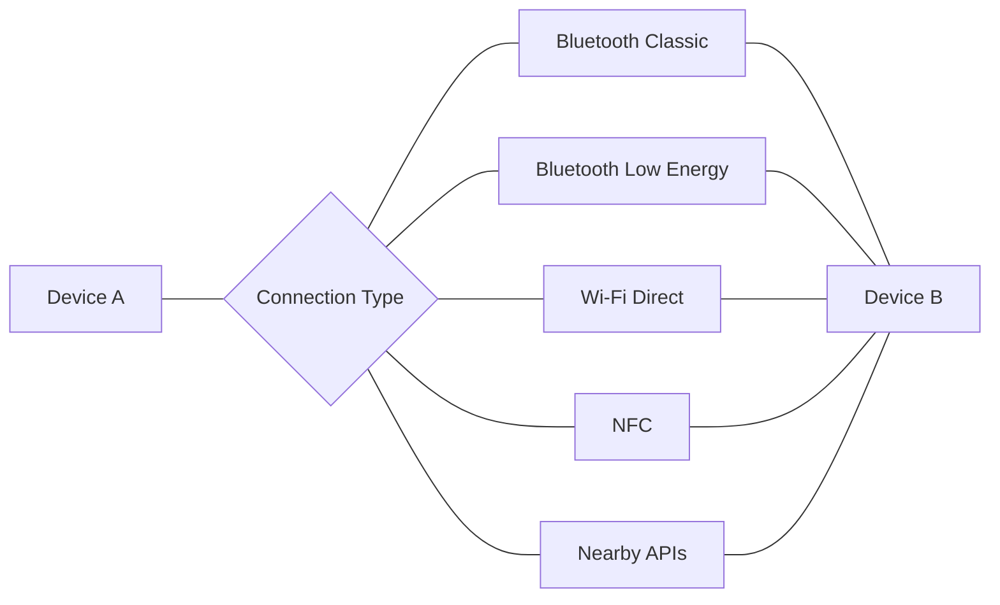
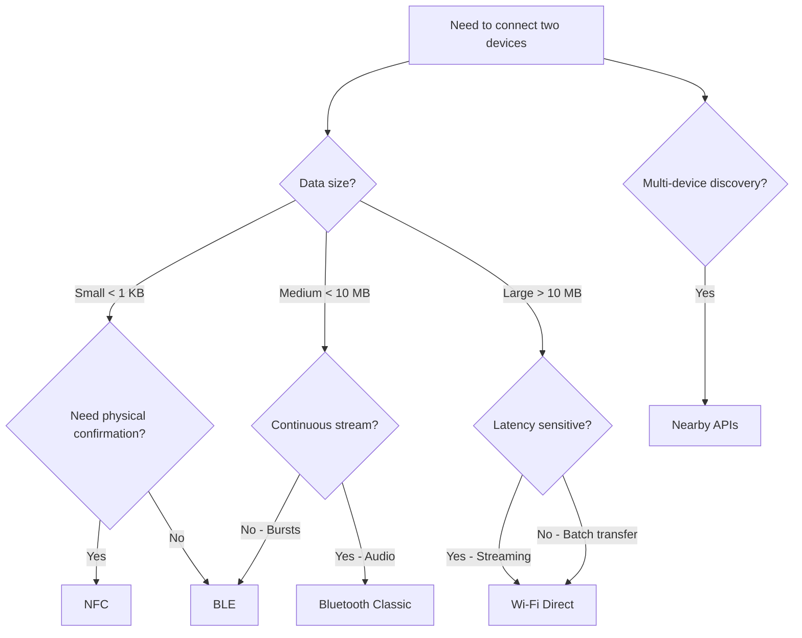

# Device-to-Device Connectivity

Modern mobile devices can communicate directly without an internet connection using several wireless and wired technologies. Each technology trades off **range**, **bandwidth**, **power consumption**, and **setup complexity** — choosing the right one depends on the use case.

## Technology Comparison

| Technology | Range | Max Throughput | Power | Setup | Best For |
|---|---|---|---|---|---|
| **Bluetooth Classic** | ~10–100 m | ~3 Mbps | Medium | Pairing required | Audio streaming, file transfer |
| **BLE** | ~10–100 m | ~2 Mbps (BLE 5) | Very Low | No pairing needed | Sensors, beacons, wearables |
| **Wi-Fi Direct** | ~200 m | ~250 Mbps+ | High | Group negotiation | Large file transfer, screen mirroring |
| **NFC** | < 4 cm | 424 kbps | Negligible | Tap to connect | Payments, quick pairing, small data |
| **Nearby APIs** | Varies | Varies | Medium | Automatic | Multi-device apps, games, sharing |

## Decision Flowchart

## Sub-Topics

| Page | What It Covers |
|---|---|
| [Bluetooth Classic & BLE](bluetooth.md) | Bluetooth stack, profiles, pairing, GATT, scanning, and data transfer on Android & iOS |
| [Wi-Fi Direct](wifi-direct.md) | Peer-to-peer Wi-Fi, group formation, service discovery, and high-bandwidth transfer |
| [NFC](nfc.md) | Near Field Communication, NDEF records, tag types, reader/writer modes, and Host Card Emulation |
| [Nearby Connectivity APIs](nearby-apis.md) | Google Nearby Connections, Apple Multipeer Connectivity, and cross-platform abstractions |

!!! tip "Further Reading"
    - [Android Connectivity Overview](https://developer.android.com/guide/topics/connectivity)
    - [Apple Wireless & Networking](https://developer.apple.com/documentation/network)
    - [Bluetooth SIG Specifications](https://www.bluetooth.com/specifications/)

??? question "Common Interview Questions"

    **Q: When would you choose BLE over Bluetooth Classic?**

    BLE is preferred for low-power, periodic data exchange (sensors, beacons, health devices). Bluetooth Classic is better for continuous, high-throughput streams like audio. BLE devices can communicate without formal pairing using advertisement packets.

    **Q: Why can't you just use Wi-Fi Direct for everything?**

    Wi-Fi Direct consumes significantly more power and requires group negotiation setup. For small/infrequent data transfers, BLE or NFC are far more efficient. Wi-Fi Direct also monopolizes the Wi-Fi radio on some devices, breaking existing network connections.

    **Q: How do devices discover each other without a central server?**

    Each technology has its own discovery mechanism: Bluetooth uses inquiry/scanning, Wi-Fi Direct uses probe requests and service discovery frames, NFC uses electromagnetic induction at close range, and Nearby APIs abstract over multiple radios (BLE + Wi-Fi + ultrasonic) to find peers automatically.

    **Q: What's the most secure option for a quick one-time data transfer?**

    NFC — the < 4 cm range makes eavesdropping extremely difficult, and the physical tap provides implicit user consent. It's commonly combined with Bluetooth or Wi-Fi Direct for "tap to pair" flows where NFC bootstraps a faster connection.
