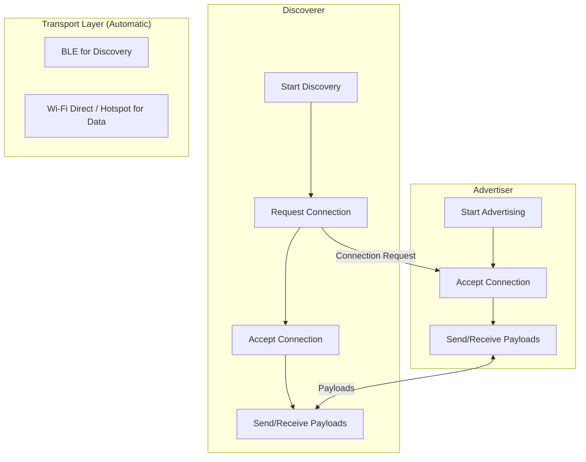
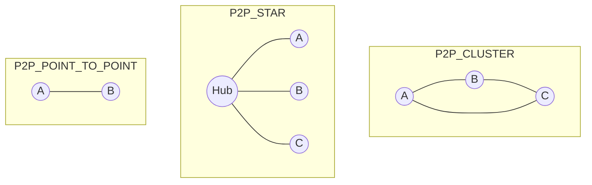
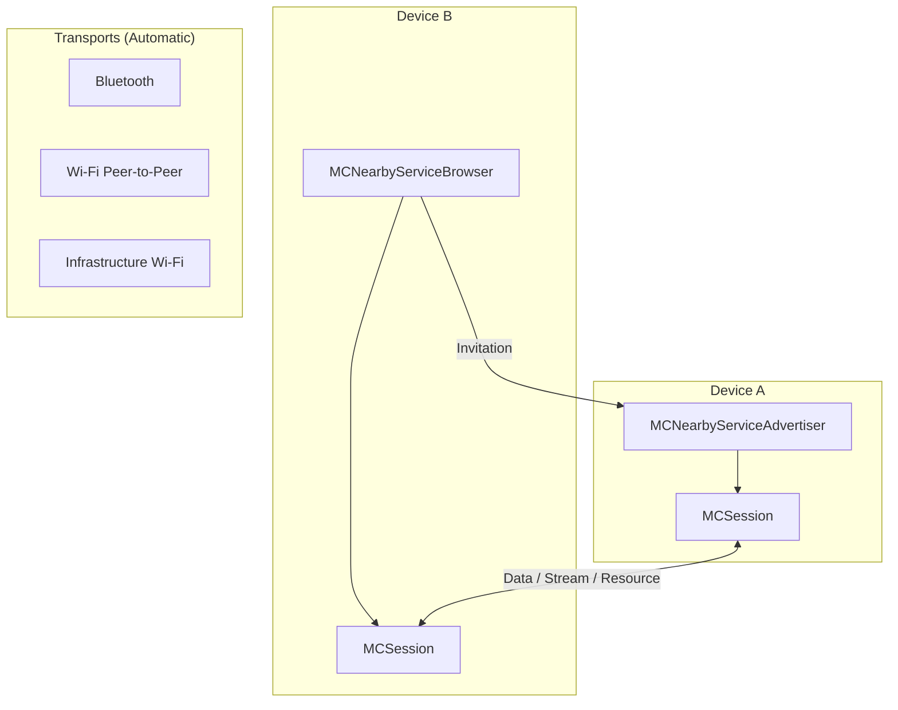
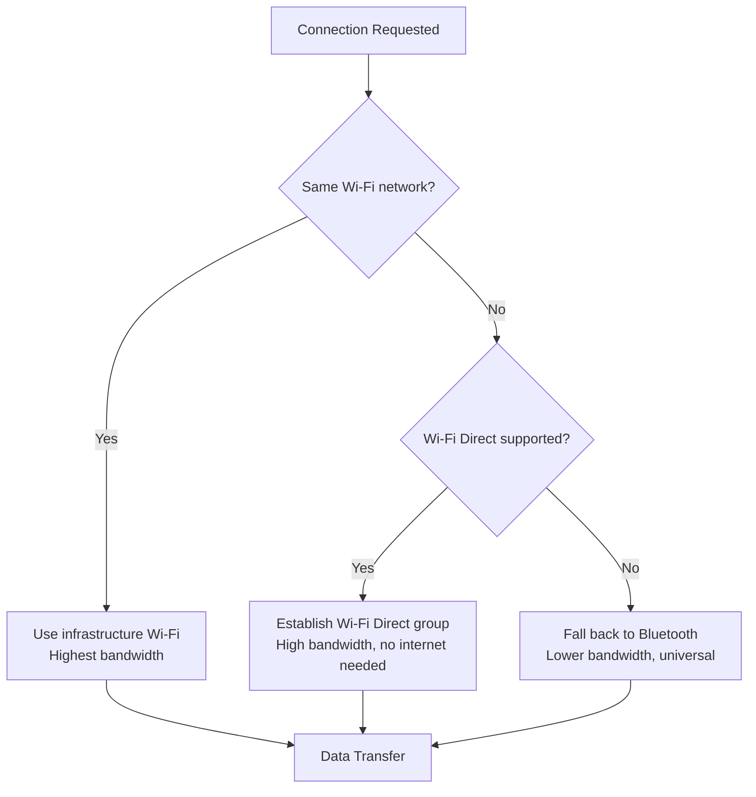

# Nearby Connectivity APIs

Both Android and iOS provide **high-level APIs** that abstract over raw Bluetooth, Wi-Fi Direct, and NFC to simplify device-to-device communication. These APIs handle discovery, connection negotiation, and transport selection automatically — making them the pragmatic choice for most app-level peer-to-peer features.

## Platform API Overview

| Feature | Google Nearby Connections | Apple Multipeer Connectivity |
|---|---|---|
| **Platform** | Android (via Google Play Services) | iOS, macOS, tvOS |
| **Underlying transports** | BLE + Wi-Fi Direct + Wi-Fi Hotspot + NFC | Wi-Fi (peer-to-peer) + Bluetooth |
| **Discovery** | Automatic (BLE advertising) | Automatic (Bonjour over BLE/Wi-Fi) |
| **Topology** | Star, Cluster, Point-to-Point | Mesh (up to 8 peers) |
| **Encryption** | Built-in (authentication tokens) | Built-in (optional encryption) |
| **Max payload** | Unlimited (streaming supported) | Unlimited (streaming supported) |
| **Requires internet** | No | No |
| **Requires Play Services** | Yes | No (native framework) |

## Google Nearby Connections API

### Architecture



### Connection Topologies

| Strategy | Topology | Use Case |
|---|---|---|
| `P2P_CLUSTER` | Many-to-many mesh | Multi-player games, group chat |
| `P2P_STAR` | One-to-many star | File sharing hub, classroom |
| `P2P_POINT_TO_POINT` | One-to-one | Direct transfer, pairing |



### Android Implementation

#### Dependencies

```kotlin
// build.gradle.kts
dependencies {
    implementation("com.google.android.gms:play-services-nearby:19.1.0")
}
```

#### Advertising

```kotlin
class NearbyAdvertiser(private val context: Context) {

    private val connectionsClient = Nearby.getConnectionsClient(context)

    private val connectionLifecycleCallback = object : ConnectionLifecycleCallback() {

        override fun onConnectionInitiated(endpointId: String, info: ConnectionInfo) {
            // Show authentication token to user for verification
            Log.d("Nearby", "Auth token: ${info.authenticationDigits}")
            // Accept the connection
            connectionsClient.acceptConnection(endpointId, payloadCallback)
        }

        override fun onConnectionResult(endpointId: String, result: ConnectionResolution) {
            when (result.status.statusCode) {
                ConnectionsStatusCodes.STATUS_OK -> {
                    // Connected — ready to send/receive
                }
                ConnectionsStatusCodes.STATUS_CONNECTION_REJECTED -> {
                    // Peer rejected
                }
            }
        }

        override fun onDisconnected(endpointId: String) {
            // Peer disconnected
        }
    }

    fun startAdvertising(userName: String) {
        val options = AdvertisingOptions.Builder()
            .setStrategy(Strategy.P2P_STAR)
            .build()

        connectionsClient.startAdvertising(
            userName,
            "com.example.myapp",  // Service ID
            connectionLifecycleCallback,
            options
        ).addOnSuccessListener {
            // Advertising started
        }.addOnFailureListener {
            // Handle error
        }
    }
}
```

#### Discovering and Connecting

```kotlin
class NearbyDiscoverer(private val context: Context) {

    private val connectionsClient = Nearby.getConnectionsClient(context)

    private val endpointDiscoveryCallback = object : EndpointDiscoveryCallback() {

        override fun onEndpointFound(endpointId: String, info: DiscoveredEndpointInfo) {
            // Found a peer — request connection
            connectionsClient.requestConnection(
                "MyDevice",
                endpointId,
                connectionLifecycleCallback
            )
        }

        override fun onEndpointLost(endpointId: String) {
            // Peer no longer visible
        }
    }

    fun startDiscovery() {
        val options = DiscoveryOptions.Builder()
            .setStrategy(Strategy.P2P_STAR)
            .build()

        connectionsClient.startDiscovery(
            "com.example.myapp",  // Must match advertiser's service ID
            endpointDiscoveryCallback,
            options
        )
    }
}
```

#### Sending Payloads

```kotlin
// Payload types
val bytesPayload = Payload.fromBytes("Hello".toByteArray())

val filePayload = Payload.fromFile(File("/path/to/file"))

val streamPayload = Payload.fromStream(inputStream)

// Send to a connected endpoint
connectionsClient.sendPayload(endpointId, bytesPayload)

// Receive payloads
val payloadCallback = object : PayloadCallback() {

    override fun onPayloadReceived(endpointId: String, payload: Payload) {
        when (payload.type) {
            Payload.Type.BYTES -> {
                val data = payload.asBytes()
                // Process bytes
            }
            Payload.Type.FILE -> {
                val file = payload.asFile()
                // File saved to cache directory
            }
            Payload.Type.STREAM -> {
                val stream = payload.asStream()?.asInputStream()
                // Read from stream
            }
        }
    }

    override fun onPayloadTransferUpdate(endpointId: String, update: PayloadTransferUpdate) {
        val progress = update.bytesTransferred * 100 / update.totalBytes
        // Update progress UI
    }
}
```

## Apple Multipeer Connectivity

### Architecture



### iOS Implementation

#### Advertising

```swift
import MultipeerConnectivity

class PeerService: NSObject {
    private let serviceType = "my-app-xfer"  // Max 15 chars, lowercase + hyphens
    private let myPeerID = MCPeerID(displayName: UIDevice.current.name)
    private var session: MCSession!
    private var advertiser: MCNearbyServiceAdvertiser!

    func startHosting() {
        session = MCSession(
            peer: myPeerID,
            securityIdentity: nil,
            encryptionPreference: .required
        )
        session.delegate = self

        advertiser = MCNearbyServiceAdvertiser(
            peer: myPeerID,
            discoveryInfo: ["version": "1.0"],  // Optional metadata
            serviceType: serviceType
        )
        advertiser.delegate = self
        advertiser.startAdvertisingPeer()
    }
}

extension PeerService: MCNearbyServiceAdvertiserDelegate {

    func advertiser(_ advertiser: MCNearbyServiceAdvertiser,
                    didReceiveInvitationFromPeer peerID: MCPeerID,
                    withContext context: Data?,
                    invitationHandler: @escaping (Bool, MCSession?) -> Void) {
        // Accept the invitation
        invitationHandler(true, session)
    }
}
```

#### Browsing and Connecting

```swift
class PeerBrowser: NSObject {
    private var browser: MCNearbyServiceBrowser!
    private var session: MCSession!

    func startBrowsing() {
        browser = MCNearbyServiceBrowser(
            peer: myPeerID,
            serviceType: serviceType
        )
        browser.delegate = self
        browser.startBrowsingForPeers()
    }
}

extension PeerBrowser: MCNearbyServiceBrowserDelegate {

    func browser(_ browser: MCNearbyServiceBrowser,
                 foundPeer peerID: MCPeerID,
                 withDiscoveryInfo info: [String: String]?) {
        // Invite the discovered peer
        browser.invitePeer(
            peerID,
            to: session,
            withContext: nil,
            timeout: 30
        )
    }

    func browser(_ browser: MCNearbyServiceBrowser,
                 lostPeer peerID: MCPeerID) {
        // Peer no longer available
    }
}
```

#### Sending and Receiving Data

```swift
extension PeerService: MCSessionDelegate {

    func session(_ session: MCSession, peer peerID: MCPeerID,
                 didChange state: MCSessionState) {
        switch state {
        case .connected:    print("Connected to \(peerID.displayName)")
        case .connecting:   print("Connecting...")
        case .notConnected: print("Disconnected")
        @unknown default:   break
        }
    }

    // Send data
    func sendMessage(_ message: String) {
        guard let data = message.data(using: .utf8) else { return }
        try? session.send(data, toPeers: session.connectedPeers, with: .reliable)
    }

    // Send a file
    func sendFile(at url: URL, to peer: MCPeerID) {
        session.sendResource(
            at: url,
            withName: url.lastPathComponent,
            toPeer: peer
        ) { error in
            // Transfer complete or failed
        }
    }

    // Receive data
    func session(_ session: MCSession, didReceive data: Data,
                 fromPeer peerID: MCPeerID) {
        let message = String(data: data, encoding: .utf8)
        // Process received message
    }

    // Receive file
    func session(_ session: MCSession,
                 didFinishReceivingResourceWithName name: String,
                 fromPeer peerID: MCPeerID,
                 at localURL: URL?,
                 withError error: Error?) {
        guard let url = localURL else { return }
        // Move file from temp location
    }

    func session(_ session: MCSession, didReceive stream: InputStream,
                 withName streamName: String, fromPeer peerID: MCPeerID) {
        // Handle incoming stream (audio, video, etc.)
    }
}
```

#### Built-In Browser UI

```swift
// Shortcut: Apple provides a ready-made UI for browsing peers
let browserVC = MCBrowserViewController(
    serviceType: serviceType,
    session: session
)
browserVC.delegate = self
present(browserVC, animated: true)
```

## Cross-Platform Considerations

Building a feature that works across Android and iOS is the primary challenge with Nearby APIs, since each platform uses proprietary protocols.

| Approach | Pros | Cons |
|---|---|---|
| **Raw BLE + custom protocol** | Full control, works cross-platform | Complex; must handle MTU, chunking, reconnection |
| **Wi-Fi Direct sockets** | High throughput, standard TCP | iOS doesn't expose Wi-Fi Direct directly |
| **BLE for discovery + Wi-Fi for transfer** | Best of both worlds | Complex orchestration; platform-specific discovery |
| **Shared Wi-Fi network + mDNS** | Simple, standard, cross-platform | Requires same network (not truly offline) |
| **Third-party SDKs** (e.g., Bridgefy, p2pkit) | Abstracted cross-platform API | Dependency, cost, potential deprecation |

!!! note "Google Nearby vs Apple Nearby Interaction"
    Apple's **Nearby Interaction** framework (iOS 14+) is different from Multipeer Connectivity. It uses the **U1 Ultra-Wideband chip** for precise spatial awareness (distance + direction) but doesn't transfer data. It's designed for "find my" and spatial UX, not for data exchange.

## Transport Selection Under the Hood

Both APIs automatically select the best transport based on conditions:



## Common Pitfalls

| Pitfall | Solution |
|---|---|
| Service ID mismatch | Ensure both sides use identical service ID / service type strings |
| Discovery stops after backgrounding | Both APIs throttle or stop discovery in background; use background modes (iOS) or foreground service (Android) |
| Multipeer limited to 8 peers | Design for this limit; use a relay pattern for larger groups |
| Play Services not available | Nearby Connections requires Google Play Services — fails on Huawei/custom ROMs without it |
| Encryption overhead | Both APIs support encryption; enable it for sensitive data but expect ~10–15% throughput reduction |
| `MCSession` disconnects randomly | Implement heartbeat pings and automatic reconnection logic |

??? question "Common Interview Questions"

    **Q: How would you build a cross-platform file sharing feature?**

    For same-platform: use Nearby Connections (Android) or Multipeer Connectivity (iOS) — they handle transport selection and provide the simplest API. For cross-platform: the most reliable approach is BLE for discovery (both platforms support CoreBluetooth / Android BLE), then upgrade to a TCP socket over a shared Wi-Fi network or Wi-Fi Direct for the actual transfer. Alternatively, use a thin BLE-based protocol for small payloads. Third-party SDKs like Google's Nearby Messages (cloud-backed) can bridge platforms but require internet.

    **Q: What happens when a device goes to background during a Nearby Connections transfer?**

    On Android, the transfer continues if the app uses a foreground service with a persistent notification. Without it, the system may kill the process. On iOS, Multipeer Connectivity sessions survive brief backgrounding but will disconnect after ~30 seconds unless the app declares `audio`, `bluetooth-central`, or `external-accessory` background modes. Large file transfers should use `URLSession` background transfers after the initial peer connection establishes a path.

    **Q: How does Nearby Connections handle authentication?**

    When two devices connect, the API generates a shared **authentication token** (4-digit code) derived from the connection handshake. Both devices display this token and the user visually confirms they match — similar to Bluetooth Secure Simple Pairing. This prevents man-in-the-middle attacks. The API then encrypts the connection. For automated scenarios (no user present), apps can skip verification but accept the MITM risk.

    **Q: Multipeer Connectivity vs GameKit — when to use which?**

    Multipeer Connectivity is general-purpose: file transfer, chat, collaboration, any peer-to-peer feature. GameKit's `GKMatchmaker` is optimized for real-time multiplayer gaming with features like matchmaking, voice chat, and turn-based play — but it requires Game Center and usually an internet connection. For offline device-to-device gaming, Multipeer Connectivity is the better choice.

!!! tip "Further Reading"
    - [Google Nearby Connections API](https://developers.google.com/nearby/connections/overview)
    - [Apple Multipeer Connectivity](https://developer.apple.com/documentation/multipeerconnectivity)
    - [Apple Nearby Interaction](https://developer.apple.com/documentation/nearbyinteraction)
    - [Nearby Connections Strategies](https://developers.google.com/nearby/connections/strategies)
