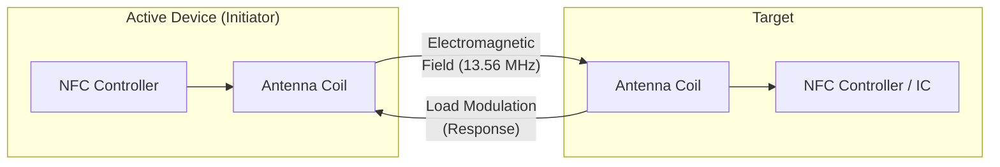
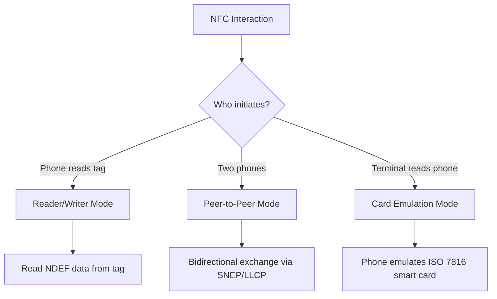
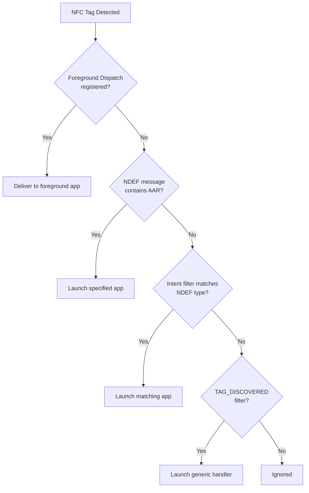
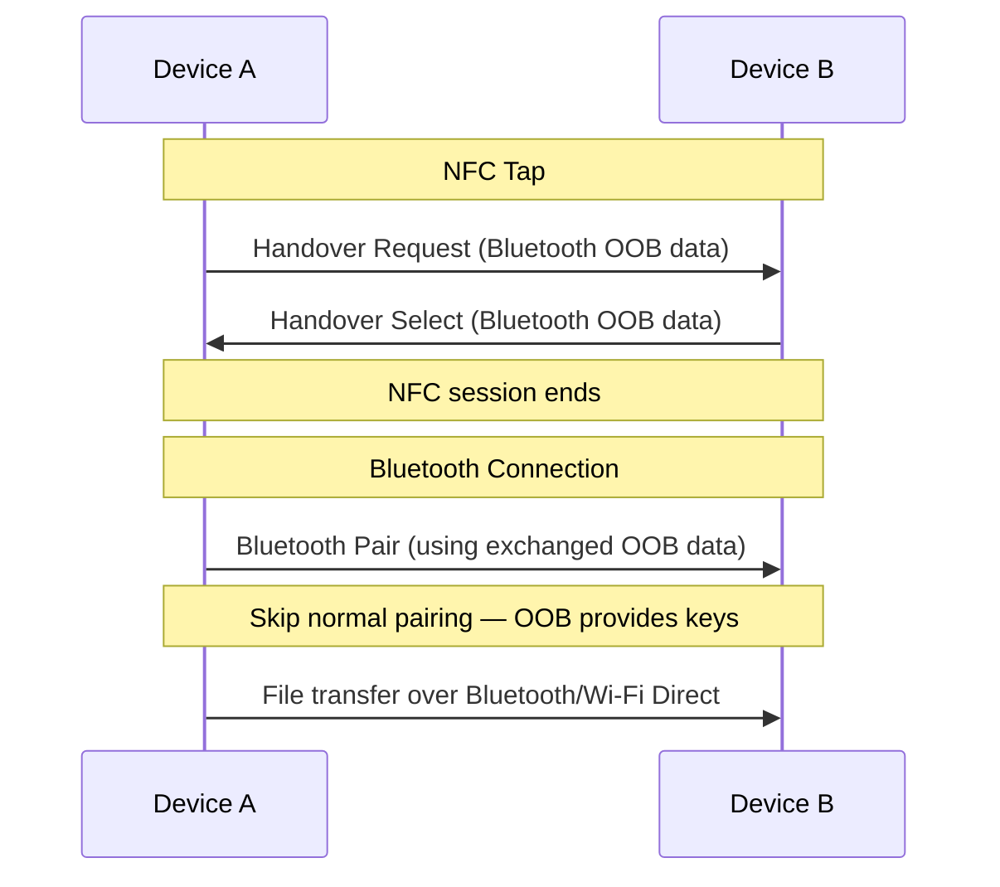

# NFC (Near Field Communication)

NFC enables two devices — or a device and a passive tag — to exchange data by bringing them within **~4 cm** of each other. The extremely short range provides **implicit physical security** and makes NFC ideal for payments, quick pairing, access control, and small data transfers where a deliberate tap gesture serves as user confirmation.

## How NFC Works

NFC operates at **13.56 MHz** and is based on electromagnetic induction between two loop antennas.



## Operating Modes

| Mode | Description | Example |
|---|---|---|
| **Reader/Writer** | Phone reads/writes passive NFC tags | Reading a museum exhibit tag |
| **Peer-to-Peer** | Two powered devices exchange data | Sharing a contact between phones |
| **Card Emulation** | Phone acts as a contactless smart card | Mobile payments (Google Pay, Apple Pay) |



## NFC Tag Types

| Type | Standard | Memory | Speed | Features |
|---|---|---|---|---|
| **Type 1** | ISO 14443A (Topaz) | 96 B – 2 KB | 106 kbps | Read/write, no collision detection |
| **Type 2** | ISO 14443A (NTAG, Mifare UL) | 48 B – 2 KB | 106 kbps | Most common; cheap, reliable |
| **Type 3** | JIS X 6319-4 (FeliCa) | Up to 1 MB | 212/424 kbps | Popular in Japan (transit cards) |
| **Type 4** | ISO 14443A/B (DESFire) | Up to 32 KB | 106–424 kbps | ISO 7816 compatible; encryption support |
| **Type 5** | ISO 15693 (ICODE) | Up to 64 KB | 26 kbps | Longer range (~1.5 m); inventory tags |

## NDEF (NFC Data Exchange Format)

NDEF is the standard message format for NFC data exchange. An NDEF message contains one or more **records**, each with a type and payload.

| Record Type | TNF | Use Case |
|---|---|---|
| **URI** | `TNF_WELL_KNOWN` + `RTD_URI` | Open URL, deep link |
| **Text** | `TNF_WELL_KNOWN` + `RTD_TEXT` | Plain text with language code |
| **MIME** | `TNF_MIME_MEDIA` | Images, vCards, custom data |
| **Smart Poster** | `TNF_WELL_KNOWN` + `RTD_SMART_POSTER` | URI + metadata (title, icon, action) |
| **Android App Record (AAR)** | `TNF_EXTERNAL_TYPE` | Launch specific Android app |
| **Handover** | `TNF_WELL_KNOWN` + `RTD_HANDOVER_*` | Bootstrap Bluetooth/Wi-Fi connection |

```
┌─────────────────────────────────────────────┐
│              NDEF Message                    │
├─────────────────────────────────────────────┤
│  Record 1: URI                              │
│  ┌─ Header ──────────────────────────────┐  │
│  │ TNF: 0x01 (Well-Known)                │  │
│  │ Type: "U" (URI)                       │  │
│  │ Payload: 0x04 "example.com/page"      │  │
│  │          ↑ prefix = "https://"        │  │
│  └───────────────────────────────────────┘  │
│  Record 2: Android Application Record       │
│  ┌─ Header ──────────────────────────────┐  │
│  │ TNF: 0x04 (External Type)             │  │
│  │ Type: "android.com:pkg"               │  │
│  │ Payload: "com.example.myapp"          │  │
│  └───────────────────────────────────────┘  │
└─────────────────────────────────────────────┘
```

## Android Implementation

### Tag Dispatch System

Android uses a **priority-based dispatch** system to route NFC intents to the right app:



### Reading NFC Tags

```kotlin
class NfcReaderActivity : AppCompatActivity() {

    private lateinit var nfcAdapter: NfcAdapter

    override fun onCreate(savedInstanceState: Bundle?) {
        super.onCreate(savedInstanceState)
        nfcAdapter = NfcAdapter.getDefaultAdapter(this)
            ?: return  // Device doesn't support NFC
    }

    override fun onResume() {
        super.onResume()
        // Foreground dispatch gives this activity priority for NFC intents
        val intent = PendingIntent.getActivity(
            this, 0,
            Intent(this, javaClass).addFlags(Intent.FLAG_ACTIVITY_SINGLE_TOP),
            PendingIntent.FLAG_MUTABLE
        )
        nfcAdapter.enableForegroundDispatch(this, intent, null, null)
    }

    override fun onPause() {
        super.onPause()
        nfcAdapter.disableForegroundDispatch(this)
    }

    override fun onNewIntent(intent: Intent) {
        super.onNewIntent(intent)
        if (intent.action == NfcAdapter.ACTION_NDEF_DISCOVERED) {
            val messages = intent.getParcelableArrayExtra(NfcAdapter.EXTRA_NDEF_MESSAGES)
            messages?.forEach { raw ->
                val message = raw as NdefMessage
                message.records.forEach { record ->
                    when {
                        record.tnf == NdefRecord.TNF_WELL_KNOWN &&
                        record.type.contentEquals(NdefRecord.RTD_URI) -> {
                            val uri = record.toUri()
                            // Handle URI
                        }
                        record.tnf == NdefRecord.TNF_WELL_KNOWN &&
                        record.type.contentEquals(NdefRecord.RTD_TEXT) -> {
                            val text = parseTextRecord(record.payload)
                            // Handle text
                        }
                    }
                }
            }
        }
    }
}
```

### Writing to NFC Tags

```kotlin
fun writeTag(tag: Tag, message: NdefMessage): Boolean {
    val ndef = Ndef.get(tag) ?: return false
    return try {
        ndef.connect()
        if (!ndef.isWritable) return false
        if (ndef.maxSize < message.byteArrayLength) return false
        ndef.writeNdefMessage(message)
        true
    } catch (e: Exception) {
        false
    } finally {
        ndef.close()
    }
}

fun createUriRecord(url: String): NdefMessage {
    val record = NdefRecord.createUri(url)
    return NdefMessage(arrayOf(record))
}

fun createMimeRecord(mimeType: String, data: ByteArray): NdefMessage {
    val record = NdefRecord.createMime(mimeType, data)
    val aar = NdefRecord.createApplicationRecord("com.example.myapp")
    return NdefMessage(arrayOf(record, aar))
}
```

### Host Card Emulation (HCE)

HCE lets the phone act as a contactless smart card, enabling custom card emulation without a Secure Element.

```kotlin
class MyCardService : HostApduService() {

    companion object {
        val SELECT_AID = byteArrayOf(
            0x00, 0xA4.toByte(), 0x04, 0x00,  // SELECT command
            0x07,                                // AID length
            0xF0.toByte(), 0x01, 0x02, 0x03, 0x04, 0x05, 0x06  // AID
        )
        val OK_SW = byteArrayOf(0x90.toByte(), 0x00)  // Success
    }

    override fun processCommandApdu(commandApdu: ByteArray, extras: Bundle?): ByteArray {
        if (commandApdu.sliceArray(0..3).contentEquals(SELECT_AID.sliceArray(0..3))) {
            // AID selected — return initial response
            return "HELLO".toByteArray() + OK_SW
        }
        // Handle subsequent APDUs for data exchange
        return OK_SW
    }

    override fun onDeactivated(reason: Int) {
        // Clean up when card emulation session ends
    }
}
```

```xml
<!-- AndroidManifest.xml -->
<service
    android:name=".MyCardService"
    android:exported="true"
    android:permission="android.permission.BIND_NFC_SERVICE">
    <intent-filter>
        <action android:name="android.nfc.cardemulation.action.HOST_APDU_SERVICE" />
    </intent-filter>
    <meta-data
        android:name="android.nfc.cardemulation.host_apdu_service"
        android:resource="@xml/apduservice" />
</service>
```

## iOS Implementation

### Reading NDEF Tags

```swift
import CoreNFC

class NFCReader: NSObject, NFCNDEFReaderSessionDelegate {

    func beginScanning() {
        let session = NFCNDEFReaderSession(
            delegate: self,
            queue: nil,
            invalidateAfterFirstRead: true
        )
        session.alertMessage = "Hold your iPhone near an NFC tag"
        session.begin()
    }

    func readerSession(_ session: NFCNDEFReaderSession,
                       didDetectNDEFs messages: [NFCNDEFMessage]) {
        for message in messages {
            for record in message.records {
                if let url = record.wellKnownTypeURIPayload() {
                    // Handle URL
                }
                if let (text, locale) = record.wellKnownTypeTextPayload() {
                    // Handle text
                }
            }
        }
    }

    func readerSession(_ session: NFCNDEFReaderSession,
                       didInvalidateWithError error: Error) {
        // Handle session end or error
    }
}
```

!!! note "iOS NFC Limitations"
    - NFC reading requires iPhone 7 or later
    - Background tag reading (without app open) requires iPhone XS or later
    - NFC writing requires iOS 13+
    - Apple restricts HCE — only Apple Pay can emulate cards
    - Must add `NFCReaderUsageDescription` to Info.plist and configure entitlements

## NFC Handover — Bootstrapping Faster Connections

NFC's killer feature for device-to-device connectivity is **connection handover** — using a quick tap to negotiate and establish a Bluetooth or Wi-Fi Direct connection.



| Handover Type | What NFC Exchanges | Result |
|---|---|---|
| **Bluetooth OOB** | Device address + pairing keys | Instant Bluetooth pairing (no PIN prompt) |
| **Wi-Fi** | SSID + passphrase + auth type | Auto-connect to Wi-Fi network |
| **Wi-Fi Direct** | GO intent + device info | Establish Wi-Fi Direct group |

## Common Pitfalls

| Pitfall | Solution |
|---|---|
| Tag not detected | Ensure NFC is enabled in device settings; check antenna position (usually near camera) |
| `TagLostException` | Device moved away too quickly; prompt user to hold steady |
| Wrong dispatch priority | Use foreground dispatch in `onResume` to override system-level handlers |
| NDEF format not supported | Check tag type; not all tags support NDEF (some need formatting with `NdefFormatable`) |
| HCE not working with some readers | Ensure correct AID registration and handle SELECT commands per ISO 7816-4 |

??? question "Common Interview Questions"

    **Q: How does NFC differ from RFID?**

    NFC is a subset of RFID that operates specifically at 13.56 MHz with standardized protocols (ISO 14443, ISO 18092). Key differences: NFC is limited to ~4 cm range (RFID can reach meters), NFC supports peer-to-peer mode (RFID is reader-tag only), and NFC has standardized data formats (NDEF). Essentially, NFC adds interoperability and security constraints on top of RFID technology.

    **Q: How do contactless payments work with NFC?**

    The phone runs a payment applet (via Secure Element or HCE) that emulates an ISO 7816 smart card. When tapped on a POS terminal: (1) the terminal sends a SELECT command with the payment AID, (2) the phone responds with card data, (3) the terminal and phone exchange APDUs to perform EMV transaction flow, (4) a cryptogram is generated that proves the transaction without exposing the real card number. Tokenization replaces the actual PAN with a device-specific token.

    **Q: What is the Secure Element and why does it matter?**

    The Secure Element (SE) is tamper-resistant hardware (embedded chip or SIM-based) that stores sensitive data like payment credentials and cryptographic keys. It runs its own OS (JavaCard) isolated from Android/iOS. HCE bypasses the SE by handling card emulation in software — more flexible but less secure since keys are in app memory. Apple exclusively uses SE for Apple Pay, while Android supports both SE-based and HCE approaches.

    **Q: How would you implement NFC-based two-device data sync?**

    For small data (< 1 KB): write an NDEF message containing the data directly and exchange via Android Beam (deprecated) or SNEP protocol. For large data: use NFC connection handover — exchange Bluetooth OOB data via NFC tap, then transfer the actual data over Bluetooth. This gives you the UX of "tap to share" with the bandwidth of Bluetooth. On modern Android, use Nearby Share which automates this NFC→BT/Wi-Fi handover pattern.

!!! tip "Further Reading"
    - [Android NFC Guide](https://developer.android.com/guide/topics/connectivity/nfc)
    - [Android Host Card Emulation](https://developer.android.com/guide/topics/connectivity/nfc/hce)
    - [Core NFC (iOS)](https://developer.apple.com/documentation/corenfc)
    - [NFC Forum Specifications](https://nfc-forum.org/build/specifications)
